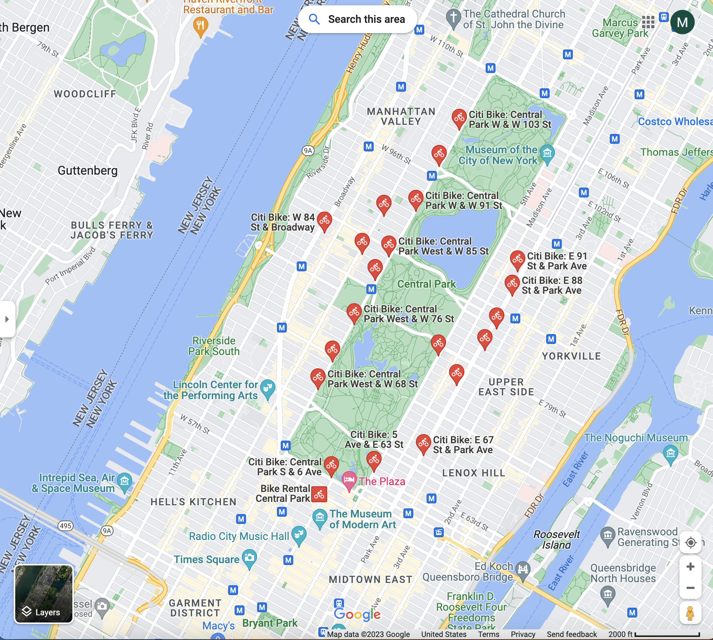
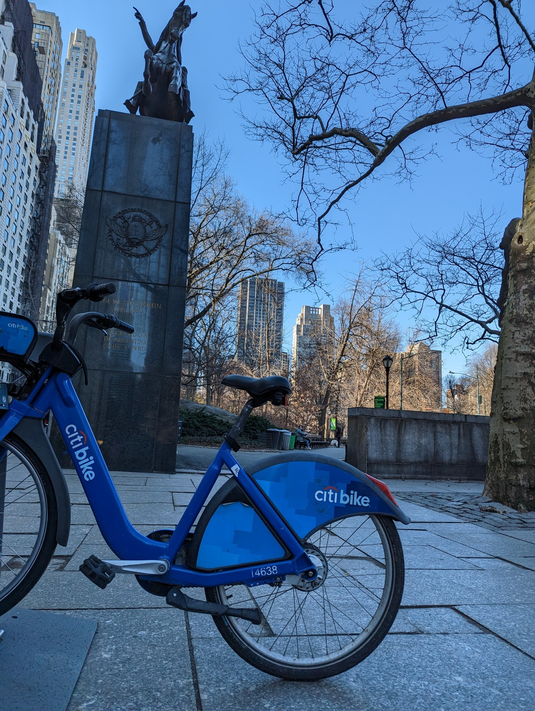

<!--- header table --->
<table align="left">     
  <td style="text-align: center">
    <a href="https://github.com/statmike/vertex-ai-mlops/blob/main/Applied%20Forecasting/readme.md">
      
       View on GitHub
    </a>
  </td>
</table>    

---
# /Applied Forecasting/readme.md

**Series Introduction: Applied Forecasting**

This series explores forecasting with Vertex AI, BigQuery ML, and additional open source frameworks.  Forecasting consist of following a measurement over time and exploring trends, the impact of seasonality (years, months, days, etc), holidays, and special events with the hope of using these insights to forecast into the near future.  Some method also incoporate observable measurements that impact demand to understand the relationships and make forecasting more accurate.

**Data Source: Citibike rentals in New York City**

This series will use Citibike rentals in New York city.  The bike stations near central park will be selected and the daily number bike trips that orignate from these stations will be followed over time.  This will illustrate some common forecasting issues due to new stations being introduced over time and some stations only have the most recent few months, or just weeks of data.  The data are found in the BigQuery Public datasets at: `bigquery-public-data.new_york.citibike_trips`.

<table style='text-align:center;vertical-align:middle' width="75%" cellpadding="1" cellspacing="0">
    <tr>
        <th colspan='2'>Citibike Stations</th>
    </tr>
    <tr>
        <td>
            <a href="https://www.google.com/maps/search/central+park+citibike+stations/@40.7794305,-73.9733652,14z" target="_blank">
                
                <h4 align="center">Central Park Stations</h4>
            </a>
        </td>
        <td>
            
            <h4 align="center">Central Park S & 6th Avenue</h4>
        </td>
    </tr>
</table>

---
## Forecasting Topics

**Univariate Forecasting**

At the core, forecasting is prediction where the target(s) is/are future time points.  For this, only two columns are needed: one to represent the time point of the observation, another that captures the measurement.  The two columns make up a time series.  Proceeding with just these two columns the choice of approach could be:
- Regression based approach predicting next value in series
- Multi-step regression models predicting each of the next values over a future horizon
- Using a parametrics approach like ARIMA
    - build a formula for the future as a function of the past with parameters for previous time points (`p`), differencing (`d`), and moving averages (`q`).
- Using a Generalized Additive Model approach like [Prophet](https://github.com/facebook/prophet)
    - this detects change points

**Pre-Trained Time Series Foundation Models**

A new class of forecasting models that are pretrained and used for forecasting as inference (similar in concept to LLMs for text).  The models are already trained and take time series as inputs and generate forecast horizons.  

**Multi-variate Forecasting**

All of these are local forecast, meaning each time series is fit independently.  Theese can be expanded to incorporate more information using covariates with multi-variate forecasting.  Additional information that is related to the measurement over time can be helpful to understand the changes that occur over time.  The covariates could be information that could be know ahead of time like discounts, holiday periods, promotions and advertising.  They could also be information not know until they acctually occur like weather, traffic, and interruptions to business.  

**Global Forecasting**

Beyond covariates (or even without covariates) there are also method that learn across multiple time series in attempts to have great generalizability.  These are called global forecasting techniques in that the time series are learned together at the same time.

**More topics**

Other topics that come up in forcasting project include:
- hierachical forecasting.  These approaches allow the hierarchy of time and/or categorization to be preserverd so that aggregations of the forecasted values make sense.
- cold start or warm start forecasting for new time series (think about issues with forecasting sales new products).
- clustering time series into like behaving groups with techniques like Dynamic Time Warping
- more!

**Online Forecasting**

The approaches above fall into the category of batch forecasting.  This is the most common approach to forecasting and works for more cases because it takes training data at a point in time and creates predictive models for future time points over a specified horizon.  The predictions can be generated in batch, saved and recalled as needed by business application like dashboards. 

What is forecasting is needed on-demand?
- Maybe the number of time series is far too large to continously train, making it easier to just create a forecast as needed
- Maybe the velocity of the data requires in the moment training and serving to make faster decisions - like anomaly detecting

Google Cloud [Time Series Insights API](https://cloud.google.com/timeseries-insights) is a solution to the scale and speed requirements of these scenarios.  It is also possible to build local forecasting approaches into Vertex AI Endpoints with Custom Prediction Routines (CPR).  An example of CPR based local forecasting is given below using Prophet. 

---
**Prerequisites**

- Environment Setup with: [00 - Setup.ipynb](../00%20-%20Setup/00%20-%20Environment%20Setup.ipynb)

## Notebooks:
This list is in the suggested order of review for anyone getting an overview and learning about forecasting approaches throughout GCP.  It is also ok to pick a particular notebook of interest and if there are dependencies on prior notebooks they will be listed in the **prerequisites** section at the top of the notebook.  

>The notebooks are designed to be editable for trying with other data sources.  The same parameter names are used across the notebooks to also help when trying multiple methods on a custom data source.

- Data Source:
    - 1 - [BigQuery Time Series Forecasting Data Review and Preparation](./BigQuery%20Time%20Series%20Forecasting%20Data%20Review%20and%20Preparation.ipynb)
- BigQuery ML: Univariate and Multivariate Local Forecasting Approaches
    - 2 - [BQML Univariate Forecasting with ARIMA+](./BQML%20Univariate%20Forecasting%20with%20ARIMA+.ipynb)
    - 3 - [BQML Multivariate Forecasting with ARIMA+ XREG](./BQML%20Multivariate%20Forecasting%20with%20ARIMA+%20XREG.ipynb)
    - 4 - [BQML Regression Based Forecasting](./BQML%20Regression%20Based%20Forecasting.ipynb)
    - [Notes - BQML ARIMA+ Handling of Granularity and Missing Data](./Notes%20-%20BQML%20ARIMA%2B%20Handling%20of%20Granularity%20and%20Missing%20Data.ipynb)
- Pre-trained Forecasting Models: Google Research Time Series Foundation Model (TimesFM)
    - [TimesFM - Time Series Foundation Model](./TimesFM%20-%20Time%20Series%20Foundation%20Model.ipynb)
- Vertex AI AutoML: Global Forecasting for univariate or multi-variate including hierarchical forecasting
    - 5 - [Vertex AI AutoML Forecasting - GCP Console (no code)](./Vertex%20AI%20AutoML%20Forecasting%20-%20GCP%20Console%20(no%20code).ipynb)
    - 6 - [Vertex AI AutoML Forecasting - Python client](./Vertex%20AI%20AutoML%20Forecasting%20-%20Python%20client.ipynb)
    - 7 - [Vertex AI AutoML Forecasting - multiple simultaneously](./Vertex%20AI%20AutoML%20Forecasting%20-%20multiple%20simultaneously.ipynb)
- Vertex AI Other: Global Forecasting for univariate or multi-variate including hierarchical forecasting
    - 8 - [Vertex AI Seq2Seq+ Forecasting - Python client](./Vertex%20AI%20Seq2Seq+%20Forecasting%20-%20Python%20client.ipynb)
    - 9 - [Vertex AI Temporal Fusion Transformer Forecasting - Python client](./Vertex%20AI%20Temporal%20Fusion%20Transformer%20Forecasting%20-%20Python%20client.ipynb)
    - 10 - [Vertex AI Time series Dense Encoder - Python client](./Vertex%20AI%20Time%20series%20Dense%20Encoder%20-%20Python%20client.ipynb)
- Vertex AI Custom Models: Local forecasting with Prophet for univariate and multi-variate data
    - 11 - [Vertex AI Custom Model - Prophet - In Notebook](./Vertex%20AI%20Custom%20Model%20-%20Prophet%20-%20In%20Notebook.ipynb)
    - 12 - [Vertex AI Custom Model - Prophet - Custom Job With Custom Container](./Vertex%20AI%20Custom%20Model%20-%20Prophet%20-%20Custom%20Job%20With%20Custom%20Container.ipynb)
- Vertex AI Pipelines: Automation for full forecasting workflows
    - 13 - [Vertex AI Pipelines - BQML ARIMA+](./Vertex%20AI%20Pipelines%20-%20BQML%20ARIMA+.ipynb)
    - 14 - [Vertex AI Pipelines - Prophet](./Vertex%20AI%20Pipelines%20-%20Prophet.ipynb)
    - 15 - [Vertex AI Pipelines - Forecasting Tournament with Kubeflow Pipelines (KFP)](./Vertex%20AI%20Pipelines%20-%20Forecasting%20Tournament%20with%20Kubeflow%20Pipelines%20(KFP).ipynb)
    - **Forecasting Pipelines** For more detailed starting points using Pipelines for forecasting I highly recommend [this repository](https://github.com/tottenjordan/vertex-forecas-repo) from coworker Jordan Totten!
- Advanced Workflows:
    - [Vertex AI Prediction Endpoints for Online Forecasting With Prophet](./Vertex%20AI%20Prediction%20Endpoints%20for%20Online%20Forecasting%20With%20Prophet.ipynb)

**Notes**

- Resources:
    - Price optimization example like: https://cloud.google.com/blog/products/ai-machine-learning/price-optimization-using-vertex-ai-forecast

