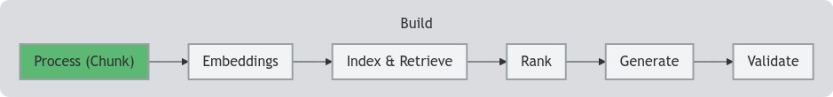

<!--- header table --->
<table align="left">     
  <td style="text-align: center">
    <a href="https://github.com/statmike/vertex-ai-mlops/blob/main/Applied%20GenAI/Chunking/readme.md">
      
       View on GitHub
    </a>
  </td>
</table>    

---
# Content Processing and Annotation - Chunking
> You are here: `vertex-ai-mlops/Applied GenAI/Chunking/readme.md`

    

In retrieval augement generation (RAG) workflows, the goal is to retrieve context chunks related to a query. While whole documents are possible with long-context LLMs like Gemini (see examples in [Long Context Retrieval With The Vertex AI Gemini API](../Generate/Long%20Context%20Retrieval%20With%20The%20Vertex%20AI%20Gemini%20API.ipynb) and [Vertex AI Gemini API](../Generate/Vertex%20AI%20Gemini%20API.ipynb)), it is often more efficient to retrieve the most relevant context via a retrieval system. These systems can be simple or complex, but at their core is the choice of methods for breaking down content into logical parts—chunks. The following workflows examine methods to help with automating the creation of chunks from documents.

## Document AI Layout Parser
Document AI on Google Cloud offers parsers that process input documents into output JSON with extracted information.  The [Layout Parser](https://cloud.google.com/document-ai/docs/layout-parse-chunk) is specifically designed for creating chunks of desired sizes while also maintaining location information from a documents hierarchy: title > chapter > section > ... headings.  The following workflow shows multiple ways to process documents of different lengths and types and how to process the responses into information ready for creating embeddings.  This workflow creates the information (chunks) used by the [embeddings workflows](../Embeddings/readme.md) and [retrieval (RAG) workflows](../Retrieval/readme.md) within this [series](../readme.md):
- [Process Documents - Document AI Layout Parser](./Process%20Documents%20-%20Document%20AI%20Layout%20Parser.ipynb)

Building on the overview of the Document AI Layout Parser, the following workflow processes multiple large documents (over 1000 pages):
- [Large Document Processing - Document AI Layout Parser](./Large%20Document%20Processing%20-%20Document%20AI%20Layout%20Parser.ipynb)