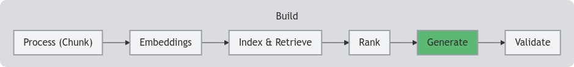

<!--- header table --->
<table align="left">     
  <td style="text-align: center">
    <a href="https://github.com/statmike/vertex-ai-mlops/blob/main/Applied%20GenAI/Generate/readme.md">
      
       View on GitHub
    </a>
  </td>
</table>    

---
# Generate
> You are here: `vertex-ai-mlops/Applied GenAI/Generate/readme.md`

    

# Generation

It's time for the exciting part: generating text with large language models (LLMs)! While simply providing a prompt to a model can yield impressive results, the field of generation has evolved to offer a wider range of tools and techniques. This section explores the APIs and methods available for generation, equipping you with the knowledge to utilize LLMs effectively and responsibly.

**Workflows:**

- **[Vertex AI Gemini API](./Vertex%20AI%20Gemini%20API.ipynb):** This notebook provides a comprehensive guide to using the Vertex AI Gemini API for text generation. It covers essential aspects such as:
    - Sending prompts and receiving generated text.
    - Multimodal prompts with images, audio, video, and documents
    - Customizing generation parameters (temperature, max output tokens, logprobs, etc.).
    - Scaling response: more than one response per requests, streaming responses, asynchronous request, batch requests, context caching
    - Controlled generation: JSON, enum, and more
    - Integrating Tools and Function Calling
    - Metadata labels for applications to trace costs
    - Much more!
- **[Vertex AI Imagen For Image Generation](./Vertex%20AI%20Imagen%20For%20Image%20Generation.ipynb):**  Expand your generative capabilities beyond text with Vertex AI Imagen. This notebook demonstrates how to:
    - Generate images from text prompts.
    - Control image attributes (style, composition, etc.).
    - Edit images
    - More!
- **[Tokens - Counting And Listing](./Tokens%20-%20Counting%20And%20Listing.ipynb):**  Tokens are the fundamental building blocks of text for LLMs. This notebook explains:
    - How LLMs tokenize text and files
    - Why tokenization matters for prompt engineering.
    - Methods to count and analyze tokens in your prompts and responses.
        - Local with the SDK
        - Remote with the Count Tokens API
        - Token usage metadata in model responses
- **[Long Context Retrieval With The Vertex AI Gemini API](./Long%20Context%20Retrieval%20With%20The%20Vertex%20AI%20Gemini%20API.ipynb):**  Explore the power of long-context models with this notebook. It demonstrates how to:
    - Use the Gemini API with extended context windows to include full documents.
    - Use the near perfect recall of newer models to replace retrieval outside the model with retrieval by the model.
    - Use context caching to avoid resending long context on repeated prompts - and save costs
    - Quickly test applications without building full retrieval architectures
    - Create a baseline for comparing retrieval systems to.

**Helper Workflows:**

- **[Create Files For Multimodal Prompt Examples](./Create%20Files%20For%20Multimodal%20Prompt%20Examples.ipynb):**  This helper notebook simplifies the process of:
    - Preparing files for multimodal prompts.
    - Combining text and image inputs for generation.
    - Experimenting with different multimodal prompting techniques
    - Saves content in this repository for use by the workflows above.
