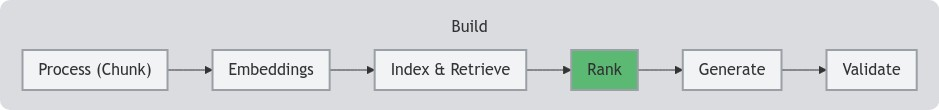

<!--- header table --->
<table align="left">     
  <td style="text-align: center">
    <a href="https://github.com/statmike/vertex-ai-mlops/blob/main/Applied%20GenAI/Ranking/readme.md">
      
       View on GitHub
    </a>
  </td>
</table>    

---
# Ranking and Re-Ranking
> You are here: `vertex-ai-mlops/Applied GenAI/Ranking/readme.md`

    

In retrieval augmented generation (RAG), providing relevant context to a large language model (LLM) is crucial for generating accurate and grounded responses. While traditional [embedding-based retrieval methods](../Retrieval/readme.md) are effective for finding semantically similar content, they may not always pinpoint the *most* relevant information. This can lead to increased costs and potentially off-topic responses.

**Why Ranking Matters:**

* **Accuracy:** Embedding methods (bi-encoders) excel at speed and scalability by independently encoding the query and candidate chunks. However, cross-encoders, which jointly encode the query and chunk, offer superior accuracy in assessing relevance.
* **Efficiency:** While cross-encoders are more accurate, they can be computationally expensive for large datasets.

The Ranking API offers a practical solution by combining the strengths of both approaches. It allows us to first retrieve potentially relevant chunks using efficient embedding methods and then re-rank those chunks with a powerful cross-encoder for optimal accuracy.

## Vertex AI Agent Builder Ranking API

This notebook explores how to leverage the [Ranking API](https://cloud.google.com/generative-ai-app-builder/docs/ranking) within [Vertex AI Agent Builder Grounding APIs](https://cloud.google.com/generative-ai-app-builder/docs/builder-apis) to enhance the accuracy and efficiency of a retrieval-augmented generation (RAG) system.
- [Vertex AI Agent Builder Ranking API](./Vertex%20AI%20Agent%20Builder%20Ranking%20API.ipynb)
