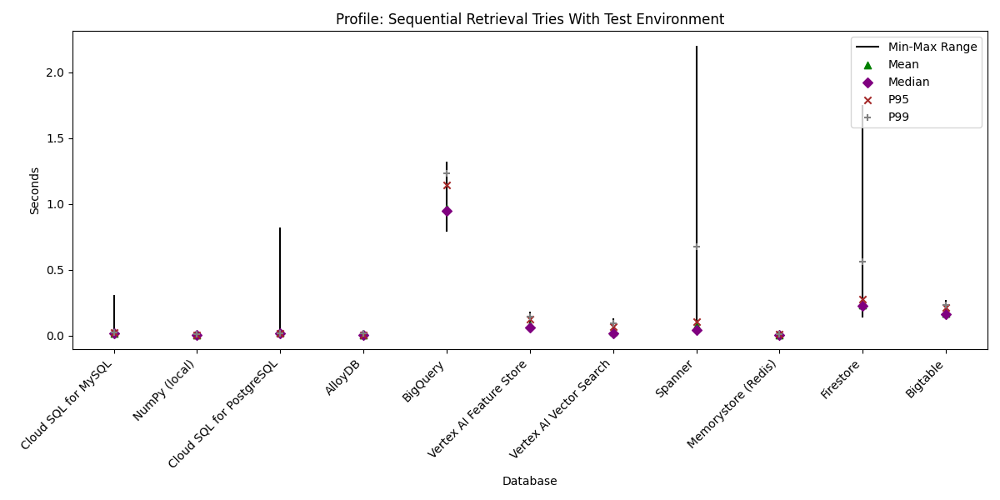
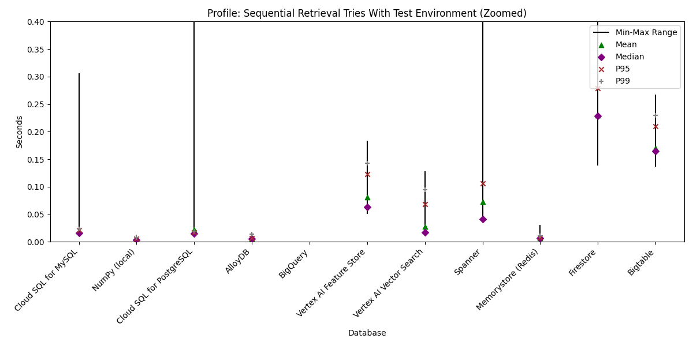
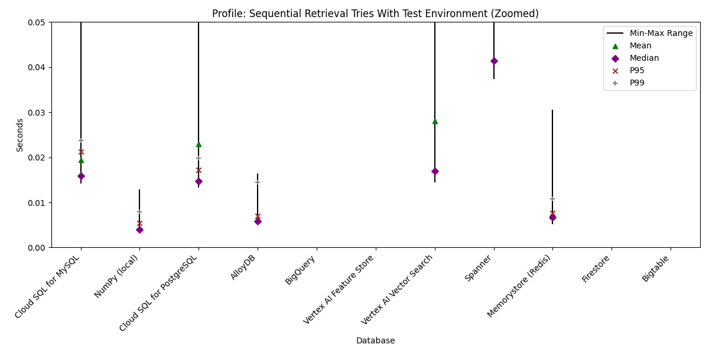

<!--- header table --->
<table align="left">     
  <td style="text-align: center">
    <a href="https://github.com/statmike/vertex-ai-mlops/blob/main/Applied%20GenAI/Retrieval/readme.md">
      
      <br>View on<br>GitHub
    </a>
  </td>
</table><br/><br/><br/><br/>

---
# Retrieval
> You are here: `vertex-ai-mlops/Applied GenAI/Retrieval/readme.md`

<p align="center"><center>
    
</center></p>

Once [embeddings](../Embeddings/readme.md) are generated for the pieces of content ([chunks](../Chunking/readme.md)), it is helpful to create a **retrieval** system that can be queried for similar matching chunks. This could be a brute-force solution or an index-based system that surfaces neighbors for query embeddings. Some solutions can store embedding vectors along with the text/image as well as other metadata. Other systems are designed to return the matching entity IDs, and a second step is needed to retrieve the text/image related to those entities. This section will review implementing a retrieval system with various Google Cloud offerings that span the set of features introduced here and can be used individually or together to fit your application workflow(s).

This retrieval process is what is usually referred to as retrieval augmented generation, or RAG, but is actually just the retrieval portion. Read more about the full process in the parent series of this content: [Applied GenAI](../readme.md), which includes a common next step of [ranking/re-ranking](../Ranking/readme.md) of the matched content.  Each of these workflows includes a full simple RAG example at the end!

**Workflow Details**

Each of these workflows sets up the solution and inserts the same 9040 embeddings with metadata:
- Document processing done in this workflow: [Large Document Processing - Document AI Layout Parser](../Chunking/Large%20Document%20Processing%20-%20Document%20AI%20Layout%20Parser.ipynb)
- Embedding calls done in batch in this workflow: [Vertex AI Text Embeddings API](../Embeddings/Vertex%20AI%20Text%20Embeddings%20API.ipynb)

The workflows import the resulting data and create the same starting point which is a Python list of dictionaries like:

```python
content_chunks = List[Dict(
    gse: str,
    chunk_id: str,
    content: str,
    embedding: List[float],  # 768-dimensional vector of float32 values
)]
```

Key-Value Pairs:
- `gse` holds values 'fannie' or 'freddie'
    - used in pre-filtering example to limit search to a one document source
    - used as crowding attribute in solutions that offer this functionality
- `chunk_id` is a unique id for a chunk of text like `fannie_part_0_c17`
    - indicates both the document, the part of the document, and the individual chunk id from the part
- `content` is the actual text chunk including a heading tree from the document structure
- `embedding` is the result of using the Vertex AI Text Embedding API to generate a text embedding

**Workflows:** Implement retrieval with different storage and indexing solutions:

- [Retrieval - Local With Numpy](Retrieval%20-%20Local%20With%20Numpy.ipynb)
    - A simple fully local solution that also shows how vector similarity works, including indexing with an inverted file (IVF) approach using k-means clustering.
    - **Ideal for:**  Experimentation, small-scale prototypes, and understanding the fundamentals of vector search.
- [Retrieval - BigQuery Vector Indexing And Search](Retrieval%20-%20BigQuery%20Vector%20Indexing%20And%20Search.ipynb)
    - A SQL-based data warehouse that has built-in vector search, including indexing methods for efficient approximate nearest neighbor search.
    - **Ideal for:** Large-scale analytical workloads, combining vector search with structured data analysis.  Batch vector matching across many rows!
- [Retrieval - Vertex AI Feature Store](Retrieval%20-%20Vertex%20AI%20Feature%20Store.ipynb)
    - A fast online sync of BigQuery tables that includes vector similarity and indexing for nearest neighbor search.
    - **Ideal for:** Machine learning applications requiring low-latency retrieval of feature vectors.
- [Retrieval - Vertex AI Vector Search](Retrieval%20-%20Vertex%20AI%20Vector%20Search.ipynb)
    - A purpose-built solution for incredible scale vector similarity search with low latency and many features, including hybrid search with sparse vectors.
    - **Ideal for:**  High-performance, large-scale production deployments with advanced search requirements.
- [Retrieval - Spanner](Retrieval%20-%20Spanner.ipynb)
    - The database that is super scale and globally distributed. Now with built-in vector similarity search.
    - **Ideal for:** Applications requiring global scale, high availability, and strong consistency for vector data.
- [Retrieval - AlloyDB For PostgreSQL](Retrieval%20-%20AlloyDB%20For%20PostgreSQL.ipynb)
    - Google Cloud's own PostgreSQL with enhanced performance and built-in vector search, including indexing methods that also cover the efficient ScaNN algorithm.
    - **Ideal for:**  PostgreSQL-compatible workloads requiring high performance and advanced vector search capabilities.
- [Retrieval - Cloud SQL For PostgreSQL](Retrieval%20-%20Cloud%20SQL%20For%20PostgreSQL.ipynb)
    - A fully managed PostgreSQL solution with an enhanced `pgvector` extension optimized for vector similarity search.
    - **Ideal for:** General-purpose vector search applications with moderate scale and PostgreSQL compatibility.
- [Retrieval - Cloud SQL For MySQL](Retrieval%20-%20Cloud%20SQL%20For%20MySQL.ipynb)
    - A fully managed MySQL solution that includes extensions for storing, indexing, and similarity search with vectors.
    - **Ideal for:**  MySQL-compatible applications with basic vector search needs.
- [Retrieval - Memorystore](Retrieval%20-%20Memorystore.ipynb)
    - In-memory data store with high-performance retrieval, including vector search.
    - **Ideal for:** Caching frequently accessed vectors and applications needing extremely fast retrieval speeds.    
- [Retrieval - Firestore](Retrieval%20-%20Firestore.ipynb)
    - An object database with real-time sync and serverless scalability.
    - **Ideal for:**  Real-time applications, mobile and web apps, where data synchronization and offline access are important.
- [Retrieval - Bigtable](Retrieval%20-%20Bigtable.ipynb)
    - The original NoSQL wide-column store with high throughput, low latency, and now, built-in vector similarity search.
    - **Ideal for:**  Large-scale, low-latency applications with sparse data and high write throughput.

**Workflow Environments**

Each workflow sets up an environment,loads the data, and then demonstrates of all vector search capabilities.  For each solution the minimal environment is choosen for the testing/development stage and is suitable for test or POC.  Here is a summary of the workflows choices for environments creation along with an approximate daily running cost when idle.  Each workflow includes code at the bottom for stopping all services and removing on going costs.

| Setting Choice For Test Environment (set as small as possible) | Numpy | BigQuery | Vertex AI Feature Store | Vertex AI Vector Search | Spanner | AlloyDB | Cloud SQL For PostgreSQL | Cloud SQL For MySQL | Memorystore (Redis) | Firestore | Bigtable |
|---|---|---|---|---|---|---|---|---|---|---|---|
|Tier||N/A|N/A|N/A|N/A|N/A|N/A|N/A|Basic|N/A|N/A|
|Edition||On-Demand|N/A|N/A|Enterprise|N/A|Enterprise|Enterprise|N/A|N/A|N/A|
|Region||`us` multi|`us-central1`|`us-central1`|`regional-us-central1`|`us-central1`|`us-central1`|`us-central1`|`us-central1`|`us-central1`|`us-central1`|
|Zone||N/A|N/A|N/A|N/A|`a`|N/A|N/A|N/A|N/A|`a`|
|Cluster||N/A|N/A|N/A|N/A|1|N/A|N/A|N/A|N/A|1|
|Instance/Node/Database||N/A|N/A|2 (min/max replicas)|1|1|1|1|1|`(default)`|1|
|Compute||On-Demand|N/A|`e2-standard-2`|Node|2 CPU, 16GB Memory|`db-g1-small`|`db-g1-small`|N/A|N/A|Node|
|Storage||33MB|N/A|N/A|N/A|N/A|N/A|N/A|1GB (memory)|N/A|HDD|
|Version Info||On-Demand|Optimized Online Serving|N/A|`GOOGLE_STANDARD_SQL`|N/A|`POSTGRES_15`|`MYSQL_8_0_36`|`REDIS_7_2`|N/A|N/A|
|Appoximate **Idle** Cost / Day|-|-|\$14.37|\$9.00|\$29.52|\$7.50|\$0.85|\$0.85|\$1.18|Free Tier|\$15.57|

**Production environments will likely need larger scale, replicas, etc.  In the case of fully managed solutions like BigQuery, Vertex AI Feature Store, Vertex AI Vector Search, etc. these are small scale production values.**

Remember to use the provided code at the end of each workflow to shut down environments in order to prevent ongoing costs.

---

## Comparison Of Vector Database Solutions

| Functionality | Cloud SQL for MySQL | NumPy | Cloud SQL for PostgreSQL | AlloyDB | BigQuery | Vertex AI Feature Store | Vertex AI Vector Search | Spanner | Memorystore (Redis) | Firestore | Bigtable |
|---|---|---|---|---|---|---|---|---|---|---|---|
| **Database Type** | OLTP |  `ndarray` (in-memory array) | OLTP | HTAP (OLTP + OLAP) | OLAP | AI/ML Feature Store | Vector Database | OLTP | In-Memory Data Store | NoSQL (OLTP-focused) | NoSQL Wide-Column Store |
| **Data Model** | Relational | In-memory Arrays | Relational | Relational, Columnar | Columnar | Key-Value based | Vector-based | Relational, Key-Value  | Key-Value | Document | Sparse, Key-Value, Wide-Column |
| **Store Embeddings** | Enable Vector Features, Use `VARBINARY` extension | Stored as NumPy Array Object | Enable Vector Features with `vector` extension | Enable Vector Features with `vector` extension | As `ARRAY<FLOAT64>` | As `ARRAY<FLOAT64>` | Native `Vector` type | As `ARRAY<FLOAT64>`, indexes require `(vector_length => INT)` parameter | Convert to bytes object | Native `Vector` type | Requires conversion to bytes |
| **Brute Force Search (No Index)** | Yes | Yes | Yes | Yes | Yes, with `VECTOR_SEARCH` function | No, requires `IndexConfig` in Feature View | No, requires index creation and deployment | Yes, with distance functions | No, requires index | No, requires index | Yes, with GoogleSQL and distance functions |
| **Distance Metrics** | Euclidean (L2 Squared), Cosine Similarity, Dot Product | Any, using math functions | Euclidean (L2), Cosine Similarity, Dot Product | Euclidean (L2), Cosine Similarity, Dot Product | Euclidean, Dot Product, Cosine Similarity | Euclidean, Dot Product, Cosine Similarity | Euclidean, Dot Product, Cosine Similarity | Euclidean, Dot Product (`DESC` for similarity), Cosine Similarity | L2 (Euclidean), IP (Dot Product), Cosine Similarity | Euclidean, Dot Product, Cosine Similarity | Cosine Similarity, Euclidean. Dot Product with limitations. |
| **Indexing** | Brute Force (In-Memory), Tree_SQ, Tree_AH | None (custom possible) | IVFFlat, HNSW | IVFFlat, HNSW (`pgvector`), IVR, ScaNN (`alloydb_scann`) | IVF, TreeAH (ScaNN) | Brute Force, TreeAH (ScaNN) | Brute Force, TreeAH (ScaNN) | ScaNN-like | FLAT (Brute Force), HNSW | FLAT (Brute Force) only | No indexes (only row keys indexed) |
| **Distance Metric Tied to Index** | Yes, no query override | N/A | Yes, no query override | Yes, no query override | Can be modified in query | Yes, no query override | Yes, no query override | Yes, no query override (`APPROX_` functions) | Yes, no query override | No, chosen at query time | N/A |
| **Tune Index During Build** | Choose number of partitions | N/A | Choose number of partitions | Choose number of partitions | Choose number of partitions | Choose size of partitions | Choose size and number of partitions for search | Choose number of partitions | HNSW has configurable partitions | N/A | N/A |
| **Index Restrictions** | One per table | N/A | No, query optimizer chooses | No, query optimizer chooses | Depends on index type and storage | One per Feature View | Indexes are the source for search | Multiple possible, user choice in query | Multiple possible, automatic selection | N/A | N/A |
| **Index Config in Query** | Overrides for neighbors and partitions | N/A | Overrides for partitions | Overrides for partitions | Overrides for partitions and distance measure | Overrides for partitions | Overrides for partitions | Required to specify partitions | No | N/A | N/A |
| **Override Index** | Yes, use distance functions | N/A | Not directly | Not directly | Force brute force in query options | No (or specify many partitions) | No, index is the search source | Yes, use non-`APPROX_` functions | All vector searches require an index | No | N/A |
| **Pre-filtering** | Not with index, yes with brute force | N/A | Yes | Yes | Yes (IVF), No (TreeAH/ScaNN) | Yes, allow/deny lists on filter column | Yes, allow/deny lists on filter columns | Yes | No (different indexes for subsets) | Requires composite index | Yes, with `WHERE` clause |
| **Crowding Attribute** | No | N/A | No | No | No | Yes, pre-specified column | Yes, pre-specified attribute | No | No | No | No |
| **Response Includes Text** | Yes, if in `SELECT` statement | Separate retrieval step | Yes, if in `SELECT` statement | Yes, if in `SELECT` statement | Yes, if in `SELECT` statement | Yes, if in Feature View and `return_full_entity = True` | Separate retrieval step | Yes, if in `SELECT` statement | Yes, if stored with embedding | Yes, if stored with embedding | Yes, if retrieved in SQL query |
| **Profile: Sequential Retrieval Tries With Test Environment<br>(seconds)**|Min: 0.0142<br>Max: 0.3064<br>Mean: 0.0194<br>Median: 0.0159<br>Std Dev: 0.0288<br>P95: 0.0212<br>P99: 0.0238|Min: 0.0038<br>Max: 0.0129<br>Mean: 0.0042<br>Median: 0.0040<br>Std Dev: 0.0011<br>P95: 0.0054<br>P99: 0.0079|Min: 0.0133<br>Max: 0.8231<br>Mean: 0.0229<br>Median: 0.0147<br>Std Dev: 0.0800<br>P95: 0.0172<br>P99: 0.0198|Min: 0.0053<br>Max: 0.0164<br>Mean: 0.0062<br>Median: 0.0058<br>Std Dev: 0.0015<br>P95: 0.0070<br>P99: 0.0145|Min: 3.8252<br>Max: 8.2738<br>Mean: 4.6543<br>Median: 4.6210<br>Std Dev: 0.5096<br>P95: 5.2126<br>P99: 5.8101|Min: 0.0503<br>Max: 0.1832<br>Mean: 0.0810<br>Median: 0.0629<br>Std Dev: 0.0289<br>P95: 0.1226<br>P99: 0.1423|Min: 0.0144<br>Max: 0.1282<br>Mean: 0.0281<br>Median: 0.0170<br>Std Dev: 0.0222<br>P95: 0.0681<br>P99: 0.0945|Min: 0.0374<br>Max: 2.2023<br>Mean: 0.0728<br>Median: 0.0414<br>Std Dev: 0.2226<br>P95: 0.1064<br>P99: 0.6752|Min: 0.0052<br>Max: 0.0305<br>Mean: 0.0068<br>Median: 0.0067<br>Std Dev: 0.0025<br>P95: 0.0076<br>P99: 0.0108|Min: 0.1388<br>Max: 1.7531<br>Mean: 0.2297<br>Median: 0.2286<br>Std Dev: 0.1299<br>P95: 0.2787<br>P99: 0.5592|Min: 0.1362<br>Max: 0.2672<br>Mean: 0.1697<br>Median: 0.1652<br>Std Dev: 0.0213<br>P95: 0.2101<br>P99: 0.2297|

<p align="center"><center>
    
    
    
</center></p>

---

## Important Notes About Setting Up An Index Solution

When working with embeddings—vectors of numbers represented as lists of floating points—there are key considerations for choosing and configuring a vector database solution.  Here are some crucial aspects to keep in mind:

- **Storage**
    - **Filterable attributes:**  Include values that can be used to filter search results (e.g., date, category, source).
    - **Crowding attributes:**  Use these to limit the number of similar matches returned (e.g., author, publication).
    - **Inline data:** Store the text chunk associated with each embedding directly to avoid an extra retrieval step.
    - **Metadata:**  Include relevant metadata like file name, location in the file, page number, etc.
    - **Normalization:** Consider automatic calculation and storage of normalized embeddings for efficient comparisons.

- **Indexing**
    - **Brute-force search:**  Offer a configuration for exhaustive search across all embeddings, useful for benchmarking and establishing ground truth retrieval.
    - **Approximate Nearest Neighbor (ANN) search:** Provide methods for efficient approximate search, such as:
        - **Inverted File (IVF) index:**  Clustering embeddings using algorithms like k-means.
        - **Tree-based methods:**  Hierarchical approaches like TreeAH.
        - **Quantization techniques:**  Compressing embeddings using methods like ScaNN ([link to ScaNN research blog](https://research.google/blog/announcing-scann-efficient-vector-similarity-search/)).
    - **Index parameters:** Allow configuration of cluster size (IVF) or leaf node size (TreeAH) to tune performance.
    - **Distance metrics:**  Support various distance metrics for similarity calculations (e.g., dot product, Euclidean, Manhattan, cosine).

- **Retrieval**
    - **Brute-force override:**  Enable an option to override ANN search and perform a brute-force search for ground truth retrieval.
    - **Control over retrieved neighbors:** Allow users to specify the number of neighbors to retrieve.
    - **Distance metric override:** Allow users to override the default distance metric at query time.
    - **Filtering and crowding:**  Enable the use of filterable and crowding attributes to refine the list of retrieved neighbors.
    - **Rich result sets:**  Return more than just match IDs; include the content, metadata, and similarity scores.
