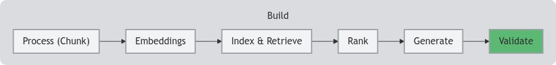

<!--- header table --->
<table align="left">     
  <td style="text-align: center">
    <a href="https://github.com/statmike/vertex-ai-mlops/blob/main/Applied%20GenAI/Validate/readme.md">
      
       View on GitHub
    </a>
  </td>
</table>    

---
# Validate
> You are here: `vertex-ai-mlops/Applied GenAI/Validate/readme.md`

    

Large language models (LLMs) are powerful tools for generating human-like text, but they can sometimes generate inaccurate information. To ensure your LLM provides grounded and factual responses, you need to provide it with relevant context. Retrieval augmented generation (RAG) helps find the relevant context, and ranking can help filter and sort the retrieved context. But how can you be sure the LLM is actually using that context effectively?

This is where validation comes in - it allows you to assess how well an LLM's response is grounded in the context provided to the prompt.

## Vertex AI Agent Builder Check Grounding API

This API helps you analyze how well an LLM's response is grounded in the context you provided.

Here's how it works:

- **Input:** You provide the Check Grounding API with the LLM's response and the context chunks you included in the prompt.
- **Analysis:** The API breaks down the LLM's response and maps phrases to supporting evidence within the context.
- **Output:** The API returns a detailed report, including:
    - **Citations:** Links between specific phrases in the response and the supporting context.
    - **Support Score:** An overall score (0 to 1) indicating how well the response is supported by the context.

**Workflow:**

- [Vertex AI Agent Builder Check Grounding API](../Validate/Vertex%20AI%20Agent%20Builder%20Check%20Grounding%20API.ipynb)
