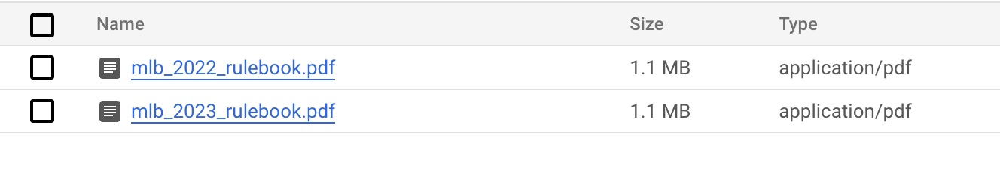
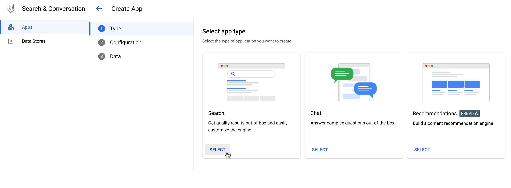
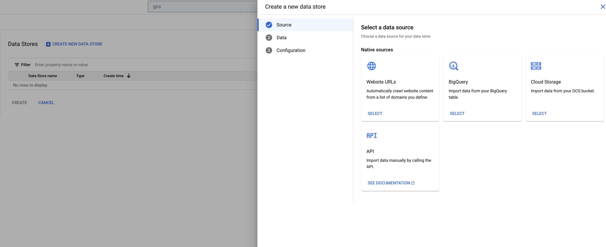
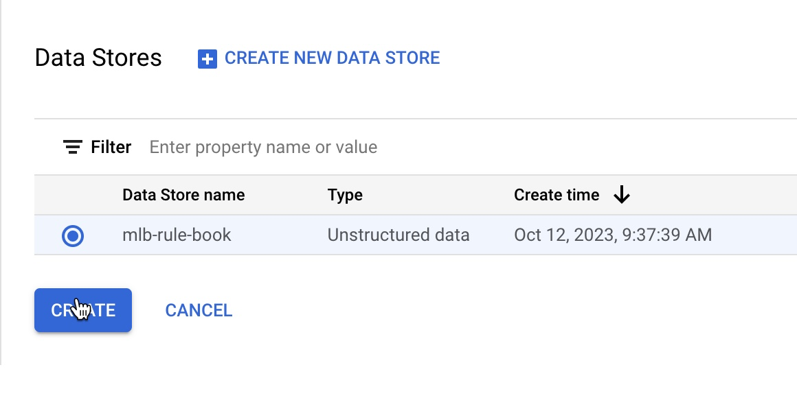
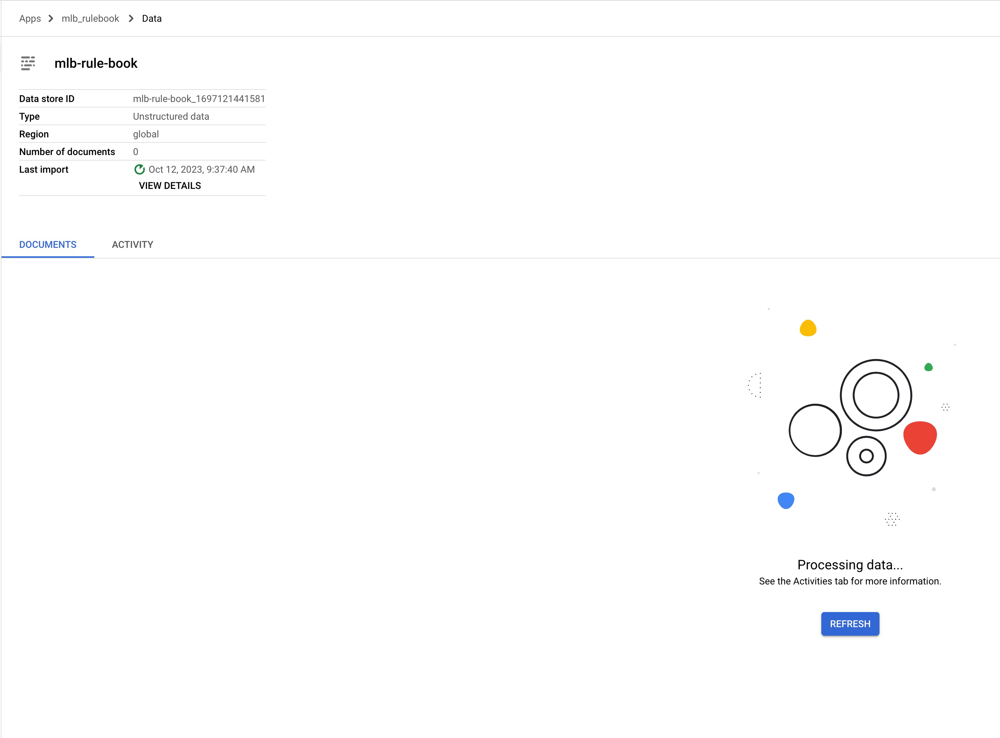

<!--- header table --->
<table align="left">     
  <td style="text-align: center">
    <a href="https://github.com/statmike/vertex-ai-mlops/blob/main/Applied%20GenAI/legacy/Vertex%20AI%20Search/vertex_search_setup.md">
      
       View on GitHub
    </a>
  </td>
</table>    

---
# /Applied GenAI/Vertex AI Search/vertex_search_setup.md

Following are the steps to create a Vertex AI Search App using Google Cloud Console.

To start with, download the MLB rule books from the URLs listed below and upload them to Google Cloud Storage. Steps to create a bucket in google cloud storage can be found [here](https://cloud.google.com/storage/docs/creating-buckets) and upload files to Google Cloud Storage can be found [here](https://cloud.google.com/storage/docs/uploading-objects)

- [MLB 2022 Rule Book](https://img.mlbstatic.com/mlb-images/image/upload/mlb/hhvryxqioipb87os1puw.pdf)
- [MLB 2023 Rule Book](https://img.mlbstatic.com/mlb-images/image/upload/mlb/wqn5ah4c3qtivwx3jatm.pdf)

    

Once the files the uploaded to Cloud Storage Bucket, search for `Vertex AI Search and Conversation` in the search bar on the top of the console and switch to the page. You will be seeing the landing page as shown below in the screenshot.

    

Click on `New App` and select `Search` as App Type.

    

Under Configuration, make sure to turn on `Enterprise Edition Features` and `Advanced LLM Features`. Also, Enter the `App Name` and select the region as `global`.

    

Next Step is to create a `Data Store`. Click on `Create New Data Store` and Select `Cloud Storage` as Data Source. 

    

Browse the Cloud Storage and select the files you have uploaded. 

    

After choosing the files, enter the `Data Store` name and click on `Create`.

    

Select the `Data Store` and click on `Create`.

    

You will be able to watch the progress in `Data Store` creation as shown below.

    

After the successful completion of Data Store creation, You will be able to test the search app using the `preview feature` on the left pane.

    

