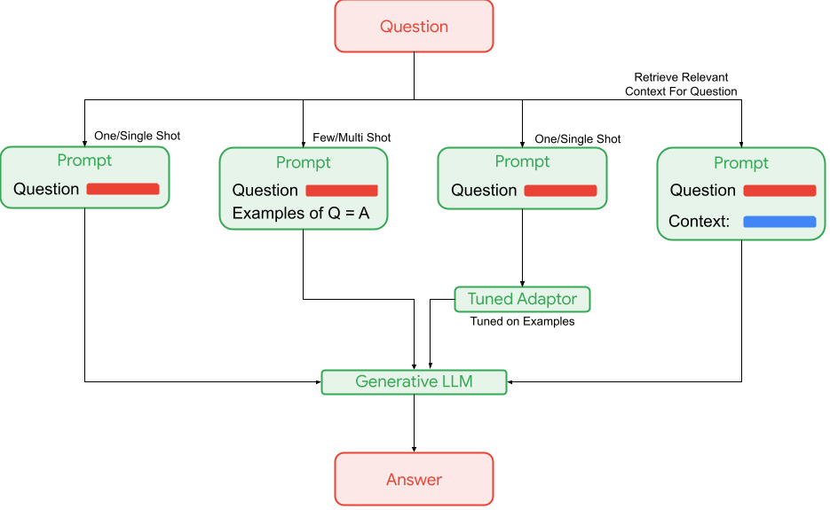
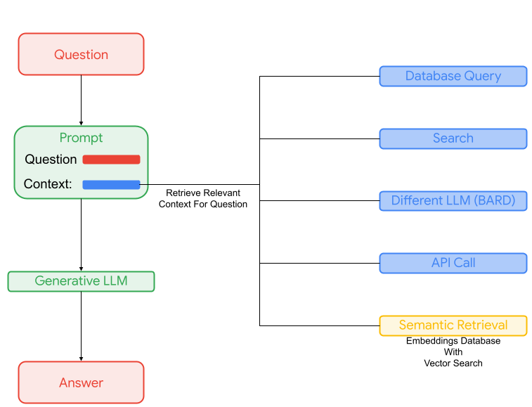
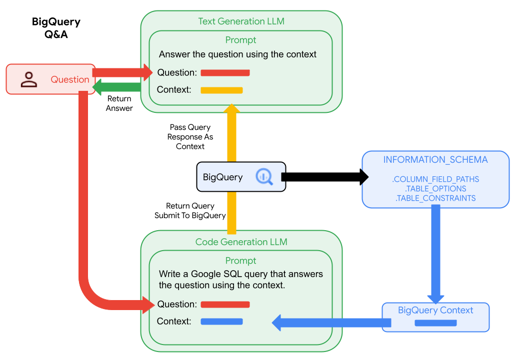
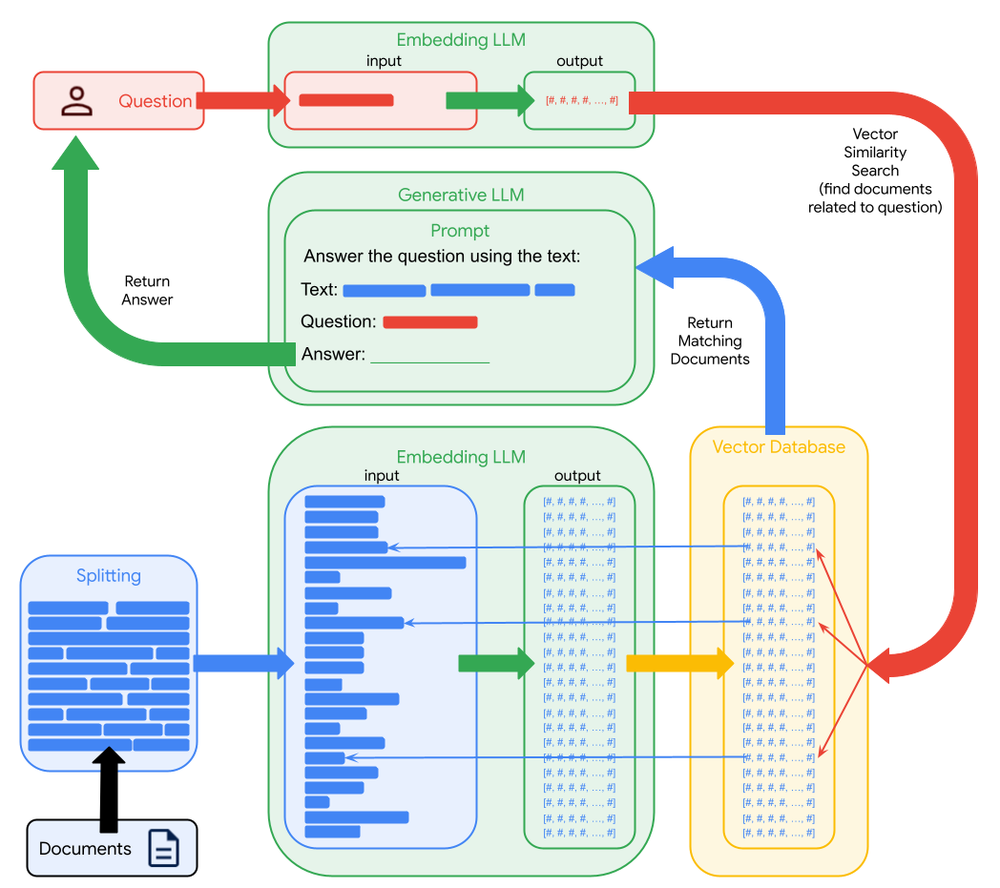

<!--- header table --->
<table align="left">     
  <td style="text-align: center">
    <a href="https://github.com/statmike/vertex-ai-mlops/blob/main/Applied%20GenAI/legacy/readme.md">
      
      <br>View on<br>GitHub
    </a>
  </td>
</table><br/><br/><br/><br/>

---
# Applied Generative AI (Legacy)
> You are here: `vertex-ai-mlops/Applied GenAI/legacy/readme.md`
    
> **NOTE** - content in this folder was previously in the parent folder structure and has been moved here to preserve it while new content has been introduced with better techniques and newer features.  This content might still be helpful.  Make sure to check out the latest content in the [main folder](../readme.md).

This series of notebooks highlights the use of [Vertex AI Generative AI](https://cloud.google.com/vertex-ai/docs/generative-ai/learn/overview) for workflows that include using Google's foundational large generative AI models.  [These models](https://cloud.google.com/vertex-ai/docs/generative-ai/learn/models) are hosted by Google and used by API:
- Gemini API (Multimodal data, text, code, chat)
- PaLM API (Text, chat, embeddings)
- Codey APIs (Code generation, code chat, code completion)
- Imagen API (Image generation, image editing, image captioning, visual question answering, and multimodal embedding)


**More Resources**

- A great repository with notebooks, code samples , sample applications, and more: [GitHub/GoogleCloudPlatform/generative-ai](https://github.com/GoogleCloudPlatform/generative-ai)
- Advanced Prompt Engineering at [GitHub/GoogleCloudPlatform/applied-ai-engineering-samples](https://github.com/GoogleCloudPlatform/applied-ai-engineering-samples/tree/main/genai-on-vertex-ai/advanced_prompting_training)
- For a solution based approach to generative AI search and conversation applications check out [Vertex AI Search and Conversation](https://cloud.google.com/generative-ai-app-builder?hl=en)
    - For an overview of using in application workflow check out the subfolder in this repository [Vertex AI Search](./Vertex%20AI%20Search/readme.md)

---
## Getting Started

This section covers the basics for getting started with the Python Client. 

>For a complete getting started overview of all the foundation models in use along with tips for managing asynchronous and streaming request as well as handling all requests within quota please check out this workflow:
>- [Getting Started - Vertex AI GenAI Python Client](./Getting%20Started%20-%20Vertex%20AI%20GenAI%20Python%20Client.ipynb)

>For an overview of handling asynchronous requests when working with generative AI APIs check out the workflow:
>- [Python Asynchronous API Calls](./Python%20Asynchronous%20API%20Calls.ipynb)

**Install**

The Vertex AI [Python Client](https://cloud.google.com/python/docs/reference/aiplatform/latest) should be updated frequently!

```Python
!pip install google.cloud.aiplatform -U -q --user
```

> If you installed a `.whl` directly during the early preview then you might need to also use the `--force-reinstall` tag.

```Python
import google.cloud.aiplatform as aiplatform
aiplatform.__version__
# '1.42.1'
```

**Authorization**

If you are in a Vertex AI Workbench instance then you are already authenticated to a GCP project.  You can retrive the current project into a variable using:

```Python
project = !gcloud config get-value project
PROJECT_ID = project[0]
PROJECT_ID
```

If you need to first authenticate to your GCP project from a Colab, use the following:

```Python
PROJECT_ID = 'YOUR PROJECT ID HERE'

from google.colab import auth

auth.authenticate_user()
!gcloud config set project {PROJECT_ID}
```

**Setup**

```Python
REGION = 'us-central1'

import vertexai
import vertexai.vision_models # Imagen Models
import vertexai.language_models # PaLM and Codey Models
import vertexai.generative_models # for Gemini Models

vertexai.init(project = PROJECT_ID, location = REGION)
```

**Use**

Example for a text generation request with a specific PaLM model - [reference](https://cloud.google.com/python/docs/reference/aiplatform/latest/vertexai.language_models.TextGenerationModel):

```Python
textgen_model = vertexai.language_models.TextGenerationModel.from_pretrained('text-bison@001')

prediction = textgen_model.predict('Create is a short summary of the rules of baseball?')

print(prediction.text)
```

>Baseball is a bat-and-ball game played between two teams of nine players on a field with a diamond-shaped infield. The game is played by throwing a ball from a pitcher to a batter, who tries to hit the ball with a bat. If the batter hits the ball, they can run around the bases to score points. The team with the most points at the end of the game wins.

And, with Gemini:

```Python
gemini_text = vertexai.generative_models.GenerativeModel("gemini-1.0-pro")

prediction = gemini_text.generate_content('Create is a short summary of the rules of baseball?')

print(prediction.text)
```

>**Rules of Baseball:**
>
>* **Objective:** Score more runs than the opposing team by advancing base runners around the four bases.
>* **Field:** Consists of a diamond-shaped infield and an outfield.
>* **Teams:** Two teams of nine players each.
>* **Innings:** A game is divided into nine innings, with each team batting and fielding.
>* **Batting:** The hitting team tries to hit the ball into the field to advance base runners.
>* **Pitching:** The fielding team tries to throw strikes at the plate to prevent the batting team from hitting the >ball.
>* **Defense:** The fielding team tries to catch or throw out batters and base runners.
>* **Scoring:** Runs are scored when a base runner crosses home plate.
>* **Outs:** Three outs end an inning for the batting team.
>* **Walks:** A batter is awarded first base if they are hit by a pitch or receive four balls.
>* **Strikeouts:** A batter is out if they swing and miss three times at a pitch.
>* **Base Stealing:** Runners may attempt to steal bases when the ball is not in play.
>* **Homeruns:** A player scores a homerun if they hit the ball over the outfield fence.


---
## LLMs

Large Language Models (LLMs) are models that have been trained on enormous amounts of text samples and then fine tuned for tasks like summarization, extraction, and/or classification.  Today, these fine-tuned models have emerged as generative AI, also called GenAI.  

### Customize

I like to say GenAI stands for "General AI" as these models are now like opinionated bots that can do many tasks that previously required custom fit-for-purpose ML models.  Those fit-for-purpose models needed training data, labeling, and iterative training to get to the necesssary accuracy for a single task.  Now the processes has reversed a bit.  These general models can be asked, called prompting, to do the a new task and then the prompt can be iteratively adjusted to attempt achieving a desired accuracy.  This prompt iteration takes on stages.

**Prompting**

- [Prompt Design](https://cloud.google.com/vertex-ai/docs/generative-ai/learn/introduction-prompt-design):
    - Adjusting prompts iteratively = Single Shot Prompt Engineering
    - Adding context to prompts (grounding)
    - Informing prompts with examples = Multi-Shot Prompt Engineering
    - More strategies:
        - [General Strategies](https://cloud.google.com/vertex-ai/docs/generative-ai/learn/prompt-design-strategies#chain-prompts)
        - [Advanced Strategies](https://github.com/GoogleCloudPlatform/applied-ai-engineering-samples/tree/main/genai-on-vertex-ai/advanced_prompting_training) like Chain of Thought, and  ReAct (Reasoning + Acting)

**Tuning**

The knowledge gained from prompt design leads the need to tune models for tasks:

- [Tuning](https://cloud.google.com/vertex-ai/docs/generative-ai/models/tune-models) Models For specific tasks 
    - [Supervised Tuning](https://cloud.google.com/vertex-ai/docs/generative-ai/models/tune-text-models-supervised) - Adaptive tuning with limited example {input:output} sample pairs
    - [Reinforcement learining from human feedback (RLHF)](https://cloud.google.com/vertex-ai/docs/generative-ai/models/tune-text-models-rlhf) to learn how create complex outputs based on providing human choices between multiple outputs
    - [Distillation](https://cloud.google.com/vertex-ai/docs/generative-ai/models/distill-text-models) to teach a smaller model how to do a task using a larger model as the teacher.  (lower cost, lower latency)

**Evaluation**

As tuned versions of models are built for tasks it is important to characterize the performance using evaluation:

- [Metrics-based evaluation](https://cloud.google.com/vertex-ai/docs/generative-ai/models/evaluate-models)
    - Provide a collection of prompt with answers and get metrics for the model performance at recreating the answers. Metrics are specifict to the type of task: classification, summarization, question answering, text generation
- [Side-by-side evaluation](https://cloud.google.com/vertex-ai/docs/generative-ai/models/side-by-side-eval)
    - Compare models ability to summarize or answer questions with an autorater that is using evaluation critera to judge each model on specific prompts and aggregate metrics.

### Use

For any LLM stage mentioned above there are additional consideration when using beyond the prompt.  

**Retrieve Context - Grounding**

To have an LLM response informed on specific information, even information it has never seen, means providing the information as context directly in the prompt.  Later, below in GenAI use cases, this is covered more thoroughly.  There are multiple ways within VertexAI to achieve this on your custom information.

A service within Vertex AI, [Vertex AI Search & Conversation](https://cloud.google.com/vertex-ai-search-and-conversation?hl=en), make it easy to manage custom content for search and retrieval.  One of these retrieval patterns is for grounding prompts to LLMs.  The PaLM and Gemini API can directly ground calls with the data stores of Vertex AI Search & Conversation: [Grounding](https://cloud.google.com/vertex-ai/docs/generative-ai/grounding/overview).

The retrieval operation can also be custom built by:
- parsing information, documents, websites, ...
- splitting content into meaningful chunks: lines, paragraphs, tables, images, ...
- generating embeddings for the chunks using embedding LLMs like those in Vertex AI, custom embedders, or OSS embedding models
- storing the embedddings for retrieval in a Vector DB

There are many ways to do vector search. In production there are considerations, including:
- How many indexes?
- What is the size of indexes?
- What is the lifespan and frequency of indexes?
- How frequently will indexes get updates (append, update, delete)?
- How quickly do updates need to surface in searches?
- What is the next step after a search?  Does the coorespondinng text need to be retrieved separately?

Google Cloud offers solutions for any workflow!
- Local to the application:
    - [ScAAN](https://github.com/google-research/google-research/tree/master/scann)
    - [Faiss](https://github.com/facebookresearch/faiss)
- With transactional data:
    - using [pgvector](https://github.com/pgvector/pgvector) with:
        - [Cloud SQL for PostgreSQL](https://cloud.google.com/sql/docs/postgres)
        - [AlloyDB for PostgreSQL](https://cloud.google.com/alloydb/docs)
        - blogs:
            - [Building AI-powered apps on Google Cloud databases using pgvector, LLMs and LangChain](https://cloud.google.com/blog/products/databases/using-pgvector-llms-and-langchain-with-google-cloud-databases)
    - [Spanner](https://cloud.google.com/spanner/docs)
        - [Vector Search in Spanner](https://cloud.google.com/spanner/docs/find-k-nearest-neighbors)
        - [langchain with Spanner](https://github.com/googleapis/langchain-google-spanner-python)
- In the data warehouse:
    - [BigQuery Vector Indexes](https://cloud.google.com/bigquery/docs/vector-search-intro)
- Fit-for-purpose: Fast, Scalable, and Flexible:
    - [Vertex AI Feature Store](https://cloud.google.com/vertex-ai/docs/featurestore/latest/overview) with built-in [Search using embeddings](https://cloud.google.com/vertex-ai/docs/featurestore/latest/embeddings-search) 
    - [Vertex AI Vector Search](https://cloud.google.com/vertex-ai/docs/vector-search/overview)

**Conforming Response Shape**

A common need for responses is to be the inputs to a later activity like calling a function or an API.  This means conforming the response to a specific schema with certain keys and data type for values.  With Vertex AI Gemini Models you can use [Function Calling](https://cloud.google.com/vertex-ai/docs/generative-ai/multimodal/function-calling) to specify the output shapes and get responses that conform directly to the schema.  

**Extending Response to Applications**

After conforming the responses to a shape (schema) it is likely that the response could directly be sent to a function or api. Think of this as extending the response.  The responses from the extention are likely inputs to another prompt to an LLM to further synthesis and refine the overall response.  This orchestration is the goal of [Vertex Ai Extensions](https://cloud.google.com/vertex-ai/docs/generative-ai/extensions/overview).

---
### What is an LLM actually doing?

Before jumping into use cases it is a good idea to think about what LLMs are doing.  The prompt is responde to with an output.  The LLM is generating an output based on settings that guide it through picking the likely next word, then next word, then next word, then next word, ... until it has either created a response that fits or has hit the limit of it's output size.

A good way to "see" this is to pick a popular passage of public domain text. Like the opening paragraph/sentence of "A Tale of Two Cites" by Charles Dickens and Harvey Dunn.  "It was the best of times, it was the worst of times, ...".  How many input/prompt words before the LLM picks the correct next word?  How many before it can fill in the remainder of the passage?  What is the input/prompt starts mid-sentence?  

Expore all of these questions interatively with the notebook:
- [Understanding LLMs](../Understanding%20LLMs.ipynb)

---
## GenAI Use Cases

**Designing Prompts**

Reference - [Overview of text prompt design](https://cloud.google.com/vertex-ai/docs/generative-ai/text/text-overview)

While using an LLM basically comes down to text input and text output, it can be helpful to understand how to frame the text input to achieve a desired output.  This is known as prompting.  Experimenting with prompting is called prompt tuning.  How the input prompt is framed can solve different types of tasks like summarization, classification and various extraction tasks (generate text, rewrite text, answer questions).  A high level overview of prompt design for these tasks is depicted below:

<p align="center" width="100%"><center>
    
</center></p>
    
An incredibly useful task for LLMs is answering questions - the far right extraction tasks depicted above.  There are several approaches to constructing prompts for this type of tasks.  The simplest is just asking the question - single shot.  This relies on the LLMs pre-trained data to construct an answer.  LLMs can have vast knowledge of many topics but are unaware of your private and/or newly created information.  

**Tuning Language Models**

Reference - [Tune language models](https://cloud.google.com/vertex-ai/docs/generative-ai/models/tune-models)

When the answers need to be tailored for format, length or tone then it can be helpful to try multi-shot prompting.  This includes examples of questions with answers in the prompt followed by the new question as a way of coercing the type of answer.  Another way to acomplish this is to create a tuned adaptor for the model that formats a single shot prompt in a way that coerces the answer based on a set of tuning examples.

>**Sidebar:**
>
>Tuning a language model does not actually change the model. Instead, it enhances the model for a specific task.  This helps the model learn to perform a task as desired from a set of examples - tuning examples.  This can be thought of as an adaptor model.  I like to think of this as a pair of glasses for an LLM.  These glasses focus the light (input text) onto the eye (the LLM input) in an alignment that optimizes on doing the task well.

**Contextual Awareness - Grounding**

When the LLM needs additional information related to the question in order to answer it, the information can also be supplied in the prompt as context.  This avoids the need to customize or retrain an LLM for specific new or private information.

>**Sidebar:**
>
>When an LLM is used to generate an answer, it is drawing from the input prompt and the learned information (parameters).  I like to think of an LLM like a professional researcher.  The researcher has read many articles, books, papers and more and is very knowledgeable.  The researcher is likely very good at reading new documents as well because it has a lot of transferable skills from already vast knowledge.  When you give context to the LLM it is like giving the researcher a new article.  They are likely very good at reading and understanding this new information as long as it is similar in style, topic, and format to what they have spent its career doing (training).
>
>Extending this analogy, if the new context is too brief or off topic then the researcher likely needs to fill in the gaps and might misinterpret what you are asking.  Also, if you give too much context that veers off into other topics then the researcher may also go too far off topic when trying to answer.  This sometimes gets called hallucination but I like to think of it as the researcher getting off topic from not being well informed, guided, and focused on the topic at hand.

Prompting approaches for question answering are shown in the diagram below:
    
<p align="center" width="100%"><center>
    
</center></p>

**Retrieving Context**

Ultimately, the LLM needs contextual information about the question in order to answer it.  Rather than needing your custom or private information as part of the LLM you could supply relevant context from your library or warehouse of information along with a question so that the LLM is tasked with reading, and determining how to answer using the supplied context.  The core to this approach is retrieving the context.  The chart below shows many sources that can be used to retrieve context for the question.

<p align="center" width="100%"><center>
    
</center></p>

The key is retrieving context relevant to the specific question being asked.  Not too much context, not off topic context, but specific relevant context.  A great advantage of this approach is that the LLM does not necessary need specific training or parameters to understand your private or new text because the text is being supplied in the prompt - as context to the question.

**Semantic Retrieval - Retrieval Augmented Generation (RAG)**

A type of LLM is an embedding LLM which returns a vector of numbers to represent the input text, image, or combination (multimodal).  These numbers relate to the words, their order, their meaning, and their cooperation - in other words semantic meaning of the input.  These embeddings lead to an amazing general approach to identifying context for a question that can been automated without a lot of customization.

By computing the distance between embeddingins for questions and pieces of information, sometimes called chunks (think lines, paragraphs, ...), a filtered list of most relevant content can be retrieved as context.  

At first pass this seems simple: match question to chunks, use chunks as context. However, the topic of retrieval can get deep, complex and very use-case specific.

**Input/Output Sizes: Tokens**

Large language models have limit for the size of input then can receive and output they can return.  While we think of these as words, maybe even characters, the models are actually using a codified version of language where the coding process is called tokenization.  It is not as simple as a `unique_word = unique_token` because models use a data compression mechanism like [Byte-Pair Encoding (BPE)](https://en.wikipedia.org/wiki/Byte_pair_encoding).

>**Sidebar:**
>
> Languages are enormous.  Many words and many versions and variations of words.  Words are made up of characters and it turns out there are actually fewer grouping of unique characters than there are unique words.  Byte-Pair Encoding groups common/frequent sets of characters into unique encodings.  This process is a big part of mapping languages to machine learning and is a core part of the research.  Modern LLMs dont just take a "bag" of unique words, or encoded character groupings.  They also consider all the combinations of these with lengths that can be very long.  The longer the considered length the more the more semantic meaning and nuance can be learned from passages of text.

Without getting into to much detail about the mechanics of the LLMs we want to know why these token limits exists.  First, computational performance.  Handling more means needing more memory and more computational complexity.  There are models designed for larger input and/or output.  These models have architectures designed to handle longer text during their training phase.  Models are typically priced based on the input+output size so we should try to focus the interaction with LLMs on the specific task with optimal information.  Semantic retrieval in the next section will help a lot with this!

>**Sidebar:**
>
>Input and output limits for LLMs can be described in the analogy of interacting with a researcher as we have before in this document.  The LLM is the researcher.  We can bring new information to the researcher - context in the prompt.  The researcher may limit what they are willing to consider when we ask each question - input tokens.  The researcher may also limit the response they give - output tokens.

**Tokens and Pricing - Control and Transparency**

LLMs hosted as API's are typically priced by a combination of the input+output and the model itself.  Large general models might cost more while smaller topical models (think code completion) are cheaper.  Models with highly focused areas of knowledge might have very special pricing - think medical or legal with specific domains covered in the pre-training data.

One mechanism to control cost is limiting the input and output size.  To control output sizes models have parameters like [`max_output_token`](https://cloud.google.com/python/docs/reference/aiplatform/latest/vertexai.language_models.TextGenerationModel#vertexai_language_models_TextGenerationModel_predict).  Input size can be controlled by creating smaller, more optimal chunks of input the technique of the next section will help - semantic retrieval.

With Vertex AI, [pricing](https://cloud.google.com/vertex-ai/pricing#generative_ai_models) for LLMs is based on the model and the character count of the input + output. This makes pricing easy and transparent.  Since the models measure input and output in tokens it can be helpful to use the `countTokens` method provided for models ([details here](https://cloud.google.com/vertex-ai/docs/generative-ai/get-token-count)).

---

## Example Workflows

The following sections links to many notebook based examples of using LLMs as described above!

---
### Summarization

Text can come in the form of audio.  This requires a conversion to text, transcription.  Google Cloud provides a Speech-To-Text API with multiple methods to handle this process depending on the needs, length of audio, and file/streaming application.  

- [Summarize Conversations - Text and Audio](./Summarize%20Conversations%20-%20Text%20and%20Audio.ipynb)
    - Start with history of a chat transcription in text
    - Continue the chat using a Chat LLM as an agent
    - Uses an LLM to Summarize the combined chat transcription with the added agent interaction
    - Converts the transcript to an audio file with multiple voices using the Text-To-Speech API
    - Converts the audio file to a conversation transcript will also recognizing the different speakers
    - Use DLP to redact person information like Names, Account numbers, and URLs.
    - Summarizes the chat transcript overall and from the perspective of each speaker
    - Use the LLM to label the speaker by their role as either "Agent" or "Customer"

---
### BigQuery Q&A Examples:

These notebooks use code generation LLMs to first query BigQuery to retrieve context for users questions.  Then the response is provided to text generation LLMs to answer the question.

<p align="center" width="100%"><center>
    
</center></p>

- [Vertex AI GenAI For BigQuery Q&A - Overview](./Vertex%20AI%20GenAI%20For%20BigQuery%20Q%26A%20-%20Overview.ipynb)

**Extended concepts:**

Similar to the Document Q&A examples below, embedding based content retrieval (RAG) can also benefit BigQuery Q&A.  

By creating embeddings for table descriptions, the question can be embedded and used to find the best matching table to use for the query.  

By creating embeddings for column descriptions, the question can be embedded and used to find the best matching columns to include in the schema supplied as context.  This allows narrowing the context down to a subset of columns rather than full tables.  The list of columns should always be checked for the inclusing of any key columns for the table and those added if not directly identified in the embedding search.  

A further enhancement is to use a text LLM along with a code LLM.  First ask the text LLM to list the steps needed to answer the question.  Then, the prompt for the code llm would include the steps retrieved from the text LLM along with the matching table and column schema retrieved.  

---
### Automate BigQuery Metadata With LLMs

Using LLMs to query data in BigQuery highlights the need for descriptive metadata like:
- better column names
- better table and column descriptions

This example workflow shows how to use an LLM to generate better naming and descriptions through interpretation of the content of tables. 

- [Vertex AI GenAI For BigQuery Metadata - Make Better Tables](./Vertex%20AI%20GenAI%20For%20BigQuery%20Metadata%20-%20Make%20Better%20Tables.ipynb)

---
### BigQuery Advisor For More Efficient Code

Code is a language.  A common syntax is SQL.  BigQuery runs GoogleSQL and a common question is "Is my code efficient?".

Using BigQuery and Vertex AI Codey APIs it is possible to build a BigQuery Advisory!

[Vertex AI GenAI For Rewriting - BigQuery Advisor With Codey](./Vertex%20AI%20GenAI%20For%20Rewriting%20-%20BigQuery%20Advisor%20With%20Codey.ipynb)
- Use the BigQuery Information Schema to find potentially inefficient queries.  In this case identify the queries with longest syntax as an example.
- Use BigQuery ML to directly connect to Vertex AI Generative AI APIs and get descriptions of long SQL statements
- Use Vertex AI Codey APIs to rewrite long code with a target of shorter syntax
    - The example runs on an environment that has run all the code in this GitHub repository.  It find a query with more than 7k character and shrinks it by 54% and then submits it to check that it runs successfully!

---
## Document Q&A Examples:

**Prerequisites**

These notebooks include direct installs of several supporting packages.  They use Vertex AI and Document AI services for processing data while also using Google Cloud Storage And Google BigQuery for data storage and retrieval.  If you are running these notebooks from Colab or another environment where your user id is authenticated then your account will need roles/permissions that allow working with these services.  If you are running these from a Vertex AI Workbench Notebook instance then it is running as a service account which will need the roles/permission that allow working with these services. 


### Document Q&A - Version 1

Ask complex scenario based questions and get text generated answers with references to relative sections of the documents.
- These parse a PDF document from GCS or URL into the documents elements: tables, paragraphs
- gets embeddings for the elements
- creates a local vector search function with ScaNN
- creates a function to generate Generative AI prompts with document contexts retrieved by vector search of the question (embedding) and the documents elements
- Saves the document parsing and embeddings to GCS and/or BigQuery for retrieval on future runs - saves repeat cost and time

<p align="center" width="100%"><center>
    
</center></p>

    
**Sports Rules:**
- [Vertex AI GenAI For Document Q&A - MLB Rules For Baseball](./Vertex%20AI%20GenAI%20For%20Document%20Q%26A%20-%20MLB%20Rules%20For%20Baseball.ipynb)
- [Vertex AI GenAI For Document Q&A - USGA Rule For Golf](./Vertex%20AI%20GenAI%20For%20Document%20Q%26A%20-%20USGA%20Rules%20For%20Golf.ipynb)
- [Vertex AI GenAI For Document Q&A - IFAB Laws For Soccer](./Vertex%20AI%20GenAI%20For%20Document%20Q&A%20-%20IFAB%20Laws%20For%20Soccer.ipynb)
- [Vertex AI GenAI For Document Q&A - MCC Laws For Cricket](./Vertex%20AI%20GenAI%20For%20Document%20Q%26A%20-%20MCC%20Laws%20For%20Cricket.ipynb)
- [Vertex AI GenAI For Document Q&A - NBA Rules For Basketball](./Vertex%20AI%20GenAI%20For%20Document%20Q%26A%20-%20NBA%20Rules%20For%20Basketball.ipynb)
- [Vertex AI GenAI For Document Q&A - NFL Rules For Football](./Vertex%20AI%20GenAI%20For%20Document%20Q%26A%20-%20NFL%20Rules%20For%20Football.ipynb)
- [Vertex AI GenAI For Document Q&A - NHL Rules For Hockey](./Vertex%20AI%20GenAI%20For%20Document%20Q%26A%20-%20NHL%20Rules%20For%20Hockey.ipynb)

**Business Documents:**
- [Vertex AI GenAI For Document Q&A - FAA Regulations](./Vertex%20AI%20GenAI%20For%20Document%20Q%26A%20-%20FAA%20Regulations.ipynb)
- [Vertex AI GenAI For Document Q&A - Municipal Securities](./Vertex%20AI%20GenAI%20For%20Document%20Q%26A%20-%20Municipal%20Securities.ipynb)
- [Vertex AI GenAI For Document Q&A - Annual Report](./Vertex%20AI%20GenAI%20For%20Document%20Q%26A%20-%20Annual%20Report.ipynb)


Use Vertex AI Matching Engine to host low-latency vector search:
- [Vertex AI Matching Engine For Document Q&A](./Vertex%20AI%20Matching%20Engine%20For%20Document%20Q%26A.ipynb)
    - Use [Vertex AI Matching Engine](https://cloud.google.com/vertex-ai/docs/matching-engine/overview) for stateful, low latency, vector searches
        - Create and Deploy an index
        - Perform online queries with hosted index
        - Recreate the document bot using online queries
        - Rerunning for multiple `EXPERIMENT` values will deploy multiple indexes to the same index endpoint

### Document Q&A - Version 2
    
Enhacements compared to Version 1:
- multiple documents
- better context configuation with multi-level search
- ouput include visual of all pages that include context to the question with bounding boxes
- better data formatting for scaling in services outside the notebook environment: datastore, Vetex AI Matching Engine, BigQuery, ...
- ability to overwrite previous runs saved data when needed

**Sports Rules:**
- [Vertex AI GenAI For Document Q&A v2 - MLB Rules For Baseball](./Vertex%20AI%20GenAI%20For%20Document%20Q%26A%20v2%20-%20MLB%20Rules%20For%20Baseball.ipynb)
    
**Business Documents:**   
- [Vertex AI GenAI For Document Q&A - Local Government Trends](./Vertex%20AI%20GenAI%20For%20Document%20Q%26A%20-%20Local%20Government%20Trends.ipynb)    

---
## Embeddings

A number of the techniques covered here use embeddings. Embeddings are vector representations of text or images or both.  These are vectors of floating point numbers that come from a model that has been trained to embed content in a way that efficiently represents the content. See how to get embeddings from text, images and both with the notebook:
- [Vertex AI GenAI Embeddings](../Embeddings/Vertex%20AI%20GenAI%20Embeddings.ipynb)

Embeddings can be used:
- To find similar content with vector similarity searches - as shown in Q&A examples above
- Clustering content in groups with similiar attributes
- Detect anomaly or outlier observations
- Classification models - use embeddings as features to predict classes

Embeddings as features is a lot like a compact, lower dimension representation of content.  One idea for using embeddings as features is to categorize content.  Stores have catalogs.  Products in the catelog have descriptions (text) and maybe even images.  Using embeddings of the product information make it possible to train a classifier for complex product catalogs - even with hierarchys.  Check out this notebook to see an example of this:
- [Vertex AI GenAI Embeddings - As Features For Hierarchical Classification](../Embeddings/Vertex%20AI%20GenAI%20Embeddings%20-%20As%20Features%20For%20Hierarchical%20Classification.ipynb)

---
