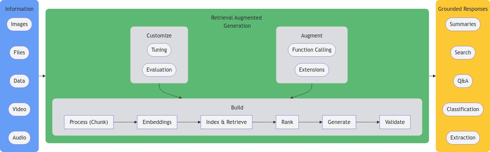

<!--- header table --->
<table align="left">     
  <td style="text-align: center">
    <a href="https://github.com/statmike/vertex-ai-mlops/blob/main/Applied%20GenAI/readme.md">
      
       View on GitHub
    </a>
  </td>
</table>    

---
# Applied Generative AI
> You are here: `vertex-ai-mlops/Applied GenAI/readme.md`

This section covers workflows for working with [Generative AI on Vertex AI](https://cloud.google.com/vertex-ai/generative-ai/docs/learn/overview), which are large models trained to continue inputs with likely outputs. While simply prompting an LLM to get helpful responses is a great starting point, the tools around these models unlock even more use cases and scalability. This enables you to quickly trial, iterate, and develop ideas into solutions. To jump right into generation, head over to the [Generate](./Generate/readme.md) section and learn all about Gemini models and Imagen.  You can also use the following table to jump to a section of interest, or keep reading here to discover this content as part of a narrative overview on applying generative AI.

  <table>
    <thead>
      <tr>
        <th colspan="3">
            

                
            

            Links To Content Sections
          </th> 
      </tr>
      <tr>
        <td style="text-align: center;">Building with Generative AI</td>
        <td style="text-align: center;">Customize</td>
        <td style="text-align: center;">Augment</td>
      </tr>
    </thead>
    <tbody>
      <tr>
        <td style="text-align: center;"><a href="./Chunking/readme.md">Process</a></td>
        <td style="text-align: center;">Tuning</td>
        <td style="text-align: center;">Function Calling</td>
      </tr>
      <tr>
        <td style="text-align: center;"><a href="./Embeddings/readme.md">Embeddings</a></td>
        <td style="text-align: center;">Evaluation</td>
        <td style="text-align: center;">Extensions</td>
      </tr> 
      <tr>
        <td style="text-align: center;"><a href="./Retrieval/readme.md">Index & Retrieve</a></td>
        <td style="border-bottom: none;"></td>
        <td style="border-bottom: none;"></td>
      </tr> 
      <tr>
        <td style="text-align: center;"><a href="./Ranking/readme.md">Ranking</a></td>
        <td style="border-bottom: none;"></td>
        <td style="border-bottom: none;"></td>
      </tr> 
      <tr>
        <td style="text-align: center;"><a href="./Generate/readme.md">Generate</a></td>
        <td style="border-bottom: none;"></td>
        <td style="border-bottom: none;"></td>
      </tr>
      <tr>
        <td style="text-align: center;"><a href="./Validate/readme.md">Validate</a></td>
        <td style="border-bottom: none;"></td>
        <td style="border-bottom: none;"></td>
      </tr>
    </tbody>
  </table>

## But What About Prompting?

The core of generation is the prompt—that piece of information provided as input to an LLM. The concept of prompt engineering centers around how to craft this input. In this series, we think about this task from an ML side rather than treating an LLM like an oracle. 

ML models generate predictions based on inputs. These predictions are the most likely outcomes to expect given the inputs. With LLMs, we have flexibility on the input side. It is important to think of this input as the information needed to lead to the correct response. 

Guess what? There are probably more than one, even many ways to do this for a given prompt. This section is all about how to provide the best context to ground the request to the LLM in order to make the output the most likely correct response.

Prompt structure is important and many valuable insights can be found in this documentation section: [Introduction To Prompt Design](https://cloud.google.com/vertex-ai/generative-ai/docs/learn/prompts/introduction-prompt-design).
  
## So How Do LLMs Work?
  
The following workflow uses an LLM to show how LLMs operate.  It makes a fun exercise out of word guessing when the next word in a pattern is from a famous passage of literature. Check it out for a brief overview to help with intuition when working with LLMs:
- [Understanding LLMs](./Understanding%20LLMs.ipynb) 
 
---
## Older Content Moved

If you visited this page in the past and are back to find a file that you remembered but it is not here:
- Files moved to the [/legacy](./legacy/readme.md) folder

---