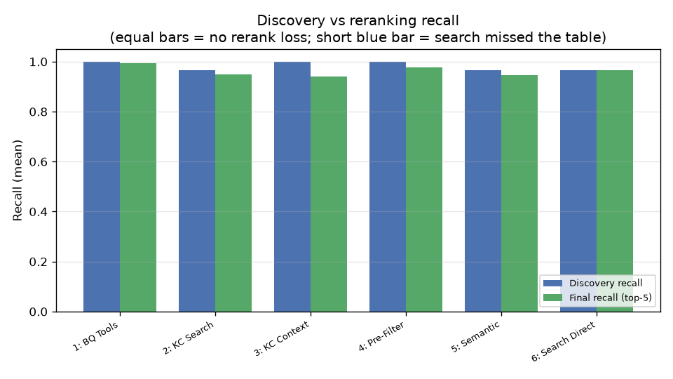
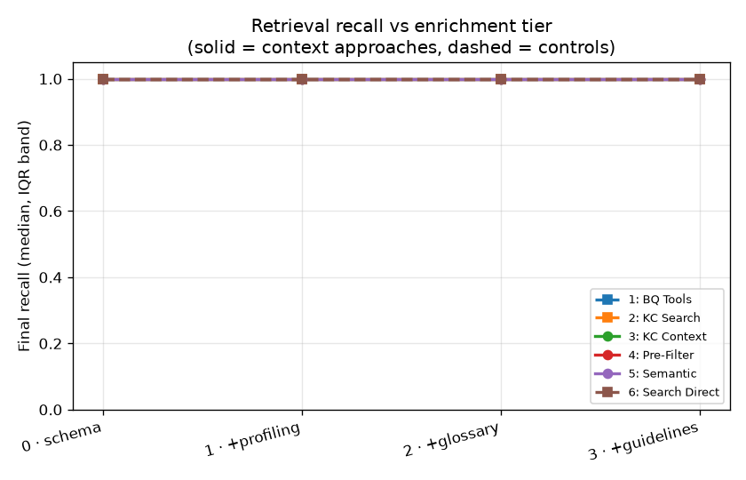
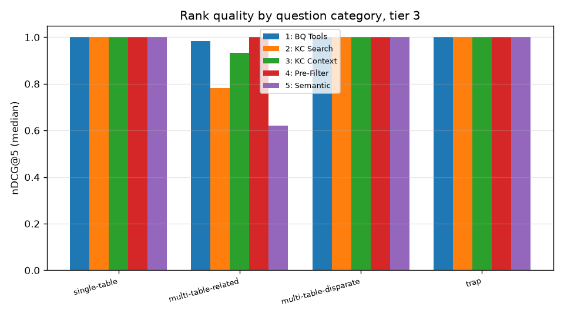
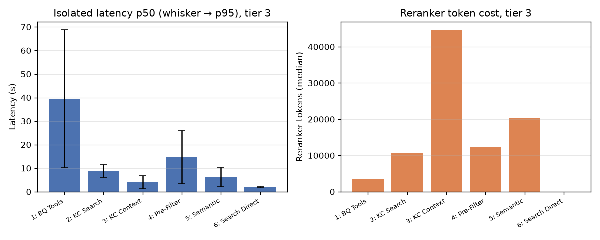

<!--- header table --->
<table>
<tr>     
  <td style="text-align: center">
    <a href="https://github.com/statmike/vertex-ai-mlops/blob/main/Applied%20ML/AI%20Agents/bigquery-context/examples/results.md">
      
       View on GitHub
    </a>
  </td>
</tr>
<tr>
  <td style="text-align: right">
    <b>Share On: </b> 
     
     
     
     
  </td>
</tr>
<tr>
  <td style="text-align: right">
    <b>Connect With Author On: </b> 
    
     
    
     
    
  </td>
</tr>
<tr>
  <td style="text-align: right">
     <a href="https://raw.githubusercontent.com/statmike/vertex-ai-mlops/main/Applied%20ML/AI%20Agents/bigquery-context/examples/results.md">Download File</a> <i>(right-click and "Save As")</i>
  </td>
</tr>
</table>  

---
# NL2SQL retrieval benchmark — results

Five table-discovery approaches for BigQuery NL2SQL, scored on a factorial experiment that isolates **catalog enrichment** as the independent variable. See `readme.md` for the challenge and approach spec cards, and `GROUND_TRUTH.md` for the grading rubric.

## Headline — where recall actually leaks

Recall decomposed into two stages: **discovery recall** (was the must-have table in the candidate set at all?) and **final recall** (did it survive the reranker's top-5 cut?). The gap between them is **rerank loss**. Means, not medians — the corpus is easy enough that medians saturate at 100% and hide the tail.

| Approach | Discovery recall | Final recall | Rerank loss |
|---|---|---|---|
| 1: BQ Tools (control) | 1.000 | 0.997 | 0.003 |
| 2: KC Search (control) | 0.884 | 0.884 | 0.000 |
| 3: KC Context | 1.000 | 0.962 | 0.038 |
| 4: Pre-Filter | 1.000 | 0.990 | 0.010 |
| 5: Semantic | 0.884 | 0.874 | 0.010 |

_**Search's ceiling is a discovery problem, not a reranking one.** The search-based approaches (`KC Search`, `Semantic`) show ~zero rerank loss — the reranker keeps every must-have table the search surfaced — yet their discovery recall caps well below 1.0. The missing tables were never in the candidate set, and a direct probe of `search_entries` (see Methodology) shows the candidate set leaks for **two distinct reasons**:_

1. **Relevance gap (disparate joins).** The API returns *well under* the `page_size=20` budget — a handful of tables, all in scope — and the join-partner table simply never ranks, because it shares no salient term with the question. The page budget is not the constraint here; semantic relevance is.
2. **Scope leak (related joins).** The `parent:(datasets/…)` predicate **is enforceable — but it is relaxed when combined with a free-text question under semantic search.** The predicate *alone* returns only in-scope tables (a clean control: 15 raw, 15 in-scope, 0 pollution), so the catalog can honor it. But the moment the natural-language question is ANDed with it, the API fills the *entire* page of 20 with tables from unrelated datasets, and the in-scope join partner is crowded out; our client-side scope filter then strips the out-of-scope tables, leaving a tiny candidate set still missing the partner. No query reformulation fixes this — exact `parent=`, the `fully_qualified_name` prefix, and explicit `NOT` negation all leak identically — and a wider page only admits more pollution (in-scope count stays pinned as `page_size` grows 20 → 100). The probe script reproduces all of this (see Methodology).

_In both cases the must-have table is absent **before** reranking, so the reranker cannot recover it. The cache-based approaches see the whole scoped corpus (discovery recall 1.0), so their only loss is at the reranker._

### Discovery recall by question category

| Category | 1: BQ Tools | 2: KC Search | 3: KC Context | 4: Pre-Filter | 5: Semantic |
|---|---|---|---|---|---|
| single-table | 1.00 | 1.00 | 1.00 | 1.00 | 1.00 |
| multi-table-related | 1.00 | 0.56 | 1.00 | 1.00 | 0.56 |
| multi-table-disparate | 1.00 | 0.93 | 1.00 | 1.00 | 0.93 |
| trap | 1.00 | 1.00 | 1.00 | 1.00 | 1.00 |

_Where the candidate set is complete (1.00) vs missing a must-have table. The search-based approaches drop on both join categories, but for different reasons (see the worked examples): `multi-table-disparate` misses are the **relevance gap**, while the sharper `multi-table-related` drop is driven by the **scope leak** — out-of-scope tables consuming the page budget._

### Worked examples — join partners search never surfaces

**Mechanism 1 — relevance gap.**

**Question (multi-table-disparate):** "Which US counties have the most weather stations per capita?"

| | Tables |
|---|---|
| **Needed (`must_have`)** | `population_by_zip_2010`, `us_counties`, `weather_stations` |
| **2: KC Search surfaced (in scope)** | `us_counties`, `weather_stations` |
| **2: KC Search missed (every one of 20 runs)** | `population_by_zip_2010` |
| **3: KC Context surfaced** | all of the above |

_Semantic search ranks the tables whose text matches the question, but `population_by_zip_2010` is required only by the *logic* of the question — it shares no salient term with the query. Search returned only 6 in-scope tables (page budget to spare), so the budget is not the constraint; relevance is. The full-corpus approach (3: KC Context) sees every scoped table, carries `population_by_zip_2010` into reranking, and answers correctly._

**Mechanism 2 — scope leak (`parent:` not enforced).**

**Question (multi-table-related):** "Which bike share stations have the highest average trip duration, and where are they located?"

| | Tables |
|---|---|
| **Needed (`must_have`)** | `austin_bikeshare_stations`, `austin_bikeshare_trips` |
| **2: KC Search surfaced (in scope)** | `austin_bikeshare_trips` |
| **2: KC Search missed (every one of 20 runs)** | `austin_bikeshare_stations` |
| **3: KC Context surfaced** | all of the above |

_Here the failure is not relevance but scope. A direct probe of `search_entries` for this question (see Methodology) returns a full page of 20, but most are tables from **unrelated datasets** that the `parent:(datasets/…)` predicate did not exclude; the client-side scope filter drops them, collapsing the in-scope candidate set to as few as 5 and leaving `austin_bikeshare_stations` out. The predicate is not inherently broken — issued *alone* it returns only in-scope tables — but it is relaxed once the free-text question is ANDed in under semantic search, and no reformulation or wider page recovers the missing partner. The full-corpus approach (3: KC Context) is immune because it never depends on the page budget._

## Discussion — what this implies at scale

On this 15-table corpus the discovery gap looks survivable: you can feed the *entire* scoped corpus to the reranker (as `KC Context` does) and let it sort out relevance, so search's missing tables never bind. That is exactly why enrichment tier does not move final recall here — recall is **discovery-bound**, and the full-corpus approaches route around search entirely. But that escape hatch closes as the corpus grows, and two things follow.

**1. At scale, search becomes mandatory — and its recall becomes the pipeline's ceiling.** A reranker cannot ingest thousands of candidate tables: context limits, token cost, and the accuracy decay of long-candidate reranking all bite. So beyond a few dozen tables you *must* use `search_entries` to subset before reranking. At that point the reranker can only improve **precision** within what search returned — it can never recover a `must_have` table search left out. Search recall therefore sets a hard ceiling the reranker is powerless to raise, and this benchmark measures that ceiling at ~0.88 (0.56 on related-join questions). A gap you route around at 15 tables is the binding constraint at 10,000.

**2. The two failure mechanisms need different fixes — and one is a precondition for the other.**

- **Enforce the `parent:` scope predicate under semantic search (fixes the scope leak).** The predicate is enforceable — issued alone it returns only in-scope tables — but it is relaxed the moment a free-text question is combined with it under `semantic_search=True`, so a scoped search still returns tables from unrelated datasets that pollute the whole page and crowd the in-scope partner out. This is a **precondition** for any page-budget-based fix — while the combined-query predicate is relaxed, a *wider* page simply admits more pollution, not more in-scope tables (measured: in-scope count stays flat as `page_size` grows 20 → 100). Making the predicate bind in the combined semantic case is the cheapest, highest-leverage change and is squarely within the catalog's control.
- **A retrieval front-end that decomposes the question and fans out (fixes the relevance gap).** Plan the query into sub-needs (e.g. "weather stations", "county boundaries", "population per area") and issue a *targeted* similarity search per sub-need, then union the results. This attacks the disparate-join failure mode: the join-partner table has no lexical anchor to the raw question, but it does match a decomposed sub-need. It scales *up* — it both subsets aggressively **and** keeps recall high enough to feed the reranker. (Simply raising `page_size` scales *down*, not up, and only helps once scope is enforced.)

**A catalog-native opportunity.** The failing tables are join partners, and Knowledge Catalog already models joins: `lookup_context` exposes a `frequent_joins` field. If `search_entries` expanded its results along known join edges — surface table A, pull in A's frequent-join partners — it would close the exact gap this benchmark isolates, using signal the catalog is positioned to already have. (In this corpus the tables are freshly created views, so auto-generated join hints are not yet populated; the mechanism, not this run's data, is the point.)

## Summary metrics — all questions, all tiers

| Metric | 1: BQ Tools | 2: KC Search | 3: KC Context | 4: Pre-Filter | 5: Semantic |
|---|---|---|---|---|---|
| Final recall | 100% | 100% | 100% | 100% | 100% |
| Discovery recall | 100% | 100% | 100% | 100% | 100% |
| Recall@5 | 100% | 100% | 100% | 100% | 100% |
| Precision | 100% | 100% | 100% | 100% | 100% |
| MRR | 1.00 | 1.00 | 1.00 | 1.00 | 1.00 |
| nDCG@5 | 1.00 | 1.00 | 1.00 | 1.00 | 1.00 |
| Latency p50 (s) | 35.06 | 7.02 | 3.94 | 13.28 | 5.75 |
| Reranker tokens | 3464 | 10436 | 44016 | 8496 | 16411 |

_Values are **medians** across all approach-runs — they saturate at 100% on this easy corpus, which is why the headline above uses means to expose the tail. Recall counts `must_have` tables; precision credits `must_have`+`nice_to_have` and is diluted by ranked distractors. See `GROUND_TRUTH.md`._

## Enrichment response — final recall by tier

| Approach | 0 · schema | 1 · +profiling | 2 · +glossary | 3 · +guidelines | Δ (t3−t0) |
|---|---|---|---|---|---|
| 1: BQ Tools (control) | 100% | 100% | 100% | 100% | +0% |
| 2: KC Search (control) | 100% | 100% | 100% | 100% | +0% |
| 3: KC Context (context) | 100% | 100% | 100% | 100% | +0% |
| 4: Pre-Filter (context) | 100% | 100% | 100% | 100% | +0% |
| 5: Semantic (context) | 100% | 100% | 100% | 100% | +0% |

_The tier axis: controls (`BQ Tools`, `KC Search`) read little/no tier enrichment; context approaches read progressively more. On this corpus final recall is flat across tiers — enrichment does not move top-5 recall here because recall is bounded by **discovery**, not by the metadata the reranker sees (see the headline above). 🟢 would mark a context approach gaining >5pp from tier 0 → tier 3._

## Rank quality by category — nDCG@5 at tier 3

| Category | 1: BQ Tools | 2: KC Search | 3: KC Context | 4: Pre-Filter | 5: Semantic |
|---|---|---|---|---|---|
| single-table | 1.00 | 1.00 | 1.00 | 1.00 | 1.00 |
| multi-table-related | 0.98 | 0.78 | 0.93 | 1.00 | 0.62 |
| multi-table-disparate | 1.00 | 1.00 | 1.00 | 1.00 | 1.00 |
| trap | 1.00 | 1.00 | 1.00 | 1.00 | 1.00 |

_`trap` questions bait distractor tables; low nDCG there means an approach ranked the wrong-but-similar table. See `GROUND_TRUTH.md`._

## Cost & latency (isolated per-approach)

| Approach | Latency p50 (s) | Latency p95 (s) | Reranker tokens (median) | Reranker calls |
|---|---|---|---|---|
| 1: BQ Tools | 35.06 | 52.87 | 3464 | 1.0 |
| 2: KC Search | 7.02 | 10.35 | 10436 | 1.0 |
| 3: KC Context | 3.94 | 6.29 | 44016 | 1.0 |
| 4: Pre-Filter | 13.28 | 18.94 | 8496 | 1.0 |
| 5: Semantic | 5.75 | 8.32 | 16411 | 1.0 |

_Latency is wall-clock for one approach run in isolation (no parallel contention). Reranker tokens are exact from `usage_metadata`; they are the dominant model cost since discovery is otherwise deterministic._

## Paired comparison vs `1: BQ Tools` (final recall)

| Approach | Mean Δ recall | 95% CI | Significant? |
|---|---|---|---|
| 2: KC Search | -12% | [-19%, -5%] | yes |
| 3: KC Context | -4% | [-7%, -1%] | yes |
| 4: Pre-Filter | -1% | [-3%, 0%] | no |
| 5: Semantic | -12% | [-19%, -6%] | yes |

_Paired over identical (question, tier) cells; CI from 2000-sample bootstrap. "Significant" = 95% CI excludes zero._

## Methodology & reproducibility

- **Design:** factorial — approach × tier × question × run. 1798 approach-runs scored (2 errored).
- **Empty returns (counted, not dropped):** 34 non-error runs returned zero ranked tables (2: KC Search 4, 5: Semantic 30) — search found nothing in scope for that question. These are scored as recall 0, so they pull the means down honestly rather than being excluded.
- **Enrichment tiers:** identical 15-table corpus replicated ×4, differing only in catalog enrichment (3 distractor tables).
- **Replicates:** n=5 runs per cell; metrics reported as medians with IQR bands.
- **Models:** agent `gemini-3.6-flash`, reranker `gemini-3.5-flash-lite` at temperature 0.0, top_k=5.
- **Packages:** google-adk 1.36.2, google-genai 2.14.0, google-cloud-dataplex 2.20.0, google-cloud-bigquery 3.40.1.
- **Isolation:** each approach runs in its own `InMemoryRunner`, one at a time, so latency and token counts carry no parallel-contention artifact.
- **Scope-leak probe (reproducible):** `examples/probe_scope_filter.py` replays the exact `search_entries` call the `KC Search` approach makes (`page_size=20`, `semantic_search=True`, the same `parent:(datasets/…)` query) and counts raw results vs. what survives the client-side scope filter, across a battery of query formulations and page sizes. It shows: the predicate *alone* returns only in-scope tables (enforceable); the combined question+predicate query leaks (a full page, mostly from unrelated datasets); exact `parent=`, the `fully_qualified_name` prefix, and `NOT` negation all leak identically; a wider page only adds pollution (in-scope pinned as `page_size` grows 20 → 100); and keyword mode (`semantic_search=False`) returns nothing for a natural-language question. The harness also records per-run `search_stats` (`raw_search_count`, `out_of_scope_dropped`) for every search-based cell.
