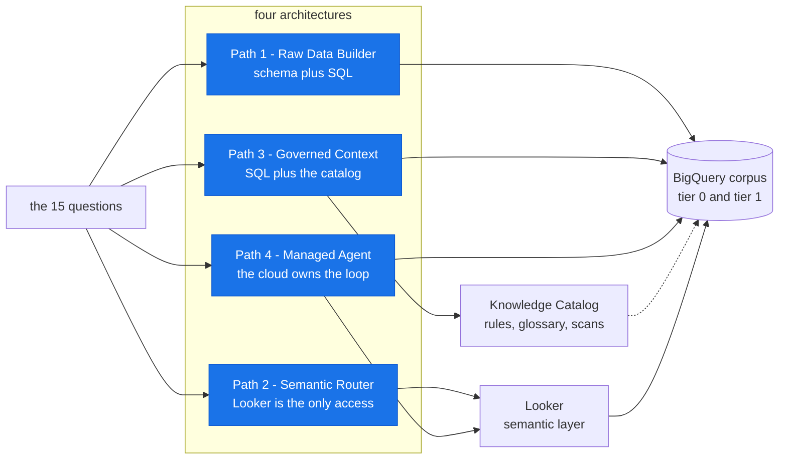

# data-mcp-sandbox

**Twelve ways to connect an AI agent to BigQuery, measured against the same
fifteen questions on the same data.** 1,800 live cells, scored against an oracle.

The answer, in three lines:

- **Documenting your data is the biggest lever there is.** Accuracy roughly
  triples on every architecture.
- **It is still not enough.** An agent that writes its own SQL reads the rule,
  restates it correctly, and then applies half of it.
- **Cost is dominated by tool *schema* size, not tool count** — one vendor tool
  declaration is 78,214 characters, re-sent every turn.

---

## Start here: one question, three answers

> *"Treat 2026-09-09 00:00:00 UTC as the current time. How many Active users do
> we have?"*

The business has a written rule for **Active**: the account is flagged active
**and** the user has an event in the trailing 30 days. Both halves. Here is what
the agents actually returned:

| What the agent did | Answer | |
|---|---:|---|
| Trusted the `is_active` column | **3,520** | ❌ 20% of flagged users are dormant |
| Applied the 30-day window, **dropped the flag** | **3,995** | ❌ counts users who were never flagged |
| Applied both halves of the rule | **2,804** | ✅ |

Three plausible queries. Three confident answers. No error message anywhere.

**Row 1 is what every arm does without governance** — 57 of 60 ungoverned cells
returned 3,520. **Row 2 is the surprise:** that is a *governed* run. The agent
read the rule, said out loud *"rather than relying on the raw `users.is_active`
account flag"*, wrote a correct 30-day window — and threw away the half of the
rule it had just quoted.

That gap is what this repo measures, across twelve architectures.

---

## The data is built to be hostile

Real warehouses are hostile in specific, boring ways. This corpus reproduces four
of them:

| Column | Looks like | Actually is |
|---|---|---|
| `txn_amt_x2` | a transaction amount | **gross**, not net |
| `status_flg` | "is it OK?" | `TRUE` means **refunded** |
| `is_active` | who is active | disagrees with the business's own definition |
| `revenue_amount` | revenue | **wrong** |

An agent that reads the schema and writes the obvious SQL gets a confident wrong
answer. That is invisible unless you grade against an oracle that knows the
intended number — which is the whole reason this is an experiment and not a demo.

---

## The two variables

Everything in this repo is one of these two things changing. Nothing else moves:
same model (`gemini-3.7-flash`, temperature 0), same questions, same data, five
replicates.

### Variable 1 — governance, as a **tier**

Two byte-identical copies of the data.

| | Tier 0 | Tier 1 |
|---|---|---|
| the tables | ✅ | ✅ |
| column descriptions | — | ✅ |
| business rule, as a catalog `overview` aspect | — | ✅ |
| glossary with term-to-column links | — | ✅ |
| profile + data-quality scans | — | ✅ |
| LookML semantic model | raw passthrough | ✅ field descriptions + governed measures |

When this repo says **governed**, it means those five, together.

Both tiers have a LookML model — Path 2 would have no data access at all
otherwise. Tier 0's is a passthrough: every column a dimension, **no measures**,
no descriptions.

The five rows are published to every tier-1 dataset. But no path can reach all
five — [each one uses a different subset](#where-the-two-variables-meet-governed-means-something-different-on-each-path),
which turns out to matter more than anything else on this page.

The tiers are separated by **IAM, not by prompt**. Each arm runs as a per-tier
service account that can read exactly one tier's dataset — because catalog search
is project-wide, and a tier-0 agent asking for "revenue" was otherwise handed the
governed entry and answered from it.

### Variable 2 — architecture, as a **path**

Four ways to put a model in front of data:



Each path is run several ways, and each of those is an **arm**. There are twelve.
**An arm's name starts with its path number** — every `p1_` arm is Path 1, every
`p3_` arm is Path 3 — and the rest of the name says *who runs the tool server*.

#### Path 1 — Raw Data Builder

Schema plus SQL. The agent writes its own queries. No governance surface at all.
This is the baseline everything else has to beat.

| Arm | Tool server | Tools |
|---|---|---:|
| `p1_managed` | Google — `bigquery.googleapis.com/mcp` | 5 |
| `p1_toolbox` | you — MCP Toolbox, `bigquery` source | 8 |
| `p1_matched` | you — Toolbox, cut down to the managed tool list | 5 |

#### Path 2 — Semantic Router

A **Looker** semantic layer is the *only* data access. No raw SQL, no table
names: the agent can reach a measure or it cannot.

| Arm | Tool server | Tools |
|---|---|---:|
| `p2_managed` | **Looker** — your instance's own `/mcp` endpoint | 7 |
| `p2_toolbox` | you — Toolbox, `looker` source, same LookML models | 7 |

> ⚠️ **`managed` does not mean the same vendor on every path.** On Paths 1 and 3
> it is Google's MCP endpoint. Here it is **Looker's own server**, hosted on your
> Looker instance at `{LOOKER_BASE_URL}/mcp`.

#### Path 3 — Governed Context

Raw SQL **plus** the Knowledge Catalog, so the agent can look the business rule
up before it queries.

| Arm | Tool server | Tools |
|---|---|---:|
| `p3_managed` | Google — the BigQuery **and** Dataplex MCP endpoints | 8 |
| `p3_toolbox` | you — Toolbox, `bigquery` + `dataplex` sources | 23 |
| `p3_matched` | you — Toolbox, cut down to the managed tool lists | 8 |

#### Path 4 — Managed Agent

Hand the whole question to Conversational Analytics. The reasoning loop moves
into the cloud, so there is no local agent to watch.

| Arm | Tool server | Reaches |
|---|---|---|
| `p4_bq_ca` | you — Toolbox, one tool: `ask_data_insights` | CA over BigQuery |
| `p4_looker_ca` | you — Toolbox, one tool: `looker_conversational_analytics` | CA over **Looker** |
| `p4_bq_direct` | *none* — the CA API is called directly | CA over BigQuery |
| `p4_bq_direct_ctx` | *none* — same call, glossary injected | CA over BigQuery |

**Where Looker appears:** three arms — `p2_managed`, `p2_toolbox`,
`p4_looker_ca`. The other nine need no Looker instance at all.

**Deeper:** [`docs/paths.md`](docs/paths.md) — every arm's exact tool list, the
full option space including what we chose *not* to run, and the measured answer
to "is this comparison fair?"

### Where the two variables meet: *governed* means something different on each path

This is the part that is easy to miss. Tier 1 publishes all five surfaces to
every path — but **a path can only use the surfaces its tools can reach.** So
"governed" is not one treatment applied four times. It is four different
treatments, and that is most of why the paths separate at all.

| | Path 1 | Path 2 | Path 3 | Path 4 |
|---|---|---|---|---|
| **Ungoverned, it sees** | bare tables — column names and types | passthrough LookML: every column a dimension, **no measures** | bare tables, and a catalog with nothing in it | whatever CA can find, which is the bare tables |
| **Governed, it gains** | table + column descriptions | field descriptions, `total_revenue`, `active_user_status` | descriptions **plus** the rule text, glossary, profile + quality scans | the same surfaces, reached by CA's own retrieval |
| **Reached with** | `get_table_info` | `get_dimensions`, `get_measures` | `get_table_info` **+** `lookup_context`, `search_entries` | nothing you control |
| **So the rule arrives as** | a warning | **a field you select** | a document to read and re-express in SQL | the service's business |
| **Definition questions, tier 1** | **33%** ⚠️ | 60–80% | **100%** | 33–100% |

⚠️ Both honest Path 1 arms. `p1_toolbox` scores 100% by calling Conversational
Analytics instead of writing SQL — see the scoreboard note below.

Read the bottom two rows together — they are the whole experiment in miniature:

- **Path 1 is told it is wrong and not told what is right.** Its tier-1 column
  description reads *"Raw account-status flag. NOT the governed definition of an
  Active user — see the Active User business rule."* The rule it is pointed at
  lives in Dataplex, and **Path 1 has no Dataplex tool** — its five-to-eight
  tools are BigQuery-only. So it learns the flag is a trap and still has nothing
  to replace it with. `p1_managed` and `p1_matched` both go **0/5 and 0/5** on
  the two rule-dependent questions at tier 1, while scoring 89% on everything
  else. That is not a weak model; it is a dangling pointer.
- **Path 2 does not have to read anything.** The rule is compiled into
  `active_user_status`, a field the agent selects. No acquisition step, so no
  application step to fail.
- **Path 3 can reach the rule, but must re-express it in SQL** — and that second
  step is where the conjunction gets dropped. See finding 2.

One more thing this table settles: **Looker never reads the Knowledge Catalog,
and the catalog never reads Looker.** They agree with each other because
`src/corpus.py` generates both from the same rule text — not because they are
integrated. They are two parallel channels, and Path 2 vs. Path 3 is the
measurement of which one an agent uses better.

---

## What we found

📊 **Every number below comes from [`docs/results.md`](docs/results.md)**, which
carries the full tables, the per-question breakdowns, and the cells behind each
claim. Start here for the shape; go there for the evidence.

### The scoreboard

All twelve arms on one screen, grouped by path. This is the whole field.

**Ungoverned** (tier 0) is the tables and nothing else. **Governed** (tier 1) is
the same bytes plus all five surfaces from [Variable 1](#variable-1--governance-as-a-tier).
Every arm was run against both — but each path reaches a different subset of
those surfaces, so the path header rows below restate what the two words mean
*for that path*. The [long version](#where-the-two-variables-meet-governed-means-something-different-on-each-path)
is above.

Each cell reads **accuracy** on top, then **tokens per correct answer · seconds
per correct answer**. Exact unrounded values are in
[`results/report.md`](results/report.md).

| Arm | What it is | Ungoverned | **Governed** | Cost figure is |
|---|---|---|---|---|
| **Path 1 — Raw Data Builder** | *schema plus SQL, no governance surface* | *bare tables* | *+ column descriptions.<br/>The rule is in Dataplex, which Path 1 cannot call.* | |
| `p1_managed` | Google's BigQuery MCP endpoint | 37%<br/>1.87M · 261s | 75%<br/>471k · 64s | complete |
| `p1_toolbox` | self-hosted Toolbox, 8 tools | 33%<br/>273k · 211s | **100%** ⚠️<br/>30k · 39s | complete |
| `p1_matched` | self-hosted, cut to the managed tool list | 35%<br/>354k · 211s | 75%<br/>68k · 60s | complete |
| **Path 2 — Semantic Router** | *Looker is the only data access* | *passthrough LookML,<br/>no measures* | *+ governed fields.<br/>The rule is a field you select.* | |
| `p2_managed` | **Looker's own** MCP endpoint | 33%<br/>414k · 291s | 93%<br/>64k · 55s | complete |
| `p2_toolbox` | self-hosted Toolbox, same LookML | 32%<br/>981k · 302s | 90%<br/>88k · 43s | complete |
| **Path 3 — Governed Context** | *SQL plus the Knowledge Catalog* | *bare tables,<br/>empty catalog* | *+ rule text, glossary, scans.<br/>The rule is a document to re-express.* | |
| `p3_managed` | Google's BigQuery **+ Dataplex** endpoints | 35%<br/>3.17M · 319s | **100%**<br/>361k · 51s | complete |
| `p3_toolbox` | self-hosted Toolbox, 23 tools | 33%<br/>609k · 252s | **100%**<br/>66k · 38s | complete |
| `p3_matched` | self-hosted, cut to the managed tool lists | 35%<br/>825k · 271s | **100%**<br/>56k · 43s | complete |
| **Path 4 — Managed Agent** | *Conversational Analytics owns the loop* | *bare tables,<br/>reached by CA* | *+ the same surfaces, retrieved<br/>however CA chooses to.* | |
| `p4_bq_ca` | CA over BigQuery, reached as an MCP tool | 23%<br/>52k · 277s | **100%**<br/>5k · 36s | a floor |
| `p4_looker_ca` | CA over **Looker**, reached as an MCP tool | 12%<br/>213k · 1,435s | 43%<br/>18k · 199s | a floor — [392,158 once metered](#3-cost-is-tool-schema-verbosity--and-some-of-it-is-invisible) |
| `p4_bq_direct` | CA over BigQuery, called as an API | 22%<br/>— · 51s | 97%<br/>— · **11s** | unmetered |
| `p4_bq_direct_ctx` | the same call, glossary injected | 23%<br/>— · 49s | 95%<br/>— · **11s** | unmetered |

⚠️ **`p1_toolbox`'s 100% is borrowed.** On 39% of its governed cells it stopped
writing SQL and called Conversational Analytics through Toolbox's tool surface —
on *exactly* the two questions that need a governed definition. It is not a
Path 1 result; it is Path 4 wearing a Path 1 name. Cells and tool traces:
[`docs/results.md`](docs/results.md#the-third-path-1-arm-looks-like-a-counterexample-and-is-the-opposite-of-one).

**Read down the Ungoverned column first — then across the paths:**

1. **Ungoverned, the architecture choice is unmeasurable.** All eight MCP arms
   land between **32% and 37%** — a 5-point spread, well inside the 8.9-point
   noise floor. Whatever you build, without governance it lands in the same
   place.
2. **Governed, the same choice decides everything** — a 43%–100% range. The
   variable that looked irrelevant becomes the only one that matters.
3. **Governance does not cost accuracy — it refunds cost.** Read the two cost
   figures in each row against each other: *every* arm gets both cheaper and
   faster when governed, by **4.0×–14.8× fewer tokens** and **3.5×–7.7× fewer
   seconds** per correct answer. There is no tradeoff to manage on this board.
   The two things you would expect to trade off move together, every time. See
   finding 1.
4. **Path 3 is the only path where every arm reaches 100%.** Path 1's honest
   result is 75%, Path 2 tops out at 93%, Path 4 ranges 43% to 100% depending on
   which warehouse is behind it. Giving an agent SQL *plus* the catalog works no
   matter who hosts the tools.
5. **Within a path, accuracy stops discriminating and cost takes over.** All
   three Path 3 arms score 100% — and spend 55,548, 65,805 and **361,420**
   tokens per correct answer doing it. Same path, same score, **6.5× apart.**
   The two Path 2 arms tie at 93/90 and sit 1.4× apart. Once you have picked a
   path, the remaining decision is not accuracy; it is who hosts the tools.
6. **Nothing is best at everything.** `p4_bq_ca` is the cheapest and fastest
   100% on the board — but its cost is a floor, not a measurement, and its
   sibling on Looker is the worst arm here. `p4_bq_direct` answers in **11
   seconds** against 36–64s for every MCP arm — at least 3.3× faster than
   anything else on the board — and gives up 3 points and all token visibility
   to do it. There is no dominant row.

The rest of this section is how those numbers came about — five findings in
three acts:

| | |
|---|---|
| **What governance is worth** | 1 · it is the largest effect here, and it refunds cost<br/>2 · only two of the five surfaces pay, and neither is sufficient alone |
| **What you actually spend** | 3 · cost is tool schema verbosity, and some of it is invisible<br/>4 · latency is a separate axis and does not track cost |
| **Whether to believe it** | 5 · it survives a model change, and there is an A/A control |

### 1. Governance is the largest effect measured

Accuracy roughly triples, tier 0 → tier 1, on every path — 33%→100% on
`p3_toolbox`, 35%→100% on `p3_managed`, and even the worst arm on the board
moves 12%→43%.

On questions that turn on a governed **definition**, the separation is total:

> **0 correct out of 180 cells at tier 0** — across all twelve arms — against
> 138/180 at tier 1.

**And it is the cheapest thing on the board, not the most expensive.** Every
token-spending arm needs 4.0×–14.8× fewer tokens and 3.5×–7.7× fewer seconds per
correct answer when governed. The obvious objection is that this is just the
accuracy denominator — more correct answers, so a smaller number. It is not,
or not only. Holding the denominator fixed at *attempts* rather than successes,
an ungoverned agent still burns **1.6×–3.6× more tokens on each individual
question**:

| | tokens per attempt, ungoverned | governed | |
|---|---:|---:|---:|
| `p2_toolbox` | 271,473 | 76,178 | 3.6× |
| `p3_matched` | 294,687 | 87,504 | 3.4× |
| `p3_managed` | 1,172,966 | 495,386 | 2.4× |
| `p1_managed` | 704,304 | 445,846 | 1.6× |

So roughly half the per-correct gap is the denominator and half is this: without
a rule to resolve the question, an agent explores — more tool calls, more
speculative SQL, larger payloads dragged back into context — and then gets it
wrong anyway. Governance is not a tax on an agent's budget. It is what stops the
agent from spending the budget guessing.

### 2. Two of the five surfaces pay — and neither is sufficient alone

Split tier 1 into five cumulative rungs and the populations separate cleanly:

| Question type | What moves the needle | What does nothing |
|---|---|---|
| Ordinary aggregations (8 questions) | **column descriptions alone**: 30–50% → 97.5–100% | everything after that |
| Governed definitions | **business rules**: 0% → 100% on all three Path 3 arms | descriptions (worth 0 points) |

A step, not a curve. Profile scans move nothing either way. Of the five surfaces
you would pay to build, two carry the entire effect.

**But reaching a rule is not the same as applying it.** From the first rung,
*every* arm that shows its work acquires the rule on **100% of cells** — we can
read it in the tool results. `p1_managed` and `p1_matched` still answer the
governed-definition questions correctly **0 times in 20** at tier 1, and 1 time
in 50 at every ladder rung including the top. The worked example at the top of
this page is that failure: the rule is a conjunction, and the agent applies one
conjunct.

So the two failure modes are different, and only one of them is a governance
problem:

| | Path 1 | Path 3 |
|---|---|---|
| Can it reach the rule? | **no** — no Dataplex tool | yes |
| Does it apply the rule? | n/a | yes |
| Definition questions, tier 1 | 33% | **100%** |

Path 1 fails on acquisition, Path 3 succeeds at both, and Path 2 skips the
problem entirely by never making the agent re-express anything. Only an arm that
*encodes* the rule — a semantic layer, or a service with one behind it — reliably
executes it. On this corpus a semantic layer is not an optimisation; it is the
thing that works.

### 3. Cost is tool schema verbosity — and some of it is invisible

| Predictor of an arm's token spend | tier 0 | tier 1 |
|---|---:|---:|
| **schema characters** | r = 0.95 | r = 0.99 |
| tool count | r = 0.12 | r = 0.11 |

One managed `get_table_info` declaration is **78,214 characters** — 64% of its
arm's entire prompt floor, and **120×** the self-hosted equivalent that does the
same job. Re-sent every turn.

`p1_managed` spends **1,870,343 input tokens per correct answer against 5,934
output**. Essentially none of the bill is the model thinking.

**Managed and self-hosted behave the same and cost up to 12× apart.** Same
verdict on 86–99% of paired cells, while sharing a tool-call sequence only 0–5%
of the time. The gap is 6.9–7.7× on Path 1, 4.8–4.9× on Path 3, and only 1.1–1.3×
on Path 2 — and the schema sizes say exactly why.

**And the cheapest-looking arm is not cheap.** Conversational Analytics bills its
own Gemini loop to a line item the API never returns. Read it back from Cloud
Monitoring:

| `p4_looker_ca` tokens per cell | |
|---|---:|
| as the API reports it | 18,045 |
| as Cloud Monitoring meters it | **392,158** |

A 22× understatement — enough to move it from the cheapest arm to the third most
expensive. Its 207 turns ran 1,220 server-side model calls. `p4_bq_ca` reports
nothing on that meter, yet made **306 successful CA calls** on the same API in
the same window. Its cost is on no meter this project can read, which is not the
same as zero. This is why four rows of the scoreboard are marked *a floor* rather
than *complete*: never rank a managed agent on the number it hands you.

### 4. Latency is a separate axis, and it does not track cost

Every MCP arm spends **4.3–5.5s per tool call** whatever its schema size, so
latency is just turn count times a constant. Tokens against wall clock correlate
at only r = 0.28 and r = 0.33.

Per **correct** answer at tier 1 — what a user actually waits:

| | seconds per correct answer |
|---|---:|
| every MCP arm | 36–64s |
| `p4_looker_ca` | 199s |
| the two direct arms | 11s |

At tier 0 the Looker CA arm needs **24 minutes** per right answer.

**Wrapping a service in MCP costs 3.1× the wall clock and no accuracy.**
`p4_bq_ca` and `p4_bq_direct` put the same question to the same API over the same
data; one goes through a tool, the other just calls it. Tier 1: 60/60 against
58/60, and a **10.5s median against 32.6s**. The wrapper also burns 5,941 input
tokens per cell that the direct call does not. It is the one pair where data,
service and model are identical and only the transport differs.

What going direct *does* buy is a thinking knob — not a model choice, since
`ChatRequest.model` is an enum with one selectable value. Over three more
captures (720 cells), `FAST` runs a **7.4s median against `THINKING`'s 18.4s**,
and `FAST` is *flat* — 6.5–7.7s whatever you ask, where the other modes scale
with difficulty. On a governed warehouse it costs no measurable accuracy;
ungoverned it costs ~16 points.

### 5. It survives a model change

Every MCP arm re-run on `gemini-3.8-flash` — both tiers, 720 cells, zero failures
— pairs against the published `gemini-3.7-flash` capture at Kendall tau **+1.00
at both tiers, zero inversions**. Absolute scores shift a few points; which
architecture beats which does not move.

And there is an accidental **A/A control**: `p4_bq_direct` and
`p4_bq_direct_ctx` differ only by a glossary payload, which at tier 0 is empty by
design — so those 120 cells send byte-identical requests. They land one cell
apart (13/60 vs 14/60). At tier 1, with the glossary actually injected, one cell
apart again (58/60 vs 57/60). Most published context-injection deltas have no
control next to them at all.

---

### 📊 Go deeper: [`docs/results.md`](docs/results.md)

Every claim in this section, with the cells behind it — the five-rung ladder
arm by arm, the acquisition-versus-application split, the blind-judge pass that
reaches the same boundary by an independent route, how Path 4's numbers should
and should not be read, and the failed replication that found the anchoring
defect.

The generated tables it is all derived from are in
[`results/report.md`](results/report.md), and the raw capture behind *those* is
`results/capture.json.gz` — which you can re-score yourself in six seconds
without a cloud account (next section).

---

## What this does not claim

> **A defect we found in our own corpus.** "Trailing 30 days" pins a window's
> *length*, never its *anchor*, so three questions scored near-arbitrarily
> depending on where the oracle's window fell. They are marked unscoreable and
> **re-issued as three anchored questions**, swept across all twelve arms and
> merged in. So the capture grades **twelve of fifteen** questions. The five-rung
> ladder was *not* re-swept, which means the 0%→100% step in finding 2 still
> rests on **one** question at five replicates. It is queued.

> **These numbers are perishable.** They are specific to a pinned model version,
> a pinned MCP Toolbox, and vendor tool schemas that can change without notice —
> and that last one dominates the cost result.

**Cost is reported in units consumed, never dollars** — tokens, seconds,
BigQuery jobs, MiB scanned — and always per *correct* answer, because an arm that
is cheap and wrong is not cheap. Units you can check against your own invoice; a
dollar figure needs a rate card and would be wrong for most readers. Prices are
opt-in via `prices.json`.

---

## Check the work yourself — no cloud account, 6 seconds

`results/capture.json.gz` holds the raw sweep: every tool call with its arguments
and results, every answer, every token count. It contains **no scores**. The
rubric is the part most worth arguing with, so it ships separately:

```bash
uv sync
uv run python examples/build_results.py \
  --results results/capture.json.gz --out /tmp/mine --no-judge --no-cost
```

No project, no corpus, no credentials — the goldens are frozen into the capture's
header. Change `src/scoring.py`, re-run, and a rubric change costs a minute
instead of a day.

[`notebooks/03_results.ipynb`](notebooks/03_results.ipynb) does the same thing
with charts, and ships with its outputs filled in — you can read the entire
result without running anything.

---

## Run it yourself

Self-contained `uv` project. Run everything from inside this folder.

```bash
cd "Applied ML/AI Agents/data-mcp-sandbox"

uv sync                                   # create .venv from pyproject.toml + uv.lock
gcloud auth application-default login     # ADC — this project never uses SA JSON keys
cp .env.example .env                      # then fill in GOOGLE_CLOUD_PROJECT
```

Requires [`uv`](https://docs.astral.sh/uv/) and the
[Google Cloud CLI](https://cloud.google.com/sdk/docs/install). Never `pip` — `uv`
manages all dependencies, environments, and the lockfile.

Then walk down the cost ladder:

```bash
make preflight        # can you provision this? two read-only IAM calls, free
make bootstrap        # APIs, Toolbox binary, tier identities, corpus, governance
make verify-isolation # prove tier 0 cannot read tier 1 — do not skip this
make plan             # what a sweep would cost, in time and tokens. Free.
make smoke            # 12 cells, ~10 min. Proves the wiring end to end.
```

`make help` lists everything. Provisioning creates billable BigQuery storage and
Dataplex scans and a full sweep is hours of live model calls, so `make plan`
estimates before you spend and `make teardown` removes everything `setup` made.

**No Looker?** It is the only component behind an annual commitment, and
`make bootstrap` deliberately **will not create an instance** — a setup script
must not be able to start an annual charge. Add `SKIP_LOOKER=1` to any target:

```bash
make bootstrap SKIP_LOOKER=1
make sweep SKIP_LOOKER=1     # 1,350 cells instead of 1,800
```

Nine of twelve arms remain at both tiers. The central governed-versus-ungoverned
result survives; you lose Path 2 and the Looker half of Path 4.

**Deeper:** [`docs/reproducing.md`](docs/reproducing.md) — the exact commands per
capture, what will and will not reproduce, and how to compare two captures that
asked different questions.

---

## Run it on your own data

The questions, the corpus and the LookML are *inputs*.
[`docs/adapting.md`](docs/adapting.md) walks it in eight rungs: re-score our
capture with no cloud account, run it unchanged in your project, then move it
toward your data one verifiable step at a time, ending at your own tables and
your own Looker across all twelve arms. Start anywhere; stop anywhere.

---

## Where everything lives

| Document | What it answers |
|---|---|
| [`docs/paths.md`](docs/paths.md) | What each of the twelve arms *is*, and what we chose not to run |
| [`docs/questions.md`](docs/questions.md) | All fifteen questions, the four traps, and what counts as right |
| [`docs/method.md`](docs/method.md) | How the sweep runs and what each capture records |
| [`docs/results.md`](docs/results.md) | Every measured result, with the cells behind it |
| [`docs/design.md`](docs/design.md) | Why it is built this way, and what it does not claim |
| [`docs/reproducing.md`](docs/reproducing.md) | Re-running exactly this |
| [`docs/adapting.md`](docs/adapting.md) | Running it on your own data |
| [`docs/scoping.md`](docs/scoping.md) | Why the tier fence is IAM and not a prompt |
| [`docs/looker_setup.md`](docs/looker_setup.md) · [`docs/looker_runbook.md`](docs/looker_runbook.md) | Standing up the Looker side |

| Directory | What it holds |
|---|---|
| `src/` | All logic — flat, single-responsibility modules |
| `examples/` | Runners: the sweep, the scorer, isolation and inventory probes |
| `scripts/` | Provisioning, teardown, capture export |
| `results/` | The report, the scores, and the publishable capture |
| `notebooks/` | [provision](notebooks/01_provision.ipynb) · [walkthrough](notebooks/02_walkthrough.ipynb) · [results](notebooks/03_results.ipynb) — narrative only, no business logic |
| `tests/` | pytest; imports flat modules from `src/` by name |

Reasoning that did not fit anywhere is in the module docstrings, which are
written to be read: [`src/cost.py`](src/cost.py) on why cost is reported in three
parts that are never silently summed,
[`src/service_tokens.py`](src/service_tokens.py) on metering the part the API
will not report, and [`src/scoring.py`](src/scoring.py) on the rubric.

```bash
make check    # ruff + mypy + pytest
```

---

Built from the [AI-Native Project Harness](https://github.com/statmike/agent-repo-template).
