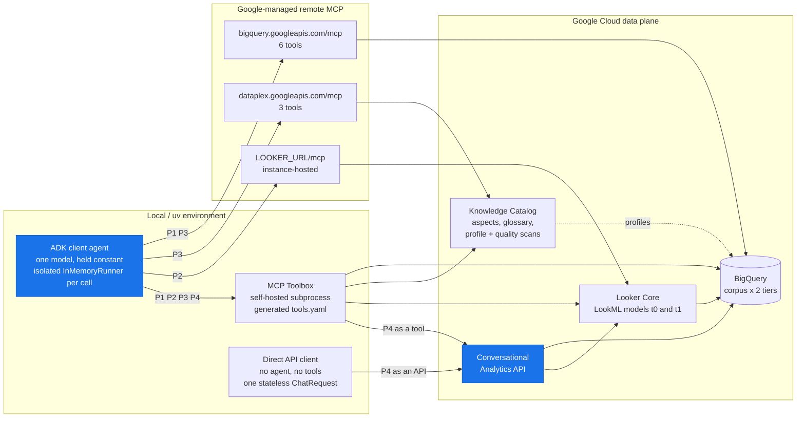

# Design

Why this experiment is shaped the way it is: what it sets out to establish, what
it deliberately does not claim, the vendor behaviour that forced particular
choices, and the limits on reading the result.

If you want the numbers, start at [`results/report.md`](../results/report.md). If
you want to run it, start at [`reproducing.md`](reproducing.md). This page is for
deciding whether to *believe* it.

---

## 1. The question

There are four architecturally distinct ways to put an LLM in front of Google
Cloud data, and most of them can be served either by a **Google-managed remote
MCP server** or by the self-hosted **MCP Toolbox for Databases**. Teams pick
between them on vibes.

The differences that matter are not throughput. They are **where the reasoning
happens** and **how much governed business context reaches the model** — and
neither shows up on data that is easy to interpret correctly. On a clean corpus
every path looks fine.

So the corpus is built to be hostile in the ways real warehouses are hostile, and
governance is made a *manipulable variable* rather than a constant. Then the same
model asks the same questions through every surface, and the answers are scored
against an oracle.

## 2. Goals and non-goals

**Goals**

| # | Goal |
|---|------|
| G1 | A reproducible BigQuery corpus whose correct answers are knowable *only* from governed context. |
| G2 | That corpus replicated at **two governance tiers**, so governance is an independent variable. |
| G3 | Governance published in three surfaces — LookML, Knowledge Catalog aspects, and a golden-truth SQL oracle. |
| G4 | All arms driven from one **isolated** ADK client, so traces, latency and tokens are attributable per cell. |
| G5 | **Graded** ground truth, decomposing outcomes into context *acquisition* vs *application*. |
| G6 | A regenerable report a data architect can actually pick a path from. |

**Non-goals — things this deliberately does not claim**

- **Not a production agent.** No serving surface, no deployment, no UI.
- **Not a model benchmark.** One model ID, held constant. Nothing here says
  anything about Gemini versus anything else.
- **Not a latency optimisation study.** Latency is recorded and reported; it is
  never scored, and it is reported as a *separate axis* from cost because the two
  do not correlate (r = 0.10).
- **Not a Looker or Dataplex tutorial.** Provisioning is scripted, not taught.
- **Not a dollar comparison.** Cost is in units consumed — tokens in, tokens out,
  seconds, jobs, MiB — because a dollar figure needs a rate card and would be
  wrong for most readers.

## 3. Architecture

Blue is the reasoning engine. It sits **local** for Paths 1–3 and **in the cloud**
for Path 4 — that relocation is the whole comparison, and it is why Path 4's cost
is so hard to see. Path 4 is reached two ways, and the difference matters: as a
tool inside the local agent loop, or as an API with no agent loop at all.

### The twelve arms

Deploying an LLM against BigQuery involves **four independent choices**, not one:
where the reasoning runs (local loop vs. cloud service), how you reach it (an MCP
tool an agent calls vs. an API you call yourself), who hosts the tools
(Google-managed MCP endpoint vs. self-hosted MCP Toolbox), and which tools you
bind under that server's ceiling. The arms are a grid over those choices:

| Path | Name | Brain | Managed | Self-hosted | Schema-matched | Direct API |
|:----:|------|-------|---------|-------------|----------------|------------|
| 1 | Raw Data Builder | Local | `p1_managed` | `p1_toolbox` | `p1_matched` | — |
| 2 | Semantic Router | Local | `p2_managed` | `p2_toolbox` | — | — |
| 3 | Governed Context | Local | `p3_managed` | `p3_toolbox` | `p3_matched` | — |
| 4 | Managed Agent | **Cloud** | *none exists* | `p4_bq_ca` · `p4_looker_ca` | — | `p4_bq_direct` · `p4_bq_direct_ctx` |

The design started at eight arms. The two **`_matched`** arms were added after the
first full capture, because managed and self-hosted differed on *two* things at
once — the endpoint and the tool list — so a cost gap could not be assigned to
either. A matched arm is self-hosted but restricted to exactly the managed tool
list, holding tool count constant.

The two **`_direct`** arms were added for the same reason one layer down. Every
Path 4 number we published came through Toolbox's
`bigquery-conversational-analytics` tool, so "Conversational Analytics" and "that
tool" were one variable. They are now two: `p4_bq_direct` calls the API itself
and `p4_bq_direct_ctx` adds the tier's glossary to the request. It is also what
makes Path 4 scorable — the tool returns prose, the API returns the SQL it ran.
Both arms are built and tested; neither has been swept, so nothing in the
published result comes from them.

That decomposition is what makes the comparison fair, and both halves are
measured. `p1_managed` and `p1_matched` bind the **same five tools** and differ
**40×** on schema size — so the endpoint is worth 40×. `p3_toolbox` and
`p3_matched` run on the **same endpoint** with 23 tools against 8 and differ by
**under 7%** on cost, with identical tier-1 accuracy — so the tool list is worth
almost nothing. Together those turned "managed costs more" into "verbose tool
declarations cost more."

Two structural gaps are deliberate rather than missing. Path 4 has no managed
column because Conversational Analytics is reachable only through Toolbox (F7) —
it is not a fourth server but a single *tool* on one you already run, and also an
API you can call with no server at all. Path 2 has no matched arm because both
its servers expose seven tools and we bind all seven on each side, so nothing
needed trimming to equalize them. The full grid,
including the one cell skipped on judgement — Toolbox exactly as it ships, which
is write-enabled and can start billable scans — is in
[`paths.md`](paths.md#the-option-space-and-which-of-it-we-ran).

## 4. Vendor behaviour that shaped the design

Every row here was **measured against the live servers**, not read from docs, and
several contradict the docs. Where they disagreed, the server won. Reproduce with
`make probe`.

| # | What we found | What it forced |
|---|---------------|----------------|
| F1 | Managed BigQuery MCP is a **remote HTTP endpoint**, not a stdio package. Auth is OAuth 2.0 + IAM. | Clients are remote-HTTP toolsets, not subprocesses. |
| F2 | It exposes exactly **6 tools**, and results cap at 3,000 rows. | We bind `execute_sql_readonly` and **IAM-deny `execute_sql`**, so no agent can mutate the sandbox. |
| F3 | Managed catalog MCP exposes only **3 tools** — but `lookup_context` returns far more than documented: rule text, every column description, profile statistics, and linked glossary terms. 5,035 chars on the governed table vs 1,554 on the control. | Path 3 Managed is **not** an automatic loss on metadata. It must extract statistics from a YAML blob instead of calling a purpose-built tool — a subtler finding than a flat capability gap, and it is what the battery measures. |
| F4 | **Version-dependent, and it flipped.** On the pinned Toolbox, `--prebuilt dataplex` ships **24** tools against the managed server's 3. An earlier version shipped 5. | The managed-vs-self-hosted asymmetry is large and **lives on the catalog**. We wire the 15 read-only tools and exclude the 9 that mutate or trigger billable scans. Availability is not reachability — see §6. |
| F5 | There is no glossary *tool*, but glossary links **do** reach the agent: `lookup_context` renders a `terms:` field per linked column. | Business rules reach a Path 3 agent twice — as the table `overview` and per column — a redundancy the scoring must not double-count. |
| F6 | Looker's MCP server is **instance-hosted**, not a central Google endpoint, and in preview an admin must pre-register the agent by hand. | Looker is a documented manual prerequisite that fails loudly rather than silently degrading. Nine of twelve arms need no Looker at all. |
| F7 | Conversational Analytics is reachable **only** through Toolbox. Its tools also ship inside `--prebuilt bigquery`. | Path 4 has no managed variant. And a Path 1 agent can reach the Path 4 engine, so scoring **flags any cell that called a CA tool outside Path 4** rather than assuming it did not happen. |
| F8 | Toolbox's `--prebuilt bigquery` is **write-enabled and unscoped** — a `CREATE OR REPLACE TABLE` succeeded, and a tier-0 run read the tier-1 dataset. | We render our own `tools.yaml` with `writeMode: blocked` and a single-dataset allowlist, mirroring the prebuilt tool names so the comparison stays fair. Neither MCP variant can scope the *catalog* at all, so tier isolation is enforced by **per-tier service accounts**, not by instructions. See [`scoping.md`](scoping.md). |

The F8 finding is the one with the widest blast radius outside this project: if
you hand an agent `--prebuilt bigquery` and assume the dataset setting scopes it,
it does not.

## 5. How governance is made a variable

Two byte-identical copies of the corpus. Tier 0 gets nothing but the tables. Tier
1 gets column descriptions, an `overview` aspect carrying the business rule, a
glossary with linked terms, profile scans and data-quality scans.

The corpus is hostile on purpose: a `txn_amt_x2` column that is gross-not-net, a
`status_flg` boolean whose `TRUE` means refunded, an `is_active` flag that
disagrees with the governed definition of active, and a `revenue_amount` column
that is simply wrong. An agent that reads the schema and writes the obvious SQL
gets a confident wrong answer.

Because the two tiers are byte-identical as *data*, any accuracy difference is
attributable to governance and nothing else. The hazard is leakage in the other
direction — an ungoverned arm reading governed metadata — which no MCP server can
prevent server-side, hence the per-tier identities and
`make verify-isolation`. Details in [`questions.md`](questions.md) and
[`method.md`](method.md).

## 6. Threats to validity

These are the reasons a number here might not mean what it appears to.

| Limit | What it does to the result |
|---|---|
| **The numbers are perishable.** | They are pinned to one model version, one Toolbox version, one Conversational Analytics SDK, and vendor tool schemas that change without notice — and schema size *is* the headline cost finding. This decays faster than anything else here. |
| **Preview surfaces.** | Looker MCP is preview and its agent registration is manual. It blocks Path 2 only; other paths proceed. |
| **Availability is not reachability.** | A least-privilege identity makes 11 of the 15 wired Dataplex tools inert — three denied by IAM, eight never called. They still cost schema tokens every turn. That is a real result for anyone in a locked-down project, but it means `p3_toolbox`'s tool count overstates its usable surface. |
| **Nothing in this capture discloses Path 4's SQL.** | Evidence recall and rule acquisition are *unmeasurable* on those arms, so the report prints `--`. Ranking an arm last on a metric it was never eligible for would be a false finding, not a conservative one. The cause is the MCP tool, not the service — called directly the CA API returns the SQL and the BigQuery job id ([verified](paths.md#what-is-opaque-and-what-that-costs-the-measurement)). `p4_bq_direct` closes this; its cells are not in the published capture yet. |
| **The published Path 4 result may describe the wrapper.** | `p4_bq_direct` is not guaranteed to reproduce `p4_bq_ca`. If they diverge, everything reported for Path 4 so far is a property of Toolbox's tool rather than of Conversational Analytics. That is the finding most worth having and least worth wanting. |
| **A direct arm has no tools, so tool metrics are undefined on it.** | Tool count, schema characters, the tool-call sequence the Equivalence check compares, and latency per tool call are all *absent* rather than zero. Schema size is recorded as 0 so the schema-versus-cost correlation keeps its denominator; the rest print `--`. |
| **Direct-arm cells will come from a later date.** | The arms ship unswept, so whenever they are run it will be against the same corpus but not in the same run as the 1,200-cell capture, carrying whatever the endpoint's condition is that day. Cross-arm comparison against Path 4 will be sound; against a Path 1 latency median it will be weaker than a within-sweep comparison. |
| **Path 4's cost is partly off-book.** | Conversational Analytics runs its own model loop server-side and does not report it. For the Looker arm Cloud Monitoring recovers it (a 22× understatement). For the BigQuery arm **no meter this project can read reports it at all** — measured, not assumed. See [`paths.md`](paths.md#p4_bq_ca-reports-nothing-which-is-not-the-same-as-spending-nothing). |
| **One model, one corpus, one scale.** | Path ranking could be model-dependent; the corpus is small enough that query cost never forces a strategy change. Neither is tested. |
| **Judge variance.** | Most metrics are deterministic. The judged ones run at temperature 0, blind to config, five replicates — measured wobble is 1.3%, which is the floor on reading anything into a small gap. |

## 7. Method lineage

The experimental method is adapted from the sibling
[`bigquery-context`](https://github.com/statmike/vertex-ai-mlops/blob/main/Applied%20ML/AI%20Agents/bigquery-context/readme.md)
benchmark rather than invented here — linked by URL rather than by relative path
so it still resolves if you lift this directory out on its own. Patterns taken
deliberately:

- identical corpus replicated per tier as the independent variable
- an isolated runner per cell, never a parallel agent
- raw-capture / scoring split, so re-scoring costs nothing and needs no cloud
- resumable cell keys; a resume re-runs only the errored cells
- a reproducibility metadata header written into the capture
- graded `must_have` / `nice_to_have` / `distractor` ground truth
- two-stage metric decomposition with an explicit "loss" gap
- median + IQR, with means for headlines past the ceiling
- errors and empties counted, never dropped

This project diverges in one respect: all logic lives in `src/` with thin CLI
wrappers in `scripts/` and `examples/`, where the sibling puts modules at the
project root.

---

*This page describes the design as shipped. Where it disagrees with the code, the
code is right — open an issue.*
