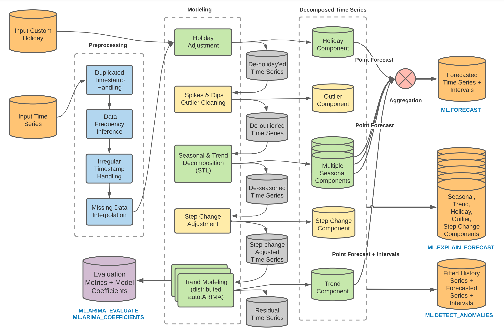
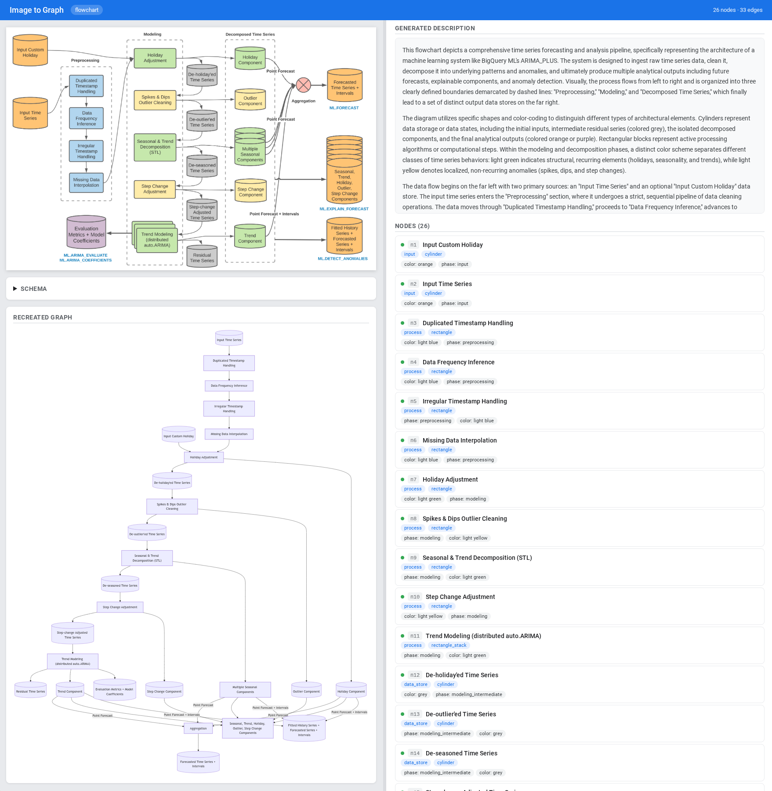
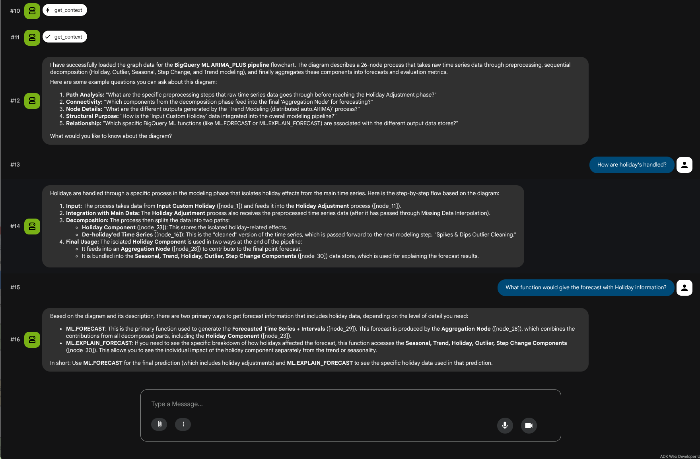

<!--- header table --->
<table>
<tr>
  <td style="text-align: center">
    <a href="https://github.com/statmike/vertex-ai-mlops/blob/main/Applied%20ML/AI%20Agents/image-to-graph/readme.md">
      
      <br>View on<br>GitHub
    </a>
  </td>
</tr>
<tr>
  <td style="text-align: right">
    <b>Share On: </b>
    <a href="https://www.linkedin.com/sharing/share-offsite/?url=https://github.com/statmike/vertex-ai-mlops/blob/main/Applied%2520ML/AI%2520Agents/image-to-graph/readme.md"></a>
    <a href="https://reddit.com/submit?url=https://github.com/statmike/vertex-ai-mlops/blob/main/Applied%2520ML/AI%2520Agents/image-to-graph/readme.md"></a>
    <a href="https://bsky.app/intent/compose?text=https://github.com/statmike/vertex-ai-mlops/blob/main/Applied%2520ML/AI%2520Agents/image-to-graph/readme.md"></a>
    <a href="https://twitter.com/intent/tweet?url=https://github.com/statmike/vertex-ai-mlops/blob/main/Applied%2520ML/AI%2520Agents/image-to-graph/readme.md"></a>
  </td>
</tr>
<tr>
  <td style="text-align: right">
    <b>Connect With Author On: </b>
    <a href="https://www.linkedin.com/in/statmike"></a>
    <a href="https://www.github.com/statmike"></a>
    <a href="https://www.youtube.com/@statmike-channel"></a>
    <a href="https://bsky.app/profile/statmike.bsky.social"></a>
    <a href="https://x.com/statmike"></a>
  </td>
</tr>
</table><br/><br/>

---
# Image to Graph

An [ADK](https://google.github.io/adk-docs/) agent that converts complex diagram images (flowcharts, electrical schematics, building plans, network diagrams, UML, etc.) into structured graph representations with nodes, edges, and attributes — then lets you ask questions about the results.

> **Why do this?** Diagrams encode rich structural information — components, connections, hierarchies, flows — but this information is trapped in pixels. By converting diagrams to structured graphs, you unlock programmatic analysis, comparison, validation, and integration with downstream systems. The agent uses an **iterative visual thinking approach**: analyze the full image, identify regions with bounding boxes, crop and re-examine at detail, then accumulate a graph incrementally.

The agent uses:
- **Gemini Vision API** — for image analysis and region examination via `google.genai`
- **Pillow** — for bounding box-based image cropping
- **Pydantic** — for dynamic JSON Schema generation and validation
- **ADK Tool Context State** — for incremental graph accumulation across tool calls

<table>
<tr>
<td align="center" width="33%"><b>Diagram Image</b></td>
<td align="center" width="34%"><b>Extracted Graph + Visualization</b></td>
<td align="center" width="33%"><b>Q&A Over Results</b></td>
</tr>
<tr>
<td align="center">
<a href="examples/bq-arima-flowchart/diagram.png"></a>
</td>
<td align="center">
<a href="examples/bq-arima-flowchart/screenshots/image_to_graph.png"></a>
</td>
<td align="center">
<a href="examples/bq-arima-flowchart/screenshots/graph_qa.png"></a>
</td>
</tr>
<tr>
<td align="center"><sub>Input: any diagram image</sub></td>
<td align="center"><sub>agent_image_to_graph → interactive HTML with linked highlights</sub></td>
<td align="center"><sub>agent_graph_qa → ask about nodes, paths, and meaning</sub></td>
</tr>
</table>

> *Click any image to enlarge. Example uses the [BigQuery ARIMA_PLUS pipeline](https://cloud.google.com/bigquery/docs/reference/standard-sql/bigqueryml-syntax-create-time-series) diagram.*

---
## Architecture

```
User provides image path (+ optional schema path)
         │
         ▼
    ┌─────────────┐     ┌──────────────┐
    │  load_image  │     │ load_schema  │  (optional) Load target schema
    └──────┬──────┘     └──────┬───────┘
           │                   │
           ▼                   ▼
    ┌──────────────┐
    │ analyze_image │  Full image → Gemini (TOOL_MODEL) → regions + bounding boxes
    └──────┬───────┘
           ▼
    ┌───────────────────────────────┐
    │  For each region:             │
    │   crop_and_examine            │  Crop + Gemini (TOOL_MODEL) → elements + confidence
    │   update_graph (batch nodes)  │  Add all nodes in one call (with confidence)
    │   (adaptive zoom if complex)  │  Re-examine dense sub-regions at finer granularity
    └──────────┬────────────────────┘  (schema hints if input schema loaded)
               ▼
    ┌──────────────────────────┐
    │  trace_connections       │  Full image + node positions → Gemini → edges + confidence
    │  update_graph            │  Batch add edges (with confidence)
    └──────────┬───────────────┘
               ▼
    ┌──────────────────┐
    │ generate_schema  │  Infer JSON Schema (skipped if input schema loaded)
    │ validate_graph   │  Check completeness, conformance, consistency, low confidence
    └────────┬─────────┘
             ▼
    ┌────────────────────────┐
    │ generate_description   │  Gemini (TOOL_MODEL) → narrative description from image + graph + schema
    └────────┬───────────────┘
             ▼
    ┌────────────────────────┐
    │ generate_visualization │  Interactive HTML: description + image + graph with confidence indicators
    └────────┬───────────────┘
             ▼
    ┌────────────────┐
    │ export_result  │  Saves graph.json + schema.json + description.md as artifacts
    └────────┬───────┘       + writes all files to disk next to the source image
             ▼
    results-with-schema/     ← when input schema was loaded
    results-without-schema/  ← when no schema was provided
             │
             ▼
    ┌─────────────────────────────────────────────────────────────┐
    │  Q&A handoff → agent_graph_qa                               │
    │  Agent suggests example questions, then transfers            │
    │  to the Q&A sub-agent on user request.                      │
    │  Shared session state — no file reload needed.              │
    └─────────────────────────────────────────────────────────────┘

    ── OR (standalone) ──

    User selects agent_graph_qa from the ADK dropdown
         │
         ▼
    ┌────────────────┐
    │ load_results   │  Reads graph.json + schema.json + description.md from a directory
    └────────┬───────┘
             ▼
    ┌────────────────┐
    │  get_context   │  Formats full graph data for Q&A
    └────────┬───────┘
             ▼
    Answer questions about nodes, edges, paths, schema, and diagram meaning
```

---
## Prerequisites

### Google Cloud APIs

Enable the following APIs in your GCP project:

```bash
gcloud services enable \
    aiplatform.googleapis.com \
    bigquery.googleapis.com \
    bigquerystorage.googleapis.com \
    storage.googleapis.com
```

| API | Purpose |
|-----|---------|
| [Vertex AI API](https://console.cloud.google.com/apis/library/aiplatform.googleapis.com) (`aiplatform.googleapis.com`) | Gemini model access via Vertex AI |
| [BigQuery API](https://console.cloud.google.com/apis/library/bigquery.googleapis.com) (`bigquery.googleapis.com`) | Agent analytics logging (bq_plugin) |
| [BigQuery Storage API](https://console.cloud.google.com/apis/library/bigquerystorage.googleapis.com) (`bigquerystorage.googleapis.com`) | Streaming writes for analytics |
| [Cloud Storage API](https://console.cloud.google.com/apis/library/storage.googleapis.com) (`storage.googleapis.com`) | GCS offloading for multimodal content |

### Authentication

```bash
# Login and set application default credentials
gcloud auth login
gcloud auth application-default login

# Set your project
gcloud config set project YOUR_PROJECT_ID
```

### Other Requirements

- [Git](https://github.com/git-guides/install-git)
- [Google Cloud CLI](https://cloud.google.com/sdk/docs/install) (initialized via `gcloud init`)
- Python 3.13.3 (via [pyenv](https://github.com/pyenv/pyenv) or [uv](https://docs.astral.sh/uv/))
- A GCP project with billing enabled

---
## Environment Setup

### 1. Clone and Navigate

```bash
cd ~/repos  # Or your preferred location
git clone https://github.com/statmike/vertex-ai-mlops.git
cd 'vertex-ai-mlops/Applied ML/AI Agents/image-to-graph'
```

### 2. Set the Python Version

```bash
# Install Python 3.13.3 if not already installed
pyenv install --skip-existing 3.13.3
pyenv local 3.13.3
```

### 3. Install Dependencies (Choose One Option)

<details>
<summary>Option 1: Using uv (Recommended)</summary>

[uv](https://docs.astral.sh/uv/getting-started/installation/) is the fastest option and what this project is built with.

```bash
# Option A: Run the setup script
chmod +x uv_setup.sh
./uv_setup.sh

# Option B: Manual
uv sync
```

</details>

<details>
<summary>Option 2: Using Poetry</summary>

```bash
# Install dependencies
poetry install

# Or if you need to create the environment first
poetry env use 3.13.3
poetry install
```

</details>

<details>
<summary>Option 3: Using pip with venv</summary>

```bash
# 1. Create a virtual environment
python -m venv .venv

# 2. Activate the virtual environment
# On macOS and Linux:
source .venv/bin/activate
# On Windows (Command Prompt):
# .venv\Scripts\activate

# 3. Install the required packages
pip install google-adk google-genai pydantic pillow python-dotenv
```

</details>

### 4. Configure Environment

Edit the `.env` file with your GCP project details:

```bash
GOOGLE_GENAI_USE_VERTEXAI=TRUE
GOOGLE_CLOUD_PROJECT=your-project-id
GOOGLE_CLOUD_LOCATION=us-central1
GOOGLE_CLOUD_STORAGE_BUCKET=gs://your-bucket

# Model Configuration
#AGENT_MODEL=gemini-2.5-flash
AGENT_MODEL=gemini-3-flash-preview
AGENT_MODEL_LOCATION=global  # Uncomment for preview models; overrides GOOGLE_CLOUD_LOCATION for the agent
#TOOL_MODEL=gemini-2.5-pro
TOOL_MODEL=gemini-3.1-pro-preview
TOOL_MODEL_LOCATION=global  # Uncomment for preview models; overrides GOOGLE_CLOUD_LOCATION for tool calls

# BigQuery Agent Analytics Plugin
BQ_DATASET_LOCATION=US
BQ_ANALYTICS_DATASET=applied_ml_image_to_graph
BQ_ANALYTICS_TABLE=agent_events
BQ_ANALYTICS_GCS_BUCKET=your-bucket-name
BQ_ANALYTICS_GCS_PATH=applied-ml/ai-agents/image-to-graph/bq_plugin
```

| Variable | Purpose | Default |
|----------|---------|---------|
| `AGENT_MODEL` | Gemini model for the ADK agent (orchestration, tool selection) | `gemini-3-flash-preview` |
| `AGENT_MODEL_LOCATION` | API endpoint location for `AGENT_MODEL`; overrides `GOOGLE_CLOUD_LOCATION` for the agent. Required for preview models. | `global` |
| `TOOL_MODEL` | Gemini model for vision tools (`analyze_image`, `crop_and_examine`, `trace_connections`, `generate_description`) | `gemini-3.1-pro-preview` |
| `TOOL_MODEL_LOCATION` | API endpoint location for `TOOL_MODEL`; overrides `GOOGLE_CLOUD_LOCATION` for tool calls. Required for preview models. | `global` |

---
## Running The Agent

Start the ADK web interface using your package manager:

```bash
# uv:
uv run adk web --reload

# poetry:
poetry run adk web --reload

# pip/venv (with .venv activated):
adk web --reload
```

Then open `http://localhost:8000` in your browser. Two agents appear in the agent dropdown:

| Agent | Purpose |
|-------|---------|
| `agent_image_to_graph` | Convert a diagram image into a structured graph. After export, suggests Q&A and can transfer to the Q&A sub-agent. |
| `agent_graph_qa` | Ask questions about previously extracted graph results. Can load results from a directory on disk, or receive them via shared session state when transferred from `agent_image_to_graph`. |

---
## Example Usage

An example is included in `examples/bq-arima-flowchart/` using the BigQuery ML ARIMA pipeline diagram:

```
examples/bq-arima-flowchart/
├── diagram.png         # The ARIMA pipeline flowchart
├── schema.json         # Pydantic-generated JSON Schema
└── create_schema.py    # Script that defines models and generates schema.json
```

> **Image source:** [BigQuery ML `CREATE TIME SERIES` documentation](https://cloud.google.com/bigquery/docs/reference/standard-sql/bigqueryml-syntax-create-time-series) — diagram showing the ARIMA_PLUS pipeline stages from preprocessing through decomposition to forecasting.

> **Note:** Only attach **image files** through the ADK web UI. Schema files (`.json`) should be referenced by **file path** in your message text — the agent's `load_schema` tool reads them from disk. Gemini does not accept `application/json` as a file upload.

### Without a Schema (auto-generated)

The agent analyzes the image freely, builds the graph, and auto-generates a JSON Schema from the observed structure.

Copy/paste this prompt into the ADK web chat:

```
Analyze this flowchart: examples/bq-arima-flowchart/diagram.png
```

The agent will:
1. Load and validate the image
2. Analyze the full image to detect regions and bounding boxes
3. Crop and examine each region in detail (with confidence scoring and adaptive zoom for dense areas)
4. Build a graph with nodes and bounding boxes (including confidence levels)
5. Trace connections across the full image for edge detection with confidence
6. Auto-generate a JSON Schema from the graph structure
7. Validate the graph (including low-confidence warnings)
8. Generate a comprehensive narrative description of the diagram
9. Generate an interactive `visualization.html` with description, linked image/graph highlights, and confidence indicators
10. Export `graph.json` + `schema.json` + `description.md` as artifacts and write all files to `results-without-schema/` next to the source image
11. Suggest example Q&A questions about the diagram — if you ask one, the agent transfers to `agent_graph_qa` which answers using the shared session state

### With a Schema (user-provided)

Provide a JSON Schema by file path and the agent will ensure the graph conforms to it — including domain-specific fields like `phase`, `element_type`, and `bq_function` for every node.

Copy/paste this prompt into the ADK web chat:

```
Analyze this flowchart: examples/bq-arima-flowchart/diagram.png
Use this schema: examples/bq-arima-flowchart/schema.json
```

The agent will:
1. Load and validate the image
2. Load the target schema and report its required fields (`id`, `label`, `element_type` for nodes)
3. Analyze the image and build the graph, conforming to the schema (with bounding boxes and confidence)
4. `update_graph` will hint at any missing required/optional fields from the schema
5. Trace connections across the full image for edge detection with confidence
6. Validate the graph against the schema — report missing fields, type mismatches, low-confidence warnings
7. Generate a comprehensive narrative description of the diagram
8. Generate an interactive `visualization.html` with description, linked image/graph highlights, and confidence indicators
9. Export `graph.json` + `schema.json` (the user-provided schema) + `description.md` as artifacts and write all files to `results-with-schema/` next to the source image
10. Suggest example Q&A questions about the diagram — if you ask one, the agent transfers to `agent_graph_qa` which answers using the shared session state

The included schema defines domain-specific enums and fields tailored to this diagram:
- **`element_type`**: `input`, `process`, `intermediate`, `component`, `output`, `operator`
- **`phase`**: `Preprocessing`, `Modeling`, `Decomposed Time Series`, `Output`
- **`edge_type`**: `flow` (solid arrow), `feedback` (dashed arrow)
- **`bq_function`**: associated BigQuery ML function (e.g., `ML.FORECAST`)

### Creating Your Own Schema with Pydantic

The example schema was generated by `examples/bq-arima-flowchart/create_schema.py`. To create your own, define Pydantic models for your diagram type, then export the JSON Schema. Required fields use `...` (Ellipsis), optional fields use `None` as default:

```python
import json
from enum import Enum
from pydantic import BaseModel, Field
from typing import Optional

class ElementType(str, Enum):
    input = "input"
    process = "process"
    intermediate = "intermediate"
    component = "component"
    output = "output"
    operator = "operator"

class FlowchartNode(BaseModel):
    id: str = Field(..., description="Unique node identifier")
    label: str = Field(..., description="Display text from the diagram")
    element_type: ElementType = Field(..., description="Type of diagram element")
    phase: Optional[str] = Field(None, description="Pipeline phase this node belongs to")
    shape: Optional[str] = Field(None, description="Visual shape: rectangle, cylinder, circle")
    color: Optional[str] = Field(None, description="Fill color")
    bq_function: Optional[str] = Field(None, description="Associated BigQuery ML function")
    bounding_box: Optional[list[int]] = Field(None, description="[y_min, x_min, y_max, x_max] 0-1000")

class FlowchartEdge(BaseModel):
    id: str = Field(..., description="Unique edge identifier")
    source: str = Field(..., description="Source node id")
    target: str = Field(..., description="Target node id")
    label: Optional[str] = Field(None, description="Edge label")
    edge_type: Optional[str] = Field("flow", description="Arrow style: flow or feedback")

class FlowchartGraph(BaseModel):
    diagram_type: str
    nodes: list[FlowchartNode]
    edges: list[FlowchartEdge]
    metadata: Optional[dict] = None

# Generate and save the schema
schema = FlowchartGraph.model_json_schema()
with open("schema.json", "w") as f:
    json.dump(schema, f, indent=2)
```

Pydantic's `model_json_schema()` produces a standard JSON Schema with `$defs` and `$ref` references — fully supported by the agent's tools. Run with:

```bash
uv run python examples/bq-arima-flowchart/create_schema.py
```

### Example Results

Running the agent on `examples/bq-arima-flowchart/diagram.png` — once without a schema and once with the included `schema.json` — produces the following result directories:

```
examples/bq-arima-flowchart/
├── diagram.png
├── schema.json
├── create_schema.py
├── results-without-schema/
│   ├── graph.json
│   ├── schema.json          ← auto-generated from graph structure
│   ├── description.md
│   └── visualization.html
└── results-with-schema/
    ├── graph.json
    ├── schema.json           ← copy of the user-provided input schema
    ├── description.md
    └── visualization.html
```

Files are replaced on each run (no accumulation). The same artifacts are also saved via the ADK artifact system.

**View the interactive visualizations directly in your browser:**

| Run | Visualization | Graph | Description |
|-----|---------------|-------|-------------|
| Without schema | [**visualization.html**](https://htmlpreview.github.io/?https://github.com/statmike/vertex-ai-mlops/blob/main/Applied%20ML/AI%20Agents/image-to-graph/examples/bq-arima-flowchart/results-without-schema/visualization.html) | [graph.json](examples/bq-arima-flowchart/results-without-schema/graph.json) | [description.md](examples/bq-arima-flowchart/results-without-schema/description.md) |
| With schema | [**visualization.html**](https://htmlpreview.github.io/?https://github.com/statmike/vertex-ai-mlops/blob/main/Applied%20ML/AI%20Agents/image-to-graph/examples/bq-arima-flowchart/results-with-schema/visualization.html) | [graph.json](examples/bq-arima-flowchart/results-with-schema/graph.json) | [description.md](examples/bq-arima-flowchart/results-with-schema/description.md) |

> The visualization links use [htmlpreview.github.io](https://htmlpreview.github.io) to render the self-contained HTML files directly from GitHub — no setup required. Each visualization embeds the source image as base64, includes interactive hover/click highlighting, a recreated Mermaid diagram, and the schema.

**What's different between the two runs?**

- **Without schema**: the agent freely discovers diagram elements and auto-generates a generic schema from the observed structure. Node attributes reflect what was visually detected.
- **With schema**: the agent conforms to the provided schema's field definitions (`element_type`, `phase`, `bq_function`, `edge_type`, etc.), producing richer domain-specific annotations and validated output.

### Q&A: Asking Questions About Results

After `agent_image_to_graph` finishes exporting, it suggests example questions about the diagram and offers to hand off to the Q&A agent. You can also use `agent_graph_qa` directly by selecting it from the ADK dropdown — useful for exploring results from a previous session without re-running the extraction pipeline.

**As a sub-agent** (continued session — no prompt needed, the agent transfers automatically):

After export completes, the agent suggests questions like:
- "What processing steps happen between the input time series and the modeling phase?"
- "Which nodes feed into the Aggregation operator?"
- "What is the path from Input Time Series to Forecasted Time Series?"

Ask any question and the agent transfers to `agent_graph_qa`, which answers using the graph, schema, and description already in session state.

**Standalone** (select `agent_graph_qa` from the dropdown):

Copy/paste this prompt into the ADK web chat:

```
Load results from: examples/bq-arima-flowchart/results-with-schema
```

The agent will:
1. Load `graph.json`, `schema.json`, and `description.md` from the directory
2. Suggest 3-5 example questions based on the actual graph content
3. Answer structural questions (paths, neighbors, connectivity) by reasoning over the edges
4. Answer semantic questions (purpose, meaning) using the description and node attributes
5. Answer schema questions (required fields, allowed types) from the schema

---
## Graph Output Format

The exported `graph.json` follows this structure:

```json
{
  "diagram_type": "flowchart",
  "nodes": [
    {
      "id": "node_1",
      "label": "Start",
      "element_type": "terminal",
      "shape": "oval",
      "confidence": "high",
      "attributes": {}
    },
    {
      "id": "node_2",
      "label": "Process Data",
      "element_type": "process",
      "shape": "rectangle",
      "confidence": "medium",
      "attributes": {"description": "Transforms input data"}
    }
  ],
  "edges": [
    {
      "id": "edge_1",
      "source": "node_1",
      "target": "node_2",
      "label": null,
      "confidence": "high"
    }
  ],
  "metadata": {
    "source_file": "/path/to/image.png",
    "image_width": 1920,
    "image_height": 1080,
    "status": "complete"
  }
}
```

A `schema.json` is **always** exported alongside the graph — either the user-provided input schema or an auto-generated schema inferred from the graph structure. A `description.md` is also exported when a description has been generated. All files are saved both as ADK artifacts and written to disk in a `results-with-schema/` or `results-without-schema/` directory next to the source image.

---
## Interactive Visualization

The agent generates an interactive HTML visualization (`visualization.html` artifact) that lets you visually verify the extracted graph against the source image.

**Features:**
- **Two-panel layout**: source image on the left, graph details on the right
- **Generated description**: comprehensive narrative description of the diagram shown at the top of the graph panel
- **Linked highlighting**: hover or click a node in either panel to highlight its bounding box on the image AND its card in the graph panel
- **Edge tracing**: hover an edge to highlight both its source and target nodes on the image
- **Resizable panels**: drag the divider between panels to adjust the layout
- **Self-contained**: the HTML file embeds the image as base64 — no external dependencies, works offline

For the visualization to work, nodes must include a `bounding_box` field with `[y_min, x_min, y_max, x_max]` coordinates (normalized 0-1000 scale). The agent is instructed to always include this when adding nodes.

### Confidence Scoring

All Gemini-backed tools (`crop_and_examine`, `trace_connections`) return per-element confidence levels (`high`, `medium`, `low`). Confidence is carried through the pipeline:

- **Extraction**: Each node and edge gets a confidence level during examination and edge tracing
- **Graph storage**: Confidence is stored as a field on each node/edge via `update_graph`
- **Validation**: `validate_graph` flags low-confidence nodes and edges as warnings
- **Visualization**: Confidence-aware indicators on node and edge cards — green (high), yellow (medium), red (low). Low-confidence edges get a dashed border

### Adaptive Zoom

When `crop_and_examine` detects a high-complexity region (many overlapping elements, small text), it returns suggested sub-regions for closer examination. The agent can then re-examine those sub-regions at finer granularity (limited to 3 additional calls) to improve extraction quality in dense areas.

### Description Artifact

`export_result` saves a `description.md` artifact alongside `graph.json` and `schema.json`. This contains the narrative description generated by `generate_description`, providing a human-readable summary of the diagram's structure and content.

---
## Tools Reference

| Tool | Purpose |
|------|---------|
| `load_image` | Load image from file path, validate with Pillow, store bytes in state |
| `load_schema` | Load a JSON Schema from file to use as the target structure for graph construction |
| `analyze_image` | Full image analysis via Gemini (`TOOL_MODEL`) — diagram type, regions, bounding boxes |
| `crop_and_examine` | Crop a region and examine it in one call via Gemini (`TOOL_MODEL`) — labels, symbols, attributes, complexity, confidence; suggests sub-regions for adaptive zoom |
| `trace_connections` | Dedicated edge detection — sends full image + all node positions to Gemini (`TOOL_MODEL`) for a cross-region edge-finding pass with confidence |
| `update_graph` | Batch add/update nodes and edges in one call (with schema conformance hints) |
| `get_graph` | Retrieve current graph state for progress review |
| `generate_schema` | Infer JSON Schema from observed graph attributes (skipped if input schema loaded) |
| `validate_graph` | Validate graph structure and schema conformance — missing fields, orphaned edges, type mismatches, low-confidence flags |
| `generate_description` | Generate a narrative description of the diagram via Gemini (`TOOL_MODEL`) using image + graph + schema as context |
| `generate_visualization` | Create interactive HTML with description + image + graph, linked hover/click highlights, confidence indicators; writes to disk |
| `export_result` | Save final `graph.json` + `schema.json` + `description.md` as artifacts; writes all files to disk |

### Q&A Tools (`agent_graph_qa`)

| Tool | Purpose |
|------|---------|
| `load_results` | Load `graph.json`, `schema.json`, and `description.md` from a results directory into session state (standalone mode) |
| `get_context` | Retrieve the full graph context — nodes, edges, schema, description — formatted for Q&A reasoning |

---
## Agent Analytics

This agent logs events to BigQuery using the [BigQuery Agent Analytics Plugin](https://google.github.io/adk-docs/observability/bigquery-agent-analytics/). The plugin is built into the agent at `agent_image_to_graph/bq_plugin.py`.

### Auto-Setup

**No manual setup required.** The agent automatically checks for and creates the BigQuery dataset and table on first run. Just configure your `.env` and start the agent — the BQ resources are provisioned automatically.

### Configuration

Analytics settings in `.env`:

```bash
BQ_DATASET_LOCATION=US
BQ_ANALYTICS_DATASET=applied_ml_image_to_graph
BQ_ANALYTICS_TABLE=agent_events
BQ_ANALYTICS_GCS_BUCKET=your-bucket-name
BQ_ANALYTICS_GCS_PATH=applied-ml/ai-agents/image-to-graph/bq_plugin
```

### Querying Analytics

Use `bq_analytics.ipynb` to query and analyze agent behavior:
- Event type distribution
- Token usage analysis
- Latency analysis (LLM & tools)
- Tool usage statistics
- Error analysis
- Conversation tracing by `invocation_id`
- Span hierarchy & duration
- Multimodal content queries (GCS references)
- Daily activity summaries

### Disabling Analytics

Comment out the plugin section at the end of `agent_image_to_graph/agent.py`:

```python
# from .bq_plugin import bq_analytics_plugin
# from google.adk.apps import App
# app = App(name="agent_image_to_graph", root_agent=root_agent, plugins=[bq_analytics_plugin])
```

---
