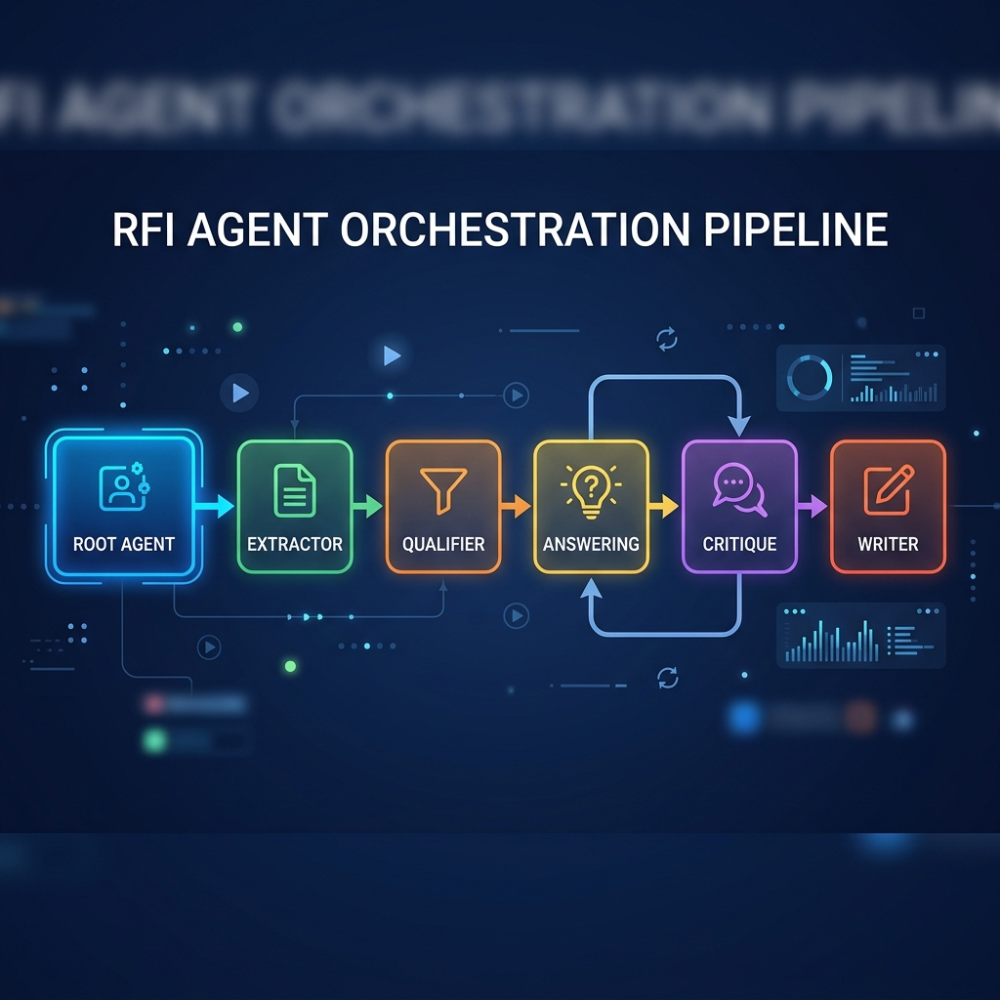
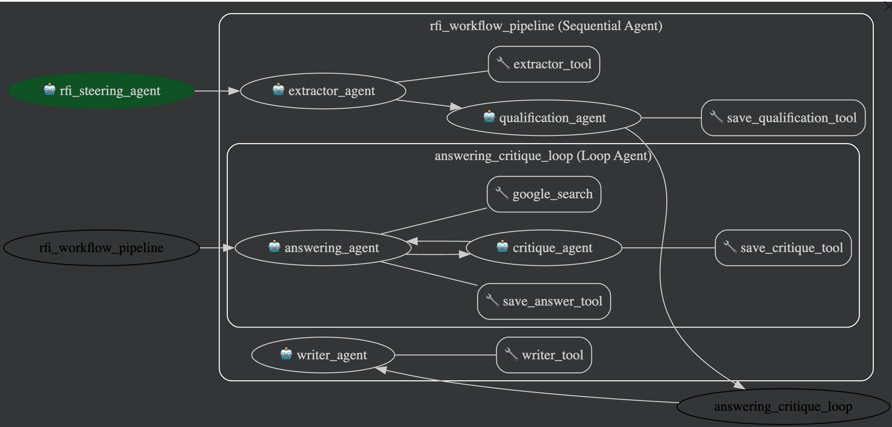

# RFI Agent

Putting ML and Generative AI to work with Agents using the Google Agent Development Kit (ADK).

An AI Agent workflow designed to automate responses to Requests for Information (RFI) by processing DOCX, Excel, and PDF documents.

## Project Goal
Automate the end-to-end process of responding to RFIs:
- **Extract** questions from DOCX, Excel, and PDF files, maintaining location mapping.
- **Qualify** questions as generic or project-specific.
- **Answer** questions using internal knowledge bases or Google Search Grounding.
- **Critique** answers for quality before final output.
- **Write** completed answers back to the original file formats (or generate a Markdown report for PDFs).

## System Architecture

The system implements a multi-agent workflow coordinated by a Root Agent:

### Core Agents

- **Root Agent**: Orchestrates the workflow, identifies document types, manages state transitions, and delegates tasks to sub-agents.
- **Question Extractor Agent**: Extracts questions and their locations from documents into a central JSON state. Supports DOCX, Excel, and PDF.
- **Question Qualification Agent**: Classifies questions into "generic" or "project_specific".
- **Question Answering Agent**: Generates answers using RAG (Knowledge Base) or Search Grounding.
- **Response Critique Agent**: Validates responses against quality standards.
- **Response Writer Agent**: Writes finalized answers back to the source file (Docx/Excel) or generates a Markdown report for PDFs.

### Agent Orchestration Flow

The following diagram illustrates how the Root Agent orchestrates the sub-agents to process the RFI:



### ADK Agent Flow



### Key Features
- **Centralized State**: Uses a concrete JSON structure to track question status (`extracted` -> `qualified` -> `answered` -> `critiqued` -> `completed`).
- **Grounding**: Initial Implementation uses Google Search Grounding for answering questions. This could be extended to support internal documentation by using Vertex AI Search Data store or Custom RAG implementation using Vertex AI.
- **Multi-Format Support**: Works with Microsoft Word (.docx), Excel (.xlsx), and PDF (.pdf) files. Note: For PDFs, the system generates a Markdown report as output because writing back to a PDF is complex.

## JSON State Structure

The JSON file acts as the "single source of truth" passed between agents. Here is the structure used for tracking state:

```json
{
  "document": {
    "filename": "sample_rfi.pdf",
    "type": "pdf",                     // "docx", "excel", or "pdf"
    "path": "./data/input/sample_rfi.pdf",
    "status": "completed"              // "processing", "completed", or "error"
  },
  "questions": [
    {
      "id": "pdf_p2_Q1",
      "text": "Describe your controller's droop control logic...",
      "location": {                     // Varies based on doc type
        "type": "pdf_page",             // "docx_table", "docx_paragraph", "excel_cell", or "pdf_page"
        "page_number": 2,               // Populated if PDF
        "table_index": null,            // Populated if DOCX table
        "row_index": null,
        "cell_index": null,
        "sheet_name": null,             // Populated if Excel
        "cell_reference": null
      },
      "status": "completed",            // "extracted" -> "qualified" -> "answered" -> "critiqued" -> "completed"
      "qualification": {
        "question_type": "generic",     // "generic" or "project_specific"
        "reasoning": "..." 
      },
      "answer": {
        "text": "...",
        "confidence_score": 0.9,
        "sources": []                   // Links/Docs used for grounding
      },
      "critique": {
        "passed_quality_check": true,
        "feedback": "",
        "retry_count": 0
      }
    }
  ]
}
```

## Project Structure

Folder structure showing the layout of the root agent and sub-agents:

```text
RFI_Agent/
├── main.py                         # Helper script to launch or test the flow
├── requirements.txt                # Project dependencies
├── data/                           # Data storage
│   ├── input/                      # Input artifacts (Docx, Excel, PDF)
│   └── output/                     # Finalized documents (or MD reports)
└── root_agent/                     # The main steering orchestrator
    ├── agent.py                    # Defines the root_agent
    ├── models/                     # Data schemas (e.g., Pydantic)
    └── sub_agents/                 # Directory holding sub-agents
        ├── answering_agent/        # Agent for generated responses
        ├── critique_agent/         # Agent for quality validation
        ├── extractor_agent/        # Agent for extracting questions
        ├── qualification_agent/    # Agent for question classification
        └── writer_agent/           # Agent for writing answers back
```