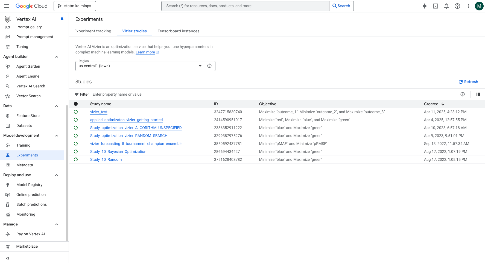
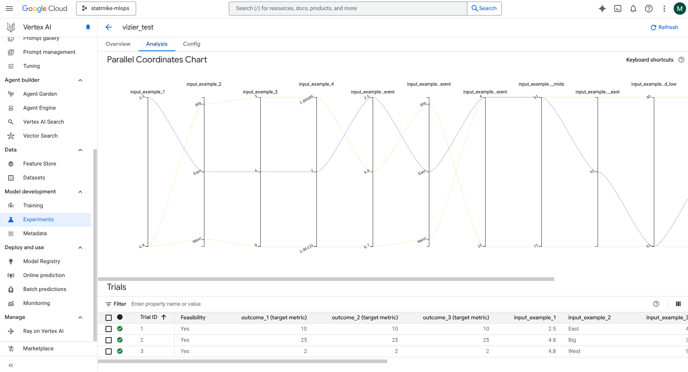

<!--- header table --->
<table align="left">     
  <td style="text-align: center">
    <a href="https://github.com/statmike/vertex-ai-mlops/blob/main/Applied%20ML/Optimization/readme.md">
      
      <br>View on<br>GitHub
    </a>
  </td>
</table><br/><br/><br/><br/>

---
# Applied Optimization
> You are here: `vertex-ai-mlops/Applied ML/Optimization/readme.md`

## Optimization Overview

**Optimization** is a powerful technique used across science, engineering, business, and machine learning to find the best possible outcome given a set of constraints. It involves systematically choosing values for **decision variables** to maximize or minimize an **objective function** (like profit, accuracy, cost, or error), while respecting limitations or rules known as **constraints** (like budgets, resource limits, or physical laws). The goal is to identify optimal, or near-optimal, solutions efficiently from a potentially vast space of possibilities.

## Problem Categories & Recommended Tools

The best tool for an optimization task depends heavily on the mathematical structure of the problem. Here's a breakdown of common categories relevant to this repository and the primary tools used:

### Continuous Optimization

* **Description:** Problems where decision variables can take any value within a continuous range (e.g., temperatures, dimensions, weights). Often involves smooth, nonlinear functions (Nonlinear Programming - NLP).
* **Recommended Tool: [scipy.optimize](https://docs.scipy.org/doc/scipy/tutorial/optimize.html)**
    * **Why:** SciPy provides a robust suite of algorithms specifically designed for continuous problems. It handles both unconstrained and constrained nonlinear optimization, least-squares fitting, and root finding. It's ideal when you can express your objective function and constraints mathematically, potentially even providing gradients for faster convergence.

### Discrete & Combinatorial Optimization

* **Description:** Problems where decision variables must be chosen from discrete sets (e.g., integers representing item counts, binary yes/no choices) or involve combinations, permutations, or graphs (e.g., scheduling, routing). This includes well-defined structures like Linear Programming (LP) and Mixed-Integer Programming (MIP).
* **Recommended Tool: [Google OR-Tools](https://developers.google.com/optimization)**
    * **Why:** OR-Tools is purpose-built for these types of problems. It offers high-performance, specialized solvers for LP, MIP, Constraint Programming (CP), vehicle routing, scheduling, and network flows. It excels at finding optimal or good feasible solutions for complex, large-scale logistical and planning challenges.

### Black-Box Optimization

* **Description:** Problems where the internal workings of the objective function are unknown, computationally expensive to evaluate, or lack an easily derivable mathematical form. We can only provide inputs and observe the output value. A prime example is tuning machine learning model hyperparameters.
* **Recommended Tool: [Vertex AI Vizier](https://cloud.google.com/vertex-ai/docs/vizier/overview)** (Example Workflows Below)
    * **Why:** Vizier is a managed Google Cloud service specializing in optimizing these black-box functions. It uses sophisticated search strategies (like Bayesian optimization, evolutionary algorithms) to efficiently explore the decision space and find optimal inputs without needing gradient information or a mathematical model. It's particularly effective for hyperparameter tuning integrated within the Vertex AI ecosystem.

**In summary:** The nature of your objective function, variables, and constraints dictates the appropriate tool – use SciPy for continuous mathematical functions, OR-Tools for discrete/combinatorial/LP/MIP problems, and Vizier for optimizing expensive or unknown black-box functions, especially hyperparameters.

---
## Vertex AI Vizier

As motivated above, Vertex AI Vizier is a black-box optimization service that helps find optimal parameter settings to achieve goals on desired metrics. It excels when you don't have a simple objective function to evaluate, or when the cost (in time, money, or complexity) of running a trial is high. The service allows you to configure an optimization "Study" and retrieve suggested parameter settings ("Trials") from it. As you report back the outcome metrics for completed trials, Vizier's successive suggestions learn from past results to optimize the settings it proposes. You can even backfill the study with data from past trials for Vizier to use as a starting point.

**Vizier References**
- [Vertex AI Vizier Documentation](https://cloud.google.com/vertex-ai/docs/vizier/overview)
- [Vertex SDK Vizier Client For Python](https://cloud.google.com/python/docs/reference/aiplatform/latest/google.cloud.aiplatform_v1.services.vizier_service)
- Read about how Vertex AI Vizier tunes multi-objective functions: [Random Hypervolume Scalarizations for Provable Multi-Objective Black Box Optimization](https://arxiv.org/abs/2006.04655)
- Vizier Research paper [Google Vizier: A Service for Black-Box Optimization](https://static.googleusercontent.com/media/research.google.com/en//pubs/archive/46180.pdf)
- [OSS Vizier](https://arxiv.org/abs/2207.13676) and its GitHub Repository: [Open Source Vizier: Reliable and Flexible Black-Box Optimization](https://github.com/google/vizier)

A great way to get started is to try an overview workflow like this:

### Workflows:
- [Vertex AI Vizier - Getting Started](../../Applied%20Optimization/Vertex%20AI%20Vizier%20-%20Getting%20Started.ipynb)
    - Includes multiple parameters and multiple objectives (metrics).
    - Includes safety thresholds for metrics.
    - Includes examples of loading past trials as a starting point.
    - Includes an example of contextual bandits (some parameters fixed during trials).

> This content currently resides in the [Applied Optimization](../../Applied%20Optimization/readme.md) folder and will migrate here.

### Working With Vizier on Vertex AI

#### **Vertex AI SDK**

To interact with Vizier, you use a [Vertex AI Client library](https://cloud.google.com/vertex-ai/generative-ai/docs/reference/libraries); the [Vertex AI SDK for Python](https://cloud.google.com/vertex-ai/docs/python-sdk/use-vertex-ai-python-sdk) is used in these examples.
- The full API Guide for the Python client library is documented [here](https://cloud.google.com/python/docs/reference/aiplatform/latest).

```python
from google.cloud import aiplatform

REGION = 'us-central1'
PROJECT_ID = 'your-project-1234' # Replace with your Project ID
```

#### **Vizier Client**

With the SDK you can set up a Vizier client, either synchoronous (`VizierServiceClient`) or asynchronous (`VizierServiceAsyncClient`).  

```python
vizier = aiplatform.gapic.VizierServiceClient(
    client_options = {"api_endpoint" : f"{REGION}-aiplatform.googleapis.com"}
)
```

#### **Vizier Study**

A Vizier study represents an optimization process, consisting of a series of trials. Each trial involves specific parameter settings and their resulting metric(s).

**Retrieve Existing Study**

f you already have a study, you can retrieve it (connect to it) using either of these approaches:

```python
# using the studies display name:
study = vizier.lookup_study(
    dict(
        parent = f'projects/{PROJECT_ID}/locations/{REGION}',
        display_name = 'vizier_test'
    )
)

# OR, if you know the studies resource name you can directly use it like:

study = vizier.get_study(
    name = f'projects/{PROJECT_ID}/locations/{REGION}/studies/2414590951017'
)
```

**Create A New Study**

You need a study configuration (defined below) to create a new study.

Create a new study by providing a study configuration object (e.g., `study_specs` in the code here):

```python
study = vizier.create_study(
    parent = f'projects/{PROJECT_ID}/locations/{REGION}',
    study = study_specs
)
```

#### **Study Configuration**

The study configuration defines the parameters (inputs), metrics (outputs), and optimization settings for a study. 

**Parameters**

These define the search space. Parameters can represent tunable settings that Vizier will suggest values for, or they can represent contextual information provided for a trial. Vizier seeks the optimal values for tunable parameters based on the metrics reported.

```python
parameter_specs = [
    dict(
        parameter_id = 'input_example_1',
        discrete_value_spec = dict(
            values = [1.0, 2.5, 4.8, 6.7], # up to 1000 values, sorted in increasing order, minimum 1e-10 spacing
            default_value = 2.5 # optional specification of starting point
        ),
        scale_type = 'SCALE_TYPE_UNSPECIFIED' # optional, default, see more options below
    ),
    dict(
        parameter_id = 'input_example_2',
        categorical_value_spec = dict(
            values = ['East', 'West', 'Big', 'Left'],
            default_value = 'East' # optional specification of starting point
        )
    ),
    dict(
        parameter_id = 'input_example_3',
        integer_value_spec = dict(
            min_value = 1,
            max_value = 20,
            default_value = 4 # optional specification of starting point
        ),
        scale_type = 'SCALE_TYPE_UNSPECIFIED' # optional, default, see more options below
    ),
    dict(
        parameter_id = 'input_example_4',
        double_value_spec = dict(
            min_value = 1.2,
            max_value = 4.3,
            default_value = 2.0 # optional specification of starting point
        ),
        scale_type = 'SCALE_TYPE_UNSPECIFIED' # optional, default, see more options below
    )
]
```

Some optional advanced settings for each parameter are:
- `scale_type` - not applicable when parameter uses `categorical_value_spec`
    - `scale_type = 'SCALE_TYPE_UNSPECIFIED'`: default, no scaling.
    - `scale_type = 'UNIT_LINEAR_SCALE'`: scales the feasible space linearly to (0, 1).
    - `scale_type = 'UNIT_LOG_SCALE'`: Scales the feasible space logarithmically to (0, 1); requires parameter values > 0.
    - `scale_type = 'UNIT_REVERSE_LOG_SCALE'`: Scales using a reverse logarithm to (0, 1); requires parameter values > 0.

**Conditional (Nested) Parameters**

Parameter specifications can also include nested (conditional) relationships, as shown in the following examples. The specification for child parameters is similar to regular parameters but includes the parent parameter values they apply to. The list of parent values can overlap or be shared between multiple child parameters, activating them when those parent values occur.

```python
parameter_specs = parameter_specs + [
    dict(
        parameter_id = 'input_example_1_parent',
        discrete_value_spec = dict(
            values = [1.0, 2.5, 4.8, 6.7], # up to 1000 values, sorted in increasing order, minimum 1e-10 spacing
            default_value = 2.5 # optional specification of starting point
        ),
        conditional_parameter_specs = [
            dict(
                parent_discrete_values = dict(values = [2.5, 4.8]),
                parameter_spec = dict(
                    parameter_id = 'input_example_1_child_mids',
                    # the discrete, categorical, integer, or double value spec
                    integer_value_spec = dict(
                        min_value = 1,
                        max_value = 100
                    )
                )
            ),
            # additional conditional parameters
        ]
    ),
    dict(
        parameter_id = 'input_example_2_parent',
        categorical_value_spec = dict(
            values = ['East', 'West', 'Big', 'Left'],
            default_value = 'East' # optional specification of starting point
        ),
        conditional_parameter_specs = [
            dict(
                parent_categorical_values = dict(values = ['East']),
                parameter_spec = dict(
                    parameter_id = 'input_example_2_child_east',
                    # the discrete, categorical, integer, or double value spec
                    integer_value_spec = dict(
                        min_value = 1,
                        max_value = 100
                    )
                )
            ),
            # additional conditional parameters
        ]
    ),
    dict(
        parameter_id = 'input_example_3_parent',
        integer_value_spec = dict(
            min_value = 1,
            max_value = 20,
            default_value = 4 # optional specification of starting point
        ),
        conditional_parameter_specs = [
            dict(
                parent_int_values = dict(values = [1,2,3,4,5]),
                parameter_spec = dict(
                    parameter_id = 'input_example_3_child_low',
                    # the discrete, categorical, integer, or double value spec
                    integer_value_spec = dict(
                        min_value = 1,
                        max_value = 100
                    )
                )
            ),
            # additional conditional parameters
        ]
    ),
]
```

**Metric(s)**

The outcome of a trial consists of one or more metrics. These are the values that Vizier aims to maximize or minimize by finding the optimal parameter settings. Metrics can also include safety thresholds for outcomes that are undesired or unsafe (e.g., profit < 0 or resource usage > limit).

```python
metric_specs = [
    dict(
        metric_id = 'outcome_1',
        goal = 'MAXIMIZE'
    ),
    # optionally proivde more than 1 metric to optimize
    dict(
        metric_id = 'outcome_2',
        goal = 'MINIMIZE'
    ),
    dict(
        metric_id = 'outcome_3',
        goal = 'MAXIMIZE',
        safety_config = dict(
            safety_threshold = 0, # a boundary value between safe and unsafe
            desired_min_safe_trials_fraction = .90 # the fraction of trials that you are ok with crossing the threshold, set to 1.0 to try to completely avoid unsafe trials
        )
    ),
]
```

**Study Specification Dictionary**

The full study specification combines the `parameter_specs` and `metric_specs` with overall study settings into a dictionary suitable for the `create_study` call:

```python
study_specs = dict(
    display_name = 'vizier_test',
    study_spec = dict(
        parameters = parameter_specs, # created above
        metrics = metric_specs, # created above
        algorithm = 'ALGORITHM_UNSPECIFIED' # this is the default, Vizier optimization
    )
) 
```

The `study_spec` can contain additional optional settings:
- `algorithm` has alternatives to the Vizier optimization algorithm
    - `algorithm = 'GRID_SEARCH'` uses a grid search but requires all parameters to be integer, categorical or discrete
    - `algorithm = 'RANDOM_SEARCH'` is simple random search in the space defined by parameters
- `observation_noise` can be used to indicate if trial parameters might result in variable outcome metric values
    - `observation_noise = 'OBSERVATION_NOISE_UNSPECIFIED'` is the default
    - `observation_noise = 'LOW'` guide the service to never repeat the same trial parameters
    - `observation_noise = 'HIGH'` guide the service to consider repeating the same trial parameters
- Early stopping configurations: [Reference for the StudySpec](https://cloud.google.com/python/docs/reference/aiplatform/latest/google.cloud.aiplatform_v1.types.StudySpec)
    - **Study stopping** configuration:
        - `study_stopping_config` can be used to setup the automated stopping of a study, where no new trials will be suggested and the study will enter a state of STOPPING.  The settings include:
            - min and max number of completed trials
            - max consectuive trials without progress
            - max amount of time without progress
            - min and max runtime for a study, including setting exact times rather than durations
    - **Trial stopping** configurations can be done with one of the following three options.  Trial results can be reported back intermitantly to inform the service of the trial progress and these rules can be used to move a trial from pending to early-stopped
        - `decay_curve_stopping_spec`
        - `median_automated_stopping_spec`
        - `convex_automated_stopping_spec`

#### **Trials**

A trial represents a specific set of parameter values evaluated against the defined metrics. Vizier suggests parameter values with the goal of finding settings that best meet the metric goals. Vizier learns over the course of trials, and past trials (with their parameters and metrics) can be provided using the `.create_trial()` method to serve as starting points or historical data.

**Get Suggested Trial(s)**

Request one or more trials using the client's `.suggest_trials()` method. This will return the desired number of trials, each containing suggested parameter settings (assuming no context is provided - see below). A `client_id` can be provided to distinguish requests if multiple systems are interacting with the same study.

```python
suggestions = vizier.suggest_trials(
    dict(
        parent = study.name,
        suggestion_count = 4,
        client_id = 'client_1'
    )
).result()
```

Reviewing the first suggested trial (`suggested_trials[0]`) might look like this (output formatted for readability):

```python
name: "projects/1026793852137/locations/us-central1/studies/3247715830740/trials/1"
state: ACTIVE
parameters {
  parameter_id: "input_example_1"
  value {
    number_value: 2.5
  }
}
parameters {
  parameter_id: "input_example_1_parent"
  value {
    number_value: 2.5
  }
}
parameters {
  parameter_id: "input_example_1_child_mids"
  value {
    number_value: 51
  }
}
parameters {
  parameter_id: "input_example_2"
  value {
    string_value: "East"
  }
}
parameters {
  parameter_id: "input_example_2_parent"
  value {
    string_value: "East"
  }
}
parameters {
  parameter_id: "input_example_2_child_east"
  value {
    number_value: 51
  }
}
parameters {
  parameter_id: "input_example_3"
  value {
    number_value: 4
  }
}
parameters {
  parameter_id: "input_example_3_parent"
  value {
    number_value: 4
  }
}
parameters {
  parameter_id: "input_example_3_child_low"
  value {
    number_value: 51
  }
}
parameters {
  parameter_id: "input_example_4"
  value {
    number_value: 2
  }
}
start_time {
  seconds: 1744403020
}
client_id: "client_1"
```

**Report Metrics for Trials**

Once you evaluate the suggested trial's parameters, you report the resulting metrics back to Vizier. This can be done incrementally if metrics have intermediate values (e.g., accuracy after each training epoch).

The `add_trial_measurement()` method reports intermediate or final results. The `complete_trial()` method marks the trial as finished (e.g., `SUCCEEDED`, `INFEASIBLE`).

The following examples show different ways to report results:

Method 1: Add Final Measurement, then Complete

```python
add_result = vizier.add_trial_measurement(
    dict(
        trial_name = suggestions.trials[0].name,
        measurement = dict(
            metrics = [
                dict(metric_id = 'outcome_1', value = 10),
                dict(metric_id = 'outcome_2', value = 10),
                dict(metric_id = 'outcome_3', value = 10)
            ]
        )
    )
)

complete = vizier.complete_trial(dict(name = suggestions.trials[0].name))

complete.state.name
# 'SUCCEEDED'

complete.final_measurement
# metrics {
#   metric_id: "outcome_1"
#   value: 10
# }
# metrics {
#   metric_id: "outcome_2"
#   value: 10
# }
# metrics {
#   metric_id: "outcome_3"
#   value: 10
# }
```

Method 2: Add Incremental Measurements, then Complete

```python
add_result_1 = vizier.add_trial_measurement(
    dict(
        trial_name = suggestions.trials[1].name,
        measurement = dict(
            metrics = [
                dict(metric_id = 'outcome_1', value = 15),
                dict(metric_id = 'outcome_2', value = 15),
                dict(metric_id = 'outcome_3', value = 15)
            ]
        )
    )
)

add_result_2 = vizier.add_trial_measurement(
    dict(
        trial_name = suggestions.trials[1].name,
        measurement = dict(
            metrics = [
                dict(metric_id = 'outcome_1', value = 25),
                dict(metric_id = 'outcome_2', value = 25),
                dict(metric_id = 'outcome_3', value = 25)
            ]
        )
    )
)

complete = vizier.complete_trial(dict(name = suggestions.trials[1].name))

complete.state.name
# 'SUCCEEDED'

complete.final_measurement
# metrics {
#   metric_id: "outcome_1"
#   value: 25
# }
# metrics {
#   metric_id: "outcome_2"
#   value: 25
# }
# metrics {
#   metric_id: "outcome_3"
#   value: 25
# }
```

Method 3: Complete with Final Measurement in One Step

```python
complete = vizier.complete_trial(
    dict(
        name = suggestions.trials[2].name,
        final_measurement = dict(
            metrics = [
                dict(metric_id = 'outcome_1', value = 2),
                dict(metric_id = 'outcome_2', value = 2),
                dict(metric_id = 'outcome_3', value = 2)            
            ]
        )
    )
)

complete.state.name
# 'SUCCEEDED'

complete.final_measurement
# metrics {
#   metric_id: "outcome_1"
#   value: 2
# }
# metrics {
#   metric_id: "outcome_2"
#   value: 2
# }
# metrics {
#   metric_id: "outcome_3"
#   value: 2
# }
```

**Infeasible Trials**

If a suggested trial results in a failed run or cannot be started (e.g., due to resource constraints or invalid parameter combinations discovered during setup), it should be marked as `INFEASIBLE`. This is still valuable information for the optimization process.

```python
infeasible = vizier.complete_trial(
    dict(
        name = suggestions.trials[3].name,
        trial_infeasible = True,
        infeasible_reason = 'Settings result in process errors.'
    )
)

infeasible.state.name
# 'INFEASIBLE'

infeasible.infeasible_reason
# 'Settings result in process errors.'
```

**Trials With Context (Contextual Bandits / Conditional Optimization)**

Some parameters might represent observed context (e.g., weather, current market conditions, user segment) rather than tunable settings. You might want to optimize the tunable parameters within the context of these observations. You can achieve this by providing the fixed values for context parameters in the `.suggest_trials()` request. Vizier will then suggest values for the remaining tunable parameters based on that context.

```python
suggestion_with_context = vizier.suggest_trials(
    dict(
        parent = study.name,
        suggestion_count = 1,
        client_id = 'client_1',
        contexts = [
            dict(
                description = 'Fixed value of some parameters.',
                parameters = [
                    dict(parameter_id = 'input_example_1', value = 4.8),
                    dict(parameter_id = 'input_example_2', value = 'Left')
                ]
            )
        ]
    )
).result()

suggestion_with_context.trials[0].parameters
# [parameter_id: "input_example_1"
# value {
#   number_value: 4.8
# }
# , parameter_id: "input_example_2"
# value {
#   string_value: "Left"
# }
# , ...
# ]
```

**List Trials**

At any time, you can retrieve a list of all trials associated with a study:

```python
trials = vizier.list_trials(dict(parent = study.name)).trials

len(trials)
# 5

[trial.state.name for trial in trials]
# ['ACTIVE', 'INFEASIBLE', 'SUCCEEDED', 'SUCCEEDED', 'SUCCEEDED']
```

**Retrieve Optimal Trials**

You can request the subset of trials considered most optimal so far using the `.list_optimal_trials()` method.

- For single-objective studies (1 metric), this returns the trial(s) with the best metric value according to the goal (MAXIMIZE/MINIMIZE).
- For multi-objective studies, this returns a list of [pareto-optimal trials](https://en.wikipedia.org/wiki/Pareto_efficiency) (trials where no single metric can be improved without worsening another).

```python
optimal_trials = vizier.list_optimal_trials(dict(parent = study.name)).optimal_trials

len(optimal_trials)
# 3

[trial.name for trial in optimal_trials]
# ['projects/1026793852137/locations/us-central1/studies/3247715830740/trials/1',
# 'projects/1026793852137/locations/us-central1/studies/3247715830740/trials/2',
# 'projects/1026793852137/locations/us-central1/studies/3247715830740/trials/3']
```

#### **Advanced Topics**

**Parameters With Constraints Between Them**

Sometimes, combinations of parameter values might be invalid or impossible. For example, you might require $p_1 \le p_2$. Vizier doesn't directly support arbitrary constraints between parameters in the study definition. Here are strategies to handle such cases:

- Strategy 1: Use Context / Conditional Parameters:
If some constrained parameters are contextual (you provide their values), they naturally restrict the space for other parameters. You can also model some constraints using conditional parameters, activating certain parameter ranges only when parent parameters have specific values.

- Strategy 2: Use Trial Infeasibility:
When Vizier suggests a trial, immediately check if the parameter combination violates your known constraints. If it does, mark the trial as `INFEASIBLE` using `.complete_trial()`. This tells Vizier not to explore that specific combination further. Combining this with safety thresholds on metrics can help guide the search away from invalid regions.

- Strategy 3: Reparameterization:
Rewrite the constrained parameters using a set of unconstrained surrogate parameters. Define the Vizier study over these surrogate parameters, and then transform the suggested surrogate values back into the original constrained parameter space before running the trial.

An example of strategy 3:

Example: Constraint on $(p_1, p_2)$ such that $0 \le p_1 \le p_2 \le 10$.

Define new surrogate parameters $z_1, z_2$, each in the range $[0, 1]$. Calculate the original parameters using a transformation that enforces the constraint. One such transformation is:

$$p_i = p_{i-1} + 10*z_i^3(1-\frac{p_{i-1}}{10})$$

For this example:
- $p_1 = 10 * z_1^3$
- $p_2 = p_1 + 10*z_2^3(1-\frac{p_1}{10})$

The idea is that the $z_i$ will be fractions of the remaining distance from $p_i$ to the upper limit, 10 in this case.

Now, set up the Vizier study specification with $z_1$ and $z_2$ as `DOUBLE` parameters in $[0, 1]$:

```python
parameter_specs = [
    dict(
        parameter_id = 'z_1',
        double_value_spec = dict(
            min_value = 0,
            max_value = 1
        )
    ),
    dict(
        parameter_id = 'z_2',
        double_value_spec = dict(
            min_value = 0,
            max_value = 1
        )
    )
]
```

When receiving suggestions for $z_1, z_2$ from Vizier, you need to convert them back into $p_1, p_2$ values using a function before running the actual trial. Here is an example Python function for this conversion (assuming the upper limit is 10.0):

```python
def converter(*z_values):
    transformed_parameters = []
    p_previous = 0
    for z in z_values:
        transformed_parameters.append(p_previous + 10 * (z**3) * (1 - p_previous / 10))
        p_previous = transformed_parameters[-1]
    return transformed_parameters

# p1, p2 = converter(0.5, .2)
# p1, p2
# output is (1.25, 1.32)
```

A quick test of random values in range $[0, 1]$ show that the any values for $z_1$ and $z_2$ meet to the orignal constraint of $(p_1,p_2) \text{ such that } 0 \le p_1 \le p_2 \le 10$:

```python
import random
for i in range(10):
  p1, p2 = converter(random.uniform(0, 1), random.uniform(0, 1))
  print(f"Run number {i} had values p1: {p1:.4} and p2: {p2:.4}. 0 <= p1 <= p2 <= 10 is {0 < p1 <= p2 <= 10}")
    
# Run number 0 had values p1: 0.05295 and p2: 7.097. 0 <= p1 <= p2 <= 10 is True
# Run number 1 had values p1: 0.3157 and p2: 8.759. 0 <= p1 <= p2 <= 10 is True
# Run number 2 had values p1: 0.2662 and p2: 0.3311. 0 <= p1 <= p2 <= 10 is True
# Run number 3 had values p1: 6.486 and p2: 8.172. 0 <= p1 <= p2 <= 10 is True
# Run number 4 had values p1: 0.114 and p2: 2.718. 0 <= p1 <= p2 <= 10 is True
# Run number 5 had values p1: 5.168e-05 and p2: 2.681. 0 <= p1 <= p2 <= 10 is True
# Run number 6 had values p1: 2.725 and p2: 9.637. 0 <= p1 <= p2 <= 10 is True
# Run number 7 had values p1: 1.17 and p2: 7.509. 0 <= p1 <= p2 <= 10 is True
# Run number 8 had values p1: 0.04679 and p2: 0.5477. 0 <= p1 <= p2 <= 10 is True
# Run number 9 had values p1: 6.603 and p2: 6.654. 0 <= p1 <= p2 <= 10 is True
```

**Vizier in the Vertex AI Console**

The Vertex AI section of the Google Cloud Console provides a visual interface for monitoring your Vizier studies. Actions performed via the SDK (like creating studies or reporting trials) are reflected here, allowing you to track trial states, view parameters and metrics, explore analysis graphs, and examine study configurations.

<p>Viewing the list of Vizier studies:</p>
<p style="text-align: center;"></p>

<p>The overview page for a specific study:</p>
<p style="text-align: center;"></p>

<p>Analysis graphs (e.g., parallel coordinates, parameter importance):</p>
<p style="text-align: center;"></p>

<p>Viewing the study configuration details (parameters, metrics):</p>
<p style="text-align: center;"></p>

