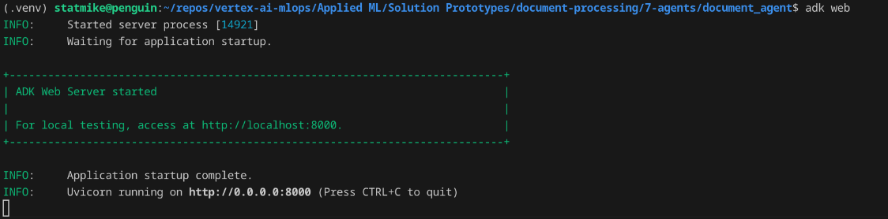
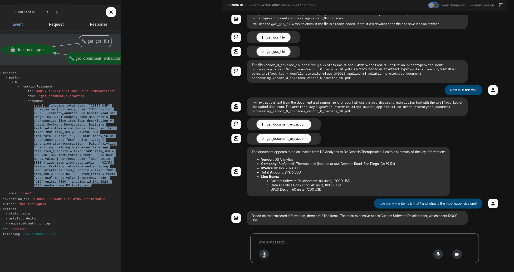
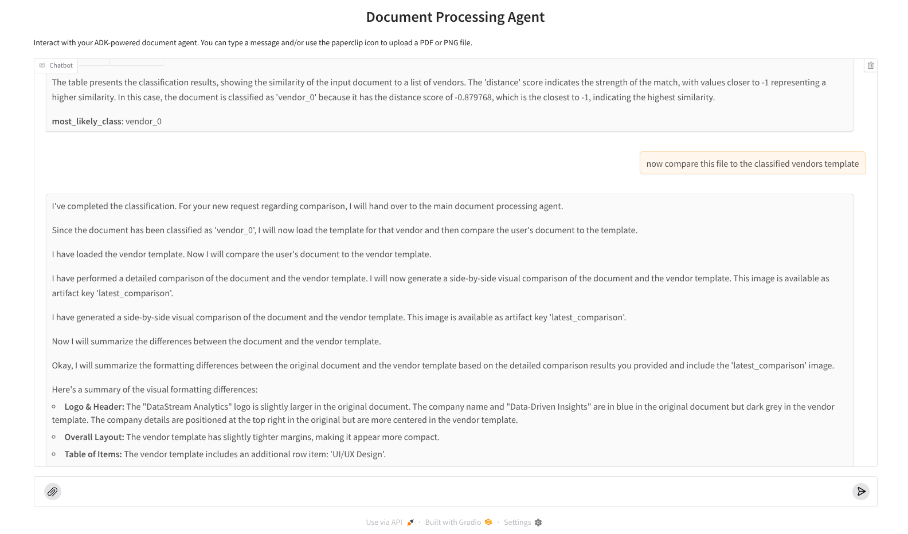
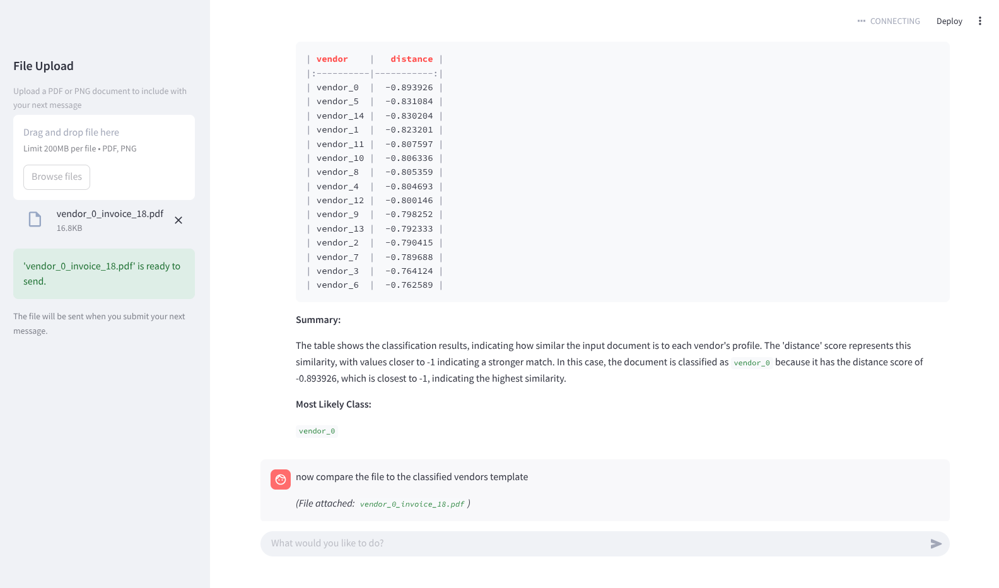
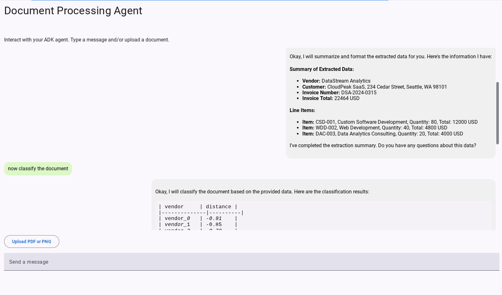

<!--- header table --->
<table>
<tr>     
  <td style="text-align: center">
    <a href="https://github.com/statmike/vertex-ai-mlops/blob/main/Applied%20ML/Solution%20Prototypes/document-processing/7-agents/readme.md">
      
      <br>View on<br>GitHub
    </a>
  </td>
</tr>
<tr>
  <td style="text-align: right">
    <b>Share On: </b> 
    <a href="https://www.linkedin.com/sharing/share-offsite/?url=https://github.com/statmike/vertex-ai-mlops/blob/main/Applied%2520ML/Solution%2520Prototypes/document-processing/7-agents/readme.md"></a> 
    <a href="https://reddit.com/submit?url=https://github.com/statmike/vertex-ai-mlops/blob/main/Applied%2520ML/Solution%2520Prototypes/document-processing/7-agents/readme.md"></a> 
    <a href="https://bsky.app/intent/compose?text=https://github.com/statmike/vertex-ai-mlops/blob/main/Applied%2520ML/Solution%2520Prototypes/document-processing/7-agents/readme.md"></a> 
    <a href="https://twitter.com/intent/tweet?url=https://github.com/statmike/vertex-ai-mlops/blob/main/Applied%2520ML/Solution%2520Prototypes/document-processing/7-agents/readme.md"></a> 
  </td>
</tr>
<tr>
  <td style="text-align: right">
    <b>Connect With Author On: </b> 
    <a href="https://www.linkedin.com/in/statmike"></a>
    <a href="https://www.github.com/statmike"></a> 
    <a href="https://www.youtube.com/@statmike-channel"></a>
    <a href="https://bsky.app/profile/statmike.bsky.social"></a> 
    <a href="https://x.com/statmike"></a>
  </td>
</tr>
</table><br/><br/>

---
# Agents

Build an agent workflow using the [Agent Development Kit (ADK)](https://google.github.io/adk-docs/) from Google.  This agent workflow will:
- load document for evaluation as an artifact for agents to use
- extract content from the document using the custom data extractor we created in [step 1](../1-custom-extractor.ipynb) and used in [step 2](../2-document-extraction.ipynb)
- compare the document to each vendors document to show similarity and verify classification like we showed in [step 4](../4-document-similarity.ipynb)
- assess the document for anomalies like we did in [step 5](../5-document-anomalies.ipynb)
- compare the document to a known good doucment from the same vedor to highlight in key difference in formatting like we did in [step 6](../6-document-comparison.ipynb)

## Environment Setup

This project uses a Python environment.  You can replicate the exact environment with `pyenv` and the `venv` library (included in Python >= 3.3):

> **Note:** This code does assume you have [git](https://github.com/git-guides/install-git) installed and relies on having installed the [Google Cloud CLI](https://cloud.google.com/sdk/docs/install) and [initialized](https://cloud.google.com/sdk/docs/initializing) it with `gcloud init`.

```
# 1. Clone the repository
git clone https://github.com/statmike/vertex-ai-mlops.git

# 2. Change into the cloned repository directory
cd 'vertex-ai-mlops/Applied ML/Solution Prototypes/document-processing/7-agents'

# 3. Set up the Python environment using pyenv
# (Install Python 3.13.3 if you don't have it)
pyenv install 3.13.3
# (Set Python 3.13.3 as the local version for this project)
pyenv local 3.13.3

# 4. Create a virtual environment
python -m venv .venv

# 5. Activate the virtual environment
source .venv/bin/activate

# 6. Install the required Python packages
pip install -r requirements.txt

# 7. Change to the specific agent subfolder
cd document_agent
```

## Run The Agents Locally With A Test UI

To test this agent you can use the `adk web` command from inside the `document_agent` folder.  

```
# 8. Run the ADK web interface
adk web
```

This will start the test user interface and you can `ctrl+click` on the `http://localhost:8000` address:

<div align="center">
  
</div>

The test UI will open in a local browser:

<div align="center">
  
</div>

Stop the service with `ctrl+c` in the terminal.

**Note:** For examples of custom  UI Applications running locally and interacting with the local ADK test environment see the UI examples below and start them in their default mode: `mode = local`.

## Deploy Agents: Locally for testing, Vertex AI Agent Engine for productions

Deployment code is included in the included notebook workflow [deploy-vertex-ai-agent-engine](./document_agent/deploy-vertex-ai-agent-engine.ipynb).  This workflow shows how to use the Vertex AI SDK to deploy the agent as a local application for testing and then to [Vertex AI Agent Engine](https://cloud.google.com/vertex-ai/generative-ai/docs/agent-engine/overview) for easy and scalable production hosting.

For examples of directly interacting with the deployed agent using both the SDK and REST check out this workflow: [use-vertex-ai-agent-engine](./document_agent/use-vertex-ai-agent-engine.ipynb).

The deployment created here is directly used in the following example UI Applications when the mode is set to `remote`. To use these UI examples locally make sure you are in the correct folder with the virtual environment activated:

```bash
cd 'vertex-ai-mlops/Applied ML/Solution Prototypes/document-processing/7-agents'
source .venv/bin/activate
cd document_agent/apps
```

---
### An Example User UI: Gradio

To start the [Gradio](https://www.gradio.app/) app execute:

For **local** ADK running with `adk web` or `adk api_server`:
```bash
#python gradio_app.py --mode local
# the default mode is local so the following works as well
python gradio_app.py 
```

For **remote** ADK deployed to Vertex AI Agent Engine:
```bash
python gradio_app.py --mode remote
```

Open the Gradio app at the address reported in the terminal with a `ctrl+click`. To stop the app use `ctrl+c` in the terminal.

<div align="center">
  
</div>

---
### An Example User UI: Streamlit

To start the [Streamlit](https://streamlit.io/) app execute:

For **local** ADK running with `adk web` or `adk api_server`:
```bash
#streamlit run streamlit_app.py -- --mode local
# the default mode is local so the following works as well
streamlit run streamlit_app.py
```

For **remote** ADK deployed to Vertex AI Agent Engine:
```bash
streamlit run streamlit_app.py -- --mode remote
```

Open the Streamlit app at the address reported in the terminal with a `ctrl+click` - it will most likely auto-open in the system browser. To stop the app use `ctrl+c` in the terminal.

<div align="center">
  
</div>

---
### An Example User UI: Mesop

To start the [Mesop](https://mesop-dev.github.io/mesop/) app execute:

For **local** ADK running with `adk web` or `adk api_server`:
```bash
#APP_MODE=local mesop mesop_app.py
# the default mode is local so the following works as well
mesop mesop_app.py 
```

For **remote** ADK deployed to Vertex AI Agent Engine:
```bash
APP_MODE=remote mesop mesop_app.py
```

Open the Mesop app at the address reported in the terminal with a `ctrl+click`. To stop the app use `ctrl+c` in the terminal.

<div align="center">
  
</div>

