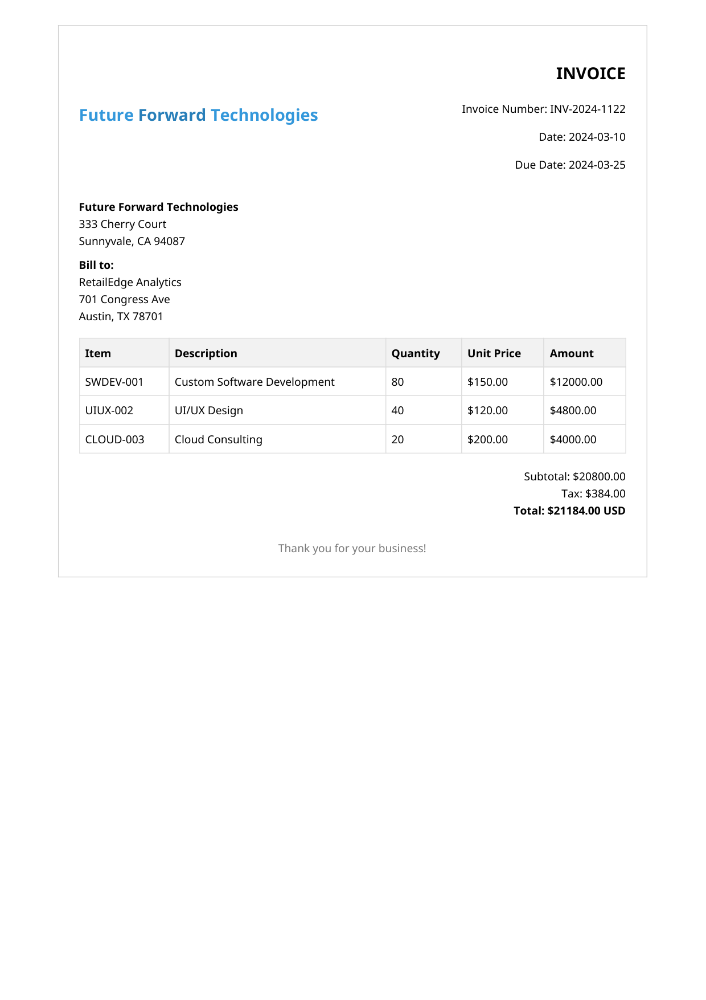
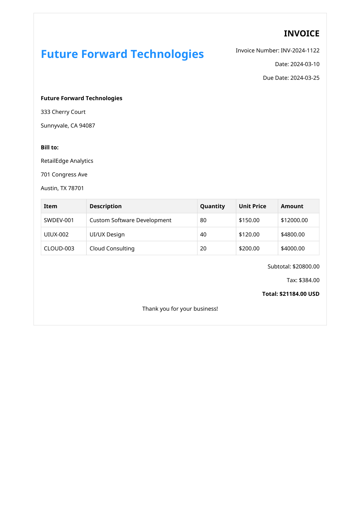
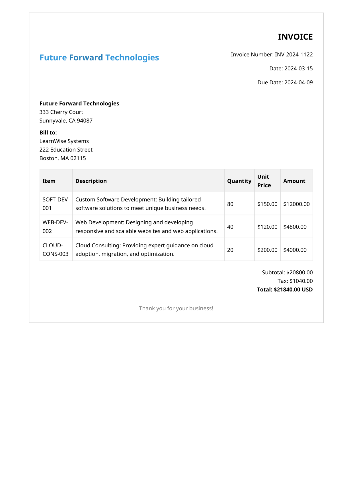
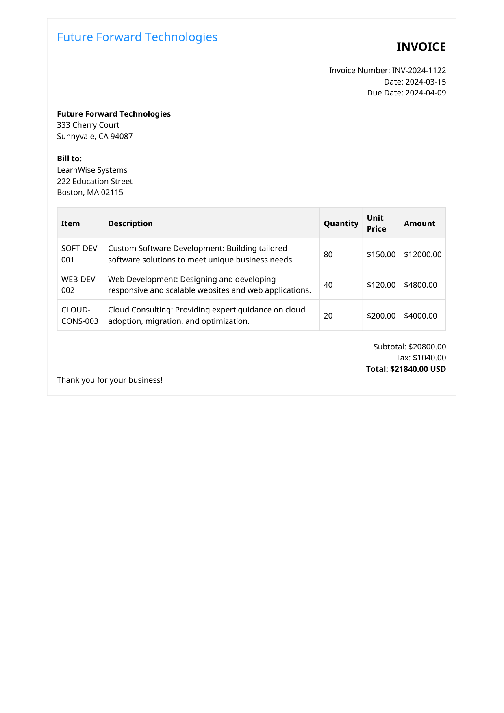
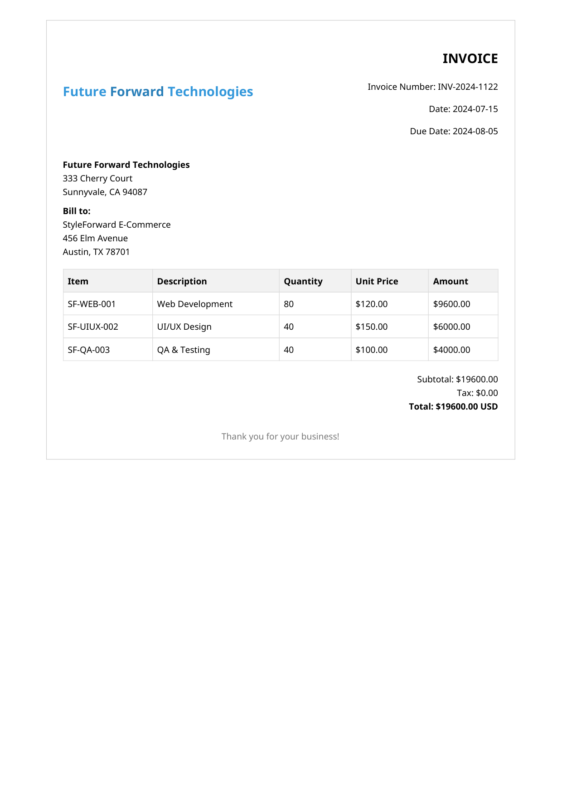
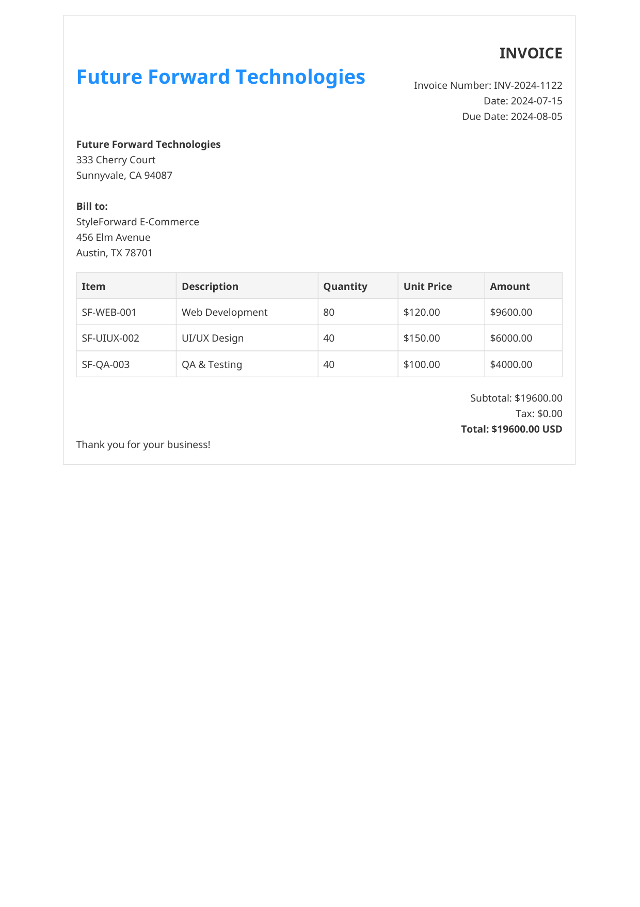
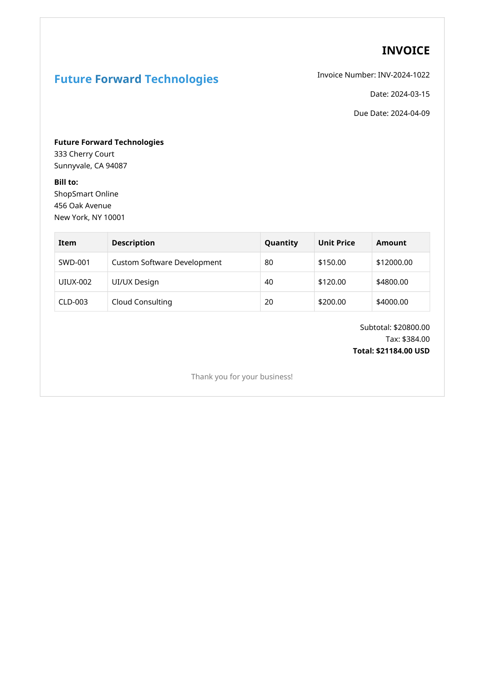
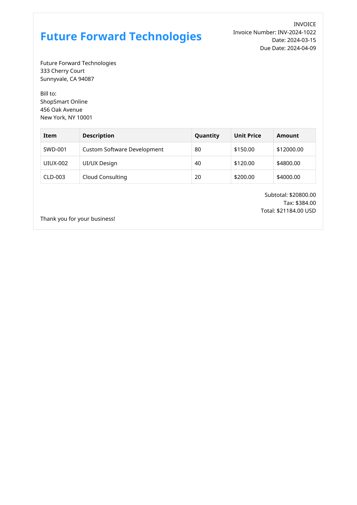
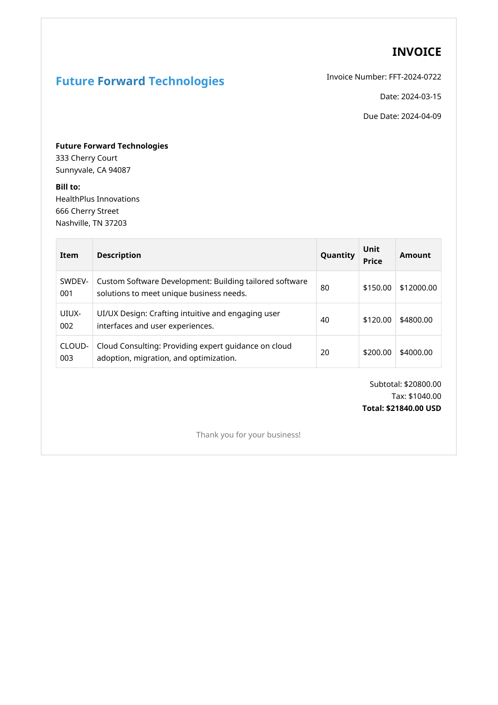
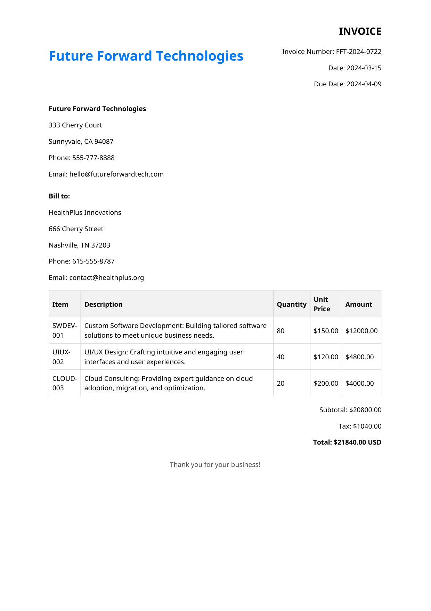

# Document Processing
> You are here `vertex-ai-mlops/Applied ML/Solution Prototypes/document-processing/readme.md`

A common scenario for companies is receiving documents, like invoices, with variable formats and needing to extract information into a structured form. Compounding this is the need to verify document authenticity and detect fraud, creating a full-scale document processing challenge.

This prototype focuses on a fast-to-create and easy-to-scale solution for both document extraction and verification, initially without any custom ML. This allows for rapid deployment and validation of the core workflow before investing in more complex, custom models. It establishes a robust foundation for expanding the approach to fraud detection with customized models and other ML-based approaches as needed.

To start, we will establish a core workflow for ingesting documents into Google Cloud services. This workflow will extract information and compare documents to previous ones, assessing the likelihood of anomalies that may indicate potential fraud.

<div align="center">
  
</div>

## Environment Setup

This project uses a Python environment.  You can replicate the exact environment with `pyenv` and the `venv` library (included in Python >= 3.3):

```
pyenv install 3.13.3
pyenv local 3.13.3
python -m venv .venv && source .venv/bin/activate
pip install -r requirements.txt
```

## Documents

This project requires a set of documents with known values. In this scenario, vendors send invoices to customers for services rendered. The dataset also includes anomalous documents with varying degrees of format changes, which could potentially indicate fraud. These documents were generated using the Gemini family of generative AI models hosted on Vertex AI. To understand how these documents were created, refer to the process outlined in [0-documents.ipynb](./0-documents.ipynb). The resulting files are located in the [./resources/documents](./resources/documents) directory. Each vendor has a dedicated folder containing the following subfolders:

-   `data`: Contains `invoices.jsonl`, which holds the actual invoice data.
-   `template`: Contains a template invoice for the vendor in `.png`, `.html`, and `.pdf` formats.
-   `invoices`: Contains generated invoices that closely follow the vendor's template in `.png` and `.pdf` formats.
-   `fake_invoices`: Contains generated invoices with slight to moderate changes from the vendor's template. These were created for the first five invoices found in the `invoices` folder.

To get started, select one of the vendors and review the first five real and fake invoices.

<table>
    <thead>
        <tr>
            <th style="text-align: center;">Compare</th>
            <th style="text-align: center;">Real Invoices</th>
            <th style="text-align: center;">Anomalous Invoices</th>
        </tr>
    </thead>
    <tbody>
        <tr>
            <td>Invoice 0</td>
            <td></td>
            <td></td>
        </tr>
        <tr>
            <td>Invoice 1</td>
            <td></td>
            <td></td>
        </tr>
        <tr>
            <td>Invoice 2</td>
            <td></td>
            <td></td>
        </tr>
        <tr>
            <td>Invoice 3</td>
            <td></td>
            <td></td>
        </tr>
        <tr>
            <td>Invoice 4</td>
            <td></td>
            <td></td>
        </tr>
    </tbody>
</table>


