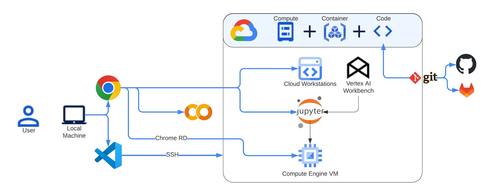

<!--- header table --->
<table>
<tr>     
  <td style="text-align: center">
    <a href="https://github.com/statmike/vertex-ai-mlops/blob/main/IDE/readme.md">
      
       View on GitHub
    </a>
  </td>
</tr>
<tr>
  <td style="text-align: right">
    <b>Share On: </b> 
     
     
     
     
  </td>
</tr>
<tr>
  <td style="text-align: right">
    <b>Connect With Author On: </b> 
    
     
    
     
    
  </td>
</tr>
</table>  

---
# /IDE/readme.md

How do you want to work? What is your development workflow? 

**IDE** The core point where "work" happens in is the box on the screen!

**Code** THe "work" is typing code, instructions, for softare - Python, Julia, R for instance.

**Container** But code needs software to interpret its instructions. Even the IDE may be software on a container.

**Compute** And containers need cpu, memory and maybe even GPU resources to run their software

What options for IDE are there and how do I get the IDE along with **Compute + Container + Code**

    

Options reviewed here will include:
- Google Colaboratory for Notebooks: [Colab](./colab.md)
    - Like Google Docs for a notebook (.ipynb) file.  It comes with free compute (even GPUs).
    - It times out after you quit using it or if you use it for too long (24 hours)
    - It can read and save to GitHub. It can even read and save to Google Drive.
    - Many IDE features on top of a notebook!
    - It comes with a container already loaded with common Python packages
    - Install more Python packages with pip
- Vertex AI WorkBench: [Vertex AI Workbench](./vertex_ai_workbench.md)
    - Select Compute - CPU and GPU (optional)
    - Select a pre-built container, or custom container
    - Starts a Compute Engine VM and setup up JupyterLab for single click access
    - Already authenticated to the current user - access other GCP resources you have permission to
    - Install more Python packages with pip
    - Git clone, commit, push, pull built in
- Cloud Workstations: [Cloud Workstations](./cloud_workstations.md)
    - Enterprise solution for any number of users
    - Setup configuration for common uses: compute size, automatic timeouts (or always warm)
    - Select an IDE from a list or preconfigured hosted IDEs - already configured containers - or custom!
    - Authenticate as a GCP user with permissions granted to that user to other resources
    - Install more Python packages with pip
    - Git integration direction in the IDE you choose!
- Compute Engine VM: [Custom Compute Engine VM](./custom_compute_engine_vm.md)
    - Fully custom setup!
    - Even install a windowing environment on Linux to host an IDE directly on it.
    - Connect via SSH, even through Chrome RD
- Local IDE, like VSCode: [VS Code Local Setup](./vs_code_local.md)
    - Run Python locally - data moves to local machine potentially
    - OR
    - SSH to remote machines: Vertex AI WorkBench, Cloud Worstation, Compute Engine VM