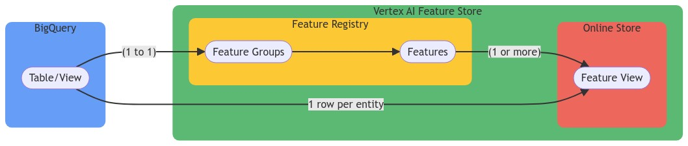
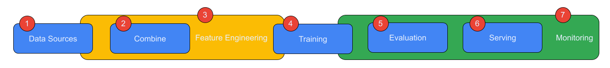

<!--- header table --->
<table align="left">     
  <td style="text-align: center">
    <a href="https://github.com/statmike/vertex-ai-mlops/blob/main/MLOps/Feature%20Store/readme.md">
      
       View on GitHub
    </a>
  </td>
</table>    

---
# Feature Management
> You are here: `vertex-ai-mlops/MLOps/Feature Store/readme.md`

A core part of MLOps, for going from model to MODELS, is feature management.  [Vertex AI Feature Store](https://cloud.google.com/vertex-ai/docs/featurestore/latest/overview) is an excellent way manage features and short-cut the process of deploying models into production systems.

>**Versions**
>
>Vertex AI Feature Store (pre-2023) is now named [Vertex Ai Feature Store (Legacy)](https://cloud.google.com/vertex-ai/docs/featurestore#vaifs_legacy).  The new feature store is [Vertex AI Feature Store](https://cloud.google.com/vertex-ai/docs/featurestore).  This readme will now focus on the latest feature store but for information regarding the legacy feature store see:
>- Notebook based workflow (in this repository): [Feature Store (Legacy)](./Feature%20Store%20%28Legacy%29.ipynb)
>- [Documentation](https://cloud.google.com/vertex-ai/docs/featurestore#vaifs_legacy)
>- [Comparison to Vertex AI Feature Store](https://cloud.google.com/vertex-ai/docs/featurestore#comparison_between_and)

## Vertex AI Feature Store

Get to know feature store with this workflow notebook:
- [Feature Store](./Feature%20Store.ipynb) workflow

Embeddings are condensed representation of data, usually in the form of an array (vector) of floats.  These are **features** and can be used directly in feature store. They can be retrieved as features for an entity like any other feature.  They can also be directly used in the online store for finding vector matches.  Search by entity and find neighbor entities or search by query embedding to find matching entities.  The indexing can be setup to be aNN or brute force and filter columns as well crowding can be configured.  Learn more and use this hand-on with:
- [Feature Store - Embeddings](./Feature%20Store%20-%20Embeddings.ipynb) workflow

Incorporating feature store in model serving helps prevent **training-serving skew**.  Check out the following workflow for a detail guide to implementing feature store in model serving locally or with a custom container than can be used locally, on Cloud Run, or with Vertex AI Endpoints:
- [CatBoost Prediction With Vertex AI Feature Store](../../Framework%20Workflows/CatBoost/CatBoost%20Prediction%20With%20Vertex%20AI%20Feature%20Store.ipynb)

[Documentation](https://cloud.google.com/vertex-ai/docs/featurestore/latest/overview)

---
**tl;dr**

    

The main layout for Feature Store is serving environment for **features** observed on **entities**:
- **entity** = a unique record, think row
- **feature** = observations, input for ML, think column

The **offline store** is made up of any BigQuery Table(s)/View(s), the **data source**, that you manage:
- (1) If a table/view has a single row per unique **entity** with columns that are non-changing values for **features** then the table can be directly used in an **online store's** **feature view** (see below).
- (2) For time bound **features** the table/view needs to have two additional columns: entity_id, feature_timestamp. Think of this as a history table.

The **feature registry**:
- Tables/Views of type (2) above are registered as **Feature Groups** - a feature group is sourced by a single table/view
- Columns from the **feature group** are then registered as **features**

The **online store** is has two types to choose from:
- Cloud Bigtable online serving - highly scalable
- Optimized online serving - ultra-low latencies and responsive to burst of requests

**Feature Views** are created in the **online store** from either:
- Features from one or more **feature groups**
- a table/view of type (1) above
 
BigQuery as a **data source**:
- This means that managing time bound **features** is done in BigQuery but before the **feature store**.  You can create multiple rows per **entity** in tables and use the entity_id and feature_timestamp columns to indicate the time based values. To make this shape of source data useful for training data batches (or evaluation, test, batch prediction) there are two new functions in BigQuery to help extract point-in-time value for **entity/feature** data:
    - [ML.FEATURES_AT_TIME](https://cloud.google.com/bigquery/docs/reference/standard-sql/bigqueryml-syntax-feature-time) - will take a table and timestamp as input and return the value for each feature on each entity as of the timestamp.  There are additional optional configurations also.  
    - [ML.ENTITY_FEATURES_AT_TIME](https://cloud.google.com/bigquery/docs/reference/standard-sql/bigqueryml-syntax-entity-feature-time) - will take a input table and an additional table of entity+timestamp pairs and return the feature values for each entity+timestamp pair.  This allows both multiple points in time for single entities as well as different times for different entities.
- Time bound data, or column values that change for a row/entity, might not be the native way data scientist are used to working with data.  There are great features in BigQuery to help with handling data that changes with time.
    - Creating these tables/views with timestamp entity records may be benefited by [time-travel](https://cloud.google.com/bigquery/docs/time-travel#time_travel) (up to 7 days - configurable) and [snapshots](https://cloud.google.com/bigquery/docs/table-snapshots-intro) (user controlled points in time). You can also [query time-travel](https://cloud.google.com/bigquery/docs/access-historical-data) as well as [create snapshots from time-travel](https://cloud.google.com/bigquery/docs/table-snapshots-create#create_a_table_snapshot_using_time_travel).

---

## Feature Focused Data Architecture

With the offline store being able to be in BigQuery and be a history table with time bound **features** it opens up many possibilities for efficient data architectures for feature management to enable ease of use across the the spectrum of MLOps - DataOps as part of MLOps:

    

    
1. Find data sources
    - discovery
    - understandinng
    - formats
    - frequency
    - preparation, ETL
2. Combine data sources
    - formats
    - frequency
    - preparation, ETL
3. Feature Enginneering
    - Converting raw data columns into useful signal for ML methods
4. Training ML Models
    - Splits for train/validate/test
    - Iterate Features and Feature Engineering
5. Evaluate Models
    - Continously
6. Serve Models
    - Format features for predition
    - Serve features for prediction
7. Monitor Models
    - Skew: Change from training
    - Drift: Change over time
    - Continously
    - Monitor Features for change

When the goal is training a model (4), it might seem easy to ad-hoc work through 1-3. _Let's be honest - it's what we do most of the time._ But then, when a model version proves useful, many compromises are needed to get 5-7 to ~~work~~ - it rarely works correctly.

**What if**
- you could make careful decision during 1-3 that could essentially automate 5-7 seemlessly?
- it was not hard or time consuming?
- it makes it easier to train and iterate?
- it made everything easier?
    
For a demonstration of a potential architecture that makes all this possible check out this notebook based workflow:
- [Feature Focused Data Architecture](./Feature%20Focused%20Data%20Architecture.ipynb)