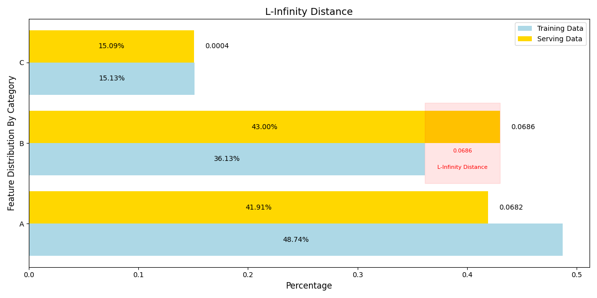
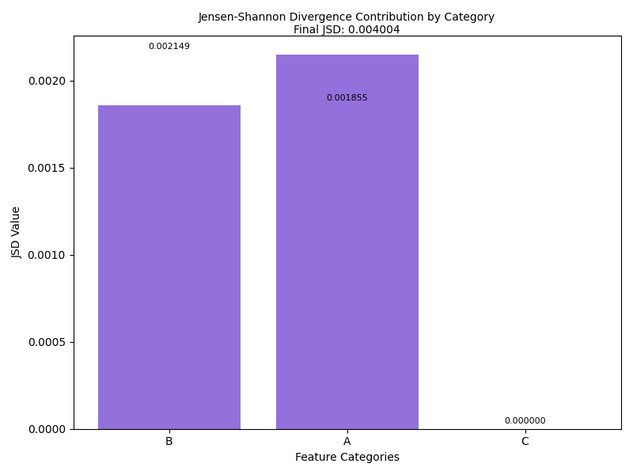

<!--- header table --->
<table>
<tr>     
  <td style="text-align: center">
    <a href="https://github.com/statmike/vertex-ai-mlops/blob/main/MLOps/Model%20Monitoring/readme.md">
      
      <br>View on<br>GitHub
    </a>
  </td>
</tr>
<tr>
  <td style="text-align: right">
    <b>Share On: </b> 
    <a href="https://www.linkedin.com/sharing/share-offsite/?url=https%3A//github.com/statmike/vertex-ai-mlops/blob/main/MLOps/Model%20Monitoring/readme.md"></a> 
    <a href="https://reddit.com/submit?url=https%3A//github.com/statmike/vertex-ai-mlops/blob/main/MLOps/Model%20Monitoring/readme.md"></a> 
    <a href="https://bsky.app/intent/compose?text=https%3A//github.com/statmike/vertex-ai-mlops/blob/main/MLOps/Model%20Monitoring/readme.md"></a> 
    <a href="https://twitter.com/intent/tweet?url=https%3A//github.com/statmike/vertex-ai-mlops/blob/main/MLOps/Model%20Monitoring/readme.md"></a> 
  </td>
</tr>
<tr>
  <td style="text-align: right">
    <b>Connect With Author On: </b> 
    <a href="https://www.linkedin.com/in/statmike"></a>
    <a href="https://www.github.com/statmike"></a> 
    <a href="https://www.youtube.com/@statmike-channel"></a>
    <a href="https://bsky.app/profile/statmike.bsky.social"></a> 
    <a href="https://x.com/statmike"></a>
  </td>
</tr>
</table><br/><br/>

---
# Model Monitoring
> You are here: `vertex-ai-mlops/MLOps/Model Monitoring/readme.md`

Understanding the ongoing performance of a model in production is important to maintain accuracy.  While evaluations can be run on new data, they rely on also knowing the ground truth of the new records which is often delayed.  To monitor models for potential impacts to peformance it is better to monitoring what the model learned from - features.  The distribution of feature can be compared between training and current for **skew** and between rolling time points for **drift**.  

Model monitoring tasks can be easily accessed in both BigQuery ML and Vertex AI:
- [BigQuery Model Monitoring](https://cloud.google.com/bigquery/docs/model-monitoring-overview)
    - Easily conduct monitoring task on any model with logged predictions in BigQuery, including Vertex AI Endpoints or even offline models with logs saved to BigQuery.
- [Introduction To Vertex AI Model Monitoring](https://cloud.google.com/vertex-ai/docs/model-monitoring/overview)
    - Monitoring for any Vertex AI model with visuals integrated directly in the console.

---
## BigQuery ML Model Monitoring

BigQuery ML model monitoring provides a powerful and efficient way to ensure the ongoing performance and accuracy of your machine learning models. By leveraging the techniques and tools covered in this notebook, you can gain valuable insights into your data, detect potential issues early on, and take corrective actions to maintain the effectiveness of your models over time.

**Workflows:**
These resources help get started with BQML based model monitoring:
- Blog Post: [Introducing new ML model monitoring capabilities in BigQuery](https://cloud.google.com/blog/products/data-analytics/monitor-ml-model-skew-and-drift-in-bigquery)
    - Introduction Notebook Workflow: [BQML Model Monitoring Introduction](./bqml-model-monitoring-introduction.ipynb)
    - Tutorial Notebook Workflow: [BQML Model Monitoring Tutorial](bqml-model-monitoring-tutorial.ipynb)
        - Includes:
            - Vertex AI Endpoint Monitoring Directly in BigQuery
            - Visualization for monitoring jobs and alerts
            - Automation with scheduled BigQuery Jobs
            - Email notifications for alerts

**Planning:**
- Automate Monitoring With:
    - Dataform
    - Workflows
    - Cloud Composer
    - Vertex AI Pipelines with KFP

---
## BigQuery ML Model Monitoring - In Vertex AI

BigQuery ML models that are created with BigQuery [can be registered to the Vertex AI Model Registry](https://cloud.google.com/bigquery/docs/managing-models-vertex) by adding parameters to the `CREATE MODEL` statement.  This is the basis for also beign able to visualize and collect results of `ML.VALIDATE_DATA_SKEW` and `ML.VALIDATE_DATA_DRIFT` directly in Vertex AI Model Monitoring! More on this coming soon!

**Planning:**
- Show integration with Vertex AI via the Model Registry

---
## Vertex AI Model Monitoring

Vertex AI has a [model registry](https://cloud.google.com/vertex-ai/docs/model-registry/introduction) the organize models.  Each model has versions and each version holds the links to the model files, evaluation information, list of batch prediction jobs, and deployed instances on Vertex AI Endpoints.  

Vertex AI Model Monitoring has two version currently.  [Version 1](https://cloud.google.com/vertex-ai/docs/model-monitoring/overview#v1) was/is specific to a deployed instance on Vertex AI Endpoints.  The newer [version 2](https://cloud.google.com/vertex-ai/docs/model-monitoring/overview#v2) is connected to a model version in the model registry - a prefered and more general approach to monitoring models.  Only version 2 is covered here and you can read more about both versions [in the documentation](https://cloud.google.com/vertex-ai/docs/model-monitoring/overview#versions).

Monitoring means comparing distribution between training and serving.  This include both numerical (float, int) and categorical (bool, string, category) data that is a feature, and output (prediction), or feature attribution (SHAP value).  Comparison is done using metrics:
- Categorical features and predictions:
    - L-Infinity
    - Jansen Shannon Divergence
- Numerical features and predictions:
    - Jensen Shannon Divergence
- Feature attributions:
    - SHAP Value

With Vertex AI Model Monitoring V2 the monitoring can use data from:
- BigQuery
    - Including time windows for tables that have a timestamp column in the table
- Cloud Storage for CSV and JSONL formats
- Vertex AI Batch Predictions Jobs
- Vertex AI Endpoint Logging
- Vertex AI Managed Dataset such as the input for AutoML

The Vertex AI Model Monitoring V2 is also continuous in that jobs can be scheduled on a routine.

**Planning:**
- Setup monitoring for model version, show monitoring across data sources
- Pipeline triggered by monitoring alerts: retrain, compare, condintionally replace

---
## Understanding Monitoring Metrics

Let's understand the calculation of these two metrics:
- [L-infinity distance](https://en.wikipedia.org/wiki/Chebyshev_distance) for categorical features
- [Jensen-Shannon divergence](https://en.wikipedia.org/wiki/Jensen%E2%80%93Shannon_divergence) for numeric features.  Can also be use for categorical features.

Start with a categorical feature with three levels: A, B, C.  This table show some statistics for the levels in the trianing data and some recent serving data:

|    |   train_n |   serve_n |   train_pct |   serve_pct |
|:---|----------:|----------:|------------:|------------:|
| A  |       116 |       775 |    0.487395 |    0.419145 |
| B  |        86 |       795 |    0.361345 |    0.429962 |
| C  |        36 |       279 |    0.151261 |    0.150892 |


Calculating the L-Infinity Distance starts with the absolute percentage difference in each category.  Add that to the table:

|    |   train_n |   serve_n |   train_pct |   serve_pct |   abs_change_pct |
|:---|----------:|----------:|------------:|------------:|-----------------:|
| A  |       116 |       775 |    0.487395 |    0.419145 |       0.0682495  |
| B  |        86 |       795 |    0.361345 |    0.429962 |       0.0686176  |
| C  |        36 |       279 |    0.151261 |    0.150892 |       0.00036813 |

The final value of the L-Infinity Distance is the maximum of these absolute percentage differences:

<p align="center"><center>
    
</center><p>

The Jansen-Shannon Divergence (JSD) is bit more involved to calculate so let do it step-by-step. For each category we want to calculate the Jansen-Shannon Divergence and the final value will be the sum across categories.  

For each category:
- Step 1: Calculate the average percentage and call it `mix`

```python
stats['mix'] = (stats['train_pct'] + stats['serve_pct']) / 2
```

- Step 2: Calculate the Kullback-Leibler (KL) Divergence of the train and serve percentages from the `mix`

```python
stats['train_kl'] = stats['train_pct'] * np.log2(stats['train_pct'] / stats['mix'])
stats['serve_kl'] = stats['serve_pct'] * np.log2(stats['serve_pct'] / stats['mix'])
```

- Step 3: Calculate the `JSD` as the average of the `kl` values for train and serve

```python
stats['JSD'] = (stats['train_kl'] + stats['serve_kl']) / 2
```

|    |   train_n |   serve_n |   train_pct |   serve_pct |   abs_change_pct |      mix |     train_kl |     serve_kl |         JSD |
|:---|----------:|----------:|------------:|------------:|-----------------:|---------:|-------------:|-------------:|------------:|
| A  |       116 |       775 |    0.487395 |    0.419145 |       0.0682495  | 0.45327  |  0.05104     | -0.04733     | 0.00185497  |
| B  |        86 |       795 |    0.361345 |    0.429962 |       0.0686176  | 0.395653 | -0.0472862   |  0.0515837   | 0.00214875  |
| C  |        36 |       279 |    0.151261 |    0.150892 |       0.00036813 | 0.151076 |  0.000265711 | -0.000265388 | 1.61767e-07 |

Finally, sum the `JSD` values across all categories for the overall value of the Jansen-Shannon Divergence

<p align="center"><center>
    
</center><p>

---
