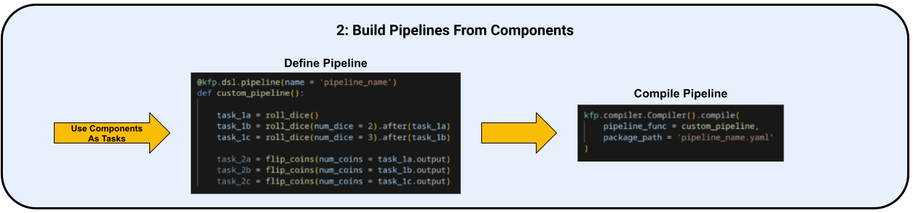
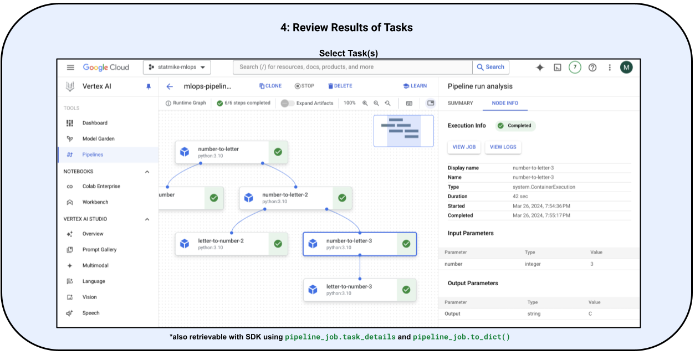
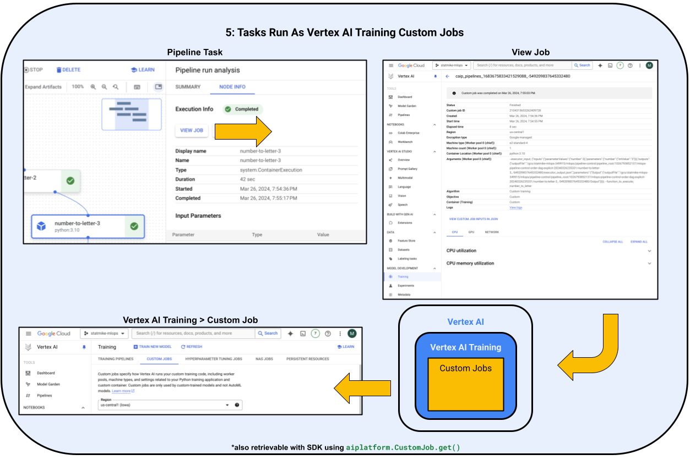
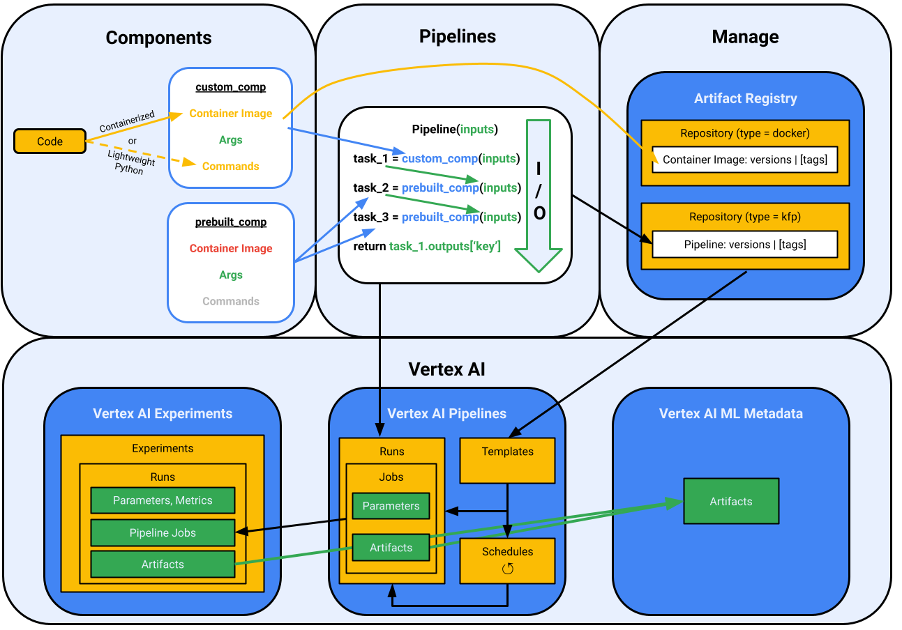

<!--- header table --->
<table align="left">     
  <td style="text-align: center">
    <a href="https://github.com/statmike/vertex-ai-mlops/blob/main/MLOps/Pipelines/readme.md">
      
      <br>View on<br>GitHub
    </a>
  </td>
</table><br/><br/><br/><br/>

---
# Orchestration With Pipelines
> You are here: `vertex-ai-mlops/MLOps/Pipelines/readme.md`

The workflow of ML code does many steps in sequence.  Some of the steps involve conditional logic like deploying the new model only when it is more accurate than the currently deployed model.  This is a pipeline.  Pipelines are essential for turning ML processes into MLOps.  MLOps goes the next mile with automation, monitoring, and governing the workflow.

There are frameworks for specifying these steps like [Kubeflow Pipelines (KFP)](https://www.kubeflow.org/docs/components/pipelines/v2/introduction/) and [TensorFlow Extended (TFX)](https://www.tensorflow.org/tfx/guide/understanding_tfx_pipelines).  [Vertex AI Pipelines](https://cloud.google.com/vertex-ai/docs/pipelines/introduction) is a managed service that can execute both of these.
- The [history of Kubeflow](https://www.kubeflow.org/docs/started/introduction/#history) is creating a simplified way for running TensorFlow Extended jobs on Kubernetes.

**TL;DR**

This is a series of notebook based workflows that teach all the ways to use pipelines within Vertex AI. The suggested order and description/reason is:

|Link To Section|Notebook Workflow|Description|
|---|---|---|
|[Link To Section](#workflow-0)|[Vertex AI Pipelines - Start Here](./Vertex%20AI%20Pipelines%20-%20Start%20Here.ipynb)|What are pipelines? Start here to go from code to pipeline and see it in action.|
|[Link To Section](#workflow-1)|[Vertex AI Pipelines - Introduction](./Vertex%20AI%20Pipelines%20-%20Introduction.ipynb)|Introduction to pipelines with the console and Vertex AI SDK|
|[Link To Section](#workflow-2)|[Vertex AI Pipelines - Components](./Vertex%20AI%20Pipelines%20-%20Components.ipynb)|An introduction to all the ways to create pipeline components from your code|
|[Link To Section](#workflow-3)|[Vertex AI Pipelines - IO](./Vertex%20AI%20Pipelines%20-%20IO.ipynb)|An overview of all the type of inputs and outputs for pipeline components|
|[Link To Section](#workflow-4)|[Vertex AI Pipelines - Control](./Vertex%20AI%20Pipelines%20-%20Control.ipynb)|An overview of controlling the flow of exectution for pipelines|
|[Link To Section](#workflow-5)|[Vertex AI Pipelines - Secret Manager](./Vertex%20AI%20Pipelines%20-%20Secret%20Manager.ipynb)|How to pass sensitive information to pipelines and components|
|[Link To Section](#workflow-6)|[Vertex AI Pipelines - Scheduling](./Vertex%20AI%20Pipelines%20-%20Scheduling.ipynb)|How to schedule pipeline execution|
|[Link To Section](#workflow-9)|[Vertex AI Pipelines - Notifications](./Vertex%20AI%20Pipelines%20-%20Notifications.ipynb)|How to send email notification of pipeline status.|
|[Link To Section](#workflow-7)|[Vertex AI Pipelines - Management](./Vertex%20AI%20Pipelines%20-%20Management.ipynb)|Managing, Reusing, and Storing pipelines and components|
|[Link To Section](#workflow-8)|[Vertex AI Pipelines - Testing](./Vertex%20AI%20Pipelines%20-%20Testing.ipynb)|Strategies for testing components and pipeliens locally and remotely to aide development.|


To discover these notebooks as part of an introduction to MLOps read on below!

---
## Table of Contents

- [Pipelines](#orchestration-with-pipelines)
    - [Start Here](#start-here)
    - [Introduction](#introduction)
    - [Components](#components)
    - [Component IO](#component-io)
    - [Control Flow For Pipelines](#control-flow-for-pipelines)
    - [Scheduling Pipelines](#scheduling-pipelines)
    - [Notifications From Pipelines](#notifications-from-pipelines)
    - [Managing Pipelines: Storing And Reusing Pipelines & Components](#managing-pipelines-storing-and-reusing-pipelines--components)
    - [Testing Components And Pipelines: Strategies for Local and Remote Development](#testing-components-and-pipelines-strategies-for-local-and-remote-development)
- [Putting It All Together](#putting-it-all-together)

---
<a id='workflow-0'></a>
## Start Here

What are pipelines?
- They help you automate, manage, and scale your ML workflows
- They offer reproducibility, collaboration, and efficiency

Before getting into the details let's go from code to pipeline and see this in action!

<div><table style='text-align:left;vertical-align:middle;background-color: #4285F4' width="100%" cellpadding="1" cellspacing="0"><tr><td markdown="block">

**Notebook Workflow:**

In this quick start, we'll take a simple code example and run it both in a notebook and as a pipeline on Vertex AI Pipelines. This will likely spark many questions, and that's great! The rest of this series will dive deeper into each aspect of pipelines, providing comprehensive answers by example. 
- [Vertex AI Pipelines - Start Here](./Vertex%20AI%20Pipelines%20-%20Start%20Here.ipynb)
    - Code, Python, pulling data and training a model
    - Same code running in a pipeline on Vertex AI Pipelines
    - Same code modified to be for MLOps on Vertex AI Pipelines

</td></tr></table></div>


---
<a id='workflow-1'></a>
## Introduction

Pipelines are constructed of:
1. Create **Components** From Code
2. Construct **Pipelines** Where steps, or **Tasks**, are made from components
3. **Run** Pipelines on Vertex AI Pipelines
4. Review pipelines runs and **tasks results**
5. Review task **Execution**: Each task runs as a Vertex AI Training Custom Job

An overview:

<p align="center"><center>
    
</center></p>
<p align="center"><center>
    
</center></p>
<p align="center"><center>
    
</center></p>
<p align="center"><center>
    
</center></p>
<p align="center"><center>
    
</center></p>

<div><table style='text-align:left;vertical-align:middle;background-color: #4285F4' width="100%" cellpadding="1" cellspacing="0"><tr><td markdown="block">

**Notebook Workflow:**

Get a quick start with pipelines by reviewing this workflow for an example using both the Vertex AI Console and SDK.
- [Vertex AI Pipelines - Introduction](./Vertex%20AI%20Pipelines%20-%20Introduction.ipynb)
    - **Build** a simple pipeline with IO parameters and artifacts as well as conditional execution
    - **Review** all parts (runs, tasks, parameters, artifacts, metadata) with the Vertex AI Console
    - **Retrieve** all parts (runs, tasks, parameters, artifacts, metadata) with the Vertex AI SDK

</td></tr></table></div>

---
<a id='workflow-2'></a>
## Components

The steps of the workflow, an ML task, are run with components. Getting logic and code into components can consists of using prebuilt components or constructing custom components:
- KFP
    - Pre-Built:
        - [Google Cloud Pipeline Components](https://cloud.google.com/vertex-ai/docs/pipelines/gcpc-list)
            - [GitHub](https://github.com/kubeflow/pipelines/blob/master/components/google-cloud/README.md)
    - Custom:
        - [Lightweight Python Components](https://www.kubeflow.org/docs/components/pipelines/v2/components/lightweight-python-components/) - create a component from a Python function
        - [Containerized Python Components](https://www.kubeflow.org/docs/components/pipelines/v2/components/containerized-python-components/) - for complex dependencies
        - [Container Component](https://www.kubeflow.org/docs/components/pipelines/v2/components/container-components/) - a component from a container
- TFX
    - Pre-Built:
        - [TFX Standard Components](https://www.tensorflow.org/tfx/guide#tfx_standard_components)
        - [Community-developed components](https://www.tensorflow.org/tfx/addons)
    - Custom:
        - [Python function-based components](https://www.tensorflow.org/tfx/guide/custom_function_component) - create a component from a Python function
        - [Container-based components](https://www.tensorflow.org/tfx/guide/container_component) - a component from a contaienr
        - [Fully custom components](https://www.tensorflow.org/tfx/guide/custom_component) - reuse and extend standard components.

<div><table style='text-align:left;vertical-align:middle;background-color: #4285F4' width="100%" cellpadding="1" cellspacing="0"><tr><td markdown="block">

**Notebook Workflow:**

For an overview of components from custom to pre-built, check out this notebook:
- [Vertex AI Pipelines - Components](./Vertex%20AI%20Pipelines%20-%20Components.ipynb)
    - **Pre-Built Components:** Easy access to many GCP services
    - **Lightweight Python Components:** Build a component from a Python function
    - **Containerized Python Components:** Build an entire Python enviornment as a component
    - **Container Components:** Any container as a component
    - **Importer Components:** Quickly import artifacts

</td></tr></table></div>

**Compute Resources** For Components:

Running pipleines on Vertex AI Pipelines runs each component as a Vertex AI Training `CustomJob`.  This defaults to a vm based on `e2-standard-4` (4 core CPU, 16GB memory).  This can be modified at the task level of pipelines to choose different computing resources, including GPUs.  For example:

```Python
@kfp.dsl.pipeline()
def pipeline():
    task = component().set_cpu_limit(C).set_memory_limit(M).add_node_selector_constraint(A).set_accelerator_limit(G).
```
Where the inputs are defining [machine configuration for the step](https://cloud.google.com/vertex-ai/docs/pipelines/machine-types):
- C = a string representing the number of CPUs (up to 96).
- M = a string represent the memory limit.  An integer follwed by K, M, or G (up to 624GB).
- A = a string representing the desired GPU  or TPU type
- G = an integer representing the multiple of A desired.

---
<a id='workflow-3'></a>
## Component IO

Getting information into code and results out is the IO part of components.  These inputs and outputs are particularly important in MLOps as they are the artifacts that define an ML system: datasets, models, metrics, and more.  Pipelines tools like TFX and KFP go a step further and automatically track the inputs and outpus and even provide lineage information for them.  Component inputs and outputs can take two forms: parameters and artifacts.  

**Parameters** are Python objects like `str`, `int`, `float`, `bool`, `list`, `dict` objects that are defined as inputs to pipelines and components. Components can also return parameters for input into subsequent components. Paramters are excellent for changing the behavior of a pipeline/component through inputs rather than rewriting code.
- [KFP Parameters](https://www.kubeflow.org/docs/components/pipelines/v2/data-types/parameters/)
- [TFX Parameters](https://www.tensorflow.org/tfx/guide/understanding_tfx_pipelines#parameter)

**Artifacts** are multi-parameter objects that represent machine learning artifacts and have defined schemas and are stored as metadata with lineage.  The artifact schemas follow the [ML Metadata (MLMD)](https://github.com/google/ml-metadata) client library.  This helps with understanding and analyzing a pipeline.
- [KFP Artifacts](https://www.kubeflow.org/docs/components/pipelines/v2/data-types/artifacts/)
    - provided [artifact types](https://www.kubeflow.org/docs/components/pipelines/v2/data-types/artifacts/#artifact-types)
    - [Google Cloud Artifact Types](https://google-cloud-pipeline-components.readthedocs.io/en/google-cloud-pipeline-components-2.0.0/api/artifact_types.html)
- [TFX Artifacts](https://www.tensorflow.org/tfx/guide/understanding_tfx_pipelines#artifact)

<div><table style='text-align:left;vertical-align:middle;background-color: #4285F4' width="100%" cellpadding="1" cellspacing="0"><tr><td markdown="block">

**Notebook Workflow:**

See all the types of parameters and artifacts in action with the following notebook based workflow:
- [Vertex AI Pipelines - IO](./Vertex%20AI%20Pipelines%20-%20IO.ipynb)
    - **parameters:** input, multi-input, output, multi-output
    - **artifacts:** input, output, Vertex AI ML Metadata Lineage

</td></tr></table></div>


<a id='workflow-5'></a>
**Secure Parameters:** Passing credentials for an API or service can expose them.  If these credentials are hardcoded then they can be discovered from the source code and are harder to update.  A great solution is using [Secret Manager](https://cloud.google.com/secret-manager/docs/create-secret-quickstart#secretmanager-quickstart-console) to host credentials and then pass the name of the credential as a parameter.  The only modification needed to a component is to use a Python client to retrieve the credentials at run time.  

<div><table style='text-align:left;vertical-align:middle;background-color: #4285F4' width="100%" cellpadding="1" cellspacing="0"><tr><td markdown="block">

**Notebook Workflow:**

Check out how easy secret manager isis to implement with the following notebook based example workflow:
- [Vertex AI Pipelines - Secret Manager](./Vertex%20AI%20Pipelines%20-%20Secret%20Manager.ipynb)
    - **Setup** Secret Manager and use the console and Python Client to store secrets
    - **Retrieve** secrets using the Python Client
    - **example** pipeline that retrieves credentials from Secret Manager

</td></tr></table></div>

---
<a id='workflow-4'></a>
## Control Flow For Pipelines

As the task of an ML pipeline run they form a graph.  The outputs of upstream components become the inputs of downstram components.  Both TFX and KFP automatically use these connection to create a DAG of execution.  When logic needs to be specified in the pipeline flow of execution the use of control structures is necessary.  

<div><table style='text-align:left;vertical-align:middle;background-color: #4285F4' width="100%" cellpadding="1" cellspacing="0"><tr><td markdown="block">

**Notebook Workflow:**

The following notebook shows many examples of implement controls in KFP while running on Vertex AI Pipelines:
- [Vertex AI Pipelines - Control](./Vertex%20AI%20Pipelines%20-%20Control.ipynb)
    - **Ordering**: DAG and Explicit ordering
    - **Conditional Execution**: if, elif (else if), and else
        - **Collecting**: Conditional results
    - **Looping**: And Parallelism
        - **Collecting**: Looped Results
    - **Exit Handling:** with and without task failures
    - **Error Handling** continue execution even after task failures

</td></tr></table></div>

---
<a id='workflow-6'></a>
## Scheduling Pipelines

Pipelines can be run on a schedule directly in Vertex AI without the need to setup a scheduler and trigger (like PubSub).  

<div><table style='text-align:left;vertical-align:middle;background-color: #4285F4' width="100%" cellpadding="1" cellspacing="0"><tr><td markdown="block">

**Notebook Workflow:**

Here is an example of a pipeline run followed by a schedule that repeats the pipeline at a specified interval the number of iterations set as the maximum on the schedule:

- [Vertex AI Pipelines - Scheduling](./Vertex%20AI%20Pipelines%20-%20Scheduling.ipynb)
    - **Create**
    - **Retrieve**
    - **Manage**

</td></tr></table></div>

This can have many helpful applications, including:
- Running Batch predictions, evaluations, monitoring each day or week
- Retraining a model, do evaluations, and comparing the new model to the currently deployed model then conditionally updating the deployed model
- Check for new training records and commence with retraining if conditions are met - like records that increase a class by 10%, atleast 1000 new records, ....

---
<a id='workflow-9'></a>
## Notifications From Pipelines

As the number of pipelines grow and the use of schedulinng and triggering is implemented it becomes necessary to know which pipelines need to be reviewed.  Getting notificaitons about the completion of pipeliens is a good first step.  Then, being able to control notificaitons to only be sent on failure or particular failures becomes important.

<div><table style='text-align:left;vertical-align:middle;background-color: #4285F4' width="100%" cellpadding="1" cellspacing="0"><tr><td markdown="block">

**Notebook Workflow:**

This notebook workflow covers pre-built components for email notification and building a custom notification system for send emails (or tasks) conditional on the pipelines status.

- [Vertex AI Pipelines - Notifications](./Vertex%20AI%20Pipelines%20-%20Notifications.ipynb)
    - Pre-Built Component to send emails on pipelines completion
    - Overview of retrieving pipeline runs final status information
    - Building a custom component to send emails conditional on the pipelines final status.

</td></tr></table></div>

---
<a id='workflow-7'></a>
## Managing Pipelines: Storing And Reusing Pipelines & Components

As seen above, pipelines are made up of steps which are executions of components.  These components are made up of code, container, and instructions (inputs and outputs).  

**Components:**

For each type of component, `kfp` compiles the component into YAML as part of the pipeline.  You can also directly compile individual components.  This makes the YAML for a component a source that can be managed.  And using this in additional pipelines is made possible with `kfp.components.load_component_from_*()` which has version for files, urls, text (strings).

**Pipelines:**

Pipelines are compiled into YAML files that include component specifications.  Managine these pipelines files as artifacts is made easy with the combination of:
- Kubeflow Pipelines SDK and the included [`kfp.registry.RegistryClient`](https://kubeflow-pipelines.readthedocs.io/en/latest/source/registry.html)
- Google Cloud [Artifact Registry](https://cloud.google.com/artifact-registry/docs/overview) with native format for [Kubeflow pipeline templates](https://cloud.google.com/artifact-registry/docs/kfp)
- [Integration with Vertex AI](https://cloud.google.com/vertex-ai/docs/pipelines/create-pipeline-template#kubeflow-pipelines-sdk-client) for creating, uploading and using pipeline templates

<div><table style='text-align:left;vertical-align:middle;background-color: #4285F4' width="100%" cellpadding="1" cellspacing="0"><tr><td markdown="block">

**Notebook Workflow:**

Work directly with these concepts in the following notebook based workflow:
- [Vertex AI Pipelines - Management](./Vertex%20AI%20Pipelines%20-%20Management.ipynb)

</td></tr></table></div>

---
<a id='workflow-8'></a>
## Testing Components And Pipelines: Strategies for Local and Remote Development

When creating pipeline components and pipelines the process of testing can be aided by local testing and several strategies for remote (On Vertex AI Pipelines) testing.  This section covers local and remote stratedgies to aide development processes.

<div><table style='text-align:left;vertical-align:middle;background-color: #4285F4' width="100%" cellpadding="1" cellspacing="0"><tr><td markdown="block">

**Notebook Workflow:**

Work directly with these concepts in the following notebook based workflow:
- [Vertex AI Pipelines - Testing](./Vertex%20AI%20Pipelines%20-%20Testing.ipynb)

</td></tr></table></div>

---
# Pipeline Patterns - Putting Concepts Together Into Common Workflows

A series of notebook based workflows that show how to put all the concepts from the material above into common workflows:

- [Vertex AI Pipelines - Pattern - Modular and Reusable](./Vertex%20AI%20Pipelines%20-%20Pattern%20-%20Modular%20and%20Reusable.ipynb)
    - Example 1: Store a pipeline in artifact registry and directly run it on Vertex AI Pipelines without a local download.
    - Example 2: Store and retrieve components for reusability: as files (at url, file directory, or text string) and as artifact in artifact registry
    - Example 3: Store pipelines in artifact registry and retrieve (download, and import) to use as components in new pipelines

---
# Putting It All Together

<p align="center"><center>
    
</center></p>


