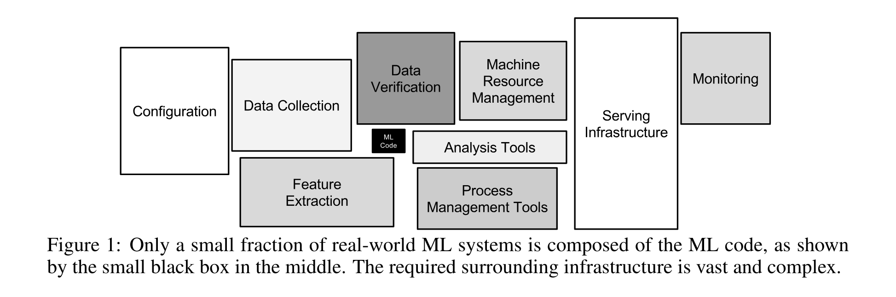
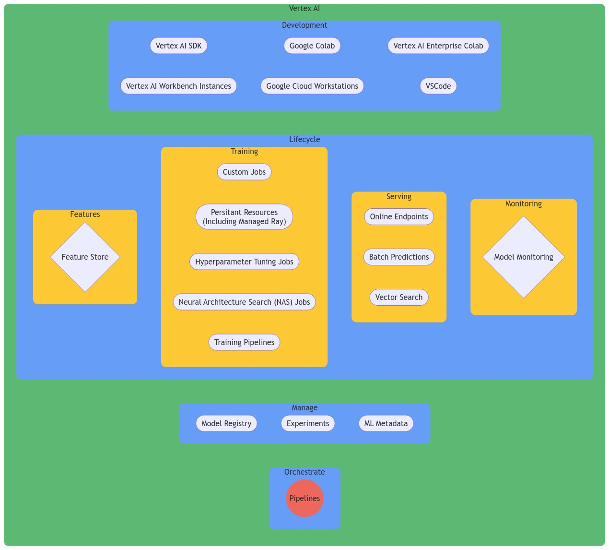

<!--- header table --->
<table align="left">     
  <td style="text-align: center">
    <a href="https://github.com/statmike/vertex-ai-mlops/blob/main/MLOps/readme.md">
      
       View on GitHub
    </a>
  </td>
</table>    

---
# MLOps
> You are here: `vertex-ai-mlops/MLOps/readme.md`

How are you going to manage data, features, training, models, deployment, monitoring, and all the connectivity between these?  How will your approach be impacted if the number of models increases 10x, 100x, or more?

Let's talk about MLOps!

> Note: This folder is in active development and is the primary focus of this repository for 2024.  Check back often and provide feedback as it will help guide the build-out.

---
## Table of Contents

- [MLOps](#mlops)
    - [ML Code: More Than A Model](#ml-code-more-than-a-model)
    - [Model Fleets: MLOps for Scale](#model-fleets-mlops-for-scale)
    - [Content Overview](#content-overview)
    - [MLOps Resources & References](#mlops-resources--references)
- [Content Development Progress](#content-development-progress)

---

## ML Code: More Than A Model

This is where it all begins.  Hands find keyboard and start writing instructions to:
- find data source
- read data
- explore data
- prepare data
- process data into features
- build a training routine: language (R, Python) with a package or framework (XGBoost, TensorFlow, PyTorch, scikit-learn, ...)
- iterate, iterate, iterate, ...
- evaluate the model
- iterate, iterate, iterare, ...
- prepare model for deployment - batch, online, cloud, onprem, mobile, ...
- deploy, test, rolloout
- monitor shift and drift
- troubleshoot everything that goes wrong or does not make sense
- automate
- repeat
- scale
- a MILLION other things!

In other words, "ML Code" is much more than just ML code.  As depicted by the blocks in this diagram which are also sized to emphasize the effort of different parts of the full ML ecosystem:

  

  <a href="https://proceedings.neurips.cc/paper_files/paper/2015/file/86df7dcfd896fcaf2674f757a2463eba-Paper.pdf">
    Sculley, D., Holt, G., Golovin, D., Davydov, E., Phillips, T., Ebner, D., Chaudhary, V., Young, M., Crespo, J., & Dennison, D. (2015). Hidden Technical Debt in Machine Learning Systems.expand_more
  </a>

The first takeaway is that this is more than just a model.  At the core, a model is the product of data, an architecture, and hyperparameters.  The system around this makes up the complete training pipeline. Putting the model into use expands the pipeline to deployment and monitoring. But Why invest in the extra steps of pipelines?  Even for a single model the benefits of automation, monitoring, and governing the workflow are great.  The speed of deployment and opportunity for continous training are also great. But ML maturity leads to more models, more versions, and more everything!

## Model Fleets: MLOps for Scale

As the workflow goes from one model to many models the practice of MLOps prevents also needing to scale the effort to support an maintain an ML environment.  Some common example of this scaling along with the benefits of MLOps are:

|Example|Description|MLOps Implication|
|---|---|---|
|Retraining|The periodic retraining of a model with new or expanded data to maintain performance.|Needs pipelines for automation, versioning, monitoring, and governening.|
|Multiple Datasets|Training the same architecture and hyperparameters on different datasets (regions, customer segments, etc.) as specialized models.|Need efficient data management, model deployment, and monitoring across environments.|
|Hyperparameter Tuning|Experimenting with hyperparameter configurations to optimize model performance (e.g., grid search, random search, Bayesian optimization).|Need to track experiment parameters, automation, scaling of training compute, compare model versions.|
|Multiple Architectures|Training a variety of model architectures (e.g., decision treees, neural networks, regression) on the same data and event combining predictions into stacked or ensemble models.|Needs efficient training, seleection, and deployment strategies to leverage the different architectures and model types.|
|Feature Engineering|Transforming and creating new features from raw data to improve model performance.|Needs for feature store to centrally manage data, track transformations, and ensure consistency across models and between traininng and serving.|
|Transfer Learning|Leveraging a trained model to accelerate training and improve performance on a new task.|Managing models and adapting to new taskswith seemless integration in to workflows.|
|Serving Strategies|Deploying models to serve preditions in different ways: batch, online, hybrid.|Requires a flexible infrastructure, model versioning, monitoring and seamless scaling, reliability, and responsiveness.|
|Model Optimization|Reducing model size and computational complexity through quantization, pruning, and distillation.|Involves evaluatinng trade-iffs between model performance and resource constraints, automation, and evaluation.|
|Model Proliferation|The growth of new models for new and various tasks, driven by business needs, technology advancements, and data availability.|Increases demand for scalable infrastructure, efficient model management, and robust governance to handle growing complexity of deployment and maintenance.|
|Continous Monitoring|Understanding each features distribution over time to get an early signal of change from the training data and/or over time as a precursor to model performance drops.|Need for robust automation for detection and notifications and ultimately automated retraining and subsequent deployment so that models adapt to real-world changes.|
|Explainability|The ability to interpret why a model makes specific predictions.|Incorporation of explainability techniques into model development and deployment broadly to identify and mitigate bias and error.|
|Addressing Bias|Identify and address biases in traininng data and training algorithms that lead to unfair predictions.|The need for automating auditing of training data for biases, implementing fairness metrics during evaluation, and implementing mitigation techniques (reweighing, adversarial debiasing, etc.) during training and deployment.|
|Security|Protect models and data from unauthorized access, and malicious attacks.|The need for a controled operating environment with encryption, access control, access logging, vulnerability scanning, anomaly detection, and code scanningn and upgrading to address security vulnerabilities.|
|Cost Optimization|Managed the computation, thus financial resources required to train, deploy, and maintain ML models.|Monitor resource utlization for over-provisioned compute and bottlenecks.  Optimize serving architectues for speed with cohosting and auto-scalinng techniques.|

Whew!! Is that enough?  The value of practicing MLOps is clear.  The core to this a bringing the entire workflow together into **pipelines** - the _'ops'_ in **MLOps**.  

---
## Content Overview

    

Links To Content:
- Orchestration with [Pipelines](./Pipelines/readme.md)
- Feature Management with [Vertex AI Feature Store](./Feature%20Store/readme.md)
- [Model Monitoring](./Model%20Monitoring/readme.md)
- [Experiment Tracking](./Experiment%20Tracking/readme.md)
- [Model Serving](./Serving/readme.md)
- More coming soon!
    
---
## MLOps Resources & References

Resources on MLOps:
- The best overview ever written (#opinion): https://www.tensorflow.org/tfx/guide/understanding_tfx_pipelines
   - Even if you don't use TFX, this captures the whole goal!
- Google Cloud + Vertex AI Content:
   - MLOps Overview: https://cloud.google.com/architecture/mlops-continuous-delivery-and-automation-pipelines-in-machine-learning
   - MLOps on Vertex AI: https://cloud.google.com/vertex-ai/docs/start/introduction-mlops
- Foundational Papers In This Area:
   - 2014: [Machine Learning: The High Interest Credit Card of Technical Debt](https://research.google/pubs/machine-learning-the-high-interest-credit-card-of-technical-debt/)
   - 2015: [Hidden Technical Debt in Machine Learning Systems](https://proceedings.neurips.cc/paper_files/paper/2015/file/86df7dcfd896fcaf2674f757a2463eba-Paper.pdf)

---
