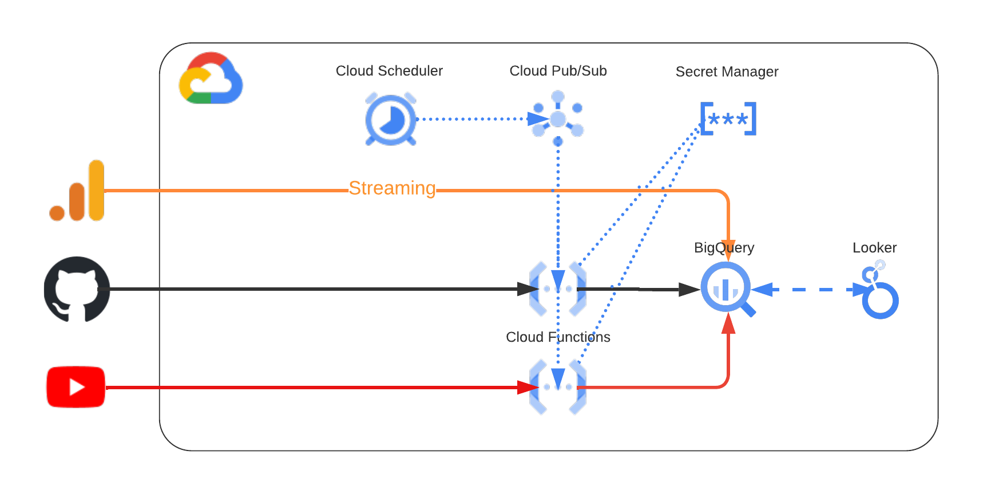
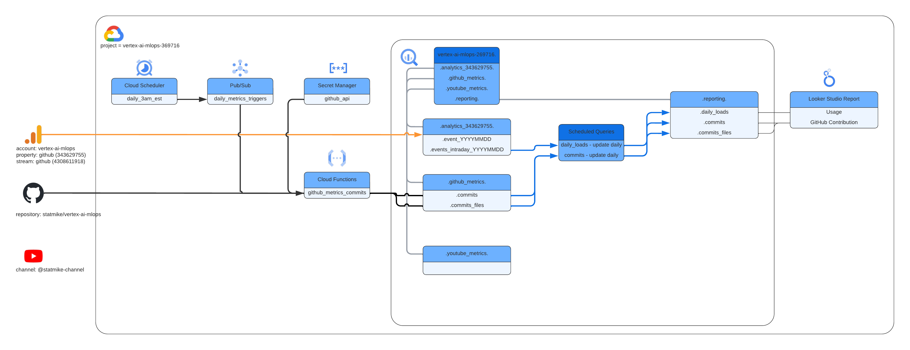

<!--- header table --->
<table align="left">     
  <td style="text-align: center">
    <a href="https://github.com/statmike/vertex-ai-mlops/blob/main/architectures/tracking/setup/readme.md">
      
       View on GitHub
    </a>
  </td>
</table>    

---
# /architectures/tracking/setup/readme.md

This folder contains the notebooks used to setup GCP services to read from APIs, schedule, ETL data for reporting and other automations for this processing.

>Great care is taken to not use user identifying information.  The goal is understanding document popularity relative the the total contents of the repository and overall.  Google Analytics Measurement Protocol is used to log `page_view` events without user identification or client identification - just a count of views.

## Direction
The setup of tracking involves 2 parts:
- 1. **data source setup**: retrieving each source into its own BigQuery dataset as a series of tables with inputs from the sources.  Jobs are designed, mostly with cloud functions, to populate these tables initially and then incrementally.
- 2. **data preparation**: setting up scheduled ETL jobs to transform each source into reporting tables in a single BigQuery dataset called `reporting`

## Sources
Each data source has a subfolder of notebooks specific to their setup:
- [/ga4](./ga4/readme.md)
    - include notebook that adds the tracking to each `.md` and `.ipynb` files in this repository
    - includes a script that will remove all the tracking from `.md` and `.ipynb` files in this repository
    - includes notebooks that:
        - walkthrough setting up Google Analytics Exports to BigQuery
        - walkthrough ETL process to prepare this data for reporting
    - decomissioning this for custom tracking - see pixel below:
- [/pixel](./pixel/readme.md)
    - create cloud function for custom pixel tracking with data privacy
    - migrate GA4 trackinng data to the custom tracker
    - update reporting to utilize the custom pixel tracking
- [/github](./github/readme.md)
    - includes notebooks that:
        - show examples of reading from API and preparing the data for storage in BigQuery
        - Build initial BigQuery tables of information
        - Build incremental updates for BigQuery tables
        - Automate/Schedule the incremental updates
        - Walkthrough and schedule the ETL process to prepare this data for reporting
- [/youtube](./youtube/readme.md)
    - includes notebooks that:
        - show examples of reading from API and preparing the data for storage in BigQuery
        - Build initial BigQuery tables of information
        - Build incremental updates for BigQuery tables
        - Automate/Schedule the incremental updates
        - Walkthrough and schedule the ETL process to prepare this data for reporting
- [/joins](./joins/readme.md)
    - includes notebooks that:
        - Walkthrough and schedule the ETL process to combine data from multiple sources for reporting

## Overview of Data Pipeline

| Overview |
:-------------------------:

| Detail of Data Pipeline |
:-------------------------:

## Notes
- These notebooks are designed to run in the project `vertex-ai-mlops-369716`
- recommendation is logging into that account with chrome, visit this repository on GitHub, click the open in colab links within the notebooks
    - my process - need a better way for editing Colab and saving back to GitHub:
        - Update local machines clone of repository
        - open repository in finder
        - drag a copy of the notebooks to Google Drive of the account running them
        - open notebooks in Colab, edit, save
        - download notebooks from Google Drive
        - drag from download to JupyterLab Explorer and overwrite previous version
        - commit changes
        - push to GitHub
        - update local clone by pulling changes
        - delete old copy in Google Drive
        

---
## TODO
- [IP] Add GitHub Traffic and Engagement
- [ ] Add YouTube measurement
    - [ ] link associated notebooks
- [ ] move GA4 BQ Schedule Job to Cloud Function (daily)
- [ ] move GitHub Comming BQ Scheduled Job to Cloud Function (daily)