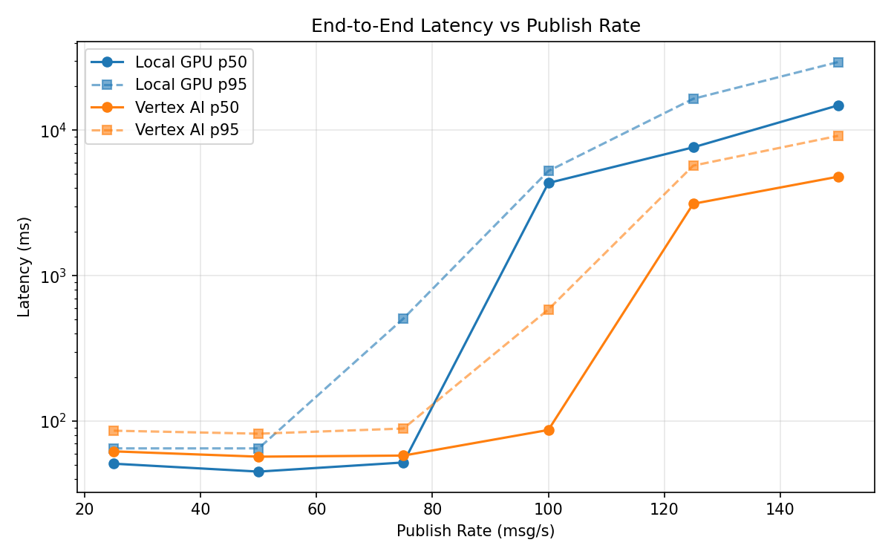
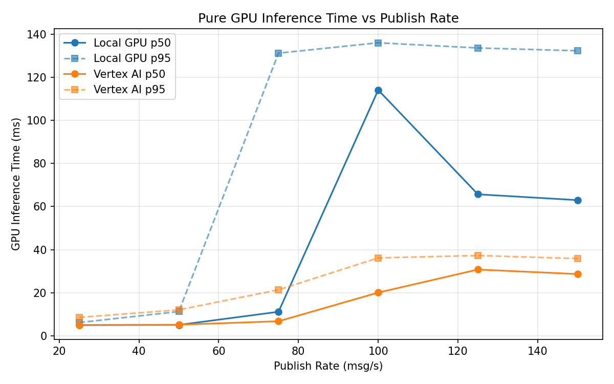
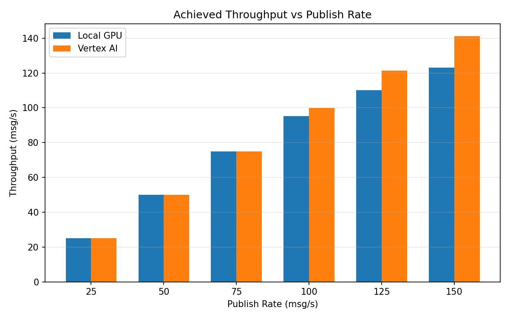

# Benchmark Report

Generated: 2026-03-07 18:51:34

## Configuration

| Parameter | Value |
|---|---|
| Messages per phase | 100s per phase |
| Rates (msg/s) | 25, 50, 75, 100, 125, 150 |
| Experiments | Local GPU, Vertex AI |

## Throughput

| Rate (msg/s) | Local GPU | Vertex AI |
|---|---|---|
| 25 | 25.0 | 25.0 |
| 50 | 50.0 | 50.0 |
| 75 | 75.0 | 75.0 |
| 100 | 95.3 | 99.9 |
| 125 | 110.1 | 121.4 |
| 150 | 123.0 | 141.2 |

## End-to-End Latency (ms)

| Rate | Percentile | Local GPU | Vertex AI |
|---|---|---|---|
| 25 | p50 | 51.0 | 62.0 |
| 25 | p95 | 65.0 | 86.0 |
| 25 | p99 | 242.4 | 215.4 |
| 50 | p50 | 45.0 | 57.0 |
| 50 | p95 | 65.0 | 82.0 |
| 50 | p99 | 442.0 | 214.0 |
| 75 | p50 | 52.0 | 58.0 |
| 75 | p95 | 508.0 | 89.0 |
| 75 | p99 | 665.0 | 456.0 |
| 100 | p50 | 4340.0 | 87.0 |
| 100 | p95 | 5246.0 | 586.0 |
| 100 | p99 | 5346.0 | 849.0 |
| 125 | p50 | 7634.0 | 3123.0 |
| 125 | p95 | 16455.4 | 5712.7 |
| 125 | p99 | 18411.0 | 6109.9 |
| 150 | p50 | 14830.0 | 4796.5 |
| 150 | p95 | 29441.1 | 9158.1 |
| 150 | p99 | 31772.0 | 9498.0 |

## GPU Inference Time (ms)

| Rate | Percentile | Local GPU | Vertex AI |
|---|---|---|---|
| 25 | p50 | 5.0 | 5.1 |
| 25 | p95 | 6.2 | 8.6 |
| 25 | p99 | 81.4 | 14.5 |
| 50 | p50 | 5.1 | 5.2 |
| 50 | p95 | 11.3 | 12.1 |
| 50 | p99 | 109.4 | 30.4 |
| 75 | p50 | 11.2 | 6.8 |
| 75 | p95 | 131.2 | 21.4 |
| 75 | p99 | 139.9 | 33.1 |
| 100 | p50 | 114.1 | 20.1 |
| 100 | p95 | 136.0 | 36.2 |
| 100 | p99 | 143.3 | 45.9 |
| 125 | p50 | 65.7 | 30.8 |
| 125 | p95 | 133.6 | 37.3 |
| 125 | p99 | 142.3 | 46.4 |
| 150 | p50 | 63.0 | 28.7 |
| 150 | p95 | 132.3 | 35.9 |
| 150 | p99 | 142.1 | 44.1 |

## Charts

### Latency vs Publish Rate

### GPU Inference Time vs Publish Rate

### Throughput vs Publish Rate

