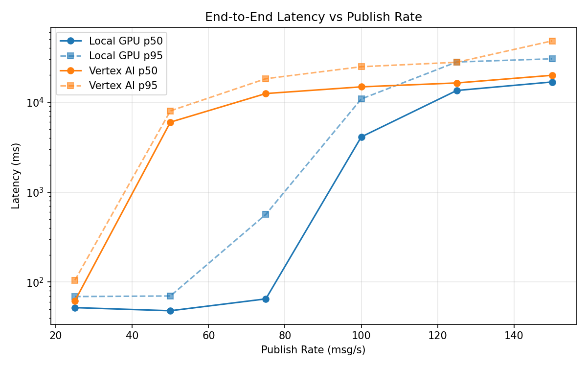
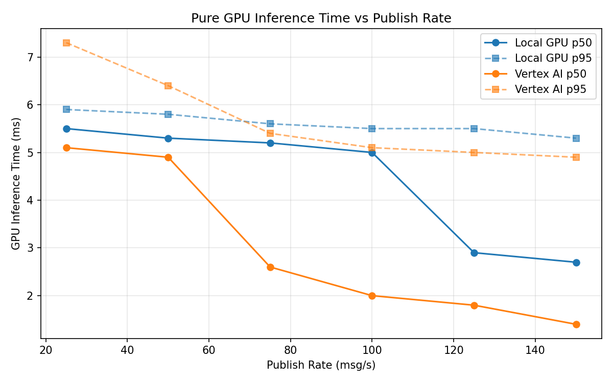
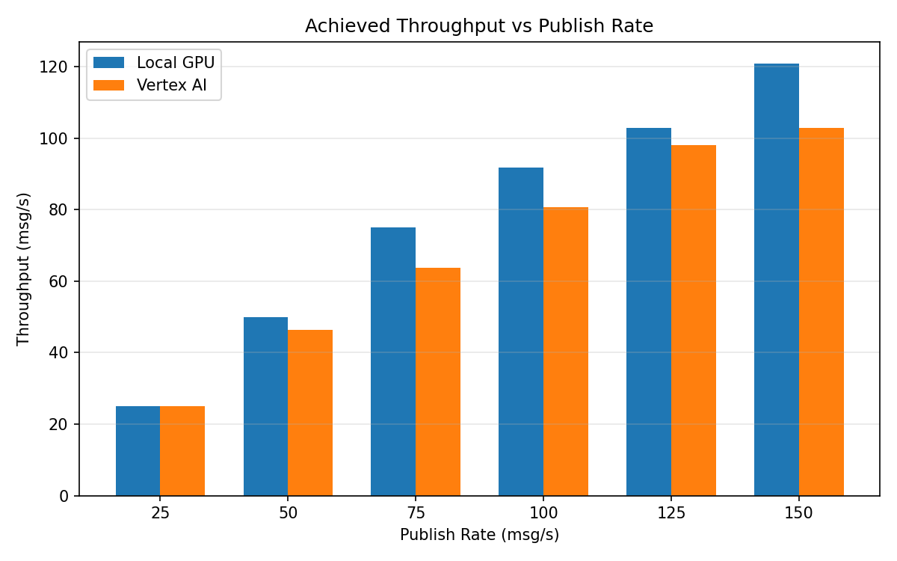

# Benchmark Report

Generated: 2026-03-07 19:11:53

## Configuration

| Parameter | Value |
|---|---|
| Messages per phase | 100s per phase |
| Rates (msg/s) | 25, 50, 75, 100, 125, 150 |
| Experiments | Local GPU, Vertex AI |

## Throughput

| Rate (msg/s) | Local GPU | Vertex AI |
|---|---|---|
| 25 | 25.0 | 25.0 |
| 50 | 50.0 | 46.3 |
| 75 | 75.0 | 63.8 |
| 100 | 91.7 | 80.6 |
| 125 | 102.8 | 98.1 |
| 150 | 120.9 | 102.9 |

## End-to-End Latency (ms)

| Rate | Percentile | Local GPU | Vertex AI |
|---|---|---|---|
| 25 | p50 | 52.0 | 62.0 |
| 25 | p95 | 69.0 | 105.0 |
| 25 | p99 | 357.3 | 449.0 |
| 50 | p50 | 48.0 | 5991.5 |
| 50 | p95 | 70.0 | 7992.0 |
| 50 | p99 | 722.0 | 8095.0 |
| 75 | p50 | 65.0 | 12455.5 |
| 75 | p95 | 565.0 | 18215.0 |
| 75 | p99 | 1047.0 | 18525.0 |
| 100 | p50 | 4103.5 | 14782.5 |
| 100 | p95 | 10836.7 | 24745.0 |
| 100 | p99 | 12286.8 | 25107.0 |
| 125 | p50 | 13462.5 | 16329.0 |
| 125 | p95 | 27921.4 | 27724.0 |
| 125 | p99 | 29899.0 | 28086.0 |
| 150 | p50 | 16749.5 | 19869.0 |
| 150 | p95 | 30295.2 | 47917.5 |
| 150 | p99 | 31669.0 | 58422.3 |

## GPU Inference Time (ms)

| Rate | Percentile | Local GPU | Vertex AI |
|---|---|---|---|
| 25 | p50 | 5.5 | 5.1 |
| 25 | p95 | 5.9 | 7.3 |
| 25 | p99 | 6.3 | 8.6 |
| 50 | p50 | 5.3 | 4.9 |
| 50 | p95 | 5.8 | 6.4 |
| 50 | p99 | 6.2 | 8.4 |
| 75 | p50 | 5.2 | 2.6 |
| 75 | p95 | 5.6 | 5.4 |
| 75 | p99 | 6.0 | 7.8 |
| 100 | p50 | 5.0 | 2.0 |
| 100 | p95 | 5.5 | 5.1 |
| 100 | p99 | 5.8 | 6.6 |
| 125 | p50 | 2.9 | 1.8 |
| 125 | p95 | 5.5 | 5.0 |
| 125 | p99 | 5.8 | 6.0 |
| 150 | p50 | 2.7 | 1.4 |
| 150 | p95 | 5.3 | 4.9 |
| 150 | p99 | 5.6 | 5.7 |

## Charts

### Latency vs Publish Rate

### GPU Inference Time vs Publish Rate

### Throughput vs Publish Rate

