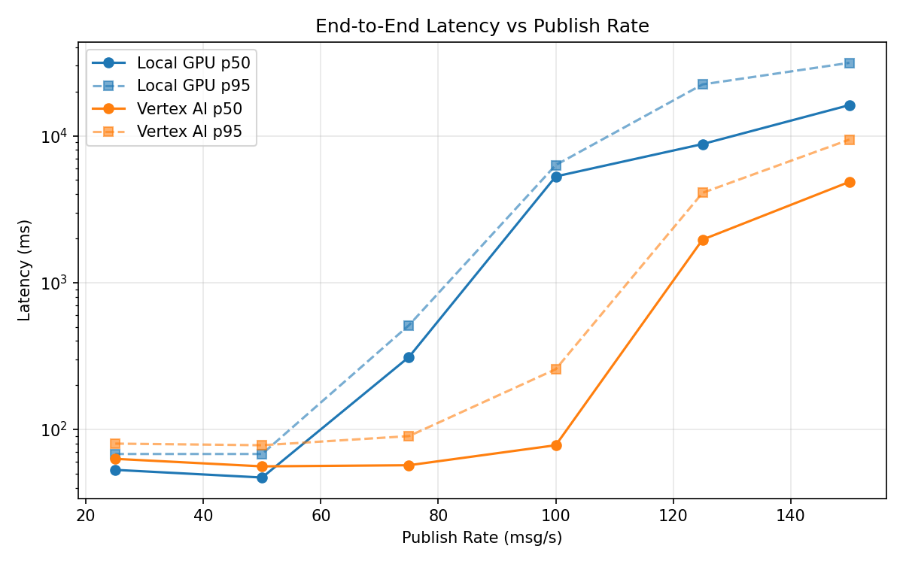
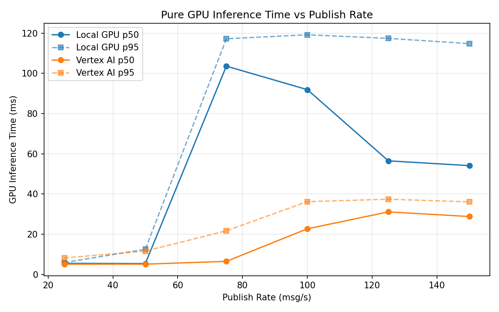
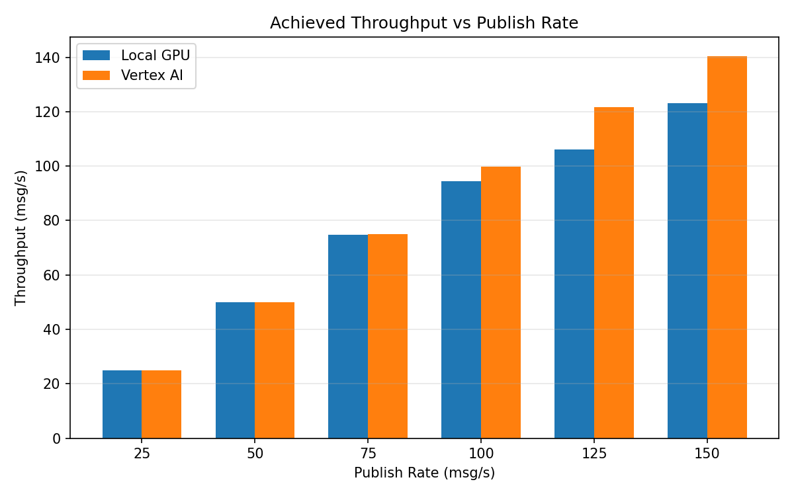

# Benchmark Report

Generated: 2026-03-07 22:01:54

## Configuration

| Parameter | Value |
|---|---|
| Messages per phase | 100s per phase |
| Rates (msg/s) | 25, 50, 75, 100, 125, 150 |
| Experiments | Local GPU, Vertex AI |

## Throughput

| Rate (msg/s) | Local GPU | Vertex AI |
|---|---|---|
| 25 | 25.0 | 25.0 |
| 50 | 50.0 | 50.0 |
| 75 | 74.8 | 75.0 |
| 100 | 94.5 | 99.9 |
| 125 | 106.1 | 121.6 |
| 150 | 123.0 | 140.4 |

## End-to-End Latency (ms)

| Rate | Percentile | Local GPU | Vertex AI |
|---|---|---|---|
| 25 | p50 | 53.0 | 63.0 |
| 25 | p95 | 68.0 | 80.0 |
| 25 | p99 | 251.4 | 129.0 |
| 50 | p50 | 47.0 | 56.0 |
| 50 | p95 | 68.0 | 78.0 |
| 50 | p99 | 250.1 | 282.2 |
| 75 | p50 | 311.0 | 57.0 |
| 75 | p95 | 512.0 | 90.0 |
| 75 | p99 | 579.0 | 260.0 |
| 100 | p50 | 5283.5 | 78.0 |
| 100 | p95 | 6316.0 | 257.0 |
| 100 | p99 | 6473.0 | 411.0 |
| 125 | p50 | 8778.5 | 1962.0 |
| 125 | p95 | 22377.2 | 4086.6 |
| 125 | p99 | 24292.0 | 4338.9 |
| 150 | p50 | 16175.0 | 4852.5 |
| 150 | p95 | 31383.2 | 9418.0 |
| 150 | p99 | 33298.0 | 10135.0 |

## GPU Inference Time (ms)

| Rate | Percentile | Local GPU | Vertex AI |
|---|---|---|---|
| 25 | p50 | 5.5 | 5.1 |
| 25 | p95 | 5.9 | 8.2 |
| 25 | p99 | 77.4 | 12.3 |
| 50 | p50 | 5.4 | 5.1 |
| 50 | p95 | 12.5 | 11.6 |
| 50 | p99 | 89.9 | 31.1 |
| 75 | p50 | 103.6 | 6.5 |
| 75 | p95 | 117.2 | 21.7 |
| 75 | p99 | 123.8 | 32.9 |
| 100 | p50 | 91.9 | 22.7 |
| 100 | p95 | 119.2 | 36.2 |
| 100 | p99 | 127.3 | 45.7 |
| 125 | p50 | 56.5 | 31.1 |
| 125 | p95 | 117.4 | 37.4 |
| 125 | p99 | 125.0 | 46.5 |
| 150 | p50 | 54.1 | 28.8 |
| 150 | p95 | 114.8 | 36.1 |
| 150 | p99 | 124.4 | 45.0 |

## Charts

### Latency vs Publish Rate

### GPU Inference Time vs Publish Rate

### Throughput vs Publish Rate

