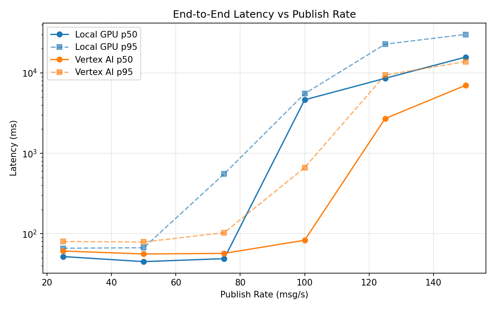
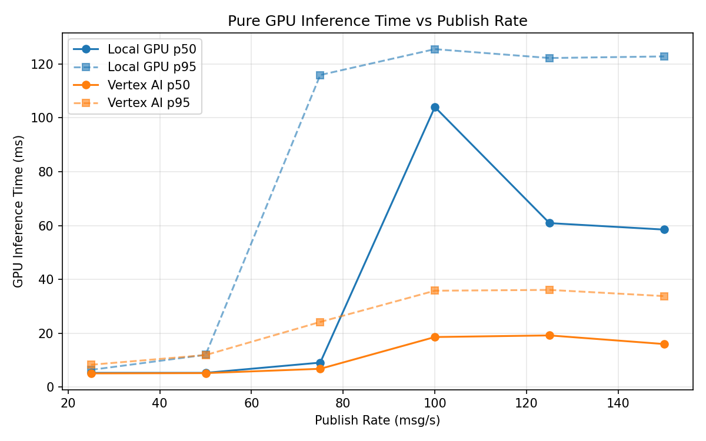
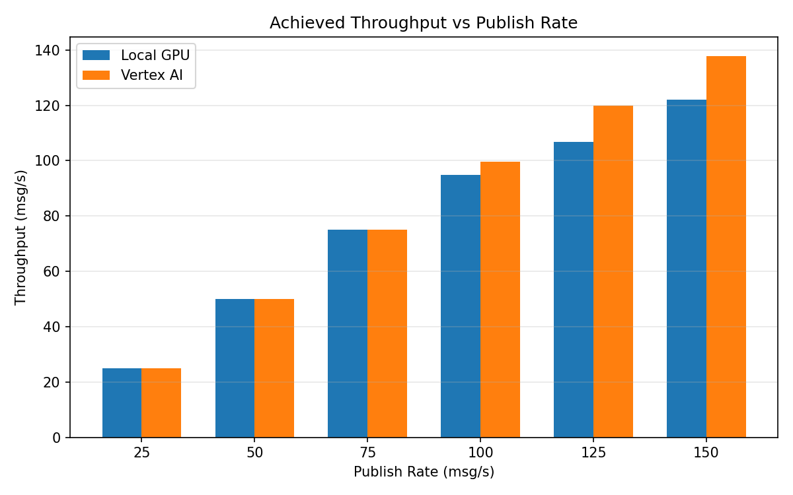

# Benchmark Report

Generated: 2026-03-07 22:20:35

## Configuration

| Parameter | Value |
|---|---|
| Messages per phase | 100s per phase |
| Rates (msg/s) | 25, 50, 75, 100, 125, 150 |
| Experiments | Local GPU, Vertex AI |

## Throughput

| Rate (msg/s) | Local GPU | Vertex AI |
|---|---|---|
| 25 | 25.0 | 25.0 |
| 50 | 50.0 | 50.0 |
| 75 | 75.0 | 75.0 |
| 100 | 94.9 | 99.7 |
| 125 | 106.8 | 120.0 |
| 150 | 122.1 | 137.8 |

## End-to-End Latency (ms)

| Rate | Percentile | Local GPU | Vertex AI |
|---|---|---|---|
| 25 | p50 | 52.0 | 61.0 |
| 25 | p95 | 66.0 | 80.0 |
| 25 | p99 | 97.0 | 149.0 |
| 50 | p50 | 45.0 | 56.0 |
| 50 | p95 | 67.0 | 79.0 |
| 50 | p99 | 484.0 | 139.0 |
| 75 | p50 | 49.0 | 57.0 |
| 75 | p95 | 555.1 | 103.0 |
| 75 | p99 | 707.0 | 803.1 |
| 100 | p50 | 4629.5 | 83.0 |
| 100 | p95 | 5517.0 | 665.0 |
| 100 | p99 | 5664.0 | 1179.0 |
| 125 | p50 | 8572.0 | 2707.0 |
| 125 | p95 | 22793.0 | 9417.8 |
| 125 | p99 | 24339.0 | 10322.9 |
| 150 | p50 | 15727.0 | 7012.5 |
| 150 | p95 | 30116.3 | 13807.3 |
| 150 | p99 | 32674.1 | 15225.0 |

## GPU Inference Time (ms)

| Rate | Percentile | Local GPU | Vertex AI |
|---|---|---|---|
| 25 | p50 | 5.3 | 5.1 |
| 25 | p95 | 6.4 | 8.3 |
| 25 | p99 | 11.6 | 11.8 |
| 50 | p50 | 5.3 | 5.2 |
| 50 | p95 | 12.0 | 11.9 |
| 50 | p99 | 106.0 | 25.9 |
| 75 | p50 | 9.1 | 6.8 |
| 75 | p95 | 115.9 | 24.2 |
| 75 | p99 | 123.8 | 33.3 |
| 100 | p50 | 104.0 | 18.6 |
| 100 | p95 | 125.5 | 35.8 |
| 100 | p99 | 133.5 | 44.2 |
| 125 | p50 | 60.9 | 19.2 |
| 125 | p95 | 122.2 | 36.1 |
| 125 | p99 | 129.8 | 45.0 |
| 150 | p50 | 58.5 | 16.0 |
| 150 | p95 | 122.8 | 33.8 |
| 150 | p99 | 131.9 | 41.4 |

## Charts

### Latency vs Publish Rate

### GPU Inference Time vs Publish Rate

### Throughput vs Publish Rate

