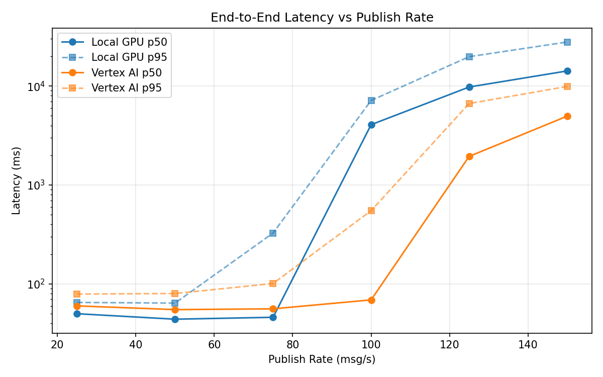
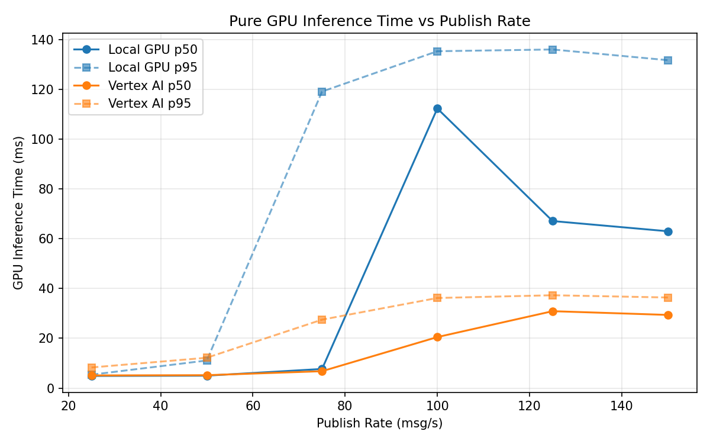
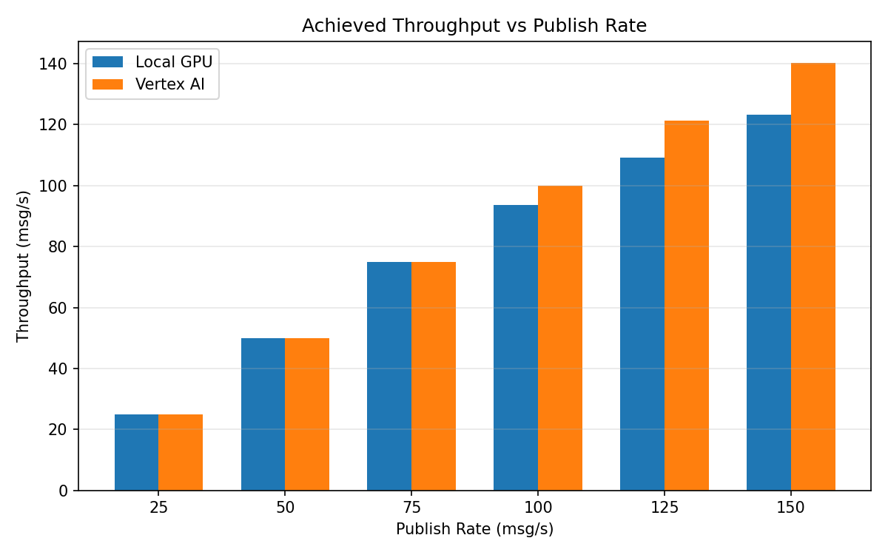

# Benchmark Report

Generated: 2026-03-07 22:39:27

## Configuration

| Parameter | Value |
|---|---|
| Messages per phase | 100s per phase |
| Rates (msg/s) | 25, 50, 75, 100, 125, 150 |
| Experiments | Local GPU, Vertex AI |

## Throughput

| Rate (msg/s) | Local GPU | Vertex AI |
|---|---|---|
| 25 | 25.0 | 25.0 |
| 50 | 50.0 | 50.0 |
| 75 | 75.0 | 75.0 |
| 100 | 93.6 | 99.9 |
| 125 | 109.1 | 121.3 |
| 150 | 123.2 | 140.3 |

## End-to-End Latency (ms)

| Rate | Percentile | Local GPU | Vertex AI |
|---|---|---|---|
| 25 | p50 | 50.0 | 60.0 |
| 25 | p95 | 65.0 | 79.0 |
| 25 | p99 | 85.0 | 143.1 |
| 50 | p50 | 44.0 | 55.0 |
| 50 | p95 | 64.0 | 80.0 |
| 50 | p99 | 133.0 | 362.1 |
| 75 | p50 | 46.0 | 56.0 |
| 75 | p95 | 327.0 | 101.0 |
| 75 | p99 | 553.0 | 799.0 |
| 100 | p50 | 4073.0 | 69.0 |
| 100 | p95 | 7150.2 | 550.0 |
| 100 | p99 | 8684.0 | 850.0 |
| 125 | p50 | 9786.5 | 1947.0 |
| 125 | p95 | 19823.0 | 6660.0 |
| 125 | p99 | 20880.1 | 7304.0 |
| 150 | p50 | 14223.0 | 4965.0 |
| 150 | p95 | 27893.2 | 9914.0 |
| 150 | p99 | 30608.1 | 10529.0 |

## GPU Inference Time (ms)

| Rate | Percentile | Local GPU | Vertex AI |
|---|---|---|---|
| 25 | p50 | 4.9 | 5.1 |
| 25 | p95 | 5.4 | 8.3 |
| 25 | p99 | 11.5 | 12.8 |
| 50 | p50 | 5.0 | 5.2 |
| 50 | p95 | 11.1 | 12.2 |
| 50 | p99 | 70.6 | 31.5 |
| 75 | p50 | 7.7 | 6.8 |
| 75 | p95 | 119.1 | 27.5 |
| 75 | p99 | 130.2 | 33.6 |
| 100 | p50 | 112.3 | 20.5 |
| 100 | p95 | 135.3 | 36.2 |
| 100 | p99 | 143.4 | 44.4 |
| 125 | p50 | 67.1 | 30.9 |
| 125 | p95 | 136.0 | 37.3 |
| 125 | p99 | 144.1 | 45.7 |
| 150 | p50 | 63.0 | 29.4 |
| 150 | p95 | 131.7 | 36.4 |
| 150 | p99 | 142.0 | 44.9 |

## Charts

### Latency vs Publish Rate

### GPU Inference Time vs Publish Rate

### Throughput vs Publish Rate

