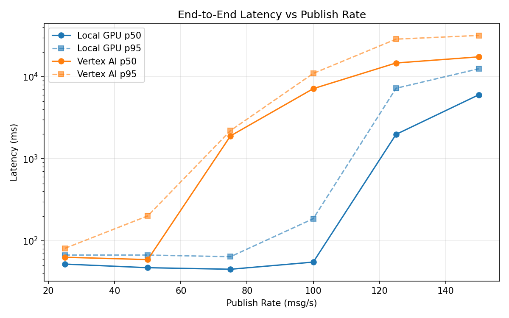
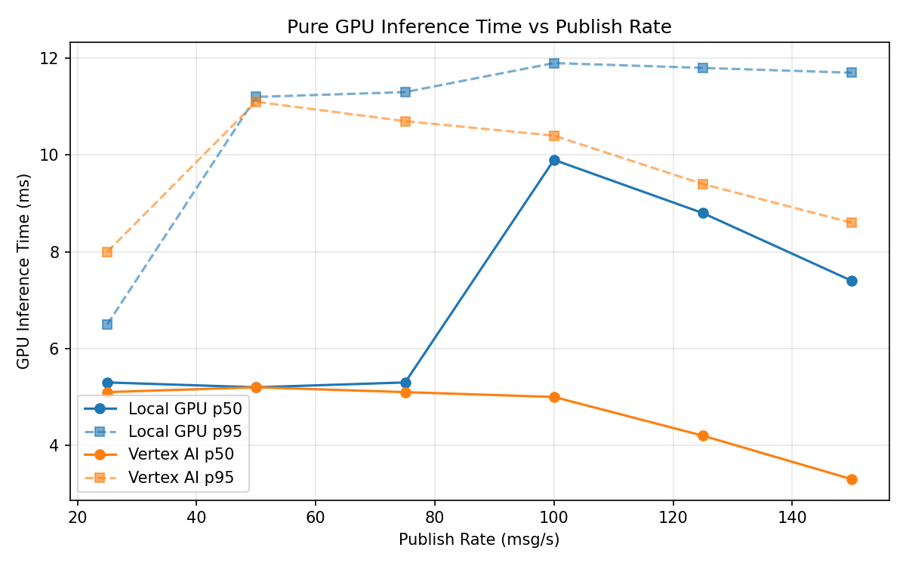
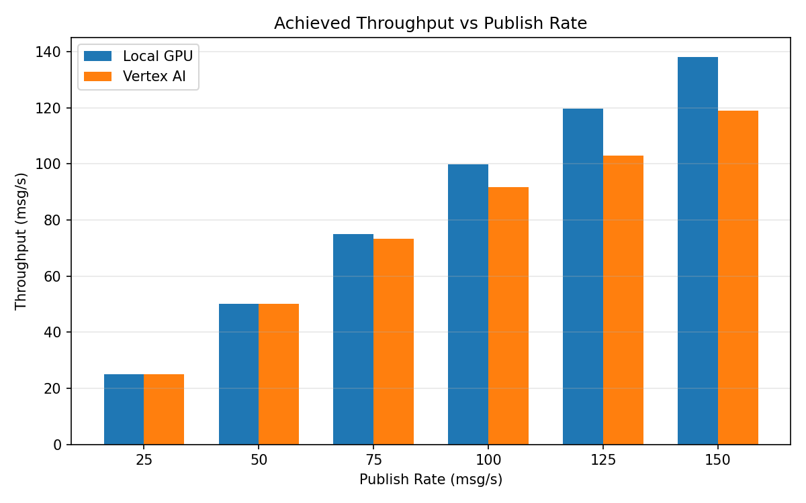

# Benchmark Report

Generated: 2026-03-07 19:31:35

## Configuration

| Parameter | Value |
|---|---|
| Messages per phase | 100s per phase |
| Rates (msg/s) | 25, 50, 75, 100, 125, 150 |
| Experiments | Local GPU, Vertex AI |

## Throughput

| Rate (msg/s) | Local GPU | Vertex AI |
|---|---|---|
| 25 | 25.0 | 25.0 |
| 50 | 50.0 | 50.0 |
| 75 | 75.0 | 73.3 |
| 100 | 99.9 | 91.6 |
| 125 | 119.6 | 102.9 |
| 150 | 138.1 | 118.9 |

## End-to-End Latency (ms)

| Rate | Percentile | Local GPU | Vertex AI |
|---|---|---|---|
| 25 | p50 | 52.0 | 63.0 |
| 25 | p95 | 67.0 | 81.0 |
| 25 | p99 | 184.2 | 370.2 |
| 50 | p50 | 47.0 | 59.0 |
| 50 | p95 | 67.0 | 201.1 |
| 50 | p99 | 102.0 | 651.0 |
| 75 | p50 | 45.0 | 1899.0 |
| 75 | p95 | 64.0 | 2205.0 |
| 75 | p99 | 161.0 | 2334.0 |
| 100 | p50 | 55.0 | 7152.0 |
| 100 | p95 | 186.0 | 10971.0 |
| 100 | p99 | 335.0 | 11240.0 |
| 125 | p50 | 1981.0 | 14697.0 |
| 125 | p95 | 7228.0 | 28689.0 |
| 125 | p99 | 7843.0 | 29397.0 |
| 150 | p50 | 6019.5 | 17452.0 |
| 150 | p95 | 12498.0 | 31847.0 |
| 150 | p99 | 13057.0 | 33784.0 |

## GPU Inference Time (ms)

| Rate | Percentile | Local GPU | Vertex AI |
|---|---|---|---|
| 25 | p50 | 5.3 | 5.1 |
| 25 | p95 | 6.5 | 8.0 |
| 25 | p99 | 9.7 | 10.1 |
| 50 | p50 | 5.2 | 5.2 |
| 50 | p95 | 11.2 | 11.1 |
| 50 | p99 | 12.4 | 13.7 |
| 75 | p50 | 5.3 | 5.1 |
| 75 | p95 | 11.3 | 10.7 |
| 75 | p99 | 12.4 | 13.0 |
| 100 | p50 | 9.9 | 5.0 |
| 100 | p95 | 11.9 | 10.4 |
| 100 | p99 | 13.0 | 12.4 |
| 125 | p50 | 8.8 | 4.2 |
| 125 | p95 | 11.8 | 9.4 |
| 125 | p99 | 12.8 | 11.7 |
| 150 | p50 | 7.4 | 3.3 |
| 150 | p95 | 11.7 | 8.6 |
| 150 | p99 | 12.9 | 11.2 |

## Charts

### Latency vs Publish Rate

### GPU Inference Time vs Publish Rate

### Throughput vs Publish Rate

