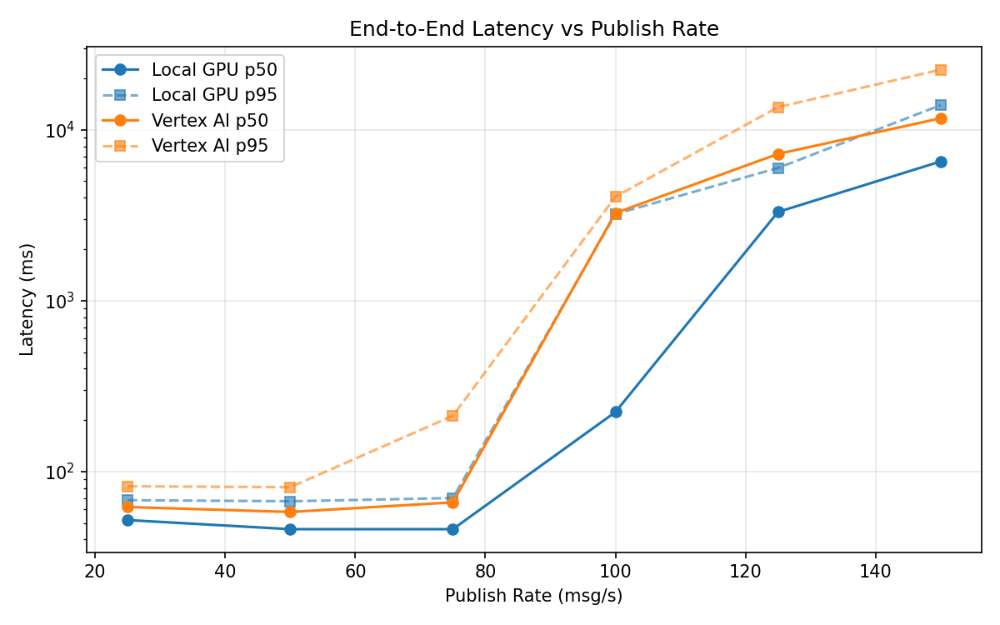
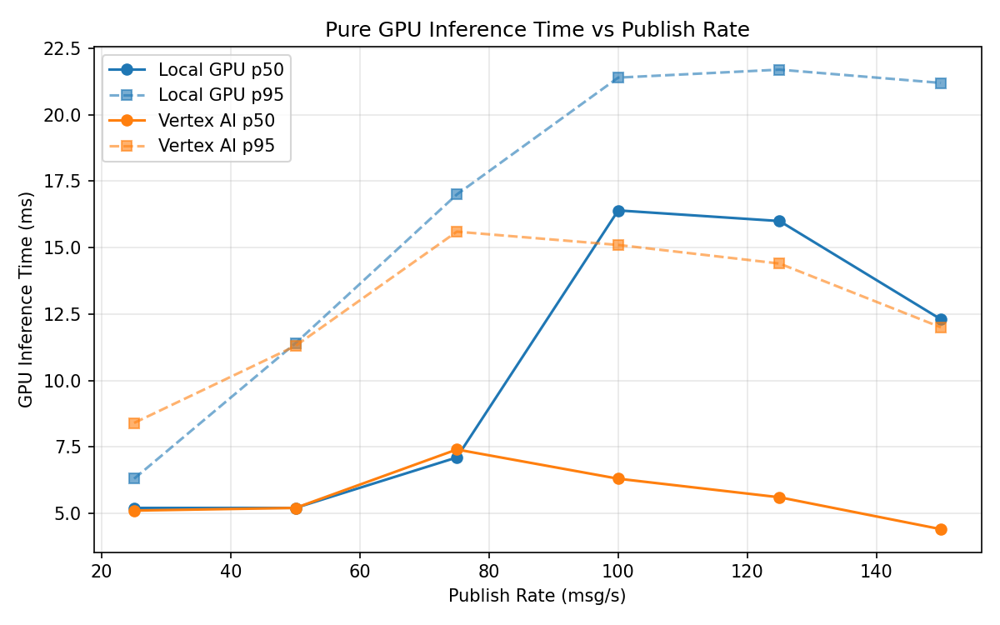
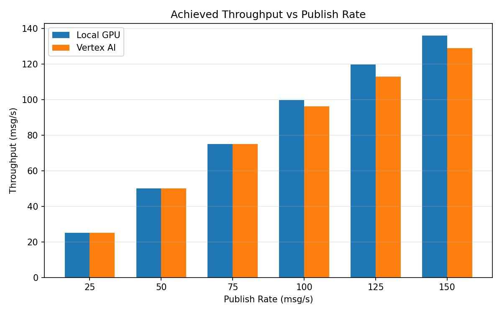

# Benchmark Report

Generated: 2026-03-07 19:50:22

## Configuration

| Parameter | Value |
|---|---|
| Messages per phase | 100s per phase |
| Rates (msg/s) | 25, 50, 75, 100, 125, 150 |
| Experiments | Local GPU, Vertex AI |

## Throughput

| Rate (msg/s) | Local GPU | Vertex AI |
|---|---|---|
| 25 | 25.0 | 25.0 |
| 50 | 50.0 | 50.0 |
| 75 | 75.0 | 75.0 |
| 100 | 99.9 | 96.3 |
| 125 | 119.8 | 113.0 |
| 150 | 136.1 | 129.1 |

## End-to-End Latency (ms)

| Rate | Percentile | Local GPU | Vertex AI |
|---|---|---|---|
| 25 | p50 | 52.0 | 62.0 |
| 25 | p95 | 68.0 | 82.0 |
| 25 | p99 | 94.0 | 172.0 |
| 50 | p50 | 46.0 | 58.0 |
| 50 | p95 | 67.0 | 81.0 |
| 50 | p99 | 382.1 | 198.0 |
| 75 | p50 | 46.0 | 66.0 |
| 75 | p95 | 70.0 | 212.0 |
| 75 | p99 | 209.0 | 427.0 |
| 100 | p50 | 223.0 | 3259.0 |
| 100 | p95 | 3214.0 | 4064.0 |
| 100 | p99 | 3934.8 | 4229.0 |
| 125 | p50 | 3306.0 | 7226.0 |
| 125 | p95 | 5980.0 | 13571.8 |
| 125 | p99 | 6305.0 | 19296.3 |
| 150 | p50 | 6525.5 | 11676.5 |
| 150 | p95 | 13940.0 | 22495.5 |
| 150 | p99 | 15079.0 | 23589.1 |

## GPU Inference Time (ms)

| Rate | Percentile | Local GPU | Vertex AI |
|---|---|---|---|
| 25 | p50 | 5.2 | 5.1 |
| 25 | p95 | 6.3 | 8.4 |
| 25 | p99 | 10.7 | 10.8 |
| 50 | p50 | 5.2 | 5.2 |
| 50 | p95 | 11.4 | 11.3 |
| 50 | p99 | 17.6 | 16.4 |
| 75 | p50 | 7.1 | 7.4 |
| 75 | p95 | 17.0 | 15.6 |
| 75 | p99 | 20.0 | 20.5 |
| 100 | p50 | 16.4 | 6.3 |
| 100 | p95 | 21.4 | 15.1 |
| 100 | p99 | 23.5 | 18.9 |
| 125 | p50 | 16.0 | 5.6 |
| 125 | p95 | 21.7 | 14.4 |
| 125 | p99 | 24.1 | 18.2 |
| 150 | p50 | 12.3 | 4.4 |
| 150 | p95 | 21.2 | 12.0 |
| 150 | p99 | 23.7 | 16.1 |

## Charts

### Latency vs Publish Rate

### GPU Inference Time vs Publish Rate

### Throughput vs Publish Rate

