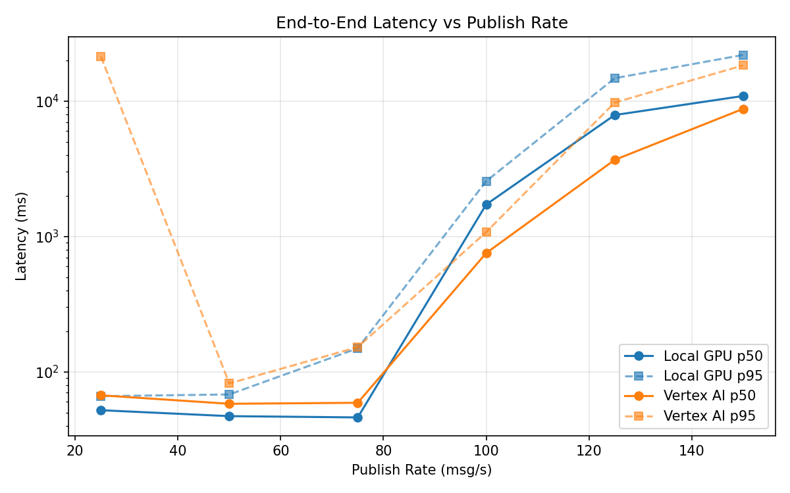
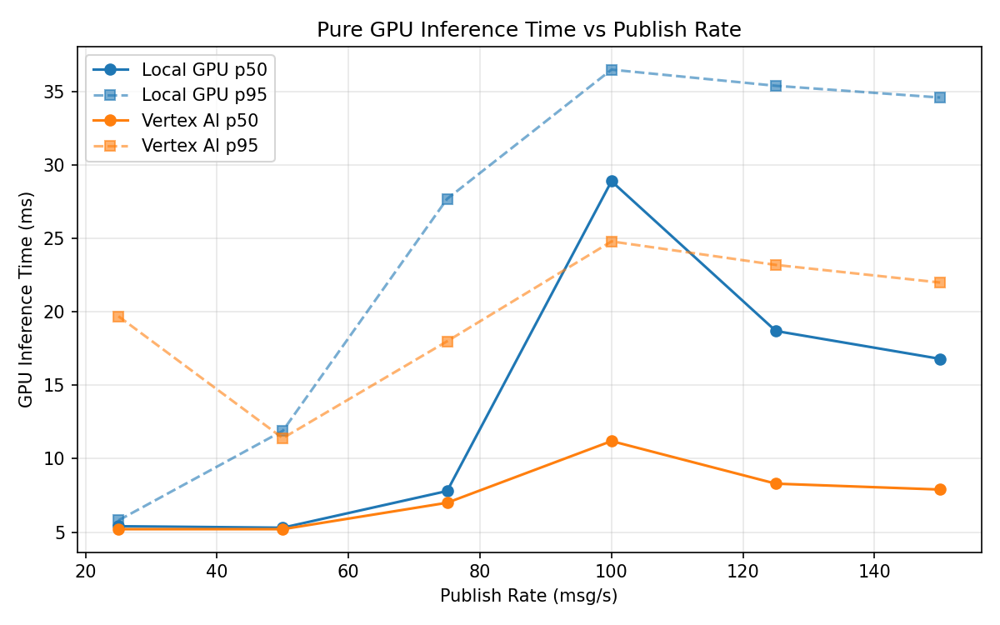
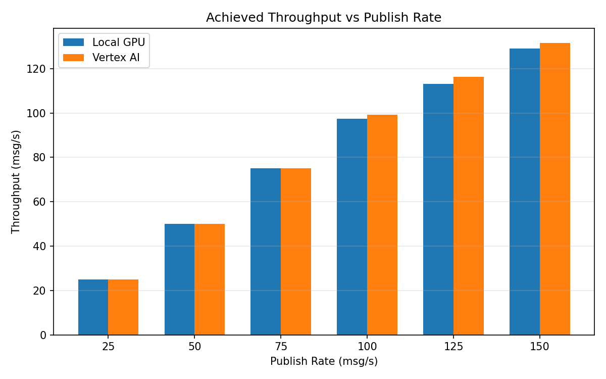

# Benchmark Report

Generated: 2026-03-07 20:08:57

## Configuration

| Parameter | Value |
|---|---|
| Messages per phase | 100s per phase |
| Rates (msg/s) | 25, 50, 75, 100, 125, 150 |
| Experiments | Local GPU, Vertex AI |

## Throughput

| Rate (msg/s) | Local GPU | Vertex AI |
|---|---|---|
| 25 | 25.0 | 25.0 |
| 50 | 50.0 | 50.0 |
| 75 | 75.0 | 75.0 |
| 100 | 97.5 | 99.3 |
| 125 | 113.1 | 116.3 |
| 150 | 129.0 | 131.6 |

## End-to-End Latency (ms)

| Rate | Percentile | Local GPU | Vertex AI |
|---|---|---|---|
| 25 | p50 | 52.0 | 67.0 |
| 25 | p95 | 66.0 | 21314.7 |
| 25 | p99 | 84.0 | 24324.1 |
| 50 | p50 | 47.0 | 58.0 |
| 50 | p95 | 68.0 | 82.0 |
| 50 | p99 | 368.0 | 176.0 |
| 75 | p50 | 46.0 | 59.0 |
| 75 | p95 | 149.0 | 152.1 |
| 75 | p99 | 705.1 | 891.0 |
| 100 | p50 | 1720.0 | 753.0 |
| 100 | p95 | 2557.0 | 1076.0 |
| 100 | p99 | 2616.0 | 1149.0 |
| 125 | p50 | 7876.5 | 3673.0 |
| 125 | p95 | 14733.1 | 9735.0 |
| 125 | p99 | 15395.0 | 10609.0 |
| 150 | p50 | 10895.0 | 8749.0 |
| 150 | p95 | 21899.0 | 18336.0 |
| 150 | p99 | 23251.0 | 19442.0 |

## GPU Inference Time (ms)

| Rate | Percentile | Local GPU | Vertex AI |
|---|---|---|---|
| 25 | p50 | 5.4 | 5.2 |
| 25 | p95 | 5.8 | 19.7 |
| 25 | p99 | 9.4 | 25.9 |
| 50 | p50 | 5.3 | 5.2 |
| 50 | p95 | 11.9 | 11.4 |
| 50 | p99 | 29.6 | 16.5 |
| 75 | p50 | 7.8 | 7.0 |
| 75 | p95 | 27.7 | 18.0 |
| 75 | p99 | 33.8 | 26.2 |
| 100 | p50 | 28.9 | 11.2 |
| 100 | p95 | 36.5 | 24.8 |
| 100 | p99 | 39.4 | 31.8 |
| 125 | p50 | 18.7 | 8.3 |
| 125 | p95 | 35.4 | 23.2 |
| 125 | p99 | 38.6 | 29.7 |
| 150 | p50 | 16.8 | 7.9 |
| 150 | p95 | 34.6 | 22.0 |
| 150 | p99 | 38.4 | 27.5 |

## Charts

### Latency vs Publish Rate

### GPU Inference Time vs Publish Rate

### Throughput vs Publish Rate

