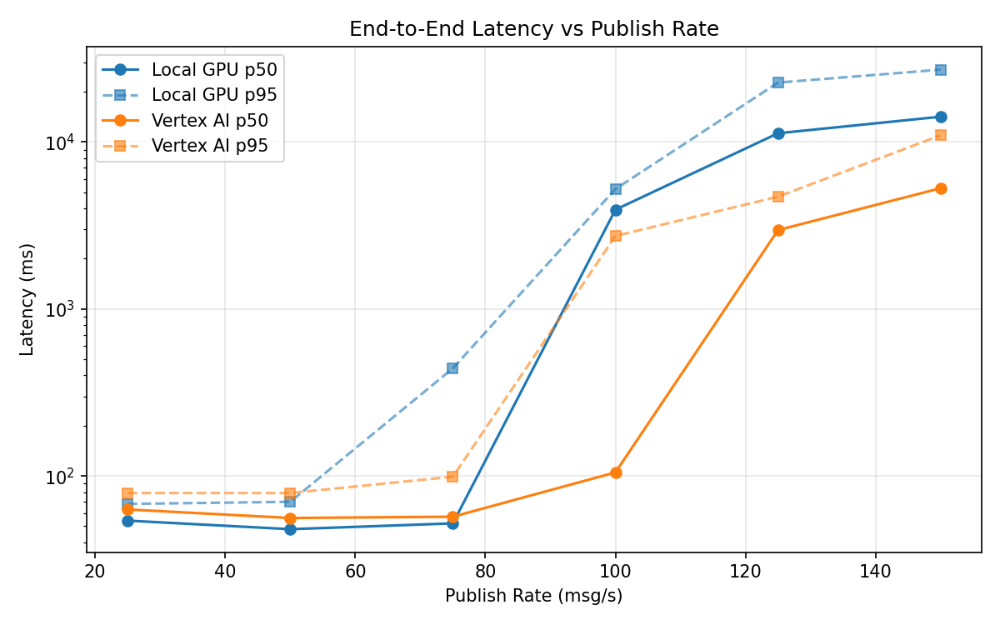
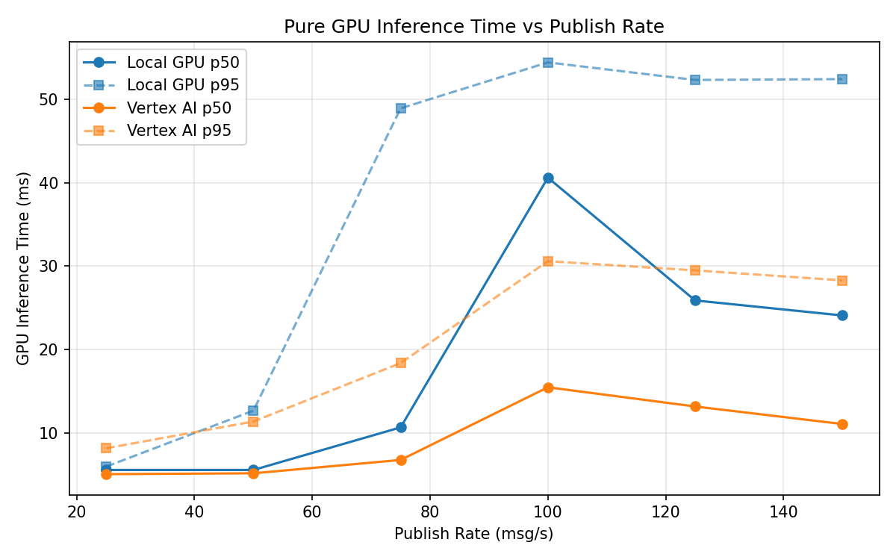
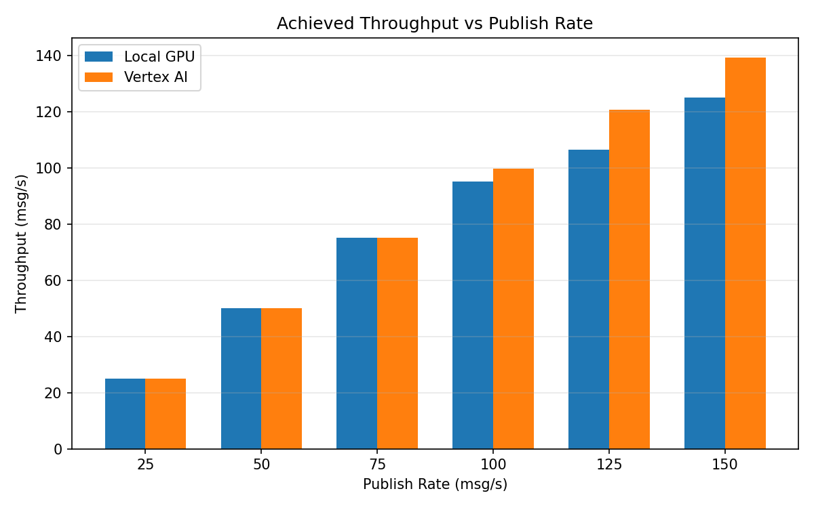

# Benchmark Report

Generated: 2026-03-07 20:28:35

## Configuration

| Parameter | Value |
|---|---|
| Messages per phase | 100s per phase |
| Rates (msg/s) | 25, 50, 75, 100, 125, 150 |
| Experiments | Local GPU, Vertex AI |

## Throughput

| Rate (msg/s) | Local GPU | Vertex AI |
|---|---|---|
| 25 | 25.0 | 25.0 |
| 50 | 50.0 | 50.0 |
| 75 | 75.0 | 75.0 |
| 100 | 95.0 | 99.7 |
| 125 | 106.5 | 120.7 |
| 150 | 125.0 | 139.2 |

## End-to-End Latency (ms)

| Rate | Percentile | Local GPU | Vertex AI |
|---|---|---|---|
| 25 | p50 | 54.0 | 63.0 |
| 25 | p95 | 68.0 | 79.0 |
| 25 | p99 | 187.4 | 115.0 |
| 50 | p50 | 48.0 | 56.0 |
| 50 | p95 | 70.0 | 79.0 |
| 50 | p99 | 496.1 | 319.2 |
| 75 | p50 | 52.0 | 57.0 |
| 75 | p95 | 441.0 | 99.0 |
| 75 | p99 | 624.0 | 523.1 |
| 100 | p50 | 3931.0 | 105.0 |
| 100 | p95 | 5225.0 | 2735.0 |
| 100 | p99 | 5324.0 | 3405.9 |
| 125 | p50 | 11272.5 | 2966.5 |
| 125 | p95 | 22666.9 | 4703.0 |
| 125 | p99 | 24621.9 | 4915.0 |
| 150 | p50 | 14163.5 | 5285.5 |
| 150 | p95 | 27101.0 | 10957.1 |
| 150 | p99 | 28773.1 | 11565.0 |

## GPU Inference Time (ms)

| Rate | Percentile | Local GPU | Vertex AI |
|---|---|---|---|
| 25 | p50 | 5.6 | 5.1 |
| 25 | p95 | 6.0 | 8.2 |
| 25 | p99 | 36.6 | 11.7 |
| 50 | p50 | 5.6 | 5.2 |
| 50 | p95 | 12.7 | 11.4 |
| 50 | p99 | 46.7 | 18.5 |
| 75 | p50 | 10.7 | 6.8 |
| 75 | p95 | 48.9 | 18.4 |
| 75 | p99 | 53.2 | 28.6 |
| 100 | p50 | 40.6 | 15.5 |
| 100 | p95 | 54.4 | 30.6 |
| 100 | p99 | 58.3 | 39.2 |
| 125 | p50 | 25.9 | 13.2 |
| 125 | p95 | 52.3 | 29.5 |
| 125 | p99 | 57.1 | 36.0 |
| 150 | p50 | 24.1 | 11.1 |
| 150 | p95 | 52.4 | 28.3 |
| 150 | p99 | 58.1 | 34.4 |

## Charts

### Latency vs Publish Rate

### GPU Inference Time vs Publish Rate

### Throughput vs Publish Rate

