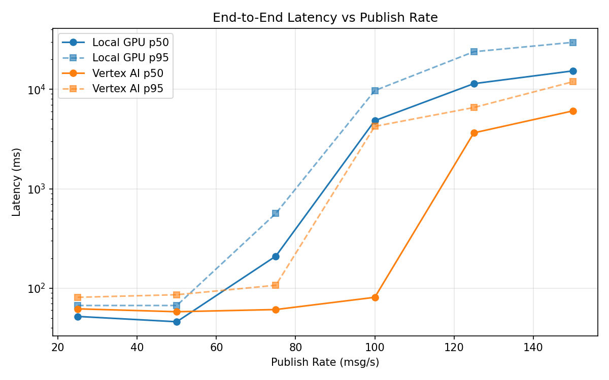
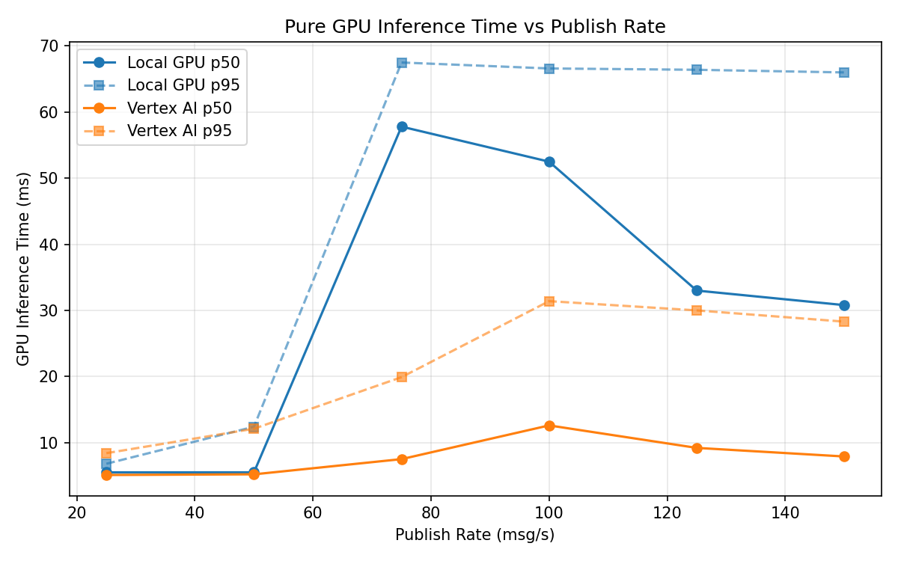
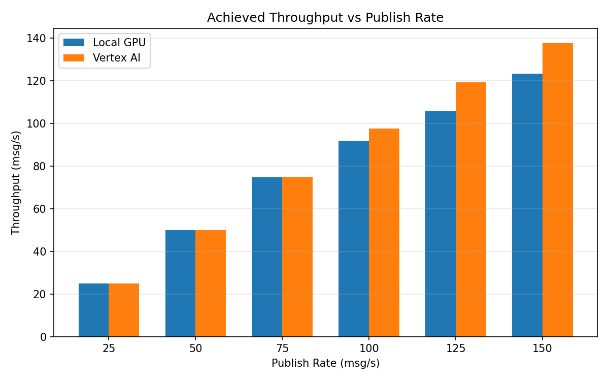

# Benchmark Report

Generated: 2026-03-07 20:46:59

## Configuration

| Parameter | Value |
|---|---|
| Messages per phase | 100s per phase |
| Rates (msg/s) | 25, 50, 75, 100, 125, 150 |
| Experiments | Local GPU, Vertex AI |

## Throughput

| Rate (msg/s) | Local GPU | Vertex AI |
|---|---|---|
| 25 | 25.0 | 25.0 |
| 50 | 50.0 | 50.0 |
| 75 | 74.8 | 75.0 |
| 100 | 91.9 | 97.6 |
| 125 | 105.7 | 119.2 |
| 150 | 123.4 | 137.7 |

## End-to-End Latency (ms)

| Rate | Percentile | Local GPU | Vertex AI |
|---|---|---|---|
| 25 | p50 | 52.0 | 62.0 |
| 25 | p95 | 67.0 | 81.0 |
| 25 | p99 | 407.1 | 438.4 |
| 50 | p50 | 46.0 | 58.0 |
| 50 | p95 | 67.0 | 86.0 |
| 50 | p99 | 360.1 | 330.0 |
| 75 | p50 | 210.0 | 61.0 |
| 75 | p95 | 564.0 | 107.0 |
| 75 | p99 | 738.0 | 681.0 |
| 100 | p50 | 4839.5 | 81.0 |
| 100 | p95 | 9709.5 | 4241.1 |
| 100 | p99 | 11826.6 | 5132.0 |
| 125 | p50 | 11394.5 | 3647.5 |
| 125 | p95 | 23866.1 | 6558.0 |
| 125 | p99 | 25713.0 | 7143.0 |
| 150 | p50 | 15312.5 | 6062.5 |
| 150 | p95 | 29656.1 | 11912.0 |
| 150 | p99 | 31630.0 | 12991.0 |

## GPU Inference Time (ms)

| Rate | Percentile | Local GPU | Vertex AI |
|---|---|---|---|
| 25 | p50 | 5.5 | 5.1 |
| 25 | p95 | 6.8 | 8.4 |
| 25 | p99 | 50.3 | 16.7 |
| 50 | p50 | 5.5 | 5.2 |
| 50 | p95 | 12.4 | 12.1 |
| 50 | p99 | 57.9 | 25.6 |
| 75 | p50 | 57.8 | 7.5 |
| 75 | p95 | 67.5 | 19.9 |
| 75 | p99 | 72.2 | 29.8 |
| 100 | p50 | 52.5 | 12.6 |
| 100 | p95 | 66.6 | 31.4 |
| 100 | p99 | 71.5 | 39.9 |
| 125 | p50 | 33.0 | 9.2 |
| 125 | p95 | 66.4 | 30.0 |
| 125 | p99 | 71.0 | 37.4 |
| 150 | p50 | 30.8 | 7.9 |
| 150 | p95 | 66.0 | 28.3 |
| 150 | p99 | 71.8 | 36.5 |

## Charts

### Latency vs Publish Rate

### GPU Inference Time vs Publish Rate

### Throughput vs Publish Rate

