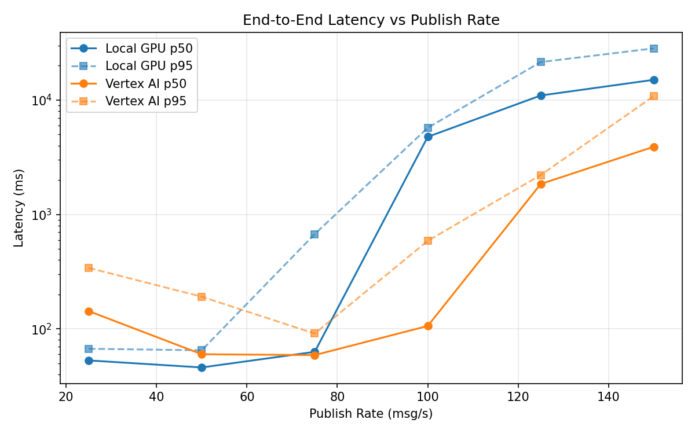
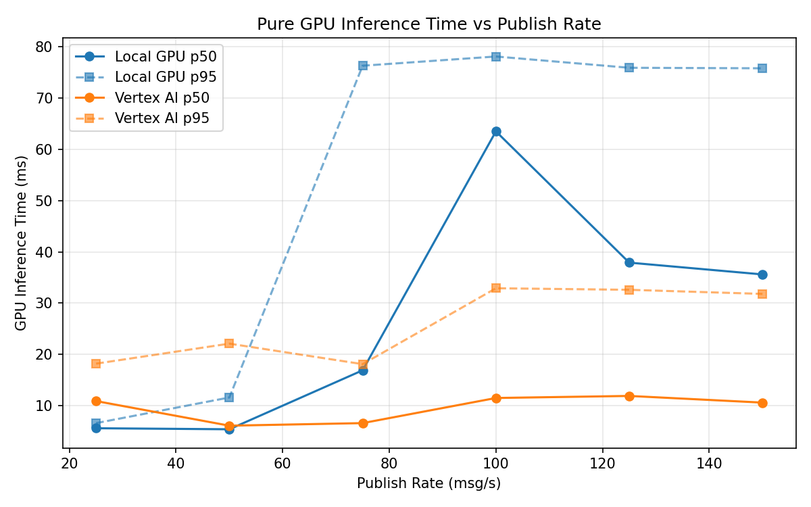
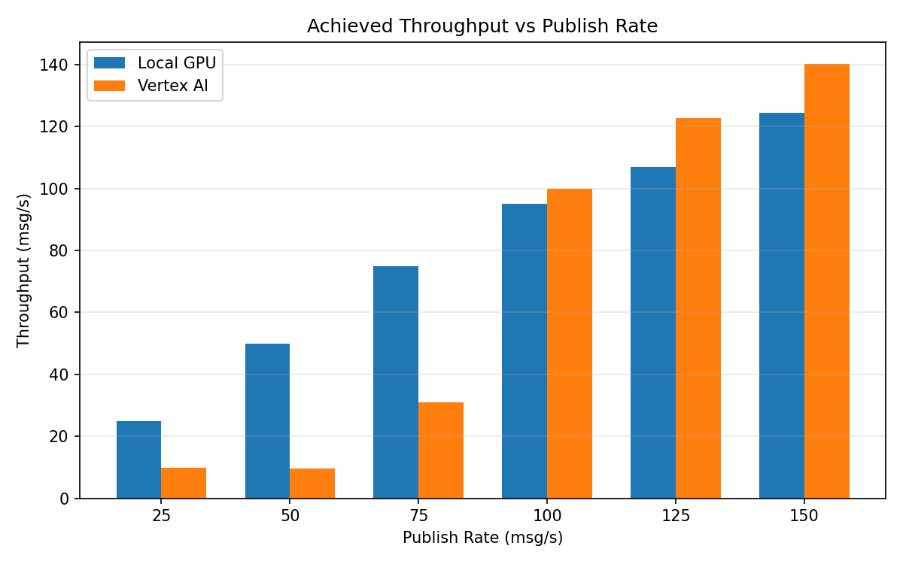

# Benchmark Report

Generated: 2026-03-07 21:05:42

## Configuration

| Parameter | Value |
|---|---|
| Messages per phase | 100s per phase |
| Rates (msg/s) | 25, 50, 75, 100, 125, 150 |
| Experiments | Local GPU, Vertex AI |

## Throughput

| Rate (msg/s) | Local GPU | Vertex AI |
|---|---|---|
| 25 | 25.0 | 9.8 |
| 50 | 50.0 | 9.7 |
| 75 | 75.0 | 30.9 |
| 100 | 95.0 | 99.8 |
| 125 | 107.0 | 122.8 |
| 150 | 124.4 | 140.2 |

## End-to-End Latency (ms)

| Rate | Percentile | Local GPU | Vertex AI |
|---|---|---|---|
| 25 | p50 | 53.0 | 143.0 |
| 25 | p95 | 67.0 | 341.3 |
| 25 | p99 | 90.0 | 608.3 |
| 50 | p50 | 46.0 | 60.0 |
| 50 | p95 | 65.0 | 191.1 |
| 50 | p99 | 329.0 | 86843.3 |
| 75 | p50 | 63.0 | 59.0 |
| 75 | p95 | 674.0 | 91.0 |
| 75 | p99 | 790.0 | 221.0 |
| 100 | p50 | 4773.0 | 106.0 |
| 100 | p95 | 5725.0 | 588.0 |
| 100 | p99 | 5837.0 | 644.0 |
| 125 | p50 | 10969.0 | 1848.0 |
| 125 | p95 | 21494.6 | 2211.0 |
| 125 | p99 | 23480.0 | 2314.0 |
| 150 | p50 | 15038.5 | 3908.0 |
| 150 | p95 | 28323.5 | 10831.0 |
| 150 | p99 | 30440.0 | 12195.4 |

## GPU Inference Time (ms)

| Rate | Percentile | Local GPU | Vertex AI |
|---|---|---|---|
| 25 | p50 | 5.6 | 10.9 |
| 25 | p95 | 6.6 | 18.2 |
| 25 | p99 | 11.7 | 24.5 |
| 50 | p50 | 5.4 | 6.1 |
| 50 | p95 | 11.6 | 22.1 |
| 50 | p99 | 66.3 | 30.2 |
| 75 | p50 | 16.9 | 6.6 |
| 75 | p95 | 76.3 | 18.1 |
| 75 | p99 | 81.3 | 30.1 |
| 100 | p50 | 63.5 | 11.5 |
| 100 | p95 | 78.1 | 32.9 |
| 100 | p99 | 82.9 | 43.6 |
| 125 | p50 | 37.9 | 11.9 |
| 125 | p95 | 75.9 | 32.6 |
| 125 | p99 | 81.4 | 41.8 |
| 150 | p50 | 35.6 | 10.6 |
| 150 | p95 | 75.8 | 31.8 |
| 150 | p99 | 81.7 | 40.2 |

## Charts

### Latency vs Publish Rate

### GPU Inference Time vs Publish Rate

### Throughput vs Publish Rate

