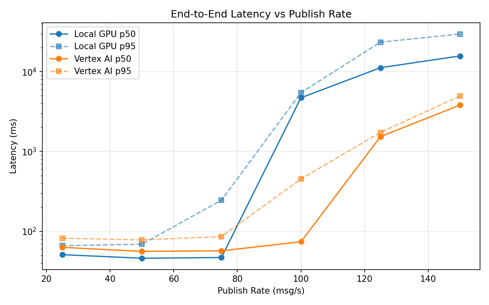
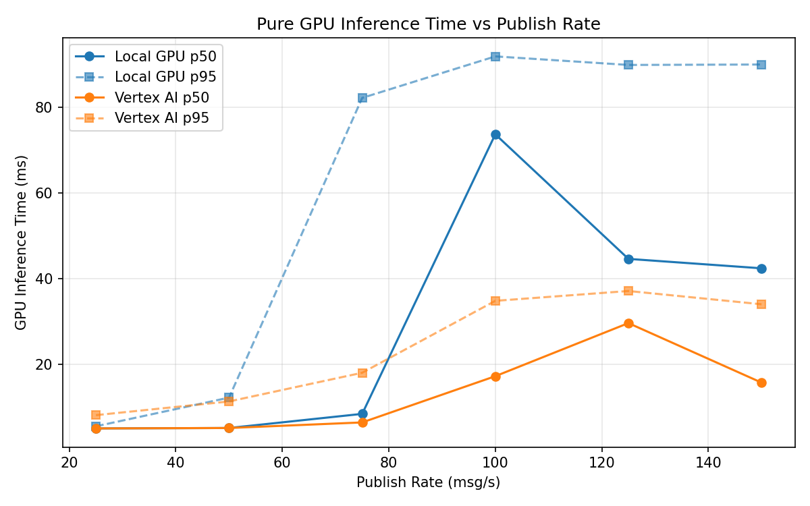
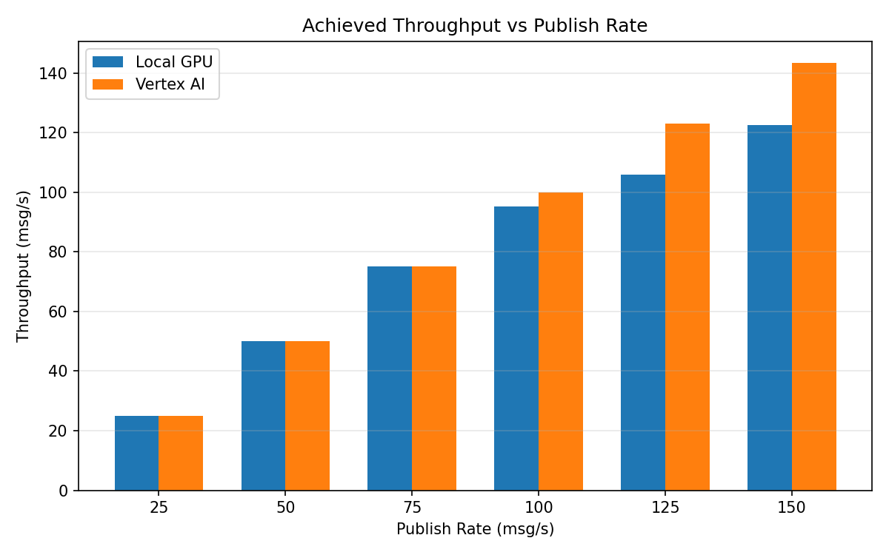

# Benchmark Report

Generated: 2026-03-07 21:25:19

## Configuration

| Parameter | Value |
|---|---|
| Messages per phase | 100s per phase |
| Rates (msg/s) | 25, 50, 75, 100, 125, 150 |
| Experiments | Local GPU, Vertex AI |

## Throughput

| Rate (msg/s) | Local GPU | Vertex AI |
|---|---|---|
| 25 | 25.0 | 25.0 |
| 50 | 50.0 | 50.0 |
| 75 | 75.0 | 75.0 |
| 100 | 95.1 | 99.9 |
| 125 | 105.8 | 123.1 |
| 150 | 122.6 | 143.4 |

## End-to-End Latency (ms)

| Rate | Percentile | Local GPU | Vertex AI |
|---|---|---|---|
| 25 | p50 | 51.0 | 63.0 |
| 25 | p95 | 66.0 | 82.0 |
| 25 | p99 | 346.2 | 120.0 |
| 50 | p50 | 46.0 | 56.0 |
| 50 | p95 | 69.0 | 78.0 |
| 50 | p99 | 634.1 | 154.1 |
| 75 | p50 | 47.0 | 57.0 |
| 75 | p95 | 245.0 | 86.0 |
| 75 | p99 | 337.0 | 167.1 |
| 100 | p50 | 4709.0 | 74.0 |
| 100 | p95 | 5467.0 | 453.0 |
| 100 | p99 | 5587.0 | 973.0 |
| 125 | p50 | 11202.0 | 1537.0 |
| 125 | p95 | 23409.6 | 1735.0 |
| 125 | p99 | 24990.0 | 1805.0 |
| 150 | p50 | 15732.0 | 3813.0 |
| 150 | p95 | 29634.1 | 4943.0 |
| 150 | p99 | 31471.0 | 5114.0 |

## GPU Inference Time (ms)

| Rate | Percentile | Local GPU | Vertex AI |
|---|---|---|---|
| 25 | p50 | 5.0 | 5.0 |
| 25 | p95 | 5.5 | 8.1 |
| 25 | p99 | 67.0 | 10.6 |
| 50 | p50 | 5.1 | 5.1 |
| 50 | p95 | 12.2 | 11.3 |
| 50 | p99 | 79.1 | 20.0 |
| 75 | p50 | 8.4 | 6.4 |
| 75 | p95 | 82.2 | 18.0 |
| 75 | p99 | 88.8 | 31.2 |
| 100 | p50 | 73.7 | 17.2 |
| 100 | p95 | 91.9 | 34.8 |
| 100 | p99 | 100.3 | 43.8 |
| 125 | p50 | 44.6 | 29.6 |
| 125 | p95 | 89.9 | 37.1 |
| 125 | p99 | 96.6 | 45.4 |
| 150 | p50 | 42.4 | 15.7 |
| 150 | p95 | 90.0 | 34.0 |
| 150 | p99 | 97.6 | 43.7 |

## Charts

### Latency vs Publish Rate

### GPU Inference Time vs Publish Rate

### Throughput vs Publish Rate

