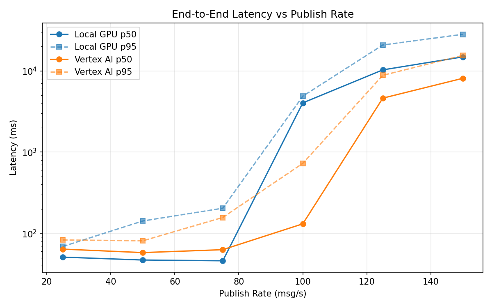
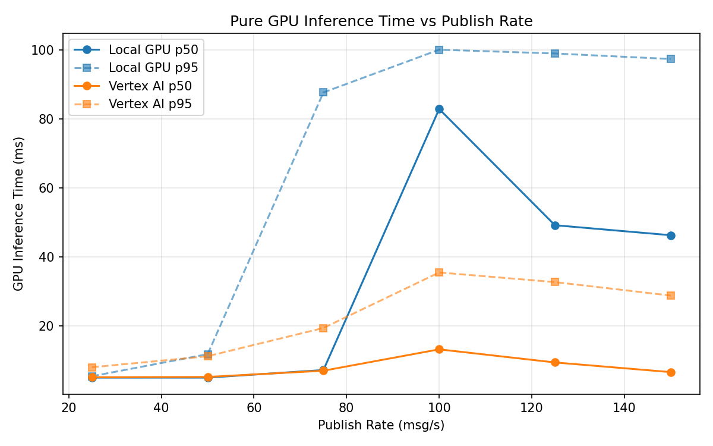
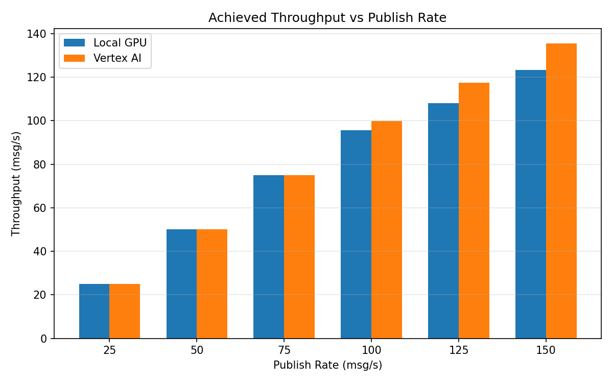

# Benchmark Report

Generated: 2026-03-07 21:43:35

## Configuration

| Parameter | Value |
|---|---|
| Messages per phase | 100s per phase |
| Rates (msg/s) | 25, 50, 75, 100, 125, 150 |
| Experiments | Local GPU, Vertex AI |

## Throughput

| Rate (msg/s) | Local GPU | Vertex AI |
|---|---|---|
| 25 | 25.0 | 25.0 |
| 50 | 50.0 | 50.0 |
| 75 | 75.0 | 75.0 |
| 100 | 95.6 | 99.8 |
| 125 | 108.1 | 117.4 |
| 150 | 123.3 | 135.5 |

## End-to-End Latency (ms)

| Rate | Percentile | Local GPU | Vertex AI |
|---|---|---|---|
| 25 | p50 | 51.0 | 64.0 |
| 25 | p95 | 69.0 | 83.0 |
| 25 | p99 | 462.2 | 122.0 |
| 50 | p50 | 47.0 | 58.0 |
| 50 | p95 | 142.1 | 81.0 |
| 50 | p99 | 568.1 | 138.0 |
| 75 | p50 | 46.0 | 63.0 |
| 75 | p95 | 204.0 | 157.0 |
| 75 | p99 | 367.0 | 1004.0 |
| 100 | p50 | 4035.0 | 131.0 |
| 100 | p95 | 4879.0 | 727.0 |
| 100 | p99 | 4968.0 | 889.0 |
| 125 | p50 | 10279.0 | 4613.0 |
| 125 | p95 | 20810.0 | 8807.0 |
| 125 | p99 | 21940.0 | 9168.0 |
| 150 | p50 | 14852.0 | 8096.0 |
| 150 | p95 | 28153.3 | 15496.0 |
| 150 | p99 | 30074.0 | 16494.0 |

## GPU Inference Time (ms)

| Rate | Percentile | Local GPU | Vertex AI |
|---|---|---|---|
| 25 | p50 | 5.0 | 5.1 |
| 25 | p95 | 5.4 | 8.0 |
| 25 | p99 | 76.1 | 10.8 |
| 50 | p50 | 5.0 | 5.2 |
| 50 | p95 | 11.8 | 11.2 |
| 50 | p99 | 86.4 | 17.0 |
| 75 | p50 | 7.2 | 7.0 |
| 75 | p95 | 87.7 | 19.4 |
| 75 | p99 | 97.2 | 30.5 |
| 100 | p50 | 82.9 | 13.2 |
| 100 | p95 | 100.1 | 35.5 |
| 100 | p99 | 105.8 | 45.2 |
| 125 | p50 | 49.2 | 9.4 |
| 125 | p95 | 99.0 | 32.7 |
| 125 | p99 | 105.9 | 40.1 |
| 150 | p50 | 46.3 | 6.6 |
| 150 | p95 | 97.4 | 28.8 |
| 150 | p99 | 104.5 | 35.1 |

## Charts

### Latency vs Publish Rate

### GPU Inference Time vs Publish Rate

### Throughput vs Publish Rate

