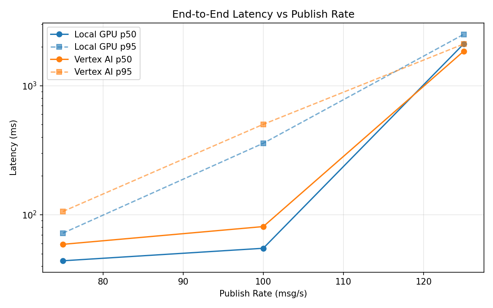
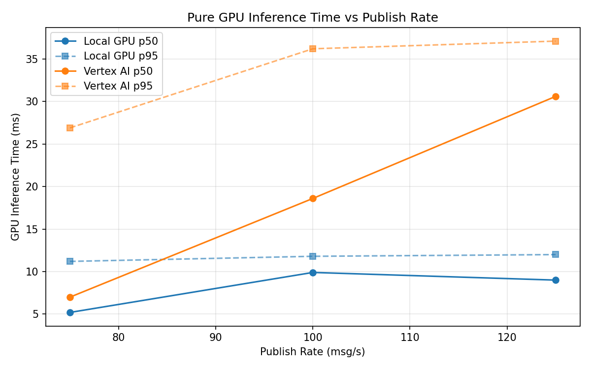
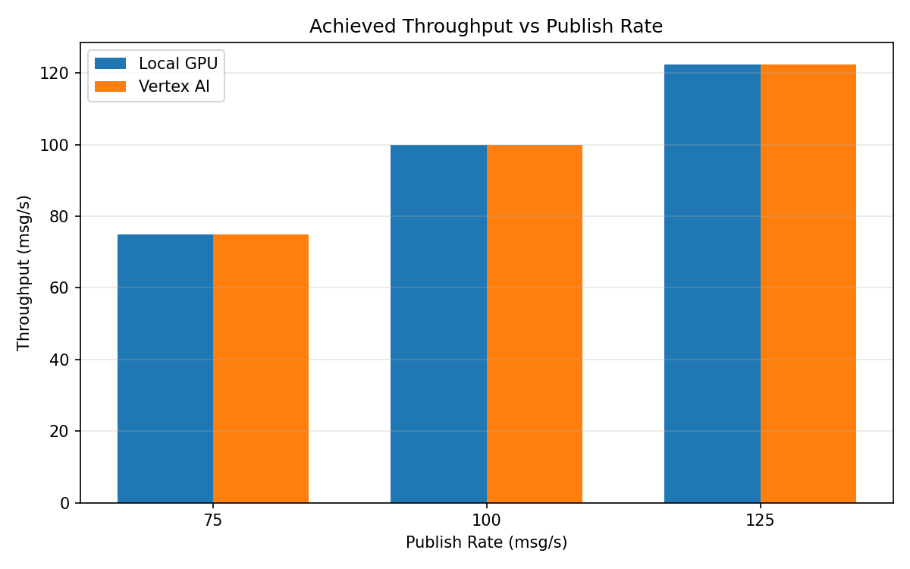

# Benchmark Report

Generated: 2026-03-07 23:16:19

## Configuration

| Parameter | Value |
|---|---|
| Messages per phase | 100s per phase |
| Rates (msg/s) | 75, 100, 125 |
| Experiments | Local GPU, Vertex AI |

## Throughput

| Rate (msg/s) | Local GPU | Vertex AI |
|---|---|---|
| 75 | 75.0 | 75.0 |
| 100 | 99.9 | 99.9 |
| 125 | 122.4 | 122.4 |

## End-to-End Latency (ms)

| Rate | Percentile | Local GPU | Vertex AI |
|---|---|---|---|
| 75 | p50 | 44.0 | 59.0 |
| 75 | p95 | 72.0 | 106.0 |
| 75 | p99 | 477.1 | 632.1 |
| 100 | p50 | 55.0 | 81.0 |
| 100 | p95 | 358.0 | 502.0 |
| 100 | p99 | 774.0 | 896.0 |
| 125 | p50 | 2109.0 | 1850.0 |
| 125 | p95 | 2500.0 | 2104.0 |
| 125 | p99 | 2559.0 | 2184.0 |

## GPU Inference Time (ms)

| Rate | Percentile | Local GPU | Vertex AI |
|---|---|---|---|
| 75 | p50 | 5.2 | 7.0 |
| 75 | p95 | 11.2 | 26.9 |
| 75 | p99 | 12.1 | 34.5 |
| 100 | p50 | 9.9 | 18.6 |
| 100 | p95 | 11.8 | 36.2 |
| 100 | p99 | 12.7 | 46.0 |
| 125 | p50 | 9.0 | 30.6 |
| 125 | p95 | 12.0 | 37.1 |
| 125 | p99 | 13.0 | 46.4 |

## Charts

### Latency vs Publish Rate

### GPU Inference Time vs Publish Rate

### Throughput vs Publish Rate

