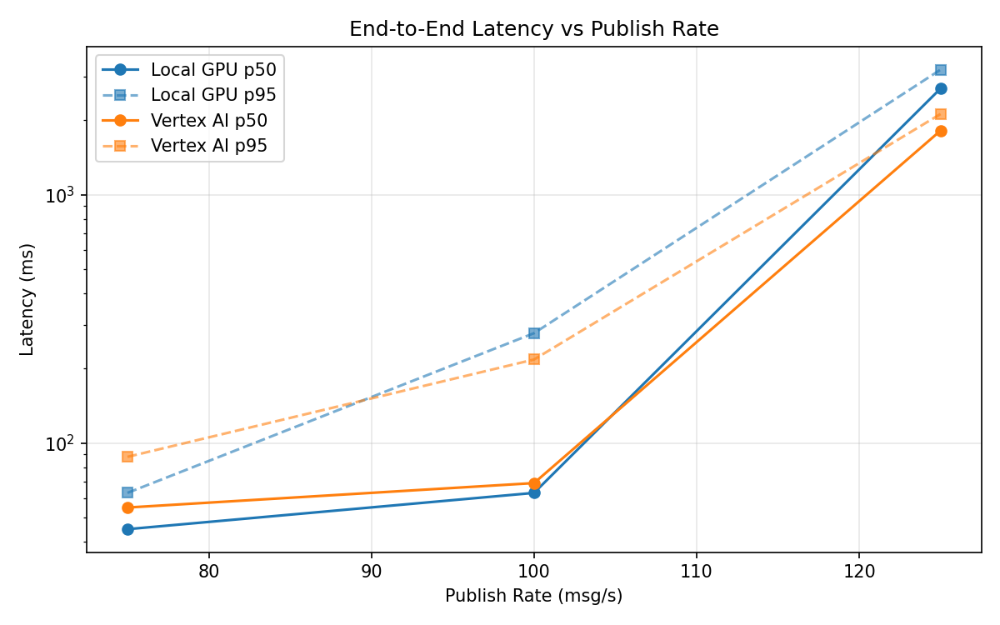
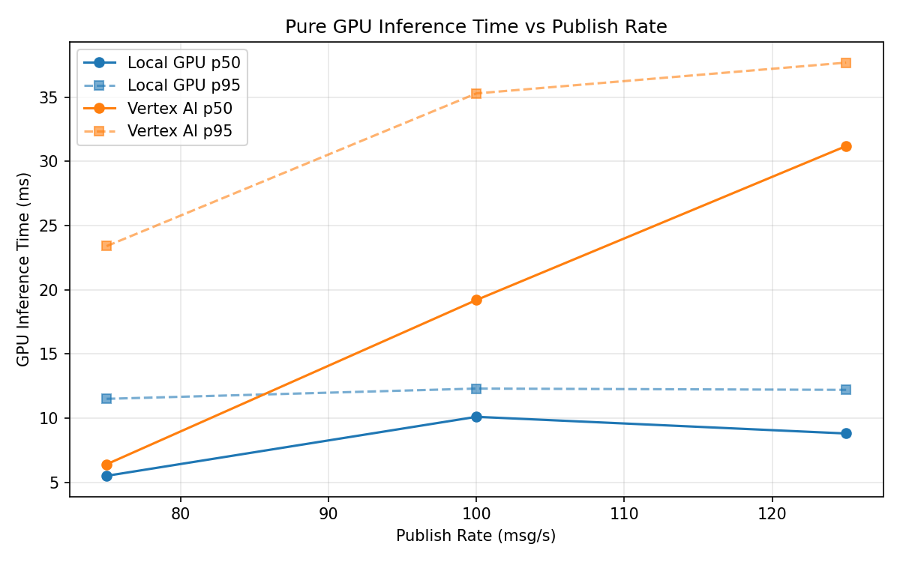
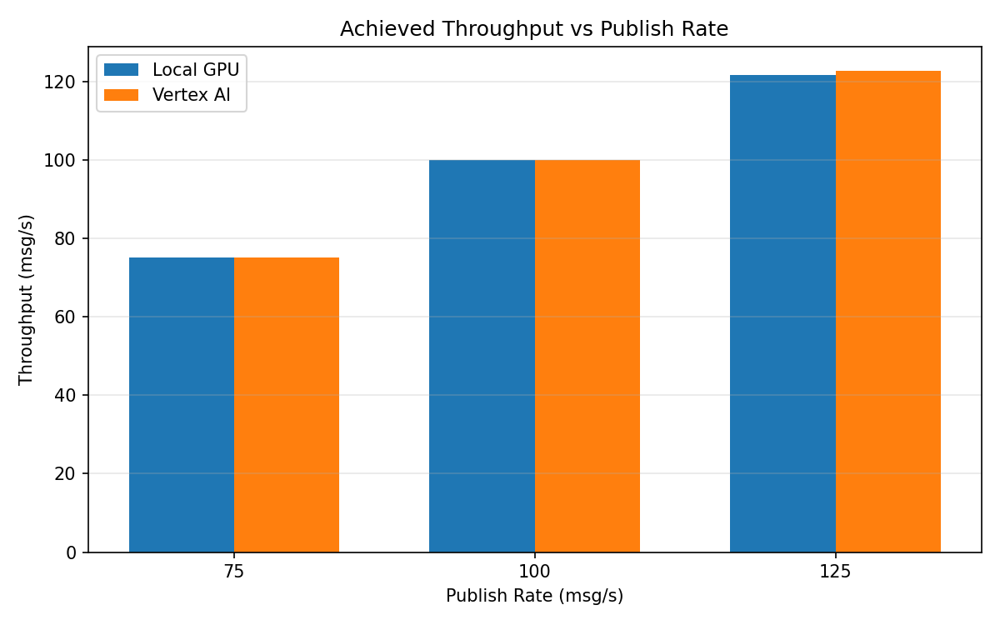

# Benchmark Report

Generated: 2026-03-07 23:28:59

## Configuration

| Parameter | Value |
|---|---|
| Messages per phase | 100s per phase |
| Rates (msg/s) | 75, 100, 125 |
| Experiments | Local GPU, Vertex AI |

## Throughput

| Rate (msg/s) | Local GPU | Vertex AI |
|---|---|---|
| 75 | 75.0 | 75.0 |
| 100 | 99.9 | 99.9 |
| 125 | 121.6 | 122.7 |

## End-to-End Latency (ms)

| Rate | Percentile | Local GPU | Vertex AI |
|---|---|---|---|
| 75 | p50 | 45.0 | 55.0 |
| 75 | p95 | 63.0 | 88.0 |
| 75 | p99 | 201.0 | 445.1 |
| 100 | p50 | 63.0 | 69.0 |
| 100 | p95 | 277.0 | 217.0 |
| 100 | p99 | 504.0 | 414.0 |
| 125 | p50 | 2679.0 | 1813.0 |
| 125 | p95 | 3190.0 | 2115.0 |
| 125 | p99 | 3246.0 | 2233.0 |

## GPU Inference Time (ms)

| Rate | Percentile | Local GPU | Vertex AI |
|---|---|---|---|
| 75 | p50 | 5.5 | 6.4 |
| 75 | p95 | 11.5 | 23.4 |
| 75 | p99 | 12.6 | 33.8 |
| 100 | p50 | 10.1 | 19.2 |
| 100 | p95 | 12.3 | 35.3 |
| 100 | p99 | 13.2 | 44.8 |
| 125 | p50 | 8.8 | 31.2 |
| 125 | p95 | 12.2 | 37.7 |
| 125 | p99 | 13.5 | 46.9 |

## Charts

### Latency vs Publish Rate

### GPU Inference Time vs Publish Rate

### Throughput vs Publish Rate

