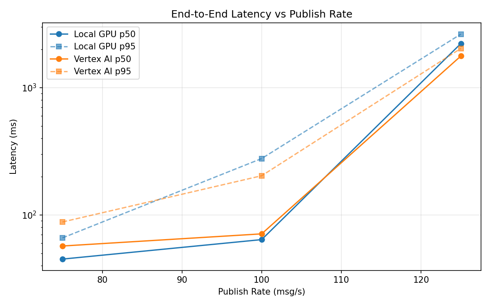
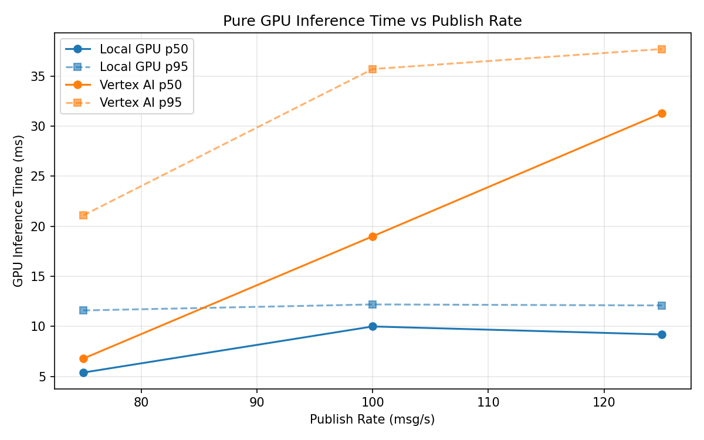

# Benchmark Report

Generated: 2026-03-07 23:40:34

## Configuration

| Parameter | Value |
|---|---|
| Messages per phase | 100s per phase |
| Rates (msg/s) | 75, 100, 125 |
| Experiments | Local GPU, Vertex AI |

## Throughput

| Rate (msg/s) | Local GPU | Vertex AI |
|---|---|---|
| 75 | 75.0 | 75.0 |
| 100 | 100.0 | 99.9 |
| 125 | 121.9 | 122.9 |

## End-to-End Latency (ms)

| Rate | Percentile | Local GPU | Vertex AI |
|---|---|---|---|
| 75 | p50 | 45.0 | 57.0 |
| 75 | p95 | 66.0 | 88.0 |
| 75 | p99 | 265.0 | 280.0 |
| 100 | p50 | 64.0 | 71.0 |
| 100 | p95 | 277.0 | 203.0 |
| 100 | p99 | 460.0 | 310.0 |
| 125 | p50 | 2215.0 | 1768.0 |
| 125 | p95 | 2627.0 | 2028.0 |
| 125 | p99 | 2696.0 | 2106.0 |

## GPU Inference Time (ms)

| Rate | Percentile | Local GPU | Vertex AI |
|---|---|---|---|
| 75 | p50 | 5.4 | 6.8 |
| 75 | p95 | 11.6 | 21.1 |
| 75 | p99 | 12.7 | 35.1 |
| 100 | p50 | 10.0 | 19.0 |
| 100 | p95 | 12.2 | 35.7 |
| 100 | p99 | 13.2 | 45.3 |
| 125 | p50 | 9.2 | 31.3 |
| 125 | p95 | 12.1 | 37.7 |
| 125 | p99 | 13.3 | 46.4 |

## Charts

### Latency vs Publish Rate

### GPU Inference Time vs Publish Rate

### Throughput vs Publish Rate

