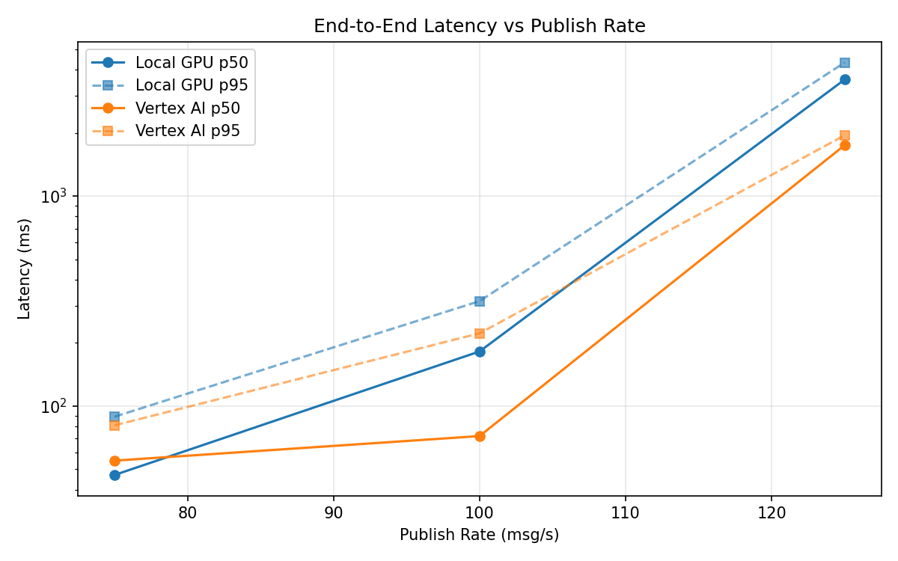
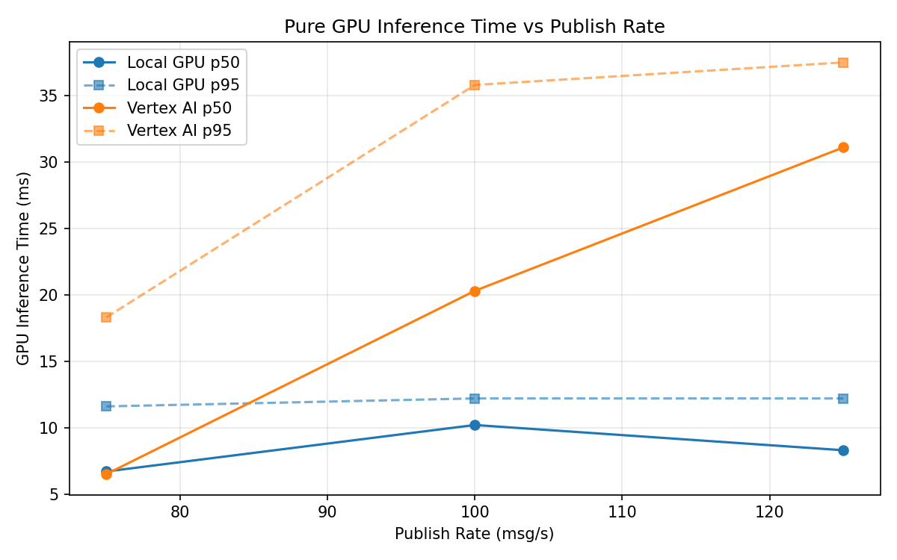
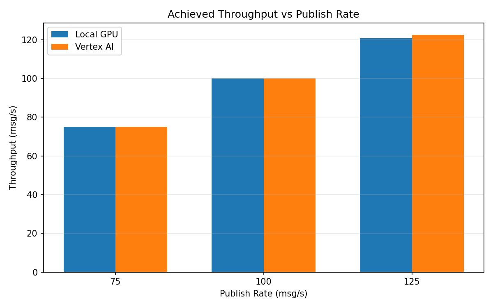

# Benchmark Report

Generated: 2026-03-07 23:54:01

## Configuration

| Parameter | Value |
|---|---|
| Messages per phase | 100s per phase |
| Rates (msg/s) | 75, 100, 125 |
| Experiments | Local GPU, Vertex AI |

## Throughput

| Rate (msg/s) | Local GPU | Vertex AI |
|---|---|---|
| 75 | 75.0 | 74.9 |
| 100 | 99.9 | 100.0 |
| 125 | 120.8 | 122.5 |

## End-to-End Latency (ms)

| Rate | Percentile | Local GPU | Vertex AI |
|---|---|---|---|
| 75 | p50 | 47.0 | 55.0 |
| 75 | p95 | 89.0 | 81.0 |
| 75 | p99 | 584.0 | 217.0 |
| 100 | p50 | 182.0 | 72.0 |
| 100 | p95 | 316.0 | 222.0 |
| 100 | p99 | 403.0 | 411.0 |
| 125 | p50 | 3584.0 | 1745.0 |
| 125 | p95 | 4320.0 | 1945.0 |
| 125 | p99 | 4389.0 | 2019.0 |

## GPU Inference Time (ms)

| Rate | Percentile | Local GPU | Vertex AI |
|---|---|---|---|
| 75 | p50 | 6.7 | 6.5 |
| 75 | p95 | 11.6 | 18.3 |
| 75 | p99 | 12.6 | 32.8 |
| 100 | p50 | 10.2 | 20.3 |
| 100 | p95 | 12.2 | 35.8 |
| 100 | p99 | 13.0 | 45.2 |
| 125 | p50 | 8.3 | 31.1 |
| 125 | p95 | 12.2 | 37.5 |
| 125 | p99 | 13.9 | 46.6 |

## Charts

### Latency vs Publish Rate

### GPU Inference Time vs Publish Rate

### Throughput vs Publish Rate

