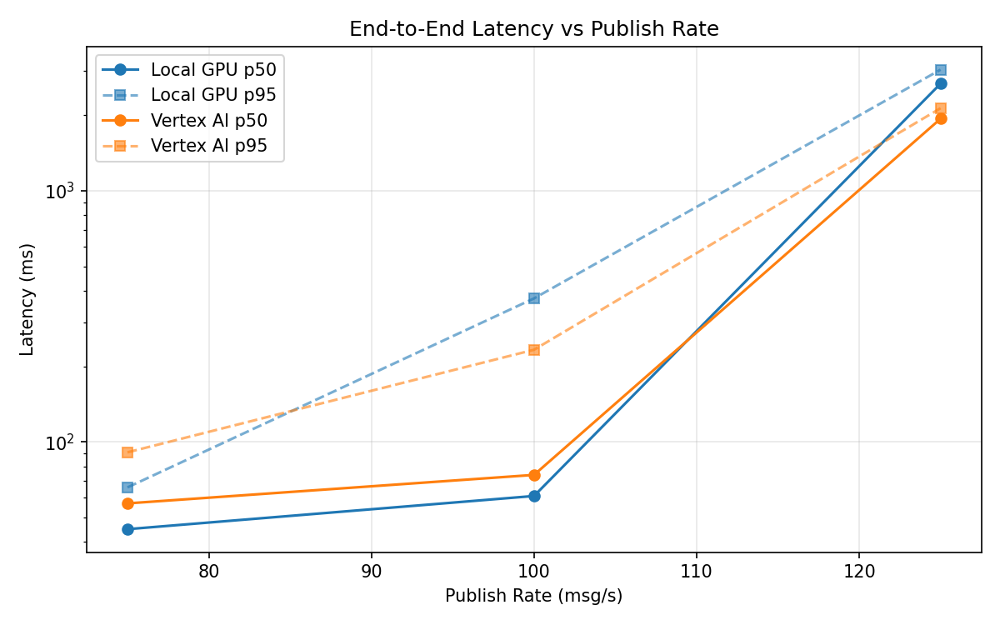
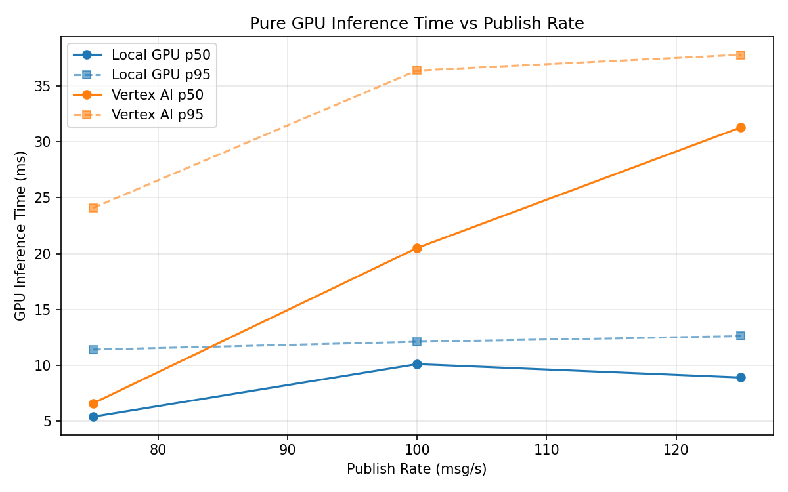
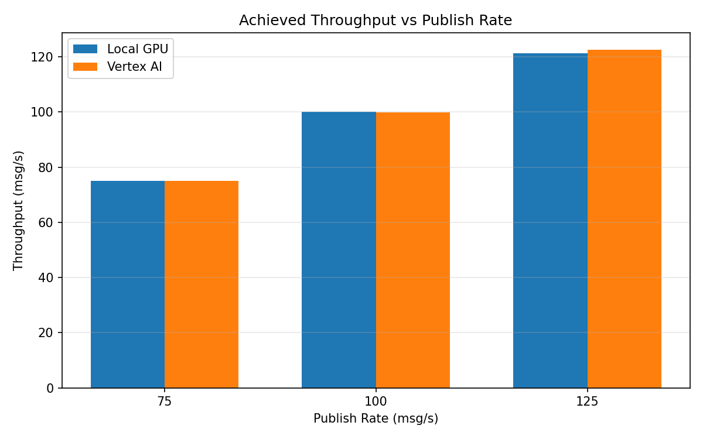

# Benchmark Report

Generated: 2026-03-08 00:06:47

## Configuration

| Parameter | Value |
|---|---|
| Messages per phase | 100s per phase |
| Rates (msg/s) | 75, 100, 125 |
| Experiments | Local GPU, Vertex AI |

## Throughput

| Rate (msg/s) | Local GPU | Vertex AI |
|---|---|---|
| 75 | 75.0 | 75.0 |
| 100 | 100.0 | 99.9 |
| 125 | 121.3 | 122.6 |

## End-to-End Latency (ms)

| Rate | Percentile | Local GPU | Vertex AI |
|---|---|---|---|
| 75 | p50 | 45.0 | 57.0 |
| 75 | p95 | 66.0 | 91.0 |
| 75 | p99 | 346.1 | 257.0 |
| 100 | p50 | 61.0 | 74.0 |
| 100 | p95 | 373.0 | 233.0 |
| 100 | p99 | 603.0 | 433.0 |
| 125 | p50 | 2670.0 | 1936.0 |
| 125 | p95 | 3035.0 | 2132.0 |
| 125 | p99 | 3168.0 | 2222.0 |

## GPU Inference Time (ms)

| Rate | Percentile | Local GPU | Vertex AI |
|---|---|---|---|
| 75 | p50 | 5.4 | 6.6 |
| 75 | p95 | 11.4 | 24.1 |
| 75 | p99 | 12.4 | 33.3 |
| 100 | p50 | 10.1 | 20.5 |
| 100 | p95 | 12.1 | 36.4 |
| 100 | p99 | 13.1 | 45.5 |
| 125 | p50 | 8.9 | 31.3 |
| 125 | p95 | 12.6 | 37.8 |
| 125 | p99 | 14.1 | 47.3 |

## Charts

### Latency vs Publish Rate

### GPU Inference Time vs Publish Rate

### Throughput vs Publish Rate

