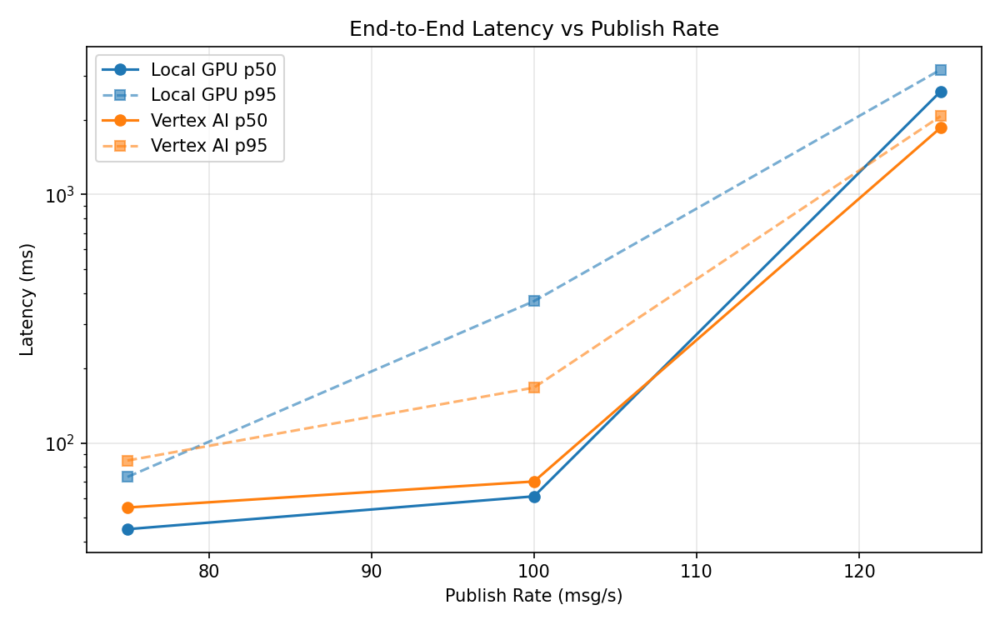
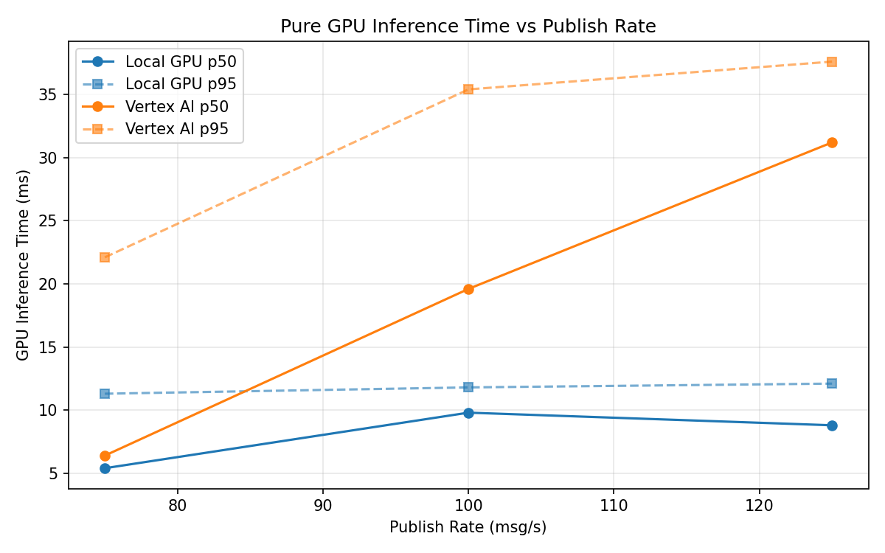
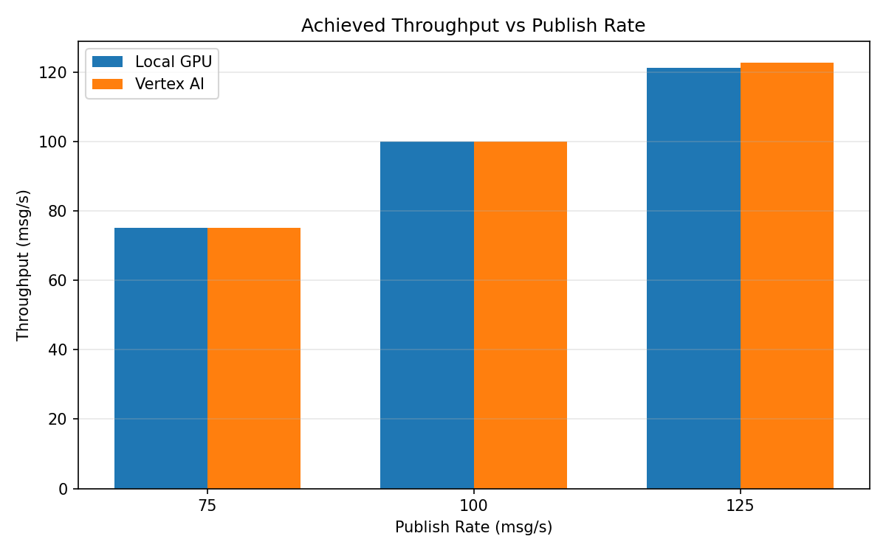

# Benchmark Report

Generated: 2026-03-07 22:51:45

## Configuration

| Parameter | Value |
|---|---|
| Messages per phase | 100s per phase |
| Rates (msg/s) | 75, 100, 125 |
| Experiments | Local GPU, Vertex AI |

## Throughput

| Rate (msg/s) | Local GPU | Vertex AI |
|---|---|---|
| 75 | 75.0 | 75.0 |
| 100 | 100.0 | 99.9 |
| 125 | 121.1 | 122.7 |

## End-to-End Latency (ms)

| Rate | Percentile | Local GPU | Vertex AI |
|---|---|---|---|
| 75 | p50 | 45.0 | 55.0 |
| 75 | p95 | 73.0 | 85.0 |
| 75 | p99 | 646.0 | 534.0 |
| 100 | p50 | 61.0 | 70.0 |
| 100 | p95 | 372.1 | 167.0 |
| 100 | p99 | 725.0 | 232.0 |
| 125 | p50 | 2596.0 | 1855.0 |
| 125 | p95 | 3177.0 | 2064.0 |
| 125 | p99 | 3295.0 | 2123.0 |

## GPU Inference Time (ms)

| Rate | Percentile | Local GPU | Vertex AI |
|---|---|---|---|
| 75 | p50 | 5.4 | 6.4 |
| 75 | p95 | 11.3 | 22.1 |
| 75 | p99 | 12.0 | 33.5 |
| 100 | p50 | 9.8 | 19.6 |
| 100 | p95 | 11.8 | 35.4 |
| 100 | p99 | 12.7 | 45.3 |
| 125 | p50 | 8.8 | 31.2 |
| 125 | p95 | 12.1 | 37.6 |
| 125 | p99 | 13.4 | 46.3 |

## Charts

### Latency vs Publish Rate

### GPU Inference Time vs Publish Rate

### Throughput vs Publish Rate

