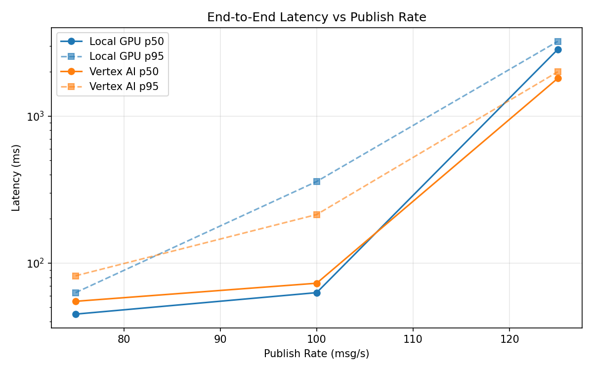
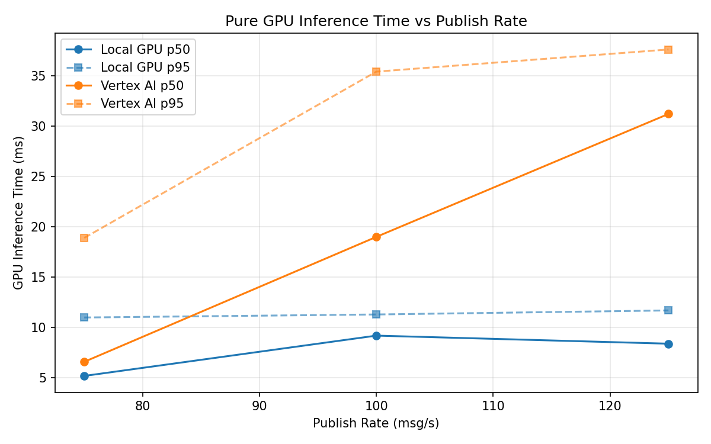

# Benchmark Report

Generated: 2026-03-07 23:03:52

## Configuration

| Parameter | Value |
|---|---|
| Messages per phase | 100s per phase |
| Rates (msg/s) | 75, 100, 125 |
| Experiments | Local GPU, Vertex AI |

## Throughput

| Rate (msg/s) | Local GPU | Vertex AI |
|---|---|---|
| 75 | 75.0 | 75.0 |
| 100 | 100.0 | 99.9 |
| 125 | 121.2 | 122.6 |

## End-to-End Latency (ms)

| Rate | Percentile | Local GPU | Vertex AI |
|---|---|---|---|
| 75 | p50 | 45.0 | 55.0 |
| 75 | p95 | 63.0 | 82.0 |
| 75 | p99 | 167.0 | 206.0 |
| 100 | p50 | 63.0 | 73.0 |
| 100 | p95 | 359.0 | 214.0 |
| 100 | p99 | 478.0 | 491.0 |
| 125 | p50 | 2840.5 | 1806.0 |
| 125 | p95 | 3223.0 | 2001.0 |
| 125 | p99 | 3269.0 | 2066.0 |

## GPU Inference Time (ms)

| Rate | Percentile | Local GPU | Vertex AI |
|---|---|---|---|
| 75 | p50 | 5.2 | 6.6 |
| 75 | p95 | 11.0 | 18.9 |
| 75 | p99 | 11.6 | 32.4 |
| 100 | p50 | 9.2 | 19.0 |
| 100 | p95 | 11.3 | 35.4 |
| 100 | p99 | 12.0 | 45.9 |
| 125 | p50 | 8.4 | 31.2 |
| 125 | p95 | 11.7 | 37.6 |
| 125 | p99 | 12.7 | 46.4 |

## Charts

### Latency vs Publish Rate

### GPU Inference Time vs Publish Rate

### Throughput vs Publish Rate

