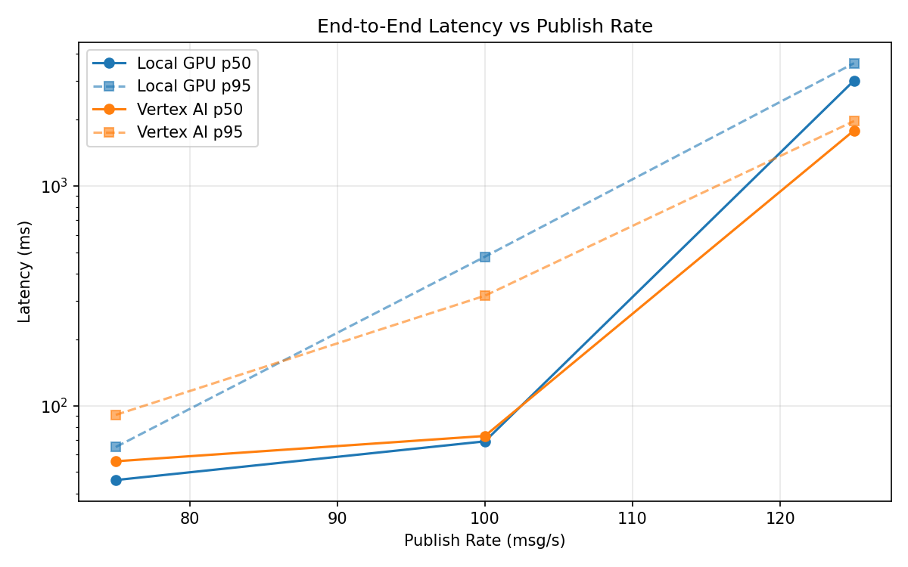
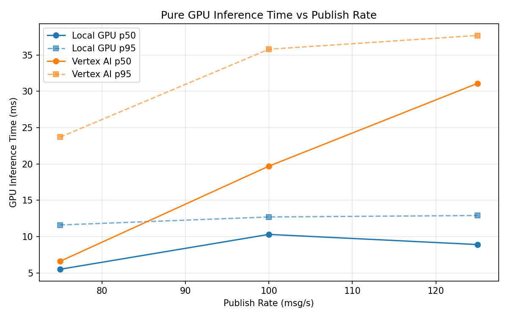
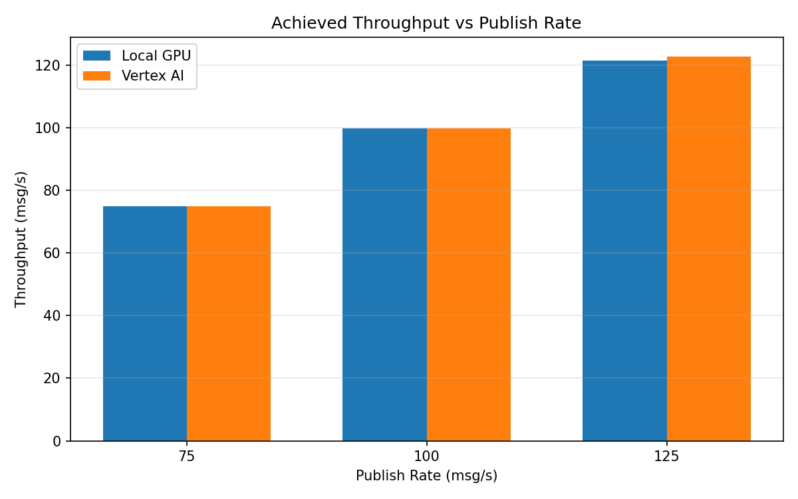

# Benchmark Report

Generated: 2026-03-08 00:18:39

## Configuration

| Parameter | Value |
|---|---|
| Messages per phase | 100s per phase |
| Rates (msg/s) | 75, 100, 125 |
| Experiments | Local GPU, Vertex AI |

## Throughput

| Rate (msg/s) | Local GPU | Vertex AI |
|---|---|---|
| 75 | 75.0 | 75.0 |
| 100 | 99.9 | 99.9 |
| 125 | 121.4 | 122.8 |

## End-to-End Latency (ms)

| Rate | Percentile | Local GPU | Vertex AI |
|---|---|---|---|
| 75 | p50 | 46.0 | 56.0 |
| 75 | p95 | 65.0 | 91.0 |
| 75 | p99 | 174.0 | 509.0 |
| 100 | p50 | 69.0 | 73.0 |
| 100 | p95 | 477.0 | 317.0 |
| 100 | p99 | 857.0 | 616.0 |
| 125 | p50 | 3017.5 | 1790.0 |
| 125 | p95 | 3619.0 | 1974.0 |
| 125 | p99 | 3674.0 | 2027.0 |

## GPU Inference Time (ms)

| Rate | Percentile | Local GPU | Vertex AI |
|---|---|---|---|
| 75 | p50 | 5.5 | 6.6 |
| 75 | p95 | 11.6 | 23.7 |
| 75 | p99 | 12.5 | 33.5 |
| 100 | p50 | 10.3 | 19.7 |
| 100 | p95 | 12.7 | 35.8 |
| 100 | p99 | 14.0 | 44.4 |
| 125 | p50 | 8.9 | 31.1 |
| 125 | p95 | 12.9 | 37.7 |
| 125 | p99 | 14.5 | 46.5 |

## Charts

### Latency vs Publish Rate

### GPU Inference Time vs Publish Rate

### Throughput vs Publish Rate

