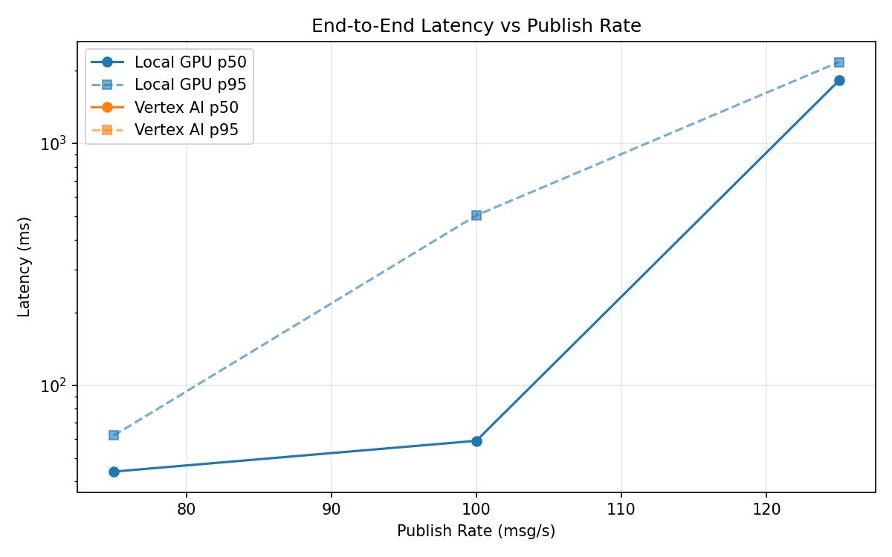
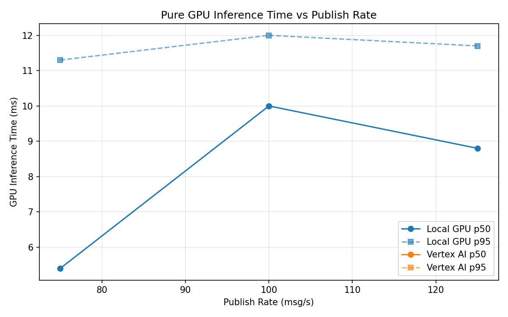
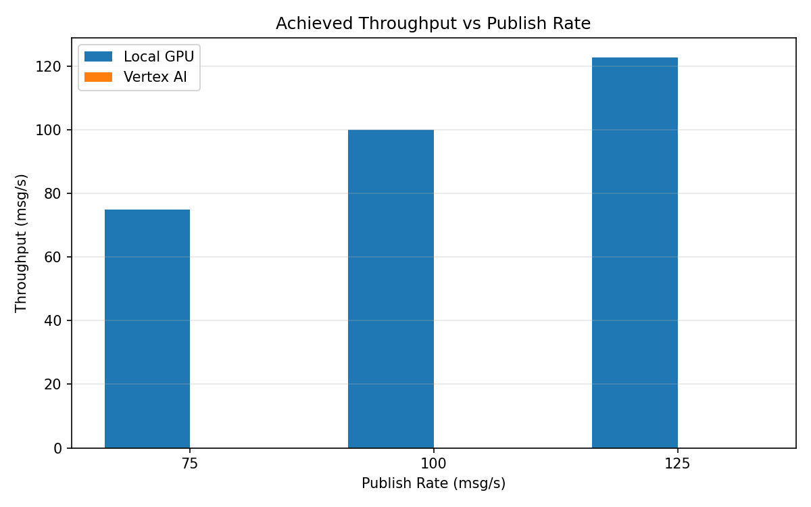

# Benchmark Report

Generated: 2026-03-08 01:51:54

## Configuration

| Parameter | Value |
|---|---|
| Messages per phase | 100s per phase |
| Rates (msg/s) | 75, 100, 125 |
| Experiments | Local GPU, Vertex AI |

## Throughput

| Rate (msg/s) | Local GPU | Vertex AI |
|---|---|---|
| 75 | 75.0 | — |
| 100 | 100.0 | — |
| 125 | 122.8 | — |

## End-to-End Latency (ms)

| Rate | Percentile | Local GPU | Vertex AI |
|---|---|---|---|
| 75 | p50 | 44.0 | — |
| 75 | p95 | 62.0 | — |
| 75 | p99 | 200.0 | — |
| 100 | p50 | 59.0 | — |
| 100 | p95 | 504.1 | — |
| 100 | p99 | 835.0 | — |
| 125 | p50 | 1819.0 | — |
| 125 | p95 | 2168.0 | — |
| 125 | p99 | 2229.0 | — |

## GPU Inference Time (ms)

| Rate | Percentile | Local GPU | Vertex AI |
|---|---|---|---|
| 75 | p50 | 5.4 | — |
| 75 | p95 | 11.3 | — |
| 75 | p99 | 12.2 | — |
| 100 | p50 | 10.0 | — |
| 100 | p95 | 12.0 | — |
| 100 | p99 | 12.9 | — |
| 125 | p50 | 8.8 | — |
| 125 | p95 | 11.7 | — |
| 125 | p99 | 12.6 | — |

## Charts

### Latency vs Publish Rate

### GPU Inference Time vs Publish Rate

### Throughput vs Publish Rate

