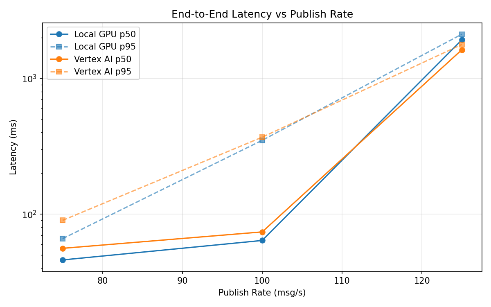
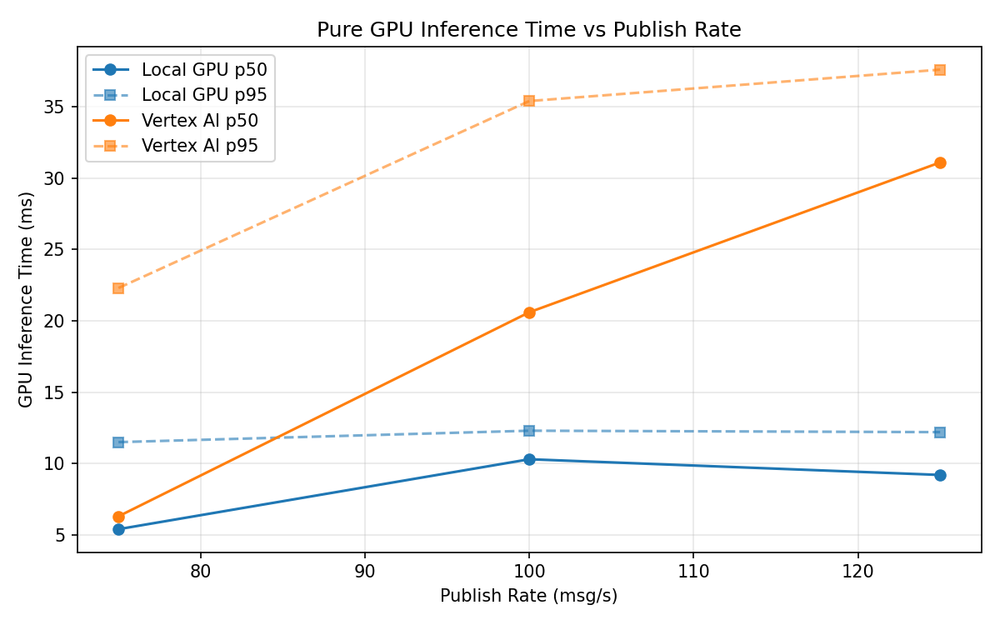

# Benchmark Report

Generated: 2026-03-08 00:55:42

## Configuration

| Parameter | Value |
|---|---|
| Messages per phase | 100s per phase |
| Rates (msg/s) | 75, 100, 125 |
| Experiments | Local GPU, Vertex AI |

## Throughput

| Rate (msg/s) | Local GPU | Vertex AI |
|---|---|---|
| 75 | 75.0 | 75.0 |
| 100 | 99.9 | 99.9 |
| 125 | 122.5 | 123.0 |

## End-to-End Latency (ms)

| Rate | Percentile | Local GPU | Vertex AI |
|---|---|---|---|
| 75 | p50 | 46.0 | 56.0 |
| 75 | p95 | 66.0 | 90.0 |
| 75 | p99 | 228.0 | 547.0 |
| 100 | p50 | 64.0 | 74.0 |
| 100 | p95 | 350.0 | 369.0 |
| 100 | p99 | 543.0 | 648.0 |
| 125 | p50 | 1922.0 | 1625.0 |
| 125 | p95 | 2116.0 | 1778.0 |
| 125 | p99 | 2151.0 | 1833.0 |

## GPU Inference Time (ms)

| Rate | Percentile | Local GPU | Vertex AI |
|---|---|---|---|
| 75 | p50 | 5.4 | 6.3 |
| 75 | p95 | 11.5 | 22.3 |
| 75 | p99 | 12.3 | 33.0 |
| 100 | p50 | 10.3 | 20.6 |
| 100 | p95 | 12.3 | 35.4 |
| 100 | p99 | 13.1 | 45.2 |
| 125 | p50 | 9.2 | 31.1 |
| 125 | p95 | 12.2 | 37.6 |
| 125 | p99 | 13.0 | 46.5 |

## Charts

### Latency vs Publish Rate

### GPU Inference Time vs Publish Rate

### Throughput vs Publish Rate

