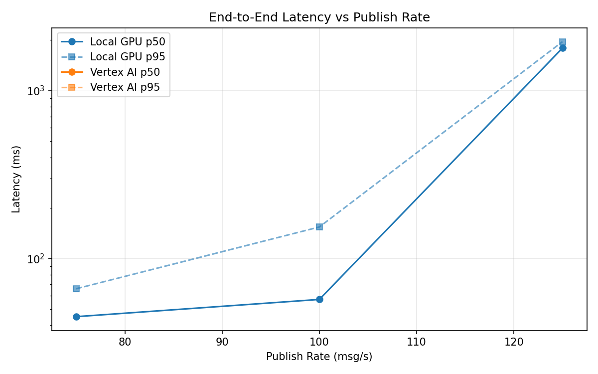
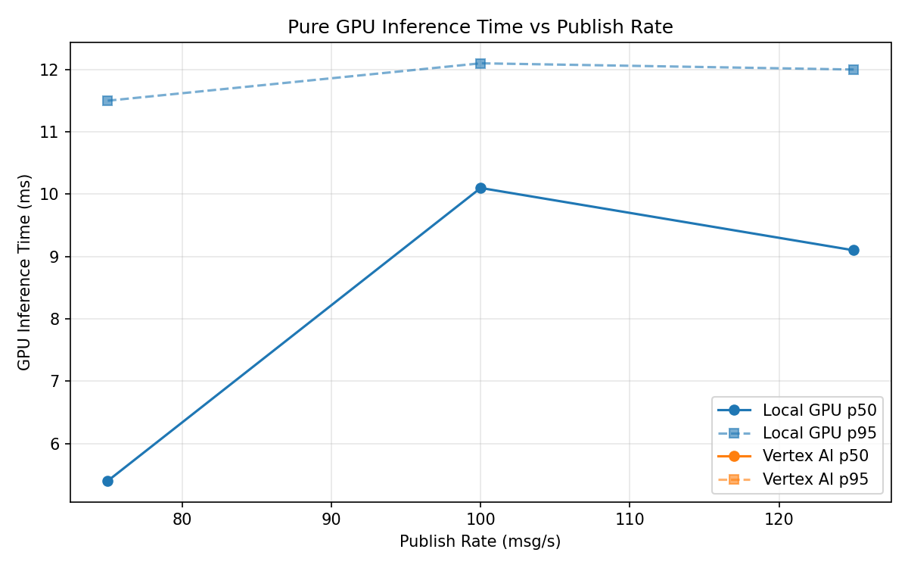

# Benchmark Report

Generated: 2026-03-08 02:07:48

## Configuration

| Parameter | Value |
|---|---|
| Messages per phase | 100s per phase |
| Rates (msg/s) | 75, 100, 125 |
| Experiments | Local GPU, Vertex AI |

## Throughput

| Rate (msg/s) | Local GPU | Vertex AI |
|---|---|---|
| 75 | 75.0 | — |
| 100 | 100.0 | — |
| 125 | 122.8 | — |

## End-to-End Latency (ms)

| Rate | Percentile | Local GPU | Vertex AI |
|---|---|---|---|
| 75 | p50 | 45.0 | — |
| 75 | p95 | 66.0 | — |
| 75 | p99 | 756.0 | — |
| 100 | p50 | 57.0 | — |
| 100 | p95 | 154.0 | — |
| 100 | p99 | 376.0 | — |
| 125 | p50 | 1793.0 | — |
| 125 | p95 | 1958.0 | — |
| 125 | p99 | 1989.0 | — |

## GPU Inference Time (ms)

| Rate | Percentile | Local GPU | Vertex AI |
|---|---|---|---|
| 75 | p50 | 5.4 | — |
| 75 | p95 | 11.5 | — |
| 75 | p99 | 12.7 | — |
| 100 | p50 | 10.1 | — |
| 100 | p95 | 12.1 | — |
| 100 | p99 | 13.1 | — |
| 125 | p50 | 9.1 | — |
| 125 | p95 | 12.0 | — |
| 125 | p99 | 13.0 | — |

## Charts

### Latency vs Publish Rate

### GPU Inference Time vs Publish Rate

### Throughput vs Publish Rate

