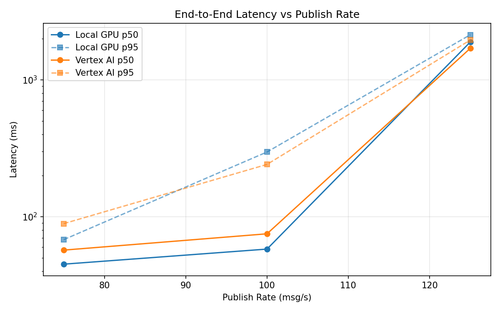
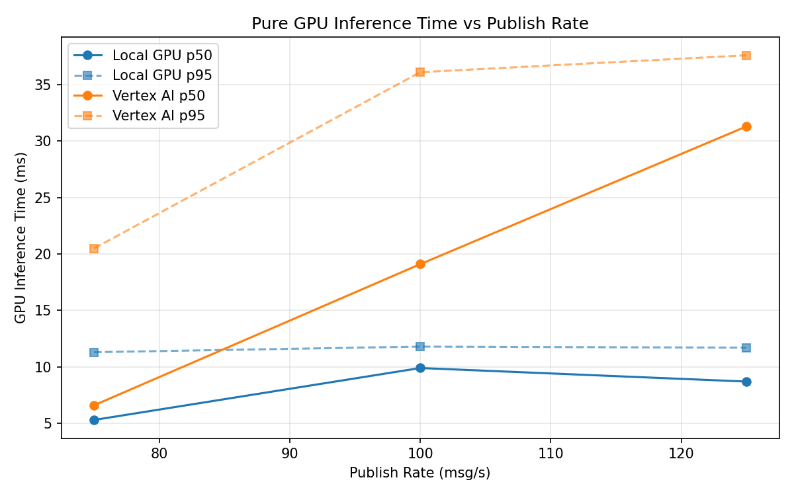

# Benchmark Report

Generated: 2026-03-08 01:08:02

## Configuration

| Parameter | Value |
|---|---|
| Messages per phase | 100s per phase |
| Rates (msg/s) | 75, 100, 125 |
| Experiments | Local GPU, Vertex AI |

## Throughput

| Rate (msg/s) | Local GPU | Vertex AI |
|---|---|---|
| 75 | 75.0 | 75.0 |
| 100 | 100.0 | 99.9 |
| 125 | 122.8 | 123.0 |

## End-to-End Latency (ms)

| Rate | Percentile | Local GPU | Vertex AI |
|---|---|---|---|
| 75 | p50 | 45.0 | 57.0 |
| 75 | p95 | 68.0 | 89.0 |
| 75 | p99 | 445.0 | 431.0 |
| 100 | p50 | 58.0 | 75.0 |
| 100 | p95 | 297.0 | 241.0 |
| 100 | p99 | 568.0 | 435.0 |
| 125 | p50 | 1889.0 | 1699.0 |
| 125 | p95 | 2134.0 | 1954.0 |
| 125 | p99 | 2208.0 | 2045.0 |

## GPU Inference Time (ms)

| Rate | Percentile | Local GPU | Vertex AI |
|---|---|---|---|
| 75 | p50 | 5.3 | 6.6 |
| 75 | p95 | 11.3 | 20.5 |
| 75 | p99 | 12.1 | 33.0 |
| 100 | p50 | 9.9 | 19.1 |
| 100 | p95 | 11.8 | 36.1 |
| 100 | p99 | 12.6 | 45.8 |
| 125 | p50 | 8.7 | 31.3 |
| 125 | p95 | 11.7 | 37.6 |
| 125 | p99 | 12.4 | 46.9 |

## Charts

### Latency vs Publish Rate

### GPU Inference Time vs Publish Rate

### Throughput vs Publish Rate

