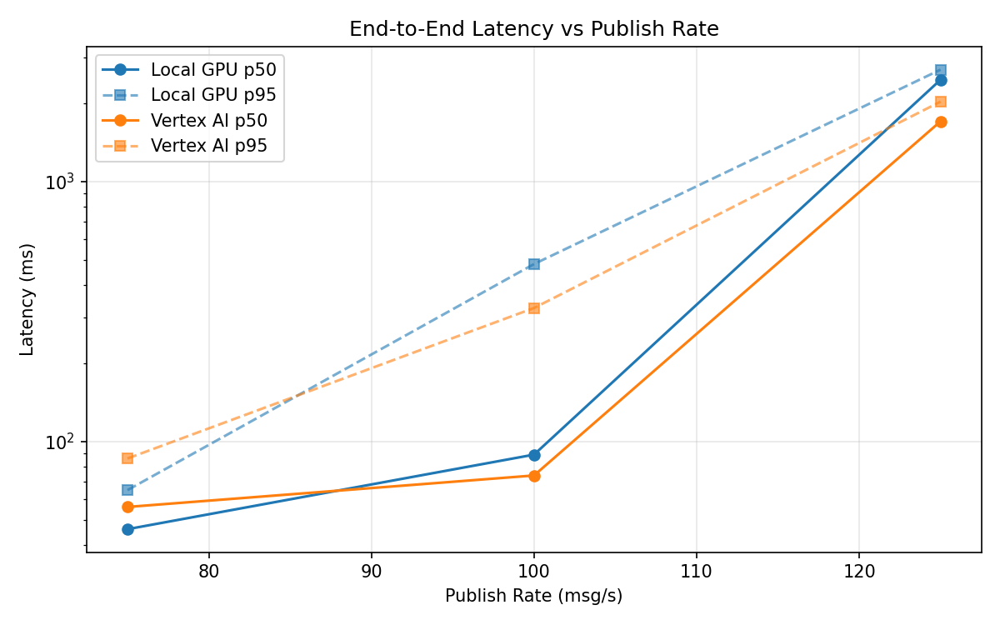
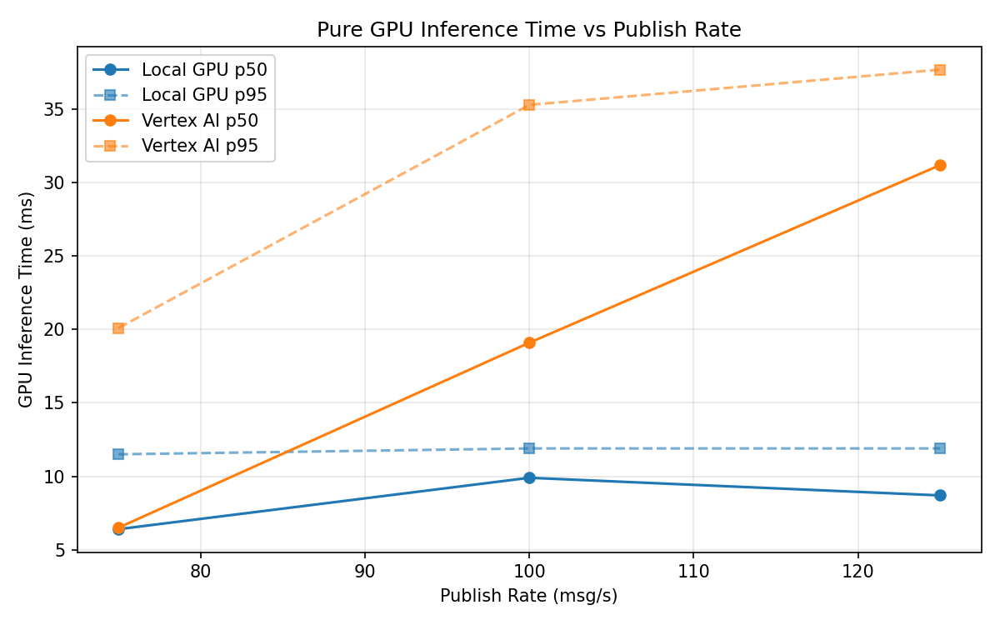
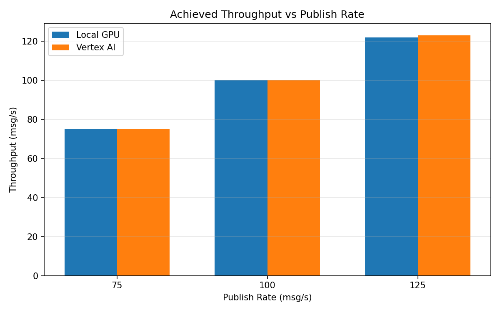

# Benchmark Report

Generated: 2026-03-08 00:31:49

## Configuration

| Parameter | Value |
|---|---|
| Messages per phase | 100s per phase |
| Rates (msg/s) | 75, 100, 125 |
| Experiments | Local GPU, Vertex AI |

## Throughput

| Rate (msg/s) | Local GPU | Vertex AI |
|---|---|---|
| 75 | 75.0 | 75.0 |
| 100 | 99.8 | 100.0 |
| 125 | 121.8 | 122.9 |

## End-to-End Latency (ms)

| Rate | Percentile | Local GPU | Vertex AI |
|---|---|---|---|
| 75 | p50 | 46.0 | 56.0 |
| 75 | p95 | 65.0 | 86.0 |
| 75 | p99 | 334.1 | 306.1 |
| 100 | p50 | 89.0 | 74.0 |
| 100 | p95 | 481.0 | 326.0 |
| 100 | p99 | 706.0 | 654.0 |
| 125 | p50 | 2460.0 | 1702.0 |
| 125 | p95 | 2689.0 | 2026.0 |
| 125 | p99 | 2761.0 | 2139.0 |

## GPU Inference Time (ms)

| Rate | Percentile | Local GPU | Vertex AI |
|---|---|---|---|
| 75 | p50 | 6.4 | 6.5 |
| 75 | p95 | 11.5 | 20.1 |
| 75 | p99 | 12.7 | 32.8 |
| 100 | p50 | 9.9 | 19.1 |
| 100 | p95 | 11.9 | 35.3 |
| 100 | p99 | 13.1 | 44.5 |
| 125 | p50 | 8.7 | 31.2 |
| 125 | p95 | 11.9 | 37.7 |
| 125 | p99 | 13.0 | 46.7 |

## Charts

### Latency vs Publish Rate

### GPU Inference Time vs Publish Rate

### Throughput vs Publish Rate

