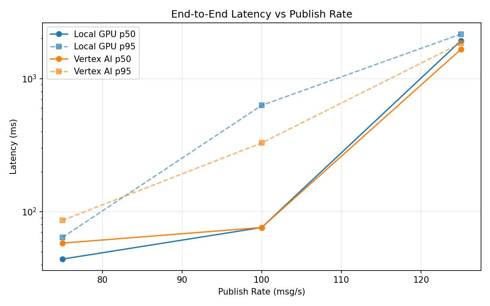
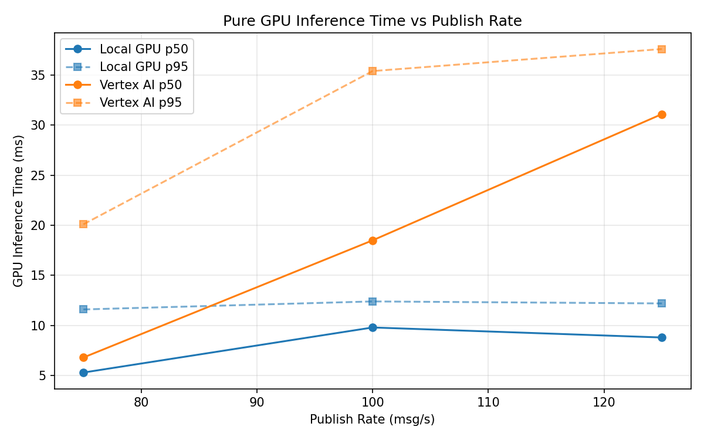
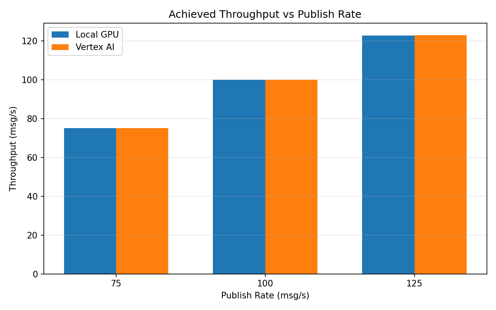

# Benchmark Report

Generated: 2026-03-08 01:20:38

## Configuration

| Parameter | Value |
|---|---|
| Messages per phase | 100s per phase |
| Rates (msg/s) | 75, 100, 125 |
| Experiments | Local GPU, Vertex AI |

## Throughput

| Rate (msg/s) | Local GPU | Vertex AI |
|---|---|---|
| 75 | 75.0 | 75.0 |
| 100 | 99.8 | 99.9 |
| 125 | 122.6 | 122.9 |

## End-to-End Latency (ms)

| Rate | Percentile | Local GPU | Vertex AI |
|---|---|---|---|
| 75 | p50 | 44.0 | 58.0 |
| 75 | p95 | 64.0 | 86.0 |
| 75 | p99 | 382.0 | 328.0 |
| 100 | p50 | 76.0 | 76.0 |
| 100 | p95 | 629.0 | 328.0 |
| 100 | p99 | 894.0 | 670.0 |
| 125 | p50 | 1923.0 | 1657.0 |
| 125 | p95 | 2158.0 | 1844.0 |
| 125 | p99 | 2205.0 | 1911.0 |

## GPU Inference Time (ms)

| Rate | Percentile | Local GPU | Vertex AI |
|---|---|---|---|
| 75 | p50 | 5.3 | 6.8 |
| 75 | p95 | 11.6 | 20.1 |
| 75 | p99 | 12.7 | 32.6 |
| 100 | p50 | 9.8 | 18.5 |
| 100 | p95 | 12.4 | 35.4 |
| 100 | p99 | 13.4 | 45.6 |
| 125 | p50 | 8.8 | 31.1 |
| 125 | p95 | 12.2 | 37.6 |
| 125 | p99 | 13.4 | 46.6 |

## Charts

### Latency vs Publish Rate

### GPU Inference Time vs Publish Rate

### Throughput vs Publish Rate

